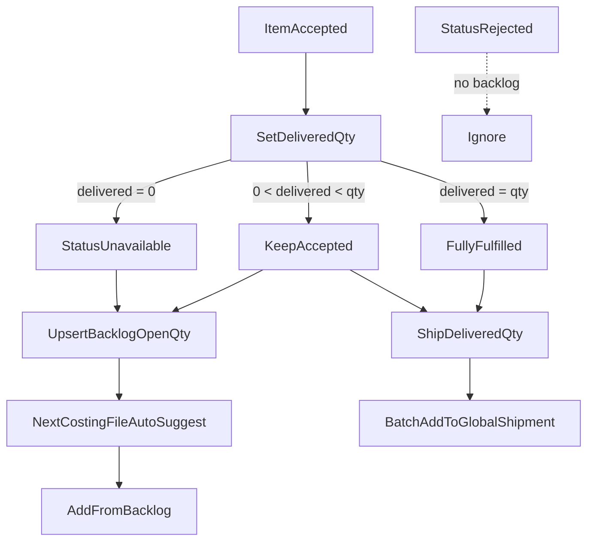

# PBC backlog + batch shipment (phased)

## Goal

Two linked outcomes on Product Based Costing:

1. **Unfulfilled demand** — customer wanted it; this batch got none or only part → keep a **latest open backlog** per billing profile + product, with **auto-suggest / one-click add** into the next costing file.
2. **Shipment compose** — bind a **file default shipment** (pick existing or create), then one-click / batch-add **fulfilled** lines into that shipment (or choose another), with correct provenance.

First deliverable after approval: a full feature doc + task matrix under [`doc/feature/`](doc/feature/) so each later phase can run in a **low-context** agent session (only that phase’s files).

## Product rules (locked)



| Outcome | Status | Backlog | Shipment eligible qty |
|---------|--------|---------|------------------------|
| Customer rejected | `rejected` | No | No |
| Still deciding | `pending` | No | No |
| Wanted; got all | `accepted`, `delivered_quantity = quantity` | No | `delivered_quantity` |
| Wanted; got some | `accepted`, `0 < delivered_quantity < quantity` | Yes, open = qty − delivered | `delivered_quantity` |
| Wanted; got none | `unavailable` | Yes, open = quantity | No |
| Already on shipment | any + `assigned_shipment_id` set | — | No |

- **Who:** `billing_profiles` (not customer group / email). Optional link via `billing_profiles.customer_group_id` is unused for this feature.
- **Latest only:** unique `(tenant_id, billing_profile_id, product_id)` — upsert replaces open qty; no history table.
- **Partial qty:** reuse existing column `product_based_costing_items.delivered_quantity` as “got this batch”.
- **Auto-suggest:** when a costing file has `billing_profile_id`, show open backlog for that profile (create success + details page). One **Add selected / Add all** action.
- **File shipment (easy path):** each costing file keeps `default_shipment_id`. On file details header: always show **Shipment** control — select an existing parent shipment, clear it, or **Create shipment** (creates `global_shipments` Draft and saves id onto the file). Same control is the default target when adding lines.
- **Add-to-shipment shortcuts:**
  - If file has `default_shipment_id`: bulk/single actions default to that shipment; primary CTA = **Add to file shipment** (confirm only; no forced re-pick).
  - User can still **Change shipment…** in the dialog (other existing or create new); choosing another updates `default_shipment_id` when they confirm “set as file shipment”.
  - If no file shipment set: dialog opens with empty select + create affordance (same as today, but required before save).
- **Tags:** out of scope.
- **Parent procurement inbox UI:** out of scope (same shipment reusable across files via shared `default_shipment_id`).

---

## Schema specification (Phase 1)

### A. Alter `product_based_costing_files`

| Column | Type | Notes |
|--------|------|-------|
| `billing_profile_id` | `bigint null` FK → `billing_profiles(id)` ON DELETE SET NULL | Required before backlog write / suggest |
| `order_for` | existing `text` | On save, set from `billing_profiles.name` when profile picked (display/back-compat) |
| `default_shipment_id` | existing | **Retarget FK** → `global_shipments(id)` ON DELETE SET NULL. UI “file shipment” binding — pick / create / clear. |

Index: `product_based_costing_files_billing_profile_id_idx`.

### B. Alter `product_based_costing_items`

| Column | Type | Notes |
|--------|------|-------|
| `status` | `text` | Allowed: `pending`, `accepted`, `rejected`, `unavailable` (app + RPC checks; no DB enum required) |
| `quantity` | existing | Customer wanted qty |
| `delivered_quantity` | existing `int null` | Got this batch; null treated as 0 until set |
| `assigned_shipment_id` | existing | **Retarget FK** → `global_shipments(id)` ON DELETE SET NULL |
| `product_id` | existing | Required for backlog upsert and shipment add |

Before FK retarget: null out `assigned_shipment_id` / `default_shipment_id` values that do not exist in `global_shipments`.

### C. New table `product_based_costing_backlog_items`

Open demand only (not a ledger).

| Column | Type | Constraints |
|--------|------|-------------|
| `id` | `bigserial` | PK |
| `tenant_id` | `bigint not null` | FK → `tenants(id)` ON DELETE CASCADE |
| `billing_profile_id` | `bigint not null` | FK → `billing_profiles(id)` ON DELETE CASCADE |
| `product_id` | `bigint not null` | FK → `products(id)` ON DELETE CASCADE |
| `open_quantity` | `int not null` | CHECK `open_quantity > 0` |
| `name` | `text not null` | Snapshot for add UI |
| `image_url` | `text null` | Snapshot |
| `barcode` | `text null` | Snapshot |
| `product_code` | `text null` | Snapshot |
| `price_gbp` | `numeric null` | Last known |
| `product_weight` | `numeric null` | Snapshot |
| `package_weight` | `numeric null` | Snapshot |
| `note` | `text null` | Optional |
| `last_costing_file_id` | `bigint null` | FK → `product_based_costing_files(id)` ON DELETE SET NULL |
| `last_costing_item_id` | `bigint null` | FK → `product_based_costing_items(id)` ON DELETE SET NULL |
| `created_at` | `timestamptz not null` | default `now()` |
| `updated_at` | `timestamptz not null` | default `now()` + trigger |

**Unique:** `(tenant_id, billing_profile_id, product_id)`.

**RLS:** same pattern as other PBC tables — tenant members can select/insert/update/delete for `tenant_id`.

**Indexes:** unique constraint above; `(tenant_id, billing_profile_id)` for list-by-profile.

### D. Upsert semantics

When recording fulfillment on a line (file must have `billing_profile_id`):

```
wanted = coalesce(quantity, 0)
got    = coalesce(delivered_quantity, 0)
open   = wanted - got
```

- If status is `rejected` → do not touch backlog.
- If `open > 0` and status in (`accepted`, `unavailable`) → upsert backlog row: `open_quantity = open`, refresh snapshots + last_* ids.
- If `open <= 0` → delete backlog row for that `(tenant, profile, product)` if present.

When consuming into a new file: insert costing items from selected backlog rows, then delete those backlog rows (or reduce if future partial consume — v1 deletes full row / adds full `open_quantity`).

---

## RPC / API contracts (Phase 2)

Reuse [`web/src/modules/sales_invoice/repositories/billingProfileRepository.ts`](web/src/modules/sales_invoice/repositories/billingProfileRepository.ts) for profile list (no new billing API).

| RPC | Purpose | Key args / result |
|-----|---------|-------------------|
| `upsert_pbc_backlog_from_item(p_costing_item_id)` | Compute open qty; upsert or delete | Returns backlog row or null |
| `list_pbc_backlog_items(p_tenant_id, p_billing_profile_id)` | Open rows for suggest/add UI | Table rows ordered by `updated_at desc` |
| `add_pbc_backlog_to_costing_file(p_file_id, p_backlog_ids bigint[])` | Insert items into file; delete consumed backlog | Returns inserted item ids; requires file.`billing_profile_id` match |
| `add_child_line_to_parent_shipment` (harden) | Costing branch | Require `accepted`, `product_id`, unassigned; **ordered_quantity = delivered_quantity** (must be > 0); reject if delivered is 0 |
| `list_child_procurement_lines` (harden) | Costing union | Same eligibility; quantity = delivered |

Security: backlog RPCs = tenant can manage file’s tenant; shipment RPC stays parent-manage (`user_can_manage_parent_tenant`).

---

## Feature doc location (Phase 0)

Create:

- [`doc/feature/PRODUCT_BASED_COSTING_BACKLOG_AND_SHIPMENT.md`](doc/feature/PRODUCT_BASED_COSTING_BACKLOG_AND_SHIPMENT.md) — full blueprint (sections from [`templates/feature-template.md`](templates/feature-template.md)), including this schema and contracts verbatim.
- [`doc/feature/PRODUCT_BASED_COSTING_BACKLOG_AND_SHIPMENT.task.md`](doc/feature/PRODUCT_BASED_COSTING_BACKLOG_AND_SHIPMENT.task.md) — execution matrix from [`templates/task-template.md`](templates/task-template.md), one phase = one low-context session, **Files to Change** exhaustive.

Do **not** put the living spec only in `.cursor/plans/`; agents should read `doc/feature/*`.

---

## Phased execution (low context)

Each phase: single concern; review gate before next; agent may only touch listed files in the task.md for that phase.

### Phase 0 — Docs only
- Write feature.md + task.md under `doc/feature/`.
- **Review:** schema + status rules + RPC shapes signed off.

### Phase 1 — Schema & types
- Migration: columns, backlog table, RLS, FK retarget, status note in comments/check if used.
- `npm run backend:types`.
- **Review:** types show new table + `billing_profile_id`; FKs reference `global_shipments`.

### Phase 2 — RPCs only
- Implement four backlog/shipment hardenings above; grants to `authenticated`.
- **Review:** SQL-only test of upsert partial, unavailable full, rejected no-op, consume, add_child delivered qty.

### Phase 3 — Billing profile on file (UI → wire)
- **3a UI:** picker on [`ProductBasedCostingFileDialog.vue`](web/src/modules/product_based_costing/components/ProductBasedCostingFileDialog.vue) + display on list/details/cards; mock options OK.
- **3b/c:** persist `billing_profile_id`; sync `order_for` from profile name; list/filter unchanged except show profile name.
- **Review:** create/edit file stores profile; details shows it.

### Phase 4 — Backlog UX (UI → wire)
- **4a UI:** on details — set `delivered_quantity`, status `unavailable`, “Save fulfillment” (mock); backlog drawer with Add selected/all (mock).
- **4b/c:** call upsert RPC on fulfillment save; list + consume RPCs; auto-open suggest when `billing_profile_id` set and backlog count > 0.
- **Review:** partial leaves backlog open qty; add-to-file clears rows and creates items.

### Phase 5 — File shipment + batch add (UI → wire)
- **5a UI:**
  - File details header: **Shipment** select bound to `default_shipment_id` (list parent `global_shipments`), actions Clear / Create new (navigate or inline create then save id on file). Show current shipment name/status.
  - Bulk bar: **Add to file shipment** (enabled when default set + selection eligible) and **Add to shipment…** (opens picker).
  - Per-row ship: same two paths; dialog pre-fills `default_shipment_id`.
  - Extend [`ShipmentItemCompactDialog.vue`](web/src/modules/procurement_stock/components/ShipmentItemCompactDialog.vue): batch mode; create-shipment affordance; optional “Save as file shipment” checkbox (default on when user picks a different id).
  - Eligibility = accepted + delivered > 0 + unassigned; file gate `processing` \| `ordered`.
- **5b/c:** resolve parent tenant for shipment list/create; persist `default_shipment_id` on change; call `add_child_line_to_parent_shipment` per id (single + bulk); no null `source_*`.
- **Review:** can bind file to existing or new shipment without leaving the page; one-click add uses file shipment; change-shipment still works; provenance set; rejected/unavailable/pending excluded; partial ships delivered only.

---

## Key existing files (implementation reference)

- PBC UI: [`web/src/modules/product_based_costing/pages/ProductBasedCostingFileDetailsPage.vue`](web/src/modules/product_based_costing/pages/ProductBasedCostingFileDetailsPage.vue), [`.../ProductBasedCostingItemsTable.vue`](web/src/modules/product_based_costing/components/ProductBasedCostingItemsTable.vue), [`.../ProductBasedCostingFileDialog.vue`](web/src/modules/product_based_costing/components/ProductBasedCostingFileDialog.vue)
- Shipment dialog: [`web/src/modules/procurement_stock/components/ShipmentItemCompactDialog.vue`](web/src/modules/procurement_stock/components/ShipmentItemCompactDialog.vue)
- RPC baseline: `supabase/migrations/20260902000700_shop_order_p8_fulfillment.sql` (`add_child_line_to_parent_shipment`, `list_child_procurement_lines`)
- Billing list: [`web/src/modules/sales_invoice/repositories/billingProfileRepository.ts`](web/src/modules/sales_invoice/repositories/billingProfileRepository.ts)

## Out of scope

- Universal tagging
- Customer group email / membership changes
- Full unfulfilled history
- Parent multi-file procurement inbox page
- Legacy `costing_file` module
- Partial consume of backlog qty into file (v1 always full open_quantity)
