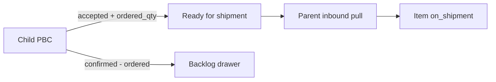

# PBC Status, Qty, and Parent Pull Redesign

## Locked decisions (from discussion)

- **Ownership:** Child PBC prepares demand; **parent** owns shipments and pulls lines (Option A).
- **No** standalone per-customer backlog page in v1 (keep file **Backlog** drawer).
- **File status** = batch workflow. **Item status** = line truth (including `on_shipment`). Do **not** use file-level “added to shipment.”
- Backlog open qty = `confirmed_quantity − ordered_quantity` (not delivered).

## Status and quantity model

### File statuses (replace current workflow)

| New | Maps from (approx) |
|-----|-------------------|
| `pending` | `pending` |
| `offered` | `offered` |
| `confirmed` | `processing` |
| `placing_order` | `ordered` |
| `ready_for_shipment` | *(new)* |
| `invoicing` | `invoicing` |
| `delivered` | `invoiced` |
| `cancelled` | `cancelled` |

### Item statuses

`pending` | `accepted` | `rejected` | `unavailable` | `partial` | `on_shipment`

Auto (overridable):

- confirmed qty set and not rejected → `accepted`
- ordered qty = 0 (after placing) → `unavailable`
- `0 < ordered < confirmed` → `partial`
- parent pull succeeds → `on_shipment` (+ set `assigned_shipment_id`)

### Quantities on `product_based_costing_items`

- Add `confirmed_quantity` (int null); **backfill from** existing `quantity`
- Add `ordered_quantity` (int null)
- Keep `delivered_quantity`
- Keep `quantity` for one release as pricing fallback (`coalesce(confirmed_quantity, quantity)`), then point costing math at confirmed qty

### Column defaults by file status (preference override allowed)

| File status | Default visible cols |
|-------------|----------------------|
| pending / offered | membership preference |
| confirmed | sl, image, name, confirmed qty, status |
| placing_order | + codes |
| ready_for_shipment | membership preference |
| invoicing | sl, image, name, confirmed, codes, delivered, status |
| delivered | all |
| After `confirmed` | **hide rejected** rows (filter default) |

UI status filter on the items table always available.

---

## Phase 1 — Schema + RPC contracts

**Migrations** under [`supabase/migrations/`](supabase/migrations/):

1. Columns: `confirmed_quantity`, `ordered_quantity` on items; backfill; optional check constraints (`>= 0`).
2. Data migrate file statuses (`processing`→`confirmed`, `ordered`→`placing_order`, `invoiced`→`delivered`).
3. Retarget [`upsert_pbc_backlog_from_item`](supabase/migrations/20260905000200_pbc_backlog_and_shipment_rpcs.sql): open = `confirmed − ordered`; clear when rejected or open ≤ 0.
4. Harden [`list_child_procurement_lines`](supabase/migrations/20260905000200_pbc_backlog_and_shipment_rpcs.sql) costing union:
   - file `status = ready_for_shipment` (or eligible)
   - item in (`accepted`,`partial`), `ordered_quantity > 0`, `assigned_shipment_id IS NULL`, not `on_shipment`
   - return quantity = `ordered_quantity`
5. Harden [`add_child_line_to_parent_shipment`](supabase/migrations/20260905000200_pbc_backlog_and_shipment_rpcs.sql) costing branch: same eligibility; set shipment line `ordered_quantity` from item `ordered_quantity`; set item `assigned_shipment_id` + status `on_shipment`.
6. Regenerate [`web/src/types/supabase.ts`](web/src/types/supabase.ts) via `npm run backend:types`.

Update domain note in [`doc/feature/PRODUCT_BASED_COSTING_BACKLOG_AND_SHIPMENT.md`](doc/feature/PRODUCT_BASED_COSTING_BACKLOG_AND_SHIPMENT.md) (status/qty/pull rules).

---

## Phase 2 — Strip shipment from child PBC

In [`ProductBasedCostingFileDetailsPage.vue`](web/src/modules/product_based_costing/pages/ProductBasedCostingFileDetailsPage.vue) and [`ProductBasedCostingItemsTable.vue`](web/src/modules/product_based_costing/components/ProductBasedCostingItemsTable.vue):

- Remove: truck/van row + card buttons, batch “Add to Shipment”, default shipment select + create draft, ship/remove dialogs and handlers.
- Keep: read-only **On shipment** indicator when `assigned_shipment_id` / status `on_shipment`.
- Keep: billing profile chip + **Backlog** drawer (unchanged entry point).

Leave `default_shipment_id` column unused for now (no UI); do not drop FK in this phase.

---

## Phase 3 — PBC UI: statuses, qtys, columns, filters

Key files: details page, items table, list page status chips ([`ProductBasedCostingPage.vue`](web/src/modules/product_based_costing/pages/ProductBasedCostingPage.vue), [`CostingFileCard.vue`](web/src/modules/product_based_costing/components/CostingFileCard.vue)).

- Replace `workflowStatuses` with the new file status list + colors/labels.
- Editable `confirmed_quantity` / `ordered_quantity` / `delivered_quantity` in the stages where they matter.
- On qty/status edit: auto-derive item status (unless user flagged manual override — simple approach: auto on qty change; status dropdown still editable).
- Status filter control on items table; default exclude `rejected` when file status ≥ `confirmed`.
- Column visibility: apply **status default set** when file status changes; user can still change visible columns via existing preference composable ([`useMembershipColumnPreference`](web/src/modules/product_based_costing/pages/ProductBasedCostingFileDetailsPage.vue)).

---

## Phase 4 — Parent pull UI

On [`InboundShipmentDetailsPage.vue`](web/src/modules/procurement_stock/pages/InboundShipmentDetailsPage.vue) (or dedicated drawer next to existing add-items):

- “Pull from children” panel calling `list_child_procurement_lines` (filter source `costing_item`) then `add_child_line_to_parent_shipment`.
- Show child tenant, costing file ref, product, **ordered qty**.
- After pull, lines appear as `add_method = costing` on the shipment.

No create-shipment from child.

---

## Phase 5 — Docs + verify

- Short update to [`doc/MASTER_PLAN.md`](doc/MASTER_PLAN.md) / procurement note if status names are referenced.
- Manual check: create file with billing profile → confirm/order qtys → backlog open math → set Ready for shipment → parent pull → item `on_shipment` → child shows badge only.

---

## Out of scope (v1)

- Standalone backlog-by-customer page
- Dropping `default_shipment_id` / legacy `quantity` column
- Auto file-status transitions (manual file status only; suggest later)
