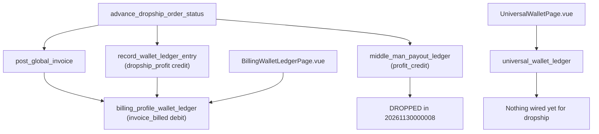

# Wallet Unification & UI Overhaul Plan

## Current State — What's Broken



Two parallel systems still exist:
- `billing_profile_wallet_ledger` — still being written to by `advance_dropship_order_status` and `post_global_invoice`
- `universal_wallet_ledger` — exists but dropship flows don't write to it
- `BillingWalletLedgerPage.vue` + `billingWalletRepository.ts` — separate legacy UI still reading from old table

---

## Phase 1 — Backend: Wire dropship flow to universal_wallet_ledger

**Migration file:** `YYYYMMDDHHMMSS_wire_dropship_to_universal_wallet.sql`

Redefine `advance_dropship_order_status` to call `record_ledger_transaction` instead of `record_wallet_ledger_entry`:

At `ready_for_pickup` / forward statuses:
- **Reseller wallet** (`entity_type='customer'`, `entity_id=billing_profile_id`):
  - `invoice_billed` debit — already triggered via `post_global_invoice`, needs to be redirected here
  - `dropship_profit` credit — currently goes to `billing_profile_wallet_ledger`, redirect to `universal_wallet_ledger` with `metadata.section = 'payout_earned'`
- **Tenant wallet** (`entity_type='tenant'`, `entity_id=tenant_id`):
  - `revenue` credit for net revenue

At rollback to `processing`:
- Delete matching `universal_wallet_ledger` entries by `source_id = order_no` and `source_type = 'shop_order'`

Redefine `post_global_invoice` to write `invoice_billed` debit to `universal_wallet_ledger` for dropship invoices (it already writes to `billing_profile_wallet_ledger` — add parallel write, then remove old one in Phase 3).

Key `metadata` fields to always populate:
```json
{
  "section": "receivable | payout_earned | cod_holding | delivery_fee | intercompany | revenue",
  "label": "Human readable label",
  "order_no": "ORD-XXXXXX"
}
```

---

## Phase 2 — UI: Overhaul UniversalWalletPage

### 2a. Section-aware KPI cards — replace `UniversalWalletKPICards.vue`

Per entity type, show meaningful tiles instead of generic Credits/Debits:

**Customer (Billing Profile):**
- Outstanding Balance (they owe you) — red if negative
- Profit Pending Payout — from `payout_earned` section credits minus payouts
- Total Payments Received

**Courier:**
- COD Pending Remittance — from `cod_holding` section
- Delivery Fees Outstanding

**Tenant:**
- Total Revenue
- Total Courier Costs
- Total Profit Paid Out

### 2b. Section column in ledger table — update `UniversalWalletLedgerTable.vue`

Add a **"Category"** column that maps `metadata.section` to a human-readable badge:

| section value | displayed label | badge color |
|---|---|---|
| `receivable` | Invoice Billed | orange |
| `payout_earned` | Profit Earned | green |
| `cod_holding` | COD Collected | blue |
| `delivery_fee` | Delivery Fee | grey |
| `revenue` | Revenue | teal |
| `adjustment` | Manual Adjustment | purple |
| `payment_received` | Payment Received | green |

Also rename `source_type` chip labels:
- `shop_order` → "Sales Order"
- `vendor_purchase` → "Vendor Purchase"
- `payout` → "Payout"
- `adjustment` → "Adjustment"

### 2c. Balance label per entity — update `UniversalWalletKPICards.vue`

Show context below balance number:
- `customer`: "Negative = they owe you"
- `courier`: "Negative = COD/fees not yet settled"
- `tenant`: "Your net position"

### 2d. Merge Middleman tab into Billing Profile tab

Remove the `middleman` tab from `UniversalWalletPage.vue`. Both load the same `billing_profiles` data — the distinction is meaningless. The `entity_type='middleman'` can stay in the DB constraint but the UI should not expose it as a separate tab.

### 2e. Add section filter chips to `UniversalWalletToolbar.vue`

Replace the "Source" dropdown with a section chip bar (multi-select) showing the sections that exist in the current loaded entries.

### 2f. Quick action buttons in `UniversalWalletHeader.vue`

Per entity type, add context-aware action buttons:
- **Customer**: "Record Payment" (credit, `payment_received`) + existing "Adjust"
- **Courier**: "Record Remittance" (credit, `cod_holding`)
- **Tenant**: "Adjust" only

---

## Phase 3 — Retire legacy tables (after Phase 1 verified in prod)

**Migration file:** `YYYYMMDDHHMMSS_retire_billing_profile_wallet_ledger.sql`

- Remove `invoice_billed` write from `post_global_invoice` to `billing_profile_wallet_ledger`
- Remove `record_wallet_ledger_entry` calls from `advance_dropship_order_status`
- Drop `billing_profile_wallet_ledger` table
- Drop `record_wallet_ledger_entry` function
- Drop `create_bulk_wallet_payout` function (replace with `record_ledger_transaction` calls)

**Frontend cleanup:**
- Delete [`web/src/modules/sales_invoice/repositories/billingWalletRepository.ts`](web/src/modules/sales_invoice/repositories/billingWalletRepository.ts)
- Delete [`web/src/modules/sales_invoice/composables/useBillingWalletQuery.ts`](web/src/modules/sales_invoice/composables/useBillingWalletQuery.ts)
- Delete [`web/src/modules/sales_invoice/composables/useBillingWalletMutations.ts`](web/src/modules/sales_invoice/composables/useBillingWalletMutations.ts)
- Delete [`web/src/modules/sales_invoice/components/SettleWalletPayoutDialog.vue`](web/src/modules/sales_invoice/components/SettleWalletPayoutDialog.vue)
- Delete [`web/src/modules/sales_invoice/pages/BillingWalletLedgerPage.vue`](web/src/modules/sales_invoice/pages/BillingWalletLedgerPage.vue)
- Update any routes that point to `BillingWalletLedgerPage` to redirect to `UniversalWalletPage`

---

## Files Changed Summary

**Backend (new migrations):**
- `supabase/migrations/YYYYMMDD_wire_dropship_to_universal_wallet.sql`
- `supabase/migrations/YYYYMMDD_retire_billing_profile_wallet_ledger.sql` (Phase 3)

**Frontend (modified):**
- [`web/src/modules/wallet/components/UniversalWalletKPICards.vue`](web/src/modules/wallet/components/UniversalWalletKPICards.vue) — section-aware KPIs
- [`web/src/modules/wallet/components/UniversalWalletLedgerTable.vue`](web/src/modules/wallet/components/UniversalWalletLedgerTable.vue) — add Category column, human-readable source labels
- [`web/src/modules/wallet/components/UniversalWalletToolbar.vue`](web/src/modules/wallet/components/UniversalWalletToolbar.vue) — section chip filter
- [`web/src/modules/wallet/components/UniversalWalletHeader.vue`](web/src/modules/wallet/components/UniversalWalletHeader.vue) — quick action buttons per entity type
- [`web/src/modules/wallet/pages/UniversalWalletPage.vue`](web/src/modules/wallet/pages/UniversalWalletPage.vue) — remove Middleman tab
- [`web/src/modules/wallet/types/index.ts`](web/src/modules/wallet/types/index.ts) — add section type, extend metadata type

**Frontend (deleted in Phase 3):**
- `web/src/modules/sales_invoice/repositories/billingWalletRepository.ts`
- `web/src/modules/sales_invoice/composables/useBillingWalletQuery.ts`
- `web/src/modules/sales_invoice/composables/useBillingWalletMutations.ts`
- `web/src/modules/sales_invoice/components/SettleWalletPayoutDialog.vue`
- `web/src/modules/sales_invoice/pages/BillingWalletLedgerPage.vue`
