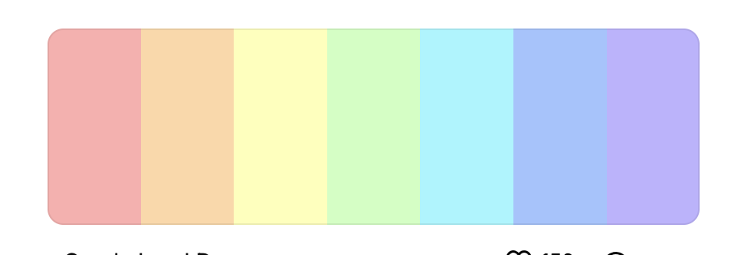

# BrandWala Wholesale Quasar

This repo contains the Quasar SPA plus the Supabase backend migrations for the platform.

The goal of this document is to give a future developer or AI enough context to generate correct SQL, RLS, and RPCs in one pass without having to rediscover the architecture.

For the current role model and the repeatable schema/RLS/RPC pattern, also see:

- [`document/core-backend-architecture.md`](/Users/david/Desktop/projects/group/brandwala-wholesale-quasar-v2/document/core-backend-architecture.md)
- [`document/costing-backend-architecture.md`](/Users/david/Desktop/projects/group/brandwala-wholesale-quasar-v2/document/costing-backend-architecture.md)

## Project Layout

```text
web/        Frontend app
supabase/   Database migrations, local config, generated types
```

## Current Auth Model

Login uses Google OAuth through Supabase.

Current route scopes:

- `platform` for superadmin
- `app` for admin and staff
- `shop` for customer-side access

The login callback flow is:

1. User starts OAuth from a scope-specific login page.
2. Supabase redirects back to `/auth/callback?scope=...`.
3. The callback reads the session email.
4. The callback calls `check_login_membership(p_email, p_scope)`.
5. If a matching membership row exists, the auth store saves the user and member snapshot.
6. The user is redirected to:
   - `platform/dashboard`
   - `app/dashboard`
   - `shop/dashboard`
7. If no row matches, the session is cleared and the user is returned to the login page with an error.

## Current Member Rule

Membership access is driven by the `memberships` table.

The key idea is:

- the authenticated Google email must match `memberships.email`
- the role must match the selected scope
- the membership must be active
- for superadmin, `tenant_id` must be `null`
- shop access is resolved through customer-group membership in the current model

Current role mapping:

- `platform` -> `superadmin`
- `app` -> `admin`, `staff`, `viewer`
- `shop` -> customer-side roles from `public.customer_group_members`, mapped in the frontend to normalized access roles

## Current Database Shape

### `public.app_role`

Enum values:

- `superadmin`
- `admin`
- `staff`
- `viewer`

Legacy customer-side roles are now represented by `public.customer_group_role` on `public.customer_group_members`.

### `public.memberships`

Current columns:

- `id`
- `tenant_id`
- `role`
- `is_active`
- `created_at`
- `updated_at`
- `email`

Important rules:

- `role = superadmin` must have `tenant_id = null`
- all non-superadmin roles must have a `tenant_id`
- the login flow uses `email + role + is_active`

### `public.tenants`

Current columns:

- `id`
- `name`
- `slug`
- `is_active`
- `created_at`
- `updated_at`

### `public.modules`

Current columns:

- `id`
- `key`
- `name`
- `description`
- `is_active`
- `created_at`
- `updated_at`

### `public.tenant_modules`

Current columns:

- `id`
- `tenant_id`
- `module_key`
- `is_active`
- `created_at`
- `updated_at`

## Current Supabase Functions

The project currently uses these public RPCs:

- `current_user_email()`
- `is_superadmin()`
- `is_tenant_admin(p_tenant_id)`
- `can_manage_membership(p_target_tenant_id, p_target_role)`
- `check_login_membership(p_email, p_scope)`
- `list_tenants_for_superadmin()`
- `create_tenant_for_superadmin(p_name, p_slug, p_is_active)`
- `update_tenant_for_superadmin(p_tenant_id, p_name, p_slug, p_is_active)`
- `delete_tenant_for_superadmin(p_tenant_id)`

## Current RLS Pattern

The important rule is that helper functions that read protected tables should be `security definer` when needed.

Why:

- `tenants` is protected by RLS
- `memberships` is also protected by RLS
- helpers like `is_superadmin()` can otherwise get trapped by recursive policy checks

Current pattern:

- helper functions that need membership access are `security definer`
- tenant reads and writes happen through RPCs instead of direct table calls
- the RPC checks `public.is_superadmin()` before touching `public.tenants`

## CRUD Pattern To Follow

For future tables, use this sequence:

1. Create the table and indexes.

## OAuth Redirect Config

The frontend now chooses the Google OAuth callback base URL like this:

- development: `VITE_LOCAL_APP_URL`
- production build: `VITE_PRODUCTION_APP_URL`
- fallback: `window.location.origin`

The app uses history routing, so the OAuth callback URL is:

- `/auth/callback?scope=...`

Set these env vars in the `web` app:

- `VITE_LOCAL_APP_URL=http://localhost:9000`
- `VITE_PRODUCTION_APP_URL=https://your-production-domain.example`

In Supabase Auth, make sure both callback hosts are included in Redirect URLs. 2. Enable RLS. 3. Add policies. 4. Add helper functions if the policy needs cross-table access. 5. Make helper functions `security definer` if they read RLS-protected tables. 6. For write operations, prefer RPCs when direct client access would fight RLS. 7. Regenerate Supabase types.

### Safe RPC Rules

When creating an RPC:

- prefer `language sql` for simple insert/update/delete logic
- use `security definer`
- set `search_path = public`
- use a CTE if Postgres complains about ambiguous output columns
- do not reuse output names that can collide with table columns unless the query is fully qualified

## Global API Feedback

The frontend now has a shared API feedback helper at:

- [`web/src/utils/appFeedback.ts`](/Users/david/Desktop/projects/group/brandwala-wholesale-quasar-v2/web/src/utils/appFeedback.ts)

Current behavior:

- successful create, update, and delete actions show a Quasar `Notify` toast
- failed API responses show a Quasar `Dialog` with the backend or fallback error message
- the dialog includes a `Close` button so users can dismiss warnings cleanly

Current wiring:

- tenant, membership, module, tenant-module, and customer-group store actions call the shared helper
- Quasar `Dialog` and `Notify` are enabled in [`web/quasar.config.ts`](/Users/david/Desktop/projects/group/brandwala-wholesale-quasar-v2/web/quasar.config.ts)

When adding new API actions:

1. Keep returning the normalized `{ success, data, error }` shape from the service layer.
2. In the store, call `handleApiFailure(result, fallbackMessage)` for failed responses.
3. Call `showSuccessNotification(message)` after successful mutations.
4. Avoid duplicating page-level warning dialogs unless the flow needs a special-case UX.

## Tenant Module Flow

Frontend flow:

1. Page calls store
2. Store calls service
3. Service calls repository
4. Repository calls Supabase RPC

Tenant actions:

- list -> `list_tenants_for_superadmin`
- create -> `create_tenant_for_superadmin`
- update -> `update_tenant_for_superadmin`
- delete -> `delete_tenant_for_superadmin`

## Files To Read First

- [`web/src/modules/auth/composables/useOAuthLogin.ts`](/Users/david/Desktop/projects/group/brandwala-wholesale-quasar-v2/web/src/modules/auth/composables/useOAuthLogin.ts)
- [`web/src/modules/auth/stores/authStore.ts`](/Users/david/Desktop/projects/group/brandwala-wholesale-quasar-v2/web/src/modules/auth/stores/authStore.ts)
- [`web/src/modules/tenant/repositories/tenantRepository.ts`](/Users/david/Desktop/projects/group/brandwala-wholesale-quasar-v2/web/src/modules/tenant/repositories/tenantRepository.ts)
- [`web/src/modules/tenant/services/tenantService.ts`](/Users/david/Desktop/projects/group/brandwala-wholesale-quasar-v2/web/src/modules/tenant/services/tenantService.ts)
- [`web/src/modules/tenant/stores/tenantStore.ts`](/Users/david/Desktop/projects/group/brandwala-wholesale-quasar-v2/web/src/modules/tenant/stores/tenantStore.ts)
- [`supabase/migrations/20260331120000_initial_schema.sql`](/Users/david/Desktop/projects/group/brandwala-wholesale-quasar-v2/supabase/migrations/20260331120000_initial_schema.sql)
- [`supabase/migrations/20260331125000_membership_rls_definer.sql`](/Users/david/Desktop/projects/group/brandwala-wholesale-quasar-v2/supabase/migrations/20260331125000_membership_rls_definer.sql)
- [`supabase/migrations/20260331125500_tenant_list_rpc.sql`](/Users/david/Desktop/projects/group/brandwala-wholesale-quasar-v2/supabase/migrations/20260331125500_tenant_list_rpc.sql)
- [`supabase/migrations/20260331130500_redefine_create_tenant_rpc.sql`](/Users/david/Desktop/projects/group/brandwala-wholesale-quasar-v2/supabase/migrations/20260331130500_redefine_create_tenant_rpc.sql)
- [`supabase/migrations/20260331131000_tenant_update_delete_rpc.sql`](/Users/david/Desktop/projects/group/brandwala-wholesale-quasar-v2/supabase/migrations/20260331131000_tenant_update_delete_rpc.sql)

## Migration Workflow

Use these commands from the repo root:

```bash
npm run backend:push
npm run backend:types
npm run deploy:backend
```

Recommended flow:

1. Add or change SQL in `supabase/migrations`.
2. Push the migration.
3. Regenerate types.
4. Update the frontend repository/service/store types if needed.

## What To Remember Next Time

If you are adding a new table or function later, keep this order in mind:

- write the schema first
- think about RLS before the UI
- use RPCs for privileged writes
- keep auth checks based on membership data, not client state
- regenerate types after every schema change
- avoid naming collisions in SQL function return values

That is the path that has been working reliably in this project.

color pallet

--powder-blush: #ffadadff;
--apricot-cream: #ffd6a5ff;
--cream: #fdffb6ff;
--tea-green: #caffbfff;
--electric-aqua: #9bf6ffff;
--baby-blue-ice: #a0c4ffff;
--periwinkle: #bdb2ffff;

https://coolors.co/palette/ffadad-ffd6a5-fdffb6-caffbf-9bf6ff-a0c4ff-bdb2ff

