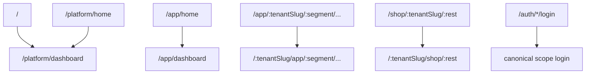
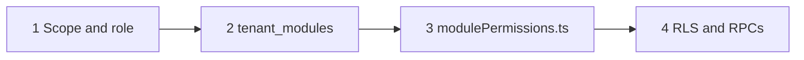
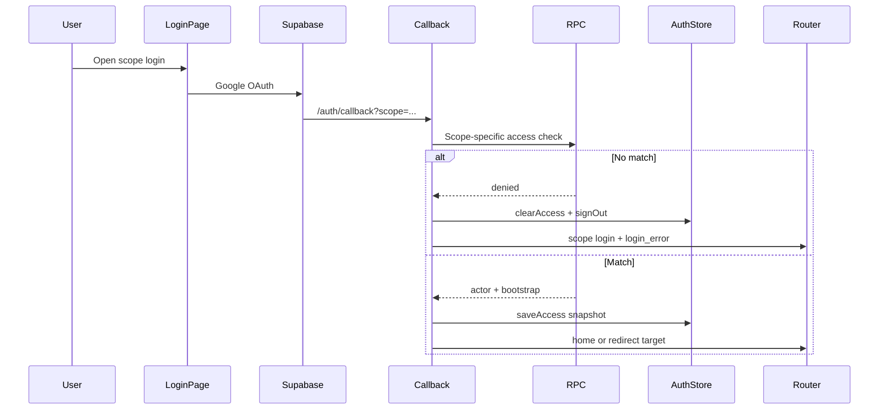

# Application Scopes and Access Control

BrandWala / TradeFlow BD is a **single Quasar web application** with **four isolated workspaces** (scopes). Each scope has its own URL prefix, login page, allowed membership or actor roles, and set of visible modules.

This document answers:

- Which workspace am I in?
- What is each scope used for?
- How do URL redirects work?
- How is access granted or denied?

For the full product architecture and module catalog, see [MASTER_PLAN.md](MASTER_PLAN.md). For step-by-step login and navigation implementation, see [LOGIN_NAV_PERMISSION_FLOW.md](../LOGIN_NAV_PERMISSION_FLOW.md). For backend actor tables and RPCs, see [document/core-backend-architecture.md](../document/core-backend-architecture.md).

---

## 1. Scope overview

| Scope | Route prefix | Layout | Users (roles) | Auth source | Primary purpose |
|-------|--------------|--------|---------------|-------------|-----------------|
| **Platform** | `/platform` | `PlatformLayout` | Superadmin | `memberships` (`tenant_id` is null, `role = superadmin`) | Tenant, market, and module administration |
| **App** | `/:tenantSlug/app` | `AppLayout` | admin, staff, viewer | `memberships` | Internal business operations per tenant |
| **Shop** | `/:tenantSlug/shop` | `ShopLayout` | customer_admin, customer_negotiator, customer_staff | `customer_group_members` | B2B customer portal per tenant |
| **Investor** | `/:tenantSlug/investor` | `InvestorLayout` | investor | `memberships` (`role = investor`) | External investor portfolio (read-only) |

All four scopes share **Google OAuth** via Supabase. What differs is which role or actor table is checked after OAuth, which session context is stored, and which routes/modules are reachable.

### What each scope is not

| Scope | Is not |
|-------|--------|
| **Platform** | A tenant workspace. Superadmins do not run shipments, invoices, or shop orders here. |
| **App** | A customer-facing shop. Internal staff use this; B2B buyers use Shop. |
| **Shop** | An internal admin panel. Membership in `memberships` does **not** grant shop access unless the user also exists in `customer_group_members`. |
| **Investor** | Internal capital management or App workspace. Parent admins manage capital in App (`global_investor`); **`investor` memberships** only grant the read-only Investor portal. |

### Tenant context in URLs

- **Platform** has no tenant in the URL.
- **App**, **Shop**, and **Investor** are tenant-scoped. The canonical pattern puts the tenant slug **first**: `/:tenantSlug/<scope>/...`.
- Parent company vs sister concern (child tenant) affects **which modules and data** are available inside App/Shop, not the URL shape. See [TENANT_MODEL_AND_ACCESS.md](TENANT_MODEL_AND_ACCESS.md).

---

## 2. What each scope is used for

### Platform (`/platform`)

Superadmin workspace for cross-tenant administration:

- Create and manage **tenants** (parent companies, sister concerns, standalone)
- Manage **markets** and platform-level configuration
- Assign **superadmin memberships**
- Enable or disable **modules per tenant** via `tenant_modules` (no inheritance between parent and child)

Platform does not execute procurement, stock, sales, or accounting workflows.

### App (`/:tenantSlug/app`)

Internal operations workspace for tenant staff. Typical capabilities (each gated by `tenant_modules`):

| Domain | Example module keys | Who uses it |
|--------|---------------------|-------------|
| Procurement | `order_management`, `product_based_costing`, `costing_file` | Child tenants: orders and costing before parent procures |
| Stock & shipments | `global_shipment`, `global_stock`, `inventory` | Parent: shipments and global stock; child: tenant stock allocations |
| Sales & invoicing | `global_invoice`, `invoice` (legacy), `commerce_invoice` | Desk sales and commerce back-office |
| Ledger & treasury | `accounting`, `global_accounting_ledger`, `global_payments` | Tenant and parent consolidated accounting |
| Commerce admin | `commerce_shop`, `commerce_order`, `commerce_accounting` | Commerce configuration and fulfillment (not customer cart UI) |
| Capital (internal) | `investor`, `global_investor`, `global_investor_shipment` | Parent: manage investor capital and shipment cost-share |
| Verticals | `thrift_*`, `koba_*`, `tasks` | Per-tenant optional verticals |
| Catalog | `products`, `vendor` | Product and supplier master data |

**Role behavior:**

- **admin** — full internal module access (per matrix)
- **staff** — operational access; some modules view-only or hidden
- **viewer** — limited access; after login, redirected to costing file viewer instead of dashboard

Multi-tenant users (memberships on more than one tenant) must **pick a tenant** from `/:tenantSlug/app/tenants` (`admin-tenant-list`) before entering module routes.

### Shop (`/:tenantSlug/shop`)

Customer-facing B2B portal. Users are **customer group members**, not internal staff. Typical modules:

| Module key | Purpose |
|------------|---------|
| `store` | Storefront browsing and group-specific pricing |
| `cart` | B2B cart before order placement |
| `order_management` | Purchase orders and negotiation |
| `commerce_shop`, `commerce_cart`, `commerce_order` | Commerce storefront, cart, and checkout |
| `costing_file` | View shared pre-order costing files (when granted) |
| `koba_retail` | Scraped retail catalog orders (where enabled) |

Shop users never see internal modules such as shipments, global stock administration, or accounting ledgers.

**Customer-side roles** (stored in `customer_group_members`, mapped in frontend to `customer_admin`, `customer_negotiator`, `customer_staff`):

- **customer_admin** — broad shop module access
- **customer_negotiator** — orders and negotiation
- **customer_staff** — cart and order placement

### Investor (`/:tenantSlug/investor`)

External read-only portal for capital partners. Requires:

- `investor_portal` module active on the tenant (typically parent company slug)
- An active **`memberships` row** with `role = 'investor'`, linked to an `investors` capital profile (`investor_id`)

Parent admins add investor members from tenant admin (`/:tenantSlug/app/tenants/:id`) alongside staff and viewer. Portal users log in only at `/:tenantSlug/investor/login` — they do not enter App routes.

Pages: portfolio summary and shipment investment breakdown. Separate from App's `global_investor` admin screens.

> **Current implementation:** Portal auth still uses `investor_accounts`. Migration to `memberships.role = 'investor'` is documented in [TENANT_MODEL_AND_ACCESS.md §10](TENANT_MODEL_AND_ACCESS.md).

---

## 3. URL model and redirects

### Canonical route patterns

| Area | Login | Home / dashboard |
|------|-------|------------------|
| Platform | `/platform/login` | `/platform/dashboard` |
| App | `/:tenantSlug?/app/login` | `/:tenantSlug/app/dashboard` |
| Shop | `/:tenantSlug?/shop/login` | `/:tenantSlug/shop/dashboard` |
| Investor | `/:tenantSlug?/investor/login` | `/:tenantSlug/investor/portfolio` |

Legacy `/auth/*` paths redirect to the canonical login URLs (for example `/auth/platform/login` → `/platform/login`).

### Root and legacy redirects



Implemented in `web/src/router/routes.ts`:

- `/` → `/platform/dashboard`
- `/app/home` → `/app/dashboard`
- `/platform/home` → `/platform/dashboard`
- `/app/:tenantSlug/:after(...)/:rest*` → `/:tenantSlug/app/:after/:rest*` (rewrites old path order)
- `/shop/:tenantSlug/:rest*` → `/:tenantSlug/shop/:rest*` (moves slug before `shop`)

### Shop tenant resolution

Before shop login, the app must resolve **exactly one tenant**:

1. **Slug in URL** — `/:tenantSlug/shop/...` or `?tenant_slug=` query param
2. **Public domain hostname** — if the browser hostname matches `tenants.public_domain`, tenant is resolved without a slug (not available on `localhost`)

If resolution fails, the user is sent back to shop login with `login_error=invalid_tenant`.

Helper: `getTenantLookupFromRoute()` in `web/src/modules/tenant/utils/tenantRouteContext.ts`.

### App tenant selection and slug alignment

After App login:

- If the user has **multiple tenant memberships** and no tenant slug in the URL, they go to **`admin-tenant-list`** to choose a tenant.
- If they have a single membership or a slug in the URL, bootstrap runs for that tenant.

Route guards on App pages compare **route tenant slug** vs **selected tenant slug** in the auth session. On mismatch, the guard rewrites the URL to the selected tenant's slug via `getAppRouteLocation()`.

### Post-login redirects

| Condition | Redirect target |
|-----------|-----------------|
| `?redirect=` on login page | Original path (if allowed) |
| Shop redirect slug ≠ session tenant | Ignored; user goes to their tenant dashboard |
| App role = `viewer` | `viewer-costing-file-page` (not dashboard) |
| Default | Scope home route (`superadmin-dashboard`, `admin-dashboard`, `customer-dashboard`, `investor-portfolio-page`) |

On guard failure (unauthenticated or insufficient access), user is sent to the scope login with `?redirect=<attempted path>`.

---

## 4. Access control model

Access is enforced in **four layers**. All must pass for a protected route or RPC.



| Layer | Source | Controls |
|-------|--------|----------|
| **1 — Scope** | Route prefix + session `scope` | Which roles apply per scope (`memberships` or `customer_group_members`) |
| **2 — Tenant modules** | `tenant_modules` + bootstrap RPCs | Whether a feature is enabled for this tenant (`is_active = true`) |
| **3 — Role matrix** | `web/src/modules/navigation/modulePermissions.ts` | What each role may do inside an enabled module (today mostly `view`) |
| **4 — Row access** | Postgres RLS + security-definer RPCs | Tenant/parent isolation at data level |

**Effective frontend permission:**

```
authenticated
  AND scope matches route
  AND role allowed for route
  AND module active in tenant_modules
  AND action permitted in role matrix
```

Database controls **which modules exist for a tenant**. Code controls **what each role can do** inside those modules.

Full role × module matrix: MASTER_PLAN §15.3.

---

## 5. Route guards

Most App and Shop routes use `createAccessGuard()` from `web/src/modules/auth/guards/accessGuard.ts`.

### Guard checklist

1. `authStore.isAuthenticated` and `authStore.hasAccess`
2. `requiredScope` matches session scope (`platform` | `app` | `shop`)
3. `requireTenantContext` — `tenantId` present (app/shop)
4. `allowedRoles` — actor role in allowed list
5. `requiredModule` + `requiredModuleAction` — `canAccessModule()` checks `tenant_modules` + matrix
6. Optional `validateAccess` — custom rules (tenant slug match, customer group present)

On failure → redirect to `loginRoute` with `?redirect=`.

### Investor guard

Investor routes use `createInvestorAccessGuard()` — requires `scope === 'investor'`, `matchedRole === 'investor'`, and `investor_portal` in `activeModuleKeys`.

### Example: App dashboard guard

- Scope: `app`
- Roles: `admin`, `staff`
- Tenant context required
- `validateAccess`: if no selected tenant → `admin-tenant-list`; if route slug ≠ selected slug → rewrite URL

### Example: Shop dashboard guard

- Scope: `shop`
- Roles: `customer_admin`, `customer_negotiator`, `customer_staff`
- Validates `actorType === 'customer_group_member'` and customer group id
- Normalizes missing or mismatched tenant slug to session tenant

Module-specific routes add `requiredModule: '<key>'` (for example `global_stock`, `commerce_shop`).

---

## 6. Login and session flow



### Steps (all scopes)

1. User opens a scope login page. Route `meta.authScope` sets the scope.
2. Google OAuth runs; callback lands on `/auth/callback?scope=<scope>`.
3. Callback reads Supabase session email.
4. Scope-specific backend check runs (see table below).
5. **Failure:** sign out, clear `authStore`, redirect to scope login with `login_error`.
6. **Success:** persist `AuthAccessSnapshot` (localStorage key `brandwala.auth.access.v2`), load active module keys, redirect.

### Backend checks by scope

| Scope | RPC / check | Valid match |
|-------|-------------|-------------|
| Platform | `check_login_membership(p_email, 'platform')` | Active membership, role `superadmin`, `tenant_id` null |
| App | `check_login_membership(p_email, 'app')` then `get_app_bootstrap_context` | Active membership, role `admin` / `staff` / `viewer`, tenant resolved |
| Shop | `check_shop_login_access(p_email, p_tenant_id)` | Active `customer_group_members` row for tenant |
| Investor | `check_login_membership(p_email, 'investor')` then investor bootstrap | Active membership, `role = investor`, linked `investor_id`; `investor_portal` module |

### Cross-scope rules

- **Separate identities:** App membership does not imply Shop access. A user needs an explicit `customer_group_members` row to use Shop.
- **Investor is membership-scoped but scope-isolated:** `role = investor` is stored in `memberships` but only matches Investor scope login — not App, Shop, or Platform.
- **Scope is session-bound:** Logging into App does not grant Platform, Shop, or Investor routes; each scope has its own login entry.
- **Module flags are per tenant:** `tenant_modules` has no parent→child inheritance; superadmin enables modules per tenant on Platform.

### Session snapshot (what is stored)

| Scope | Stored context |
|-------|----------------|
| Platform | user, scope, role |
| App | user, scope, role, tenant, membership id, active module keys |
| Shop | user, scope, tenant, customer group, member id, customer role, active module keys |
| Investor | user, scope, role (`investor`), tenant, membership id, `investor_id`, active module keys |

---

## 7. Navigation visibility

The sidebar/drawer is **not hardcoded per layout**. It is built from:

1. Current **scope**
2. Current **role**
3. **Active module keys** from bootstrap (`tenant_modules`)
4. **`MODULE_REGISTRY`** — all possible nav items with `moduleKey`, route, icon, scopes
5. **`modulePermissions.ts`** — filters items the role cannot access

Flow: load active keys → filter registry by scope → drop disabled modules → drop disallowed roles → render.

Details: [LOGIN_NAV_PERMISSION_FLOW.md § Auto-Generated Navigation](../LOGIN_NAV_PERMISSION_FLOW.md).

---

## 8. Key code references

| Concern | File |
|---------|------|
| Route table and legacy redirects | `web/src/router/routes.ts` |
| Auth routes and login aliases | `web/src/modules/auth/routes/index.ts` |
| Dashboard routes and scope guards | `web/src/modules/dashboard/routes/index.ts` |
| Generic access guard | `web/src/modules/auth/guards/accessGuard.ts` |
| Investor guard | `web/src/modules/investor_portal/guards/investorAccessGuard.ts` |
| OAuth login and post-login redirect | `web/src/modules/auth/composables/useOAuthLogin.ts` |
| Session persistence | `web/src/modules/auth/stores/authStore.ts` |
| Tenant slug helpers | `web/src/modules/tenant/utils/tenantRouteContext.ts` |
| Role × module matrix | `web/src/modules/navigation/modulePermissions.ts` |
| Nav registry | `web/src/modules/navigation/moduleRegistry.ts` |
| Per-module route guards | `web/src/modules/*/routes/index.ts` |

---

## 9. Related documentation

| Document | Contents |
|----------|----------|
| [MASTER_PLAN.md](MASTER_PLAN.md) | Architecture, tenant model, feature matrix, full permission table |
| [TENANT_MODEL_AND_ACCESS.md](TENANT_MODEL_AND_ACCESS.md) | Parent/child tenants, slug resolution, module assignment, data ownership |
| [LOGIN_NAV_PERMISSION_FLOW.md](../LOGIN_NAV_PERMISSION_FLOW.md) | Login, bootstrap, navigation generation implementation |
| [document/core-backend-architecture.md](../document/core-backend-architecture.md) | Actor types, RLS identity rules, RPC names |
| [document/costing-backend-architecture.md](../document/costing-backend-architecture.md) | Costing-specific backend (App scope) |

---

## Quick reference

**One-line flow:**

```
Google login → scope-based access check → save actor context → fetch tenant modules → apply role matrix → generate navigation → guard routes
```

**Which URL for whom:**

- Superadmin managing tenants → `/platform`
- Warehouse manager at sister concern → `/{child-slug}/app`
- Wholesale buyer placing orders → `/{child-slug}/shop`
- External capital partner → `/{parent-slug}/investor`
