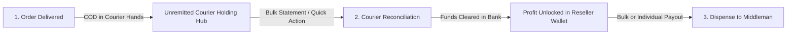
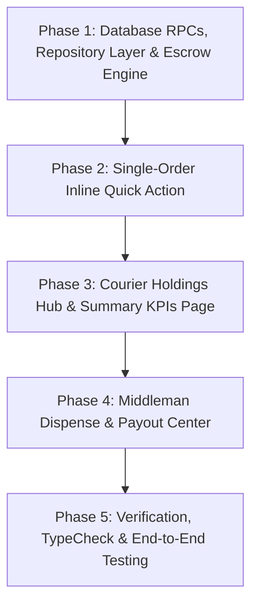

# Master Plan: Streamlined Courier Remittance & Middleman Dispense Workflow

> **Single Source of Truth** for Product Architecture, UX Flow, Data Contracts, and Phased Implementation.
> Strictly aligned with standard project guidelines in [`docs/`](../docs/).

---

## 1. Executive Summary & The Modern Escrow Model

In a modern dropshipping & wholesale platform, managing Cash on Delivery (COD) funds requires a **3-Stage Escrow Lifecycle**:



### The 3 Stages Explained:
1. **Stage 1: Order Delivered (Escrow / In-Transit)**
   - Courier collects COD from end-recipient.
   - Company logs Wholesale Revenue. Reseller Margin is logged as **`🔒 Locked (Pending Courier)`**. Zero financial risk for company.
2. **Stage 2: Courier Reconciliation (Bank Clearing)**
   - Courier deposits bank batch.
   - Admin reconciles via **1-Click Inline Action** on order row or **Bulk AWB Statement Matcher**.
   - Net cash enters bank; Reseller Margin automatically becomes **`🟢 Available for Payout`**.
3. **Stage 3: Middleman Dispense (Payout Execution)**
   - Admin views reseller available balances.
   - Admin dispenses payouts via bKash, Nagad, Bank Transfer, or Wallet Credit in single or bulk actions.

---

## 2. Architectural Compliance & Standards Matrix

Each phase in this master plan strictly enforces the core guidelines established in [`docs/`](../docs/):

| Guide / Standard | Architectural Requirement | Enforcement in Master Plan |
| :--- | :--- | :--- |
| **`AI_WORKFLOW_SOP.md`** | Unbroken Data Contract (DB Schema → Repository → Composables → Vue UI). Micro-phase isolated workflow with review gates. | Phased micro-execution structure with clear dependencies and review gates. |
| **`COMPONENT_MODULARIZATION_GUIDE.md`** | Parent container max **250 lines**, sub-components max **150 lines**, composables max **120 lines**. Rule of 3 (extract visual blocks into `components/`). No math in templates. | All pages split into container pages, modular presentational components, and business composables. |
| **`TANSTACK_QUERY_GUIDE.md`** | TanStack Query owns server state, Pinia owns client state. Repository Pattern for all API/Supabase calls. Centralized module query key factory with `tenantId`. | Repository layer (`courierRemittanceRepository.ts`) and central query key factories (`shopOrderQueryKeys.ts`) wrap all RPCs. |
| **`ERROR_AND_SUCCESS_MESSAGE_GUIDE.md`** | Mutations trigger `showSuccessNotification` + `parseSupabaseError`. Queries NEVER trigger success toasts. Backend RPCs throw clean `RAISE EXCEPTION` errors. | Standardized toast notifications in mutation composables and user-friendly RPC exceptions. |
| **`PAGE_LAYOUT_AND_LOADERS.md`** | `q-page class="q-pa-md"` with centered max-width 1200px. Header overline + `h1`. Dedicated separate skeleton loader components in `components/` (Zero CLS). | Dedicated `CourierHoldingsSkeleton.vue` & `DropshipMerchantsSkeleton.vue` extracted as standalone SFCs. |
| **`UI_CONSISTENCY.md`** | Standard 8px radius buttons (`unelevated no-caps`). Avatar initial picker + hash color generator (`getInitials` + `getAvatarColor`) for billing profiles/merchants. | merchant/billing profile tables use avatar color hash pattern; standard Quasar design tokens applied. |
| **`OPTIMIZE_ERRORS.md`** | Zero-drift `vue-tsc` type-checking and ESLint verification in `web/`. | Phase 5 explicitly requires clean `npx vue-tsc --noEmit` & `npx eslint . --fix` passes. |
| **Wallet SSOT** ([`wallet/UNIVERSAL_WALLET_LEDGER.md`](wallet/UNIVERSAL_WALLET_LEDGER.md)) | Wallet owner = `entity_type` + `entity_id` (middleman, courier, tenant). Money correctness does not depend on tags. | Remittance unlock + dispense mutate ledger by billing profile / courier id. |
| **Tagging SSOT** ([`tag/UNIVERSAL_TAGGING_SYSTEM.md`](tag/UNIVERSAL_TAGGING_SYSTEM.md)) | Tags = classification only (ops labels, expense dimensions). **Out of scope** for this escrow plan. | Do not block remittance/dispense on a tagging engine; optional order labels later. |

### Explicit non-goals (this plan)

- Building `tags` / `entity_tags` or using tags as wallet / courier / middleman identity.
- Replacing order status or locked/available wallet state with free-form labels.

---

## 3. Page-by-Page UX Flow & Component Architecture

```
[ Page 1: Dropship Orders List ] ──(Quick Inline Action)──► Courier Settled!
         │
         ▼
[ Page 2: Courier Holdings Hub ] ──(Bulk Statement Match)──► All Matched Settled!
         │
         ▼
[ Page 3: Middleman Payout Center ] ──(Bulk / Single Payout)──► Dispensed to Reseller!
```

### 📄 Page 1: Dropship Orders List & Detail (`/app/shop/dropship/orders`)
- **Visual Badge**: Shows `Delivered - Pending Remittance` vs `Payment Received`.
- **Inline Action**: `[ Mark Remitted ]` button directly on order row or detail action bar for instant 1-second settlement.
- **Component Stack**:
  - `QuickRemitDialog.vue` (<150 lines presentational dialog).
  - `useQuickRemitMutation.ts` (<120 lines mutation composable).

### 📄 Page 2: Courier Holdings & Bulk Remittance Hub (`/app/shop/dropship/courier-holdings`)
- **Layout Grid**: Centered 1200px container (`q-page class="q-pa-md"`), vertical stack (`q-gutter-y-md`).
- **Header**: Overline (`text-overline text-primary`), Title (`h1 class="text-h5 text-weight-bold q-my-none"`).
- **3 Top KPI Cards**:
  - 💳 **Owed by Couriers** (Total COD held across all couriers)
  - 🏢 **Company Wholesale Share** (Base product cost & wholesale revenue)
  - 👤 **Middleman Margin Liability** (Total reseller profit pending courier deposit)
- **Courier Tabs & AWB Bulk Matcher**:
  - Filter by Steadfast, Pathao, RedX inside a `q-card flat bordered class="q-pa-sm"` toolbar.
  - `[ Reconcile Courier Statement ]` button: Paste AWBs → Auto-match → Click **Post & Unlock All**.
- **Component Stack**:
  - `CourierHoldingsPage.vue` (Container page: ~170 lines).
  - `CourierHoldingKpiCards.vue` (Summary metrics block: ~100 lines).
  - `CourierHoldingTable.vue` (Unremitted orders table: ~140 lines).
  - `CourierHoldingsSkeleton.vue` (Dedicated skeleton loader component: ~90 lines).
  - `useCourierHoldingsQuery.ts` (TanStack Query composable: ~80 lines).

### 📄 Page 3: Middleman Payout Center (`/app/shop/dropship/merchants`)
- **Reseller Balance Table**:
  - Merchant identity avatar: `<q-avatar size="36px" :color="getAvatarColor(merchantName)">` + `getInitials(merchantName)`.
  - Financial columns: `Locked Margin (Pending Courier)` vs `Available Wallet Balance`.
- **Dispense Actions**:
  - `[ Dispense Payout ]` button next to active reseller. Select bKash / Nagad / Bank Transfer / Store Credit and enter TRX ID.
- **Component Stack**:
  - `DropshipMerchantsPage.vue` (Container page: ~180 lines).
  - `DispensePayoutModal.vue` (Payment channel selection dialog: ~130 lines).
  - `DropshipMerchantsSkeleton.vue` (Dedicated skeleton loader component: ~80 lines).
  - `useMerchantPayoutQuery.ts` & `useDispensePayoutMutation.ts` (Composables: ~90 lines each).

---

## 4. Phased Execution Task Matrix

Follow these phases sequentially for implementation.



---

### Phase 1: Database RPCs, Repository Layer & Escrow State Engine
**Goal:** Create Supabase migration for escrow RPC functions, centralized query keys, and the TypeScript repository pattern for server-state interactions.

- **Depends On:** None
- **Status:** `[Pending]`
- **Files to Change:**
  - `[NEW]` `supabase/migrations/20261215000000_courier_middleman_workflow_rpcs.sql`
  - `[NEW]` `web/src/modules/shop_order/repositories/courierRemittanceRepository.ts`
  - `[MODIFY]` `web/src/modules/shop_order/shared/queryKeys/shopOrderQueryKeys.ts`
- **Specification:**
  1. **Database RPCs**:
     - `public.get_courier_unremitted_financial_summary(p_tenant_id bigint)`: Returns aggregated totals per courier (`gross_cod_total`, `company_wholesale_total`, `middleman_margin_total`).
     - `public.reconcile_single_order_remittance(p_order_id bigint, p_courier_charge numeric)`: Validates order is `delivered`, inserts global payment, advances status to `payment_received`, and unlocks middleman profit in `billing_profile_wallet_ledger` (transitions state to `available`). Raises clear, human-readable exceptions on invalid transitions (`ERROR_AND_SUCCESS_MESSAGE_GUIDE.md`).
     - `public.dispense_middleman_payout(p_billing_profile_id bigint, p_amount numeric, p_method text, p_trx_id text)`: Deducts payout from reseller available wallet balance and inserts ledger entry with `transaction_type = 'payout_dispensed'`.
  2. **Repository Layer (`courierRemittanceRepository.ts`)**:
     - Enforce `TANSTACK_QUERY_GUIDE.md`: Wrap all Supabase RPC invocations inside strongly-typed static methods (`fetchUnremittedSummary`, `reconcileSingleOrder`, `dispensePayout`).
  3. **Query Key Factory**:
     - Add tenant-scoped keys in `shopOrderQueryKeys.ts`: `courierHoldingSummary(tenantId)`, `merchantPayouts(tenantId)`.
- **Rollback:** Revert migration file and delete repository file.
- **Review Gate:** SQL RPC functions execute cleanly in Supabase, and repository TypeScript interface passes static typing.

---

### Phase 2: Single-Order Inline Quick Action ("Mark Remitted")
**Goal:** Add a 1-click inline remittance dialog directly on the Dropship Orders list & detail pages following component modularization and toast notification rules.

- **Depends On:** Phase 1
- **Status:** `[Completed]`
- **Files to Change:**
  - `[MODIFY]` `web/src/modules/shop_order/pages/DropshipOrdersPage.vue`
  - `[MODIFY]` `web/src/modules/shop_order/pages/DropshipOrderDetailPage.vue`
  - `[NEW]` `web/src/modules/shop_order/components/QuickRemitDialog.vue`
  - `[NEW]` `web/src/modules/shop_order/composables/useQuickRemitMutation.ts`
- **Specification:**
  1. **Component Modularization**: Build `QuickRemitDialog.vue` (<150 lines) with explicit `defineProps<{ modelValue: boolean; order: ShopOrder | null }>()` and `defineEmits`.
  2. **Mutation Composable**: Build `useQuickRemitMutation.ts` (<120 lines) delegating to `courierRemittanceRepository.reconcileSingleOrder`.
     - `onSuccess`: Calls `showSuccessNotification('Order payment remitted successfully')` and invalidates `shopOrderQueryKeys.all` and `courierHoldingSummary` (`ERROR_AND_SUCCESS_MESSAGE_GUIDE.md`).
     - `onError`: Calls `showErrorNotification(parseSupabaseError(error, 'Failed to remit order payment'))`.
  3. **UI Rules**: Add `[ Mark Remitted ]` action button (`unelevated no-caps dense`, 8px radius) on `delivered` order rows. Preserve workflow status strip on detail page (`PAGE_LAYOUT_AND_LOADERS.md`).
- **Rollback:** Remove dialog component & table button.
- **Review Gate:** Clicking "Mark Remitted" on a delivered order updates status, shows success toast, and unlocks reseller profit cleanly.

---

### Phase 3: Courier Holdings Hub & Summary KPIs Page
**Goal:** Build the unified `/app/shop/dropship/courier-holdings` screen displaying top KPI summary cards, AWB bulk reconciliation, and a dedicated skeleton loader component.

- **Depends On:** Phase 2
- **Status:** `[Pending]`
- **Files to Change:**
  - `[NEW]` `web/src/modules/shop_order/pages/CourierHoldingsPage.vue`
  - `[NEW]` `web/src/modules/shop_order/components/CourierHoldingKpiCards.vue`
  - `[NEW]` `web/src/modules/shop_order/components/CourierHoldingTable.vue`
  - `[NEW]` `web/src/modules/shop_order/components/CourierHoldingsSkeleton.vue`
  - `[NEW]` `web/src/modules/shop_order/composables/useCourierHoldingsQuery.ts`
  - `[MODIFY]` `web/src/modules/shop_order/routes/adminRoutes.ts`
- **Specification:**
  1. **Page Structure & Layout**:
     - `CourierHoldingsPage.vue` (Max 250 lines): Standard layout `q-page class="q-pa-md"`, `div class="q-gutter-y-md"`, max-width 1200px. Header with overline (`text-overline text-primary`) and title (`h1 class="text-h5 text-weight-bold q-my-none"`).
     - Toolbar card: `q-card flat bordered class="q-pa-sm"` containing search and courier tab filter controls.
  2. **Dedicated Skeleton Loader**:
     - Build `CourierHoldingsSkeleton.vue` (<100 lines) in `components/` matching exact loaded dimensions, KPI card height, and table skeleton markup (`PAGE_LAYOUT_AND_LOADERS.md`). Render during `isLoading` without layout shift.
  3. **Sub-Components**:
     - `CourierHoldingKpiCards.vue` (<120 lines): 3 top metric cards (Total Courier Debt, Company Wholesale Share, Middleman Margin Liability).
     - `CourierHoldingTable.vue` (<150 lines): Courier tabs (Steadfast, Pathao, RedX) and unremitted orders list.
  4. **Query Composable**: `useCourierHoldingsQuery.ts` (<100 lines) invoking `courierRemittanceRepository.fetchUnremittedSummary(tenantId)`. No success toasts on queries (`ERROR_AND_SUCCESS_MESSAGE_GUIDE.md`).
- **Rollback:** Remove route & page/component files.
- **Review Gate:** KPI summary cards match exact database sums, skeleton loader renders with zero layout shift during load, and bulk AWB paste reconciles selected orders smoothly.

---

### Phase 4: Middleman Dispense & Payout Center
**Goal:** Upgrade Reseller Merchants page to display clear Locked vs. Available wallet balances, avatar user patterns, and individual/bulk dispense action modals.

- **Depends On:** Phase 3
- **Status:** `[Pending]`
- **Files to Change:**
  - `[MODIFY]` `web/src/modules/shop_order/pages/DropshipMerchantsPage.vue`
  - `[NEW]` `web/src/modules/shop_order/components/DispensePayoutModal.vue`
  - `[NEW]` `web/src/modules/shop_order/components/DropshipMerchantsSkeleton.vue`
  - `[NEW]` `web/src/modules/shop_order/composables/useMerchantPayoutQuery.ts`
  - `[NEW]` `web/src/modules/shop_order/composables/useDispensePayoutMutation.ts`
- **Specification:**
  1. **Merchant User Avatar Pattern**:
     - Render merchant profile column with initial picker + hash color avatar: `<q-avatar size="36px" :color="getAvatarColor(merchant.name)">` + `getInitials(merchant.name)` (`UI_CONSISTENCY.md`).
  2. **Table & Balances**: Display distinct columns for `Locked Margin (Pending Courier)` vs `Available Wallet Balance`. Include `[ Dispense Payout ]` button (`unelevated no-caps`, 8px radius) when `Available Balance > 0`.
  3. **Modal & Mutation**:
     - `DispensePayoutModal.vue` (<140 lines): Supports payment channel selection (bKash/Nagad/Bank/Wallet Credit) and TRX ID entry.
     - `useDispensePayoutMutation.ts` (<100 lines): Calls `courierRemittanceRepository.dispensePayout`. `onSuccess` shows `showSuccessNotification('Payout dispensed successfully')`; `onError` parses error via `parseSupabaseError`.
  4. **Dedicated Skeleton Loader**: `DropshipMerchantsSkeleton.vue` extracted into `components/` matching table row structure.
- **Rollback:** Revert modifications to `DropshipMerchantsPage.vue` and delete new components.
- **Review Gate:** Dispensing payout updates reseller wallet balance, shows positive toast, and creates ledger entry without errors.

---

### Phase 5: Verification, Zero-Drift TypeCheck & End-to-End Testing
**Goal:** Perform comprehensive type-checking, ESLint audits, and full end-to-end verification of the 3-stage lifecycle.

- **Depends On:** Phase 4
- **Status:** `[Completed]`
- **Files to Change:**
  - `None` (Verification & Code Audit)
- **Specification:**
  1. **Zero-Drift Code Diagnostics**:
     - Run `npx vue-tsc --noEmit` in `web/` to ensure zero TypeScript errors (`OPTIMIZE_ERRORS.md`).
     - Run `npx eslint . --ext .ts,.vue --fix` in `web/` to resolve linting issues automatically.
  2. **UI & Layout Verification**:
     - Check 1200px centered page constraint, `q-pa-md` padding, and `q-gutter-y-md` vertical stack (`PAGE_LAYOUT_AND_LOADERS.md`).
     - Verify button styling (8px radius, `unelevated no-caps`, no `round`/`pill-btn` for detail/ops tables).
     - Confirm skeleton loaders match loaded layouts with Zero CLS.
  3. **End-to-End Workflow Test**:
     - Order marked `delivered` → Margin locked as pending courier collection.
     - Courier remitted via single button or bulk AWB paste → Order updated to `payment_received`, Margin unlocked to available balance.
     - Reseller payout dispensed → Wallet balance deducted, ledger receipt logged, success notification shown.
- **Review Gate:** Complete flow functions cleanly with zero console, network, or TypeScript errors.
