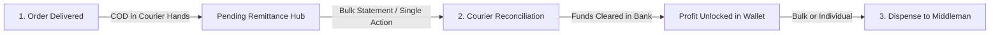

# Blueprint: Unified Courier Remittance & Middleman Dispense Workflow

## Executive Summary
This document outlines the product architecture and user experience for managing financial lifecycles when dropship/wholesale orders reach the **Delivered** state. 

In a modern dropship wholesale platform, the system must seamlessly bridge three entities:
1. **The Courier Service** (Holding Cash on Delivery funds collected from end recipients).
2. **The Company** (Wholesale revenue, profit margin, and courier fees).
3. **The Middleman / Reseller** (Dropship profit margin earned on each order).

---

## The Modern Financial Lifecycle (3-Stage Escrow Flow)



### Stage 1: Order Delivered (Funds In-Transit / Escrow)
- **Trigger**: Order status transitions to `delivered`.
- **Financial Accounting**:
  - **Courier Receivable**: COD Amount expected from courier.
  - **Company Wholesale Revenue**: Goods cost + packaging/printing charges.
  - **Middleman Profit**: Locked margin (`Recipient Price - Wholesale Cost - Fees`).
- **Reseller State**: Profit is visible in reseller dashboard as **"Pending Remittance"** (Locked).

### Stage 2: Courier Reconciliation (Bulk or Individual)
- **Admin Capability**:
  - **Bulk Reconciliation**: Upload courier statement CSV / paste AWBs to reconcile 50+ delivered orders in one click.
  - **Individual Reconciliation**: Quick inline toggle on any single order: *"Mark Remitted by Courier"*.
- **Financial Accounting**:
  - Courier receivable drops to zero.
  - Net bank deposit recorded.
  - **Middleman Profit unlocks** and becomes **"Available for Payout"**.

### Stage 3: Dispense to Middleman (Bulk or Individual Payouts)
- **Admin Capability**:
  - **Individual Dispense**: Pay out a single reseller via bKash/Nagad/Bank or credit their active wallet.
  - **Bulk Dispense**: Select all resellers with available balances > ৳0 and execute batch payouts with auto-generated payout reference IDs.

### Architecture alignment (wallet vs tags)

- **Required:** Wallet / ledger identity for courier holdings and middleman locked → available → dispensed balances (`entity_type` + `entity_id`). See [`wallet/UNIVERSAL_WALLET_LEDGER.md`](wallet/UNIVERSAL_WALLET_LEDGER.md).
- **Not required for this flow:** Universal tagging. Tags may later label orders or expense rows; they must never identify the wallet owner. See [`tag/UNIVERSAL_TAGGING_SYSTEM.md`](tag/UNIVERSAL_TAGGING_SYSTEM.md).

---

## User Experience (UX) Architecture

### 1. Delivery & Unremitted Funds Hub (`/app/shop/dropship/courier-holdings`)
A unified tab on the Dropship / Courier Operations screen showing 3 clear summary stat cards:
- **Card 1: Total Held by Couriers** (e.g. ৳ 245,000 across 85 delivered orders).
- **Card 2: Company Wholesale Portion** (e.g. ৳ 165,000).
- **Card 3: Middleman Margin Liability** (e.g. ৳ 80,000 pending courier collection).

#### Table Columns:
1. Order No & Delivery Date
2. Courier Name & AWB Number
3. Middleman / Reseller Name
4. Gross COD Collected (৳)
5. Company Wholesale Share (৳)
6. Middleman Margin (৳)
7. Status Badge (`Delivered / Pending Remittance`)
8. **Actions**: 
   - `[ Mark Remitted ]` (Individual quick action)
   - Multi-select checkbox for `[ Bulk Reconcile Selected ]`

---

### 2. Streamlined Remittance Engine (Bulk & Individual)

#### Option A: Individual Quick Action
- Click `[ Mark Remitted ]` next to any delivered order.
- Modal opens with pre-filled COD and estimated courier fee.
- Click `Confirm Remittance` -> Instantly unlocks reseller margin and updates order to `payment_received`.

#### Option B: Bulk Statement Reconciliation
- Click `[ Bulk Upload Statement ]` or `[ Paste AWB List ]`.
- Smart auto-matcher maps AWBs, flags discrepancies (e.g. partial collection or unexpected charges), and presents a live reconciliation review table.
- Click `Post & Unlock Profits` -> Reconciles all matched orders in a single database transaction.

---

### 3. Middleman Dispense Center (`/app/shop/dropship/merchants`)

A dedicated payout hub grouped by Reseller / Middleman profile:

| Reseller Name | Pending (Locked) | Available Balance | Lifetime Paid | Quick Action |
| :--- | :---: | :---: | :---: | :--- |
| **Reseller Alpha** | ৳ 12,500 | **৳ 34,000** | ৳ 120,000 | `[ Dispense Payout ]` |
| **Fashion Hub** | ৳ 4,200 | **৳ 18,500** | ৳ 75,000 | `[ Dispense Payout ]` |

#### Dispense Options:
- **Individual Dispense**: Click `[ Dispense Payout ]` -> Choose Payment Channel (bKash, Nagad, Bank Transfer, Wallet Credit), enter TRX ID, confirm.
- **Bulk Dispense**: Multi-select resellers -> Click `[ Bulk Dispense Payouts ]` -> Export bank payout file or auto-settle balances.

---

## Database Architecture & RPC Specifications

### 1. `get_courier_unremitted_financial_summary(p_tenant_id)`
Returns aggregated financial totals per courier:
```json
[
  {
    "courier_name": "Steadfast",
    "order_count": 42,
    "gross_cod_total": 125000.00,
    "company_wholesale_total": 85000.00,
    "middleman_margin_total": 40000.00
  }
]
```

### 2. `reconcile_single_order_remittance(p_order_id, p_courier_charge)`
- Atomically advances order status to `payment_received`.
- Creates `global_payment` record.
- Unlocks reseller profit entry in `billing_profile_wallet_ledger` (changes state from `locked` to `available`).

### 3. `dispense_middleman_payout(p_billing_profile_id, p_amount, p_method, p_trx_id)`
- Deducts amount from Middleman Available Wallet Balance.
- Records payout transaction in ledger (`transaction_type = 'payout_dispensed'`).
- Sends email / notification receipt to Middleman.

---

## Implementation Roadmap

- [ ] **Phase 1**: Add `get_courier_unremitted_financial_summary` RPC and create Unremitted Holding Hub UI.
- [ ] **Phase 2**: Add single-click inline order remittance action `reconcile_single_order_remittance`.
- [ ] **Phase 3**: Refactor Courier Bulk Remittance modal to support instant live AWB paste & auto-matching.
- [ ] **Phase 4**: Upgrade Reseller Wallet Payout page to support Individual and Bulk Middleman Dispensing.
