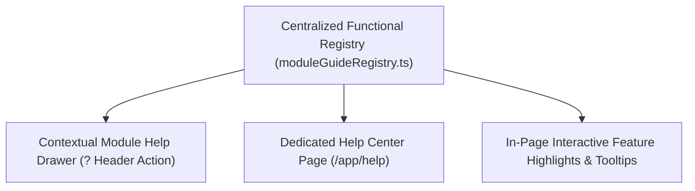

# Help Center & Functional Module Guide

## 1. Executive Summary

The **Brandwala Wholesale System** is an enterprise-grade multi-tenant platform encompassing complex operations across order fulfillment, dropshipping, inventory procurement, universal multi-currency wallets, investor capital, and financial treasury management.

To reduce system complexity for end-users (Admins, Merchants, Vendors, Investors, and Staff) and eliminate reliance on dry developer-centric documentation, this master plan establishes a **User-Centric Help Center & Contextual Module Assistance System**.

---

## 2. Functional Module Overview

Each module in the platform addresses a distinct operational requirement. The table below outlines user-facing capabilities:

| Module | Core Purpose | Key User Workflows | Primary Roles |
| :--- | :--- | :--- | :--- |
| **Shop & Orders (`shop_order`)** | Order placement, lifecycle tracking, dropship order dispatch, courier remittance reconciliation. | • Create / Checkout Orders • Process Dropship Orders • Reconcile Courier Remittances | Admin, Merchant, Customer |
| **Universal Wallet (`wallet`)** | Multi-currency balance ledgers, entity tracking (Tenant, Vendor, Courier, Middleman), payouts, ledger adjustments. | • View Wallet Balances • Process Merchant/Middleman Payouts • Review Transaction Ledger | Admin, Merchant, Vendor |
| **Procurement & Stock (`procurement_stock`)** | Vendor management, purchase orders, stock batching, inventory intake & batch costing. | • Create Purchase Orders • Receive Stock Batches • Audit Stock Levels | Admin, Inventory Manager |
| **Sales Invoice (`sales_invoice`)** | Billing, customer invoicing, line-item adjustments, payment collection tracking. | • Generate Invoices • Reconcile Payments • Issue Credit Notes | Admin, Finance Staff |
| **Reporting & Treasury (`reporting_treasury`)** | Financial health dashboards, cash balance sheets, treasury accounts, revenue reporting. | • Track Cash Flow • Review Profitability Metrics • Generate Financial Statements | Admin, Executive |
| **Investor Portal (`investor_portal` / `investor_capital`)** | Investor capital management, capital injection tracking, yield distribution, portfolio tracking. | • Record Capital Injections • View Investor Yields • Distribute Capital Profits | Admin, Investor |
| **Thrift Management (`thrift`)** | Consignment inventory tracking, thrift item pricing, sales processing, consignment settlement. | • Intake Consignment Items • Price & Tag Thrift Inventory • Settle Consignment Sales | Admin, Store Manager |
| **Products & Costing (`products` / `product_based_costing`)** | Master product catalog, variant matrix, tier pricing, landed unit costing calculation. | • Manage Catalog & Variants • Set Tiered Pricing • Calculate Product Unit Costing | Admin, Product Manager |
| **Access & Tenant Control (`tenant` / `access_control`)** | Tenant provisioning, RBAC role assignments, permission scopes, security policies. | • Provision Tenants • Assign Staff Roles • Configure Access Scopes | Super Admin, Tenant Admin |

---

## 3. System Architecture & Components

The Help Center ecosystem consists of three unified components:

1. **Functional Module Registry (`moduleGuideRegistry.ts`)**: Centralized source of truth defining module goals, FAQs, key terms, and step-by-step guides.
2. **Contextual Module Help Drawer (`ModuleHelpDrawer.vue`)**: Reusable slide-over panel available on every page header (`? Module Guide` action).
3. **Help Center Portal (`/app/help`)**: Dedicated search-enabled knowledge base presenting visual module cards, task-oriented guides, and role-filtered help articles.

---

## 4. Phased Implementation Roadmap

### Phase 0: Data & Registry Specification
- [ ] Create structured `web/src/modules/documentation/data/moduleGuideRegistry.ts` defining user-friendly metadata for all 10 core modules.
- [ ] Map user roles (`Admin`, `Merchant`, `Vendor`, `Investor`) to corresponding module guides.
- [ ] Document common FAQs and step-by-step operational workflows per module.

### Phase 1: Contextual Module Help Drawer Component
- [ ] Build atomic Quasar presentational component `ModuleHelpDrawer.vue`.
- [ ] Add `? Module Guide` header button to primary layout / header (`MainLayoutHeader.vue`).
- [ ] Integrate auto-detection of current active route to open the relevant module guide automatically.
- [ ] Provide tabbed layout inside drawer: **Overview**, **Workflows**, **Key Terms**, and **FAQs**.

### Phase 2: User Knowledge & Help Center UI
- [ ] Build `/app/help` main portal page with visual module grid cards.
- [ ] Implement search bar filtering across all workflows, terms, and FAQs.
- [ ] Add role-based filtering toggle so users only view guides relevant to their permissions.
- [ ] Add deep-link sharing capability (e.g. `/app/help?module=wallet&section=payouts`).

### Phase 3: In-Page Tooltip Guides & Onboarding Badges
- [ ] Add lightweight contextual info tooltips (`q-tooltip` / `q-badge`) to complex page headers (e.g. Universal Wallet balances, Courier Bulk Remittance).
- [ ] Provide "Learn More" links inside page banners that trigger the relevant Help Drawer directly.

### Phase 4: Legacy Documentation Module Retirement
- [ ] Review existing legacy `documentation` module components for any remaining references.
- [ ] Safely deprecate unneeded raw Markdown reader pages.
- [ ] Update navigation registries to point `/app/documentation` to the new `/app/help` portal.
- [ ] Run zero-drift validation (`vue-tsc --noEmit` and ESLint audit).

---

## 5. Verification & Acceptance Criteria

- **Usability**: Users can open module guidance in 1 click from any page without leaving their working workflow.
- **Searchability**: The `/app/help` center instantly filters articles by keyword and active user role.
- **Performance**: Zero CLS impact; module guide data loaded lazily via code splitting.
- **Maintainability**: Adding a new feature or module guide requires updating only `moduleGuideRegistry.ts`.
