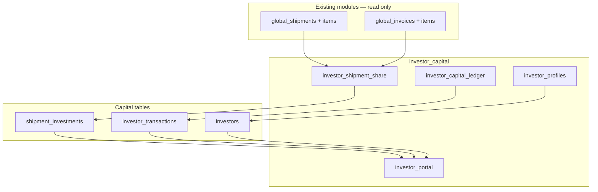

# Investor Capital

BrandWala / TradeFlow BD uses a **parent module** for external investor capital: profiles, deployment per shipment batch, profit share, and a read-only investor portal. Parent admins manage capital in the App workspace; investors see report-style summaries in the Investor scope.

This document answers:

- How do investors see where their money is deployed and what profit they earned?
- Which module keys, routes, and tables are used?
- How is investor profit computed without a shadow ledger?
- How do admins record capital in, adjustments, and withdrawal payouts?
- How does this module stay isolated from procurement, sales, and treasury?

Related: [MASTER_PLAN.md](MASTER_PLAN.md), [REPORTING_TREASURY.md](REPORTING_TREASURY.md), [PROCUREMENT_STOCK.md](PROCUREMENT_STOCK.md), [TENANT_MODEL_AND_ACCESS.md](TENANT_MODEL_AND_ACCESS.md), [APP_SCOPES_AND_ACCESS.md](APP_SCOPES_AND_ACCESS.md).

---

## 1. Overview

| Property | Investor Capital | Operational modules |
|----------|------------------|---------------------|
| Scope | Capital profiles, ledger, shipment cost-share; read-only investor reports | Procurement receives stock; sales issues invoices |
| Primary data | **Owns** `investors`, `investor_transactions`, `shipment_investments`; **reads** shipment + invoice tables for P&L | Owns `global_shipments`, `global_invoices`, etc. |
| Auth surface | App (`memberships`) for admin; Investor scope (`role = investor`) for portal | App (`memberships`) |
| Module gating | `investor_capital` parent + submodules | `procurement_stock`, `sales_invoice`, `reporting_treasury` |
| Primary UI (target) | `/:slug/app/capital/*` (admin), `/:slug/investor/*` (portal) | `/app/procurement/*`, `/app/sales/*`, `/app/finance/*` |
| Accounting style | Capital ledger + read-side profit — **not** double-entry GAAP | Transaction source of truth |

### What this domain is

| Capability | Submodule | Responsibility |
|------------|-----------|----------------|
| Investor profiles | `investor_profiles` | Parent-managed capital partner records |
| Capital ledger | `investor_capital_ledger` | Deposits, adjustments, withdrawal payouts |
| Shipment allocations | `investor_shipment_share` | Cost-share % per shipment batch per investor |
| Investor portal | `investor_portal` | Read-only dashboard, allocations, profit, activity |

### What this domain is not

| Topic | Is not |
|-------|--------|
| **Procurement ops** | Does not create shipments or receive stock |
| **Sales ops** | Does not create invoices |
| **Treasury payments** | Does not allocate AR payments (`reporting_treasury.payments`) |
| **Shadow P&L ledger** | Profit derived on read from batch margin × cost-share |
| **Withdrawal requests (v1)** | Investor portal is display-only; admin records payouts |

### Design principle

> **Batch P&L is the profit source. Investor share = batch gross profit × cost_share_pct.**

Operational invoice lines carry immutable cost snapshots. This module never maintains a second copy of shipment or invoice profit.

### Locked product decisions (v1)

| Decision | Choice |
|----------|--------|
| Investor withdrawal UI | **Display only** — show withdrawable balance; admin records `withdrawal_paid` in App |
| Default profit disposition | **Reinvest** — realized profit stays in capital pool unless admin pays out |
| Remainder rule | If sum of investor `cost_share_pct` < 100%, **parent company bears the gap** (D10) |



**Boundary rule:** This module **reads** operational tables via security-definer RPCs only. It does **not** add columns, triggers, or UI inside `shipment`, `global`, `sales_invoice`, or `reporting_treasury`. Optional deep-link from shipment detail → `/app/capital/shipments/:id` is a route link only.

---

## 2. Module hierarchy

**Parent module key:** `investor_capital`  
**Display name:** Investor Capital  
**Nav pattern:** Parent group with submodule children (same model as `reporting_treasury`, `procurement_stock`, `sales_invoice`).

| Key | Display name | `parent_module_key` | Scope | Nav route (target) | Audience |
|-----|--------------|---------------------|-------|-------------------|----------|
| `investor_capital` | Investor Capital | `null` | — | *(none — group header only)* | — |
| `investor_profiles` | Investor Profiles | `investor_capital` | app | `capital/profiles` | Parent admin |
| `investor_capital_ledger` | Capital Ledger | `investor_capital` | app | `capital/ledger` | Parent admin |
| `investor_shipment_share` | Shipment Allocations | `investor_capital` | app | `capital/shipments` | Parent admin |
| `investor_portal` | Investor Portal | `investor_capital` | investor | `investor/*` | External investor |

### Cross-referenced (legacy keys — do not modify)

| Legacy key | Target | Notes |
|------------|--------|-------|
| `investor` | `investor_profiles` + `investor_capital_ledger` | Legacy UI; leave for existing tenants |
| `global_investor` | `investor_profiles` | Parent-managed profiles |
| `global_investor_shipment` | `investor_shipment_share` | Cost-share per shipment |
| `investor_portal` (legacy seed) | Same submodule key under new parent | Investor scope login |

New work lives under `investor_capital`. Superadmin assigns the **parent** key only.

### Assignment rules

- Superadmin assigns **`investor_capital`** on a tenant via `tenant_modules`.
- `get_active_module_keys_for_tenant` expands the parent → enabled submodule keys (the parent key itself is not emitted to route guards).
- Platform can disable individual submodules per tenant via `tenant_module_submodules`.
- Submodule keys cannot be assigned directly — assign the parent (enforced by `create_tenant_module` RPC).
- Each route guard uses its **submodule** key.

### Tenant eligibility

| Tenant type | `investor_profiles` | `investor_capital_ledger` | `investor_shipment_share` | `investor_portal` |
|-------------|---------------------|---------------------------|---------------------------|-------------------|
| Parent company | Yes | Yes | Yes | Yes (external investors) |
| Child (sister concern) | No | No | No | No |
| Standalone | Yes | Yes | Yes | Optional |

---

## 3. Reports the business needs

### 3.1 Investor portal (read-only) — `investor_portal`

| Report | Question |
|--------|----------|
| Portfolio dashboard | How much did I invest, deploy, and earn? |
| Capital deployment | Where is my money allocated (per shipment)? |
| Profit breakdown | What is realized vs unrealized profit? |
| Activity ledger | What capital movements happened? |
| Withdrawable balance | How much profit can I withdraw? *(informational — contact admin)* |

### 3.2 Parent admin — `investor_profiles`, `investor_capital_ledger`, `investor_shipment_share`

| Report | Question |
|--------|----------|
| Investor list | Who are our capital partners and what are their balances? |
| Capital ledger | Deposits, adjustments, payouts per investor |
| Shipment coverage | What % of each batch is investor-funded vs parent remainder? |
| Per-shipment profit share | Each investor's `computed_profit` on a batch |

---

## 4. Profit and balance formulas (canonical)

Single source of truth for portal and admin surfaces. Shared util: `investorProfit.ts` (target).

### 4.1 Batch gross profit (read from operations)

From [REPORTING_TREASURY.md](REPORTING_TREASURY.md) §4.4:

```
batch_landed_cost   = Σ landedCost(item) × received_qty
batch_sold_cost     = Σ unit_cost_price × sold_qty
batch_revenue       = Σ sell_price_amount × sold_qty - returns on those lines
batch_gross_profit  = batch_revenue - batch_sold_cost
```

Join path: `global_shipment_items.id` ← `global_invoice_items.shipment_item_id`.

### 4.2 Investor share per shipment

```
allocated_cost    = batch_landed_cost × cost_share_pct / 100
computed_profit   = batch_gross_profit × cost_share_pct / 100
```

`profit_status` on `shipment_investments`:

| Status | Meaning |
|--------|---------|
| `open` | Batch has unsold stock — profit is unrealized |
| `partial` | Some stock sold |
| `realized` | Batch fully sold (or admin closed) |

### 4.3 Investor balance metrics

| Metric | Formula |
|--------|---------|
| Total capital in | Σ `capital_in` + Σ `capital_adjustment` |
| Deployed in shipments | Σ `allocated_cost` on active `shipment_investments` |
| Unallocated cash | Total capital in − deployed |
| Realized profit (reinvested) | Σ `computed_profit` where `profit_status = realized` |
| Withdrawn to date | Σ `withdrawal_paid` |
| **Withdrawable balance** | Realized profit − withdrawn to date |
| Unrealized profit | Σ estimated profit on `open` / `partial` batches |

---

## 5. Data model

### 5.1 Tables owned by this module

| Table | Purpose |
|-------|---------|
| `investors` | Capital profile (`tenant_id` = parent) |
| `investor_transactions` | Append-only capital ledger |
| `shipment_investments` | Cost-share and computed profit per shipment per investor |

### 5.2 `investors`

| Field | Purpose |
|-------|---------|
| `id`, `tenant_id` | Parent company scope |
| `name`, `contact_email`, `currency_code` | Profile |
| `is_active` | Soft-disable without deleting history |
| `notes` | Admin-only |

### 5.3 `investor_transactions`

| Field | Purpose |
|-------|---------|
| `investor_id`, `tenant_id` | Owner |
| `transaction_type` | `capital_in`, `capital_adjustment`, `profit_reinvest`, `withdrawal_paid`, `manual_adjustment` |
| `amount`, `currency_code`, `reference`, `notes` | Movement facts |
| `shipment_id` | Optional link when profit-related |
| `created_by_membership_id` | Audit (admin actions) |

### 5.4 `shipment_investments`

| Field | Purpose |
|-------|---------|
| `investor_id`, `shipment_id` | Allocation |
| `cost_share_pct` | Investor's % of batch cost and profit |
| `allocated_cost` | Derived from batch landed cost |
| `computed_profit` | Derived from batch gross profit |
| `profit_status` | `open`, `partial`, `realized` |

### 5.5 Read sources (no duplicate writes)

| Table | Used for |
|-------|----------|
| `global_shipments`, `global_shipment_items` | Batch cost, received qty |
| `global_invoices`, `global_invoice_items` | Revenue, cost snapshot, sold qty |
| `global_return_items` | Return margin reversal |

---

## 6. Auth and access

Per [APP_SCOPES_AND_ACCESS.md](APP_SCOPES_AND_ACCESS.md) and [TENANT_MODEL_AND_ACCESS.md §10](TENANT_MODEL_AND_ACCESS.md):

| Surface | Guard | Role |
|---------|-------|------|
| App admin pages | `createAccessGuard` | `admin` (write), `staff` (view) |
| Investor portal | `createInvestorAccessGuard` | `investor` only |

**Target auth:** `memberships.role = 'investor'` with `investor_id` FK → `investors.id`. Parent admin provisions portal access from tenant admin alongside staff and viewer.

**RLS:** Investor-scoped RPCs filter `WHERE investor_id = auth_investor_id()`. Admin RPCs filter by `parent_tenant_id` via membership.

| Login scope | Matching membership roles |
|-------------|---------------------------|
| `app` | `admin`, `staff`, `viewer` — **never** `investor` |
| `investor` | `investor` only |

---

## 7. Backend RPCs (security-definer)

| RPC | Used by | Purpose |
|-----|---------|---------|
| `get_investor_bootstrap_context` | Portal | Profile, balances, module keys |
| `get_investor_dashboard_summary` | Portal | Stat cards for dashboard |
| `list_investor_allocations` | Portal + Admin | Shipment deployment table |
| `get_investor_allocation_detail` | Portal + Admin | Single shipment drill-down |
| `list_investor_transactions` | Portal + Admin | Activity ledger |
| `list_investor_profiles` | Admin | Profile list |
| `upsert_investor_profile` | Admin | Create / edit investor |
| `record_investor_capital_in` | Admin | Deposit |
| `record_investor_withdrawal_paid` | Admin | Payout |
| `upsert_shipment_investment` | Admin | Set cost-share % per investor per shipment |
| `refresh_shipment_investor_profits` | Admin / batch job | Recompute `computed_profit` from batch P&L |
| `get_investor_capital_report` | Portal + Admin | Period summary for export |

All profit refresh **reads** operational tables — never writes to `global_shipments`, `global_invoices`, or related modules.

---

## 8. Frontend module structure

```
web/src/modules/investor_capital/
├── routes/
│   ├── adminRoutes.ts      # /:slug/app/capital/*
│   └── portalRoutes.ts     # /:slug/investor/*
├── pages/
│   ├── admin/
│   │   ├── InvestorProfilesPage.vue
│   │   ├── InvestorProfileDetailPage.vue
│   │   ├── CapitalLedgerPage.vue
│   │   └── ShipmentAllocationsPage.vue
│   └── portal/
│       ├── InvestorDashboardPage.vue
│       ├── InvestorAllocationsPage.vue
│       ├── InvestorProfitReportPage.vue
│       └── InvestorActivityPage.vue
├── components/
│   ├── InvestorStatCards.vue
│   ├── InvestorAllocationTable.vue
│   ├── InvestorProfitBreakdown.vue
│   ├── CapitalFlowSummary.vue
│   └── ShipmentShareEditor.vue
├── repositories/investorCapitalRepository.ts
├── stores/investorCapitalStore.ts
├── services/investorCapitalService.ts
├── utils/investorProfit.ts
├── types/index.ts
└── guards/investorPortalGuard.ts
```

Register in `router/routes.ts`, `moduleRegistry.ts`, and `modulePermissions.ts`.

**Do not modify:** `procurement_stock`, `sales_invoice`, `reporting_treasury`, or legacy `investor` module pages.

---

## 9. Investor portal UI (read-only)

**Layout:** `InvestorLayout.vue` — minimal shell, separate from App.  
**UI pattern:** Report-style — hero summary + stat cards + sectioned tables ([UI_CONSISTENCY_GUIDE.md](../web/UI_CONSISTENCY_GUIDE.md) + `floating-surface` / `hero-surface` for dense financial views).

### Routes

| Route | Page | Content |
|-------|------|---------|
| `/:slug/investor` or `/dashboard` | Dashboard | Stat cards, capital flow summary, recent activity |
| `/:slug/investor/allocations` | Where money went | Shipment allocation table with drill-down |
| `/:slug/investor/profit` | Profit report | Realized vs unrealized; date / shipment filters |
| `/:slug/investor/activity` | Activity | Read-only transaction ledger |

### Dashboard stat cards

- Total Invested
- Deployed in Shipments
- Unallocated Cash
- Realized Profit (reinvested)
- Unrealized Profit
- Withdrawable Balance *(banner: "Contact admin to withdraw")*
- Total Withdrawn

**No write actions in v1** except navigation and refresh.

---

## 10. Admin UI (App scope)

| Route | Page | Actions |
|-------|------|---------|
| `/app/capital/profiles` | Investor list + detail | CRUD profiles; assign `investor` membership |
| `/app/capital/ledger` | Capital ledger | Record `capital_in`, `capital_adjustment`, `withdrawal_paid` |
| `/app/capital/shipments` | Shipment allocations | Assign cost-share %; refresh profits; show parent remainder % |

---

## 11. Integration points (non-invasive)

| Existing area | Integration |
|---------------|-------------|
| `reporting_treasury.investor_reports` | Optional future read of same RPCs — no code changes in v1 |
| Shipment detail (procurement) | Optional nav link "Investor shares" if submodule enabled |
| Tenant admin | `investor` membership provisioning with `investor_id` picker |
| `parent_cash_circulation` | May aggregate investor totals later — separate RPC |

---

## 12. Permission matrix

| Submodule | superadmin | admin | staff | viewer | investor |
|-----------|------------|-------|-------|--------|----------|
| `investor_profiles` | view | view+write | view | — | — |
| `investor_capital_ledger` | view | view+write | view | — | — |
| `investor_shipment_share` | view | view+write | view | — | — |
| `investor_portal` | — | — | — | — | view |

---

## 13. Implementation phases

### Phase 1 — Backend (B6)

1. Seed `investor_capital` parent + 4 submodules in `global_modules`
2. Tables + RLS + `app_role` value `investor` + `memberships.investor_id`
3. Core RPCs: bootstrap, dashboard, allocations, transactions
4. `refresh_shipment_investor_profits` using [REPORTING_TREASURY.md](REPORTING_TREASURY.md) §4.4 formulas

### Phase 2 — Admin UI

1. Module folder + admin routes under `/app/capital/*`
2. Profiles, ledger, shipment share editor
3. Registry + permissions + navigation

### Phase 3 — Investor portal

1. Portal routes under `/:slug/investor/*`
2. Dashboard, allocations, profit, activity pages
3. Investor guard + bootstrap RPC
4. Tenant admin: provision investor memberships

### Phase 4 — Polish (optional)

1. PDF / CSV export via `get_investor_capital_report`
2. Deep-link from shipment detail
3. Withdrawal **request** flow (future — not v1)

---

## 14. Success criteria

- Investor logs in at `/{parent-slug}/investor` and sees clear capital deployment and profit breakdown
- Investor cannot write any data in v1
- Admin manages profiles, deposits, shipment cost-shares, and withdrawal payouts in App
- Profit figures match batch P&L × cost-share; reinvested profit increases effective capital pool
- Module can be enabled / disabled per tenant without affecting other domains

---

## 15. Related documentation

| Document | Contents |
|----------|----------|
| [MASTER_PLAN.md](MASTER_PLAN.md) | §6.9 investors, §10.1 portal, §15 capital modules |
| [REPORTING_TREASURY.md](REPORTING_TREASURY.md) | Batch P&L formulas; optional `investor_reports` submodule |
| [APP_SCOPES_AND_ACCESS.md](APP_SCOPES_AND_ACCESS.md) | Investor scope isolation |
| [TENANT_MODEL_AND_ACCESS.md](TENANT_MODEL_AND_ACCESS.md) | §10 investor membership target model |
