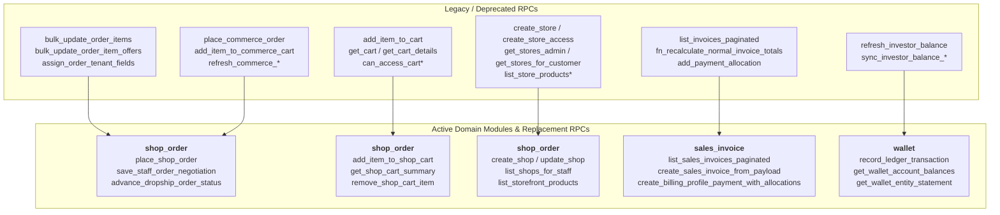

# Database Schema Legacy RPCs & Functions Audit

This document provides a comprehensive audit of all **legacy, deprecated, and unused PostgreSQL RPCs, triggers, and stored procedures** in the database schema, mapping them to their modern replacements and active domain modules.

---

## 1. Executive Summary

With the introduction of domain-scoped declarative schemas (`shop_order`, `sales_invoice`, `procurement`, `wallet`, `thrift`, `koba`), business logic previously placed in ad-hoc functions in `public.sql` has been superseded by transactional RPCs.

---

## 2. Categorized Legacy RPCs Matrix

### 2.1 Wholesale Order RPCs *(Legacy `orders` / `order_items`)*
| Legacy RPC / Function | Historical Purpose | Modern Replacement RPC | Domain | Status |
| :--- | :--- | :--- | :--- | :--- |
| `bulk_update_order_items(jsonb)` | Bulk editing legacy order lines | [`save_staff_order_negotiation`](file:///Users/daviditc/Documents/personal_projects/brandwala-wholesale-quasar-v2/supabase/schemas/shop_order/03_rpcs.sql) | `shop_order` | **Dropped in Migration 30** |
| `bulk_update_order_item_offers(jsonb)` | Staff pricing & negotiations on legacy orders | [`save_staff_order_negotiation`](file:///Users/daviditc/Documents/personal_projects/brandwala-wholesale-quasar-v2/supabase/schemas/shop_order/03_rpcs.sql) | `shop_order` | **Dropped in Migration 30** |
| `assign_order_tenant_fields()` | Trigger auto-filling `tenant_order_id` & `parent_tenant_id` | `before_insert_shop_orders` trigger | `shop_order` | **Dropped in Migration 30** |
| `set_order_parent_tenant_id()` | Trigger resolving order parent tenant | `shop_orders` tenant resolution triggers | `shop_order` | **Dropped in Migration 30** |

---

### 2.2 Dropship & Commerce RPCs *(Legacy `commerce_*`)*
| Legacy RPC / Function | Historical Purpose | Modern Replacement RPC | Domain | Status |
| :--- | :--- | :--- | :--- | :--- |
| `place_commerce_order` | Checkout procedure for old dropship cart | [`place_shop_order`](file:///Users/daviditc/Documents/personal_projects/brandwala-wholesale-quasar-v2/supabase/schemas/shop_order/03_rpcs.sql) | `shop_order` | **Dropped in Migration 30** |
| `add_item_to_commerce_cart` | Add stock item to legacy dropship cart | [`add_item_to_shop_cart`](file:///Users/daviditc/Documents/personal_projects/brandwala-wholesale-quasar-v2/supabase/schemas/shop_order/03_rpcs.sql) | `shop_order` | **Dropped in Migration 30** |
| `list_commerce_global_stock_for_store` | Query available stock for old commerce catalog | [`list_storefront_products`](file:///Users/daviditc/Documents/personal_projects/brandwala-wholesale-quasar-v2/supabase/schemas/shop_order/03_rpcs.sql) | `shop_order` | **Dropped in Migration 30** |
| `fn_recalculate_commerce_invoice_totals()` | Recalculate charges on old commerce invoices | `recompute_sales_invoice_totals` | `sales_invoice` | **Dropped in Migration 30** |
| `refresh_commerce_inventory_product_summaries` | Materialized rollup refresh | Dynamic queries in `procurement` | `procurement` | **Dropped in Migration 30** |
| `refresh_commerce_inventory_product_summary_single` | Single SKU rollup refresh | Dynamic queries in `procurement` | `procurement` | **Dropped in Migration 30** |
| `sync_commerce_summary_from_inventory_stocks` | Stock change trigger on old summaries | Procurement stock balance triggers | `procurement` | **Dropped in Migration 30** |

---

### 2.3 Legacy Shopping Cart RPCs *(Legacy `carts` / `cart_items`)*
| Legacy RPC / Function | Historical Purpose | Modern Replacement RPC | Domain | Status |
| :--- | :--- | :--- | :--- | :--- |
| `add_item_to_cart(...)` | Add items to legacy wholesale cart | [`add_item_to_shop_cart`](file:///Users/daviditc/Documents/personal_projects/brandwala-wholesale-quasar-v2/supabase/schemas/shop_order/03_rpcs.sql) | `shop_order` | **Dropped in Migration 40** |
| `get_cart(p_tenant_id, p_store_id)` | Retrieve legacy cart record | [`get_shop_cart_summary`](file:///Users/daviditc/Documents/personal_projects/brandwala-wholesale-quasar-v2/supabase/schemas/shop_order/03_rpcs.sql) | `shop_order` | **Dropped in Migration 40** |
| `get_cart_details(p_cart_id)` | Fetch legacy cart lines | [`get_shop_cart_summary`](file:///Users/daviditc/Documents/personal_projects/brandwala-wholesale-quasar-v2/supabase/schemas/shop_order/03_rpcs.sql) | `shop_order` | **Dropped in Migration 40** |
| `can_access_cart(p_cart_id)` | Legacy cart RLS security helper | Multi-tenant shop cart RLS policies | `shop_order` | **Dropped in Migration 40** |
| `can_access_cart_item(p_cart_item_id)` | Legacy cart item RLS helper | Multi-tenant shop cart item RLS policies | `shop_order` | **Dropped in Migration 40** |
| `can_insert_cart(...)` | Legacy cart insert authorization | Shop customer group access policies | `shop_order` | **Dropped in Migration 40** |
| `can_insert_cart_item(...)` | Legacy cart item insert check | Shop customer group access policies | `shop_order` | **Dropped in Migration 40** |
| `cart_exists(p_cart_id)` | Legacy cart existence check | Modern query in `shop_order` | `shop_order` | **Dropped in Migration 40** |

---

### 2.4 Legacy Vendor Stores & Catalog RPCs *(Legacy `stores`, `store_access`, `store_product_prices`)*
| Legacy RPC / Function | Historical Purpose | Modern Replacement RPC | Domain | Status |
| :--- | :--- | :--- | :--- | :--- |
| `create_store(p_name, p_vendor_code, p_tenant_id)` | Create legacy vendor store | [`create_shop`](file:///Users/daviditc/Documents/personal_projects/brandwala-wholesale-quasar-v2/supabase/schemas/shop_order/03_rpcs.sql) / `save_shop_for_staff` | `shop_order` | **Dropped in Migration 40** |
| `create_store_access(...)` | Grant customer group store access | [`save_shop_customer_group_access`](file:///Users/daviditc/Documents/personal_projects/brandwala-wholesale-quasar-v2/supabase/schemas/shop_order/03_rpcs.sql) | `shop_order` | **Dropped in Migration 40** |
| `delete_store_access(p_id)` | Revoke customer group store access | Shop access management in `shop_order` | `shop_order` | **Dropped in Migration 40** |
| `update_store_access(...)` | Update customer group store access | Shop access management in `shop_order` | `shop_order` | **Dropped in Migration 40** |
| `update_store_access_fields(...)` | Edit customer group store permissions | Shop access management in `shop_order` | `shop_order` | **Dropped in Migration 40** |
| `check_store_price_access(p_store_id)` | Verify pricing visibility flag | `customer_group_shop_profiles` & permissions | `shop_order` | **Dropped in Migration 40** |
| `can_manage_store(p_tenant_id)` | Staff check for legacy stores | `user_can_manage_shop` / RBAC grants | `shop_order` | **Dropped in Migration 40** |
| `get_stores_admin(p_tenant_id)` | Admin list of legacy stores | [`list_shops_for_staff`](file:///Users/daviditc/Documents/personal_projects/brandwala-wholesale-quasar-v2/supabase/schemas/shop_order/03_rpcs.sql) | `shop_order` | **Dropped in Migration 40** |
| `get_stores_for_customer(p_tenant_id)` | Customer list of legacy stores | [`list_customer_shops`](file:///Users/daviditc/Documents/personal_projects/brandwala-wholesale-quasar-v2/supabase/schemas/shop_order/03_rpcs.sql) | `shop_order` | **Dropped in Migration 40** |
| `get_stores_for_customer_v2(p_tenant_id)` | Customer list with permissions | [`list_customer_shops`](file:///Users/daviditc/Documents/personal_projects/brandwala-wholesale-quasar-v2/supabase/schemas/shop_order/03_rpcs.sql) | `shop_order` | **Dropped in Migration 40** |
| `get_store_access_admin_v2(...)` | Query customer store assignments | Shop access queries in `shop_order` | `shop_order` | **Dropped in Migration 40** |
| `get_store_product_brands(...)` | Store catalog brands | [`list_shop_products_for_staff`](file:///Users/daviditc/Documents/personal_projects/brandwala-wholesale-quasar-v2/supabase/schemas/shop_order/03_rpcs.sql) | `shop_order` | **Dropped in Migration 40** |
| `get_store_product_categories(...)` | Store catalog categories | [`list_shop_products_for_staff`](file:///Users/daviditc/Documents/personal_projects/brandwala-wholesale-quasar-v2/supabase/schemas/shop_order/03_rpcs.sql) | `shop_order` | **Dropped in Migration 40** |
| `list_store_products(...)` | List legacy store product prices | [`list_storefront_products`](file:///Users/daviditc/Documents/personal_projects/brandwala-wholesale-quasar-v2/supabase/schemas/shop_order/03_rpcs.sql) | `shop_order` | **Dropped in Migration 40** |
| `list_store_products_inventory_aggregated` | List store products with stock | [`list_storefront_products`](file:///Users/daviditc/Documents/personal_projects/brandwala-wholesale-quasar-v2/supabase/schemas/shop_order/03_rpcs.sql) | `shop_order` | **Dropped in Migration 40** |

---

### 2.5 Legacy Invoicing RPCs *(Legacy `invoices` / `invoice_items`)*
| Legacy RPC / Function | Historical Purpose | Modern Replacement RPC | Domain | Status |
| :--- | :--- | :--- | :--- | :--- |
| `list_invoices_paginated(...)` | Paginated listing of legacy `invoices` | [`list_sales_invoices_paginated`](file:///Users/daviditc/Documents/personal_projects/brandwala-wholesale-quasar-v2/supabase/schemas/sales_invoice/03_rpcs.sql) | `sales_invoice` | **Dropped in Migration 40** |
| `fn_recalculate_normal_invoice_totals()` | Trigger recalculating legacy `invoices` | `fn_recalculate_sales_invoice_totals` | `sales_invoice` | **Dropped in Migration 40** |
| `add_payment_allocation(...)` | Add manual payment to legacy `invoices` | [`create_billing_profile_payment_with_allocations`](file:///Users/daviditc/Documents/personal_projects/brandwala-wholesale-quasar-v2/supabase/schemas/sales_invoice/03_rpcs.sql) | `sales_invoice` | **Dropped in Migration 40** |
| `update_payment_allocation_amount(...)` | Edit allocation on legacy `invoices` | Payment allocation RPCs in `sales_invoice` | `sales_invoice` | **Dropped in Migration 40** |

---

### 2.6 Legacy Investor Balance RPCs *(Legacy `investor_balances`)*
| Legacy RPC / Function | Historical Purpose | Modern Replacement RPC | Domain | Status |
| :--- | :--- | :--- | :--- | :--- |
| `refresh_investor_balance(p_investor_id)` | Recalculate legacy balance table | `get_wallet_account_balances` / Ledger | `wallet` | **Dropped in Master Migration** |
| `sync_investor_balance_from_investors()` | Trigger on legacy investor table | Universal Wallet triggers | `wallet` | **Dropped in Master Migration** |
| `sync_investor_balance_from_transactions()` | Trigger on legacy investor transactions | [`record_ledger_transaction`](file:///Users/daviditc/Documents/personal_projects/brandwala-wholesale-quasar-v2/supabase/schemas/wallet/) | `wallet` | **Dropped in Master Migration** |
| `sync_investor_balance_from_shipment_investments()` | Trigger on shipment investments | Universal Wallet triggers | `procurement` | **Dropped in Master Migration** |

---

## 3. Active Remittance & Core Functions (NOT Legacy)

> [!NOTE]
> The audit verified that **Courier Remittance Batch RPCs** are **ACTIVE** and used by [`web/src/modules/shop_order/repositories/courierRemittanceRepository.ts`](file:///Users/daviditc/Documents/personal_projects/brandwala-wholesale-quasar-v2/web/src/modules/shop_order/repositories/courierRemittanceRepository.ts):
> - `create_or_update_courier_remittance_batch`
> - `process_courier_bulk_remittance_batch`
> - `get_courier_unremitted_financial_summary`
> - `confirm_courier_remittance_to_tenant`
>
> These functions and tables (`courier_remittance_batches`, `courier_remittance_items`) are **retained as active operational infrastructure**.

---

## 4. Applied Cleanup Migrations

All legacy tables and RPCs have been permanently decoupled and cleaned up via:
* [`supabase/migrations/20270832000030_drop_all_legacy_tables_and_rpcs.sql`](file:///Users/daviditc/Documents/personal_projects/brandwala-wholesale-quasar-v2/supabase/migrations/20270832000030_drop_all_legacy_tables_and_rpcs.sql)
