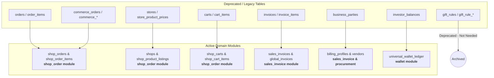

# Database Schema Legacy Tables Audit

This document provides a comprehensive inventory of legacy, deprecated, and superseded database tables in the PostgreSQL schema, mapping each table to its modern domain replacement and active frontend/backend modules.

---

## 1. Executive Summary

As Brandwala Wholesale evolved from early iterations into specialized domain modules (`shop_order`, `sales_invoice`, `procurement`, `wallet`, `thrift`, `koba`), several early monolithic and experimental tables were superseded by unified, multi-tenant architectures.

---

## 2. Comprehensive Legacy Table Matrix

| Legacy Table | Historical Purpose | Modern Replacement | Active Domain / Module | Status |
| :--- | :--- | :--- | :--- | :--- |
| **`orders`** | Early wholesale B2B order negotiation & pricing | [`shop_orders`](file:///Users/daviditc/Documents/personal_projects/brandwala-wholesale-quasar-v2/supabase/schemas/shop_order/02_tables.sql#L317) (`wholesale`) | `shop_order` | **Deprecated** |
| **`order_items`** | Wholesale order line items | [`shop_order_items`](file:///Users/daviditc/Documents/personal_projects/brandwala-wholesale-quasar-v2/supabase/schemas/shop_order/02_tables.sql#L261) | `shop_order` | **Deprecated** |
| **`commerce_orders`** | Early dropship & B2C order model | [`shop_orders`](file:///Users/daviditc/Documents/personal_projects/brandwala-wholesale-quasar-v2/supabase/schemas/shop_order/02_tables.sql#L317) (`dropship`) | `shop_order` | **Deprecated** |
| **`commerce_order_items`** | Dropship order line items | [`shop_order_items`](file:///Users/daviditc/Documents/personal_projects/brandwala-wholesale-quasar-v2/supabase/schemas/shop_order/02_tables.sql#L261) | `shop_order` | **Deprecated** |
| **`commerce_cart`** | Early dropship shopping cart | [`shop_carts`](file:///Users/daviditc/Documents/personal_projects/brandwala-wholesale-quasar-v2/supabase/schemas/shop_order/02_tables.sql#L189) & [`shop_cart_items`](file:///Users/daviditc/Documents/personal_projects/brandwala-wholesale-quasar-v2/supabase/schemas/shop_order/02_tables.sql#L151) | `shop_order` | **Deprecated** |
| **`commerce_invoices`** | Early dropship parcel invoices | [`sales_invoices`](file:///Users/daviditc/Documents/personal_projects/brandwala-wholesale-quasar-v2/supabase/schemas/sales_invoice/02_tables.sql#L83) / `global_invoices` | `sales_invoice` | **Deprecated** |
| **`commerce_invoice_boxes`** | Dropship packing boxes | `sales_invoices` dispatch workflow | `sales_invoice` | **Deprecated** |
| **`commerce_order_settings`** | Legacy commerce configurations | `shops.settings` & tenant settings | `shop_order` | **Deprecated** |
| **`commerce_inventory_product_summaries`** | Materialized stock rollups | Live stock aggregates in `global_stocks` | `procurement` | **Deprecated** |
| **`stores`** | Early vendor store catalogs | [`shops`](file:///Users/daviditc/Documents/personal_projects/brandwala-wholesale-quasar-v2/supabase/schemas/shop_order/02_tables.sql#L25) | `shop_order` | **Deprecated** |
| **`store_access`** | Customer group store permission | [`shop_customer_group_access`](file:///Users/daviditc/Documents/personal_projects/brandwala-wholesale-quasar-v2/supabase/schemas/shop_order/02_tables.sql#L69) | `shop_order` | **Deprecated** |
| **`store_product_prices`** | Storefront pricing overrides | [`shop_product_listings`](file:///Users/daviditc/Documents/personal_projects/brandwala-wholesale-quasar-v2/supabase/schemas/shop_order/02_tables.sql#L114) & [`shop_pricing_rules`](file:///Users/daviditc/Documents/personal_projects/brandwala-wholesale-quasar-v2/supabase/schemas/shop_order/02_tables.sql#L95) | `shop_order` | **Deprecated** |
| **`carts`** | Early wholesale shopping cart | [`shop_carts`](file:///Users/daviditc/Documents/personal_projects/brandwala-wholesale-quasar-v2/supabase/schemas/shop_order/02_tables.sql#L189) | `shop_order` | **Deprecated** |
| **`cart_items`** | Early wholesale cart line items | [`shop_cart_items`](file:///Users/daviditc/Documents/personal_projects/brandwala-wholesale-quasar-v2/supabase/schemas/shop_order/02_tables.sql#L151) | `shop_order` | **Deprecated** |
| **`invoices`** | Old pre-v2 sales invoices | [`sales_invoices`](file:///Users/daviditc/Documents/personal_projects/brandwala-wholesale-quasar-v2/supabase/schemas/sales_invoice/02_tables.sql#L83) | `sales_invoice` | **Deprecated** |
| **`invoice_items`** | Old invoice line items | [`sales_invoice_items`](file:///Users/daviditc/Documents/personal_projects/brandwala-wholesale-quasar-v2/supabase/schemas/sales_invoice/02_tables.sql#L143) | `sales_invoice` | **Deprecated** |
| **`invoice_boxes`** | Old invoice carton box tracking | `sales_invoices` dispatch workflow | `sales_invoice` | **Deprecated** |
| **`gift_rules`** | Threshold-based gift rule triggers | None (experimental promo engine) | None | **Unused** |
| **`gift_rule_items`** | Gift freebies / SKU associations | None | None | **Unused** |
| **`gift_rule_redemptions`** | Gift redemption audit log | None | None | **Unused** |
| **`business_parties`** | Early unified contact model | [`billing_profiles`](file:///Users/daviditc/Documents/personal_projects/brandwala-wholesale-quasar-v2/supabase/schemas/sales_invoice/02_tables.sql#L3) & [`vendors`](file:///Users/daviditc/Documents/personal_projects/brandwala-wholesale-quasar-v2/supabase/schemas/procurement/02_tables.sql#L178) | `sales_invoice` / `procurement` | **Deprecated** |
| **`investor_balances`** | Old manual balance ledger for investors | [`universal_wallet_ledger`](file:///Users/daviditc/Documents/personal_projects/brandwala-wholesale-quasar-v2/supabase/schemas/wallet/) | `wallet` | **Deprecated** |

---

## 3. Detailed Subsystem Breakdown

### 3.1 Ordering & Dropshipping
* **Legacy Tables**: `orders`, `order_items`, `commerce_orders`, `commerce_order_items`, `commerce_cart`, `commerce_invoices`, `commerce_invoice_boxes`, `commerce_order_settings`, `commerce_inventory_product_summaries`.
* **Reason for Deprecation**: Orders were originally split between wholesale (`orders`) and dropshipping (`commerce_orders`). The architecture was unified into [`shop_orders`](file:///Users/daviditc/Documents/personal_projects/brandwala-wholesale-quasar-v2/supabase/schemas/shop_order/02_tables.sql#L317), which supports both wholesale negotiation snapshots and dropship consignment fields (courier tracking, COD collection, delivery instructions, returns, merchant settlements).

### 3.2 Storefront & Catalog Management
* **Legacy Tables**: `stores`, `store_access`, `store_product_prices`.
* **Reason for Deprecation**: Replaced by the multi-shop engine ([`shops`](file:///Users/daviditc/Documents/personal_projects/brandwala-wholesale-quasar-v2/supabase/schemas/shop_order/02_tables.sql#L25)), which enables granular B2B/B2C store visibility, tiered customer group access ([`shop_customer_group_access`](file:///Users/daviditc/Documents/personal_projects/brandwala-wholesale-quasar-v2/supabase/schemas/shop_order/02_tables.sql#L69)), dynamic price rules ([`shop_pricing_rules`](file:///Users/daviditc/Documents/personal_projects/brandwala-wholesale-quasar-v2/supabase/schemas/shop_order/02_tables.sql#L95)), and per-shop product listings ([`shop_product_listings`](file:///Users/daviditc/Documents/personal_projects/brandwala-wholesale-quasar-v2/supabase/schemas/shop_order/02_tables.sql#L114)).

### 3.3 Shopping Carts
* **Legacy Tables**: `carts`, `cart_items`, `commerce_cart`.
* **Reason for Deprecation**: Consolidated into [`shop_carts`](file:///Users/daviditc/Documents/personal_projects/brandwala-wholesale-quasar-v2/supabase/schemas/shop_order/02_tables.sql#L189) and [`shop_cart_items`](file:///Users/daviditc/Documents/personal_projects/brandwala-wholesale-quasar-v2/supabase/schemas/shop_order/02_tables.sql#L151), scoped strictly per tenant, customer group, and shop profile.

### 3.4 Invoicing & Sales Accounting
* **Legacy Tables**: `invoices`, `invoice_items`, `invoice_boxes`.
* **Reason for Deprecation**: Replaced by [`sales_invoices`](file:///Users/daviditc/Documents/personal_projects/brandwala-wholesale-quasar-v2/supabase/schemas/sales_invoice/02_tables.sql#L83), [`sales_invoice_items`](file:///Users/daviditc/Documents/personal_projects/brandwala-wholesale-quasar-v2/supabase/schemas/sales_invoice/02_tables.sql#L143), and [`sales_return_items`](file:///Users/daviditc/Documents/personal_projects/brandwala-wholesale-quasar-v2/supabase/schemas/sales_invoice/02_tables.sql#L185). The unified `global_invoices` view provides full cross-tenant read consistency for wholesale and retail invoices.

### 3.5 Financial Ledgers & Wallets
* **Legacy Tables**: `investor_balances`.
* **Reason for Deprecation**: Replaced by the double-entry Universal Wallet Ledger (`universal_wallet_ledger`, `universal_wallet_accounts`), standardizing debits and credits across tenants, investors, customers, and cargo vendors.

---

## 4. Tables That Look Generic But Are In Active Use

> [!IMPORTANT]
> The following tables have generic names but **MUST NOT BE DROPPED** because they are actively utilized:

* **`items`**: Active task / todo entity table used by [`web/src/modules/tasks/`](file:///Users/daviditc/Documents/personal_projects/brandwala-wholesale-quasar-v2/web/src/modules/tasks).
* **`item_tags`**: Tag linkages for task board items.
* **`item_assignees`**: User assignment mappings for tasks.
* **`item_permissions`**: Access controls for task items.
* **`comments`**: Comment threads on task cards.
* **`koba_*`**: Multi-tenant retail and wholesale submodule ([`web/src/modules/koba/`](file:///Users/daviditc/Documents/personal_projects/brandwala-wholesale-quasar-v2/web/src/modules/koba)).

---

## 5. Deletion & Cleanup Protocol

When dropping legacy tables:
1. **Decouple Active RPCs First**: Ensure no active functions (`list_child_procurement_lines`, `get_dropship_wallet_reconciliation_report`, `create_billing_profile_payment_with_allocations`, etc.) reference the table in `SELECT` or `JOIN` blocks.
2. **Drop Foreign Key Constraints**: Remove any foreign key constraints on active tables pointing to the legacy table.
3. **Drop Standalone RPCs & Triggers**: Drop functions that exclusively manipulate the legacy tables.
4. **Execute Table Drops with CASCADE**: Drop tables and sequences cleanly.
5. **Regenerate Types**: Run `pnpm run backend:types` to refresh `web/src/types/database.types.ts`.

### Canonical Master Migration
* [`supabase/migrations/20270832000030_drop_all_legacy_tables_and_rpcs.sql`](file:///Users/daviditc/Documents/personal_projects/brandwala-wholesale-quasar-v2/supabase/migrations/20270832000030_drop_all_legacy_tables_and_rpcs.sql)
