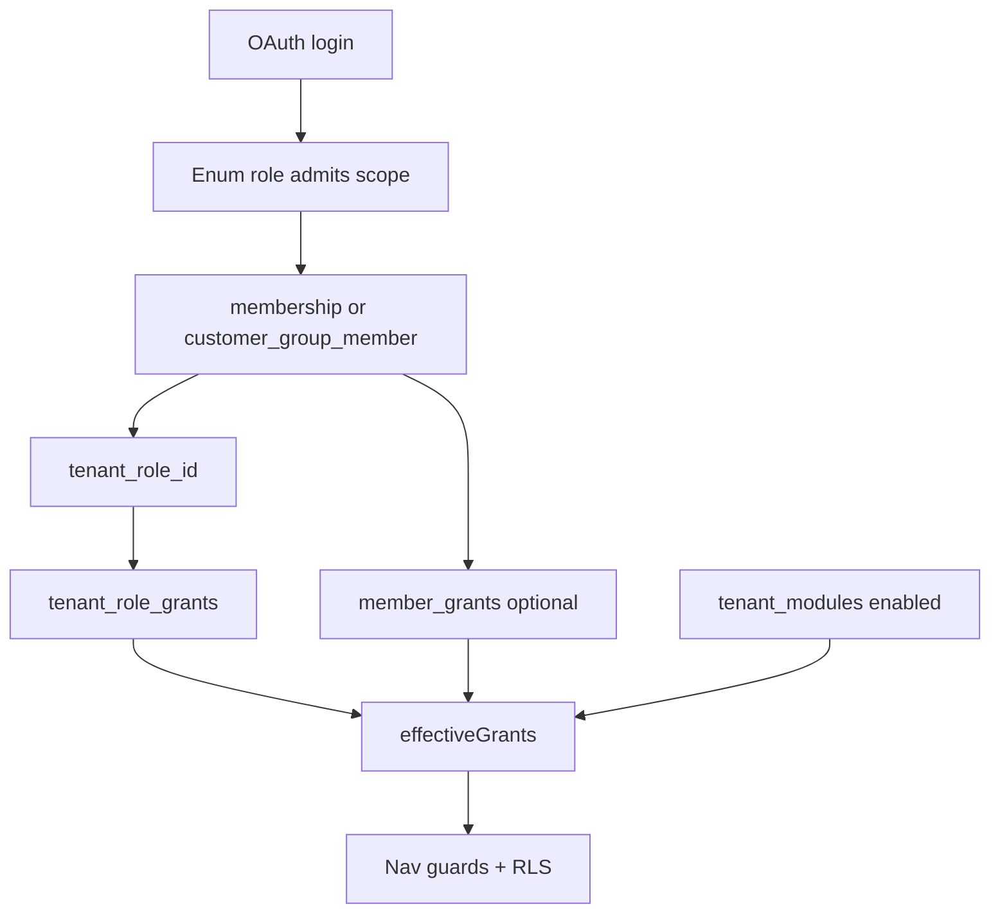
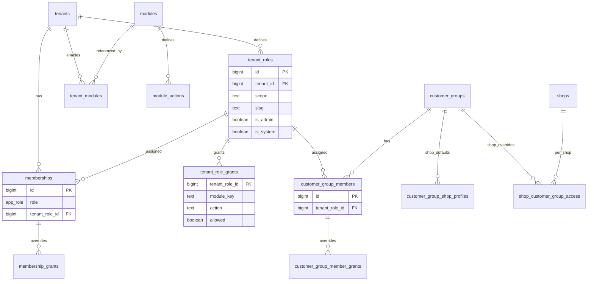
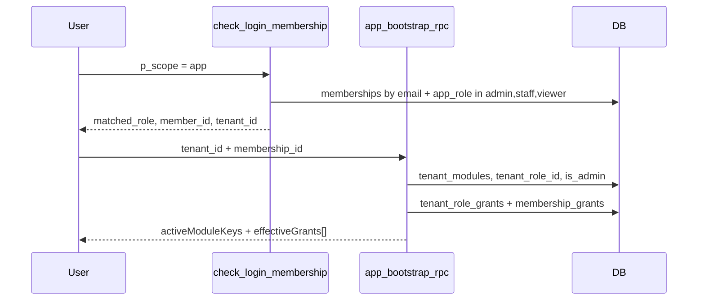
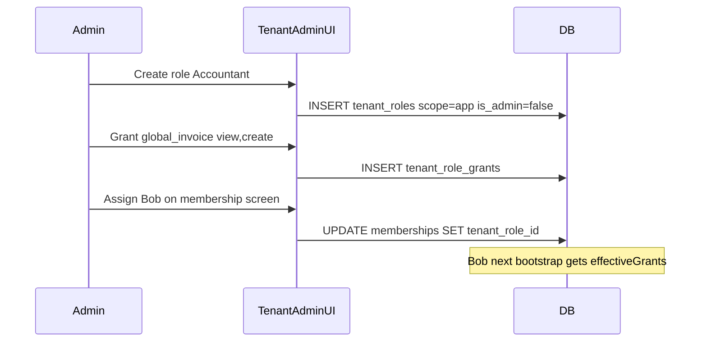
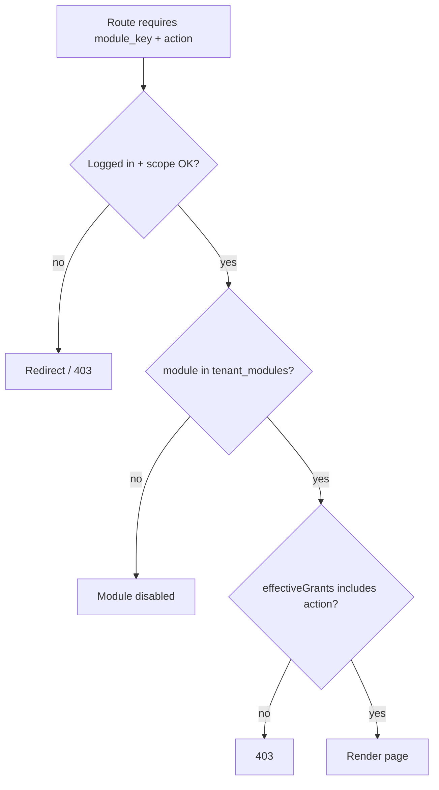
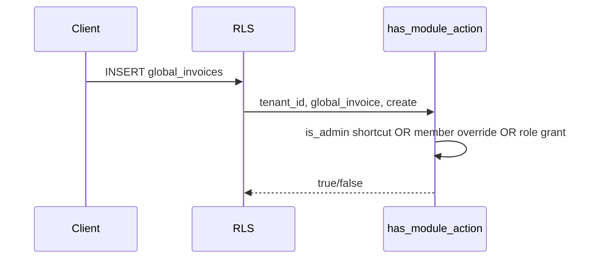

# Permission System — Target Design

**Status:** **Implemented** — PERM P1–P3 + Access Control v2 AC-P1–P4 (`20260910*`–`20260913*` migrations). Enum login gate unchanged; grants from bootstrap `effectiveGrants` + `permissionVersion`; RLS cutover via `membership_has_module_action()` / `has_module_action()`. Admin UI consolidated at `/:slug/app/access-control/*` (RPC-only grant reads/writes).
**Today:** Nav + `createAccessGuard` read `authStore.effectiveGrants`; silent re-bootstrap on `permissionVersion` mismatch. Shop Subsystem B (per-shop flags) in shop_order P3.  
**Canon for scopes:** [APP_SCOPES_AND_ACCESS.md](APP_SCOPES_AND_ACCESS.md). **Login/nav:** [LOGIN_NAV_PERMISSION_FLOW.md](LOGIN_NAV_PERMISSION_FLOW.md).

This document defines the **unified, database-backed permission system** with **tenant-scoped custom roles**, per-module actions, and member-level overrides — while keeping the four-scope model unchanged.

---

## 1. Goals

| Goal | How |
|------|-----|
| **Tenant admin** gets all actions on **enabled** modules | `tenant_roles.is_admin = true` (Administrator role) |
| **Create custom roles** per tenant (App + Shop) | `tenant_roles` + `tenant_role_grants` |
| **Edit system role** grants per tenant (Staff, Viewer, …) | Same tables; `is_system = true` roles |
| **Assign / change role** on a member | `memberships.tenant_role_id` or `customer_group_members.tenant_role_id` |
| **Per-member override** without new role | `membership_grants` / `customer_group_member_grants` |
| **Per-shop customer flags** | `customer_group_shop_profiles` + `shop_customer_group_access` |
| **Platform-only** controls hidden from tenant admin | `module_actions.scope = platform` filtered out of tenant UI |
| Keep **scope isolation** | Scope checked before any grant lookup |
| Enforce in **API** | `has_module_action()` in RLS/RPCs |
| **Safe migration** | Dual model: enum for login gate, `tenant_role_id` for permissions |

---

## 2. User stories

### Tenant admin (App scope)

| ID | Story |
|----|-------|
| US-A1 | As a **tenant admin**, when a module is **enabled** for my tenant, I receive **all actions** for that module so I can run the business without superadmin help. |
| US-A2 | As a **tenant admin**, I want to **create custom roles** (e.g. Accountant, Warehouse) and configure module × action grants so I don't need to make everyone an administrator. |
| US-A3 | As a **tenant admin**, I want to **edit grants on system roles** (Staff, Viewer) for my tenant so our policy can differ from platform defaults. |
| US-A4 | As a **tenant admin**, I want to **assign a role to a member** or **change a member's role** from the membership screen. |
| US-A5 | As a **tenant admin**, I want to **allow or deny specific actions for one member** without creating a new role. |
| US-A6 | As a **tenant admin**, I must **not see platform-only controls** (tenant create, superadmin assignment, cross-tenant module assignment) — those stay in `/platform`. |

### Customer group / Shop scope

| ID | Story |
|----|-------|
| US-S1 | As a **tenant admin**, I want to **create shop-scoped roles** and assign them to `customer_group_members`. |
| US-S2 | As a **tenant admin**, I want to configure **per-shop access** (see price, negotiate, place order, etc.) for each customer group. |
| US-S3 | As a **tenant admin**, I want to **change a shop member's role** or add **individual overrides** for one buyer in a group. |
| US-S4 | As a **shop user**, I only see shops and actions my **role + shop grants** allow. |

### Superadmin (Platform scope)

| ID | Story |
|----|-------|
| US-P1 | As a **superadmin**, I manage tenants, markets, and `tenant_modules`; platform modules **never appear** in tenant admin permission UI. |
| US-P2 | As a **superadmin**, I seed `module_actions` and `system_role_templates`; tenants inherit on create. |

### Investor

| ID | Story |
|----|-------|
| US-I1 | As an **investor**, I have **read-only** portal access; tenant admin cannot grant write actions on `investor_portal`. |

---

## 3. Dual login model (safe migration)

**Do not break** existing `check_login_membership` or shop bootstrap in B8.

| Concern | Source | Purpose |
|---------|--------|---------|
| **Login / scope admission** | `memberships.role` (`app_role`), `customer_group_members.role` | *May this user enter this scope?* |
| **Module permissions** | `tenant_role_id` → `tenant_role_grants` + member overrides | *What may they do inside?* |



**On tenant create:** seed system `tenant_roles` (scope = `app`):

| slug | is_system | is_admin | source_app_role |
|------|-----------|----------|-----------------|
| `administrator` | true | **true** | admin |
| `staff` | true | false | staff |
| `viewer` | true | false | viewer |

Shop scope (scope = `shop`), seeded per tenant:

| slug | is_system | source role |
|------|-----------|-------------|
| `customer-admin` | true | admin |
| `negotiator` | true | negotiator |
| `customer-staff` | true | staff |

Assign default `tenant_role_id` when creating members. Backfill from enum during B8 migration.

**Future (optional):** remove enum from login once all paths use `tenant_role.scope` — not in B8.

---

## 4. Five-layer access model

```text
Layer 1 — Scope          Route prefix + login RPC     → actor table + enum role gate
Layer 2 — Tenant module  tenant_modules               → feature on/off per tenant
Layer 3 — Tenant roles   tenant_roles + grants        → custom + system roles, member overrides
Layer 4 — Action catalog module_actions               → valid actions per module_key
Layer 5 — Row access     RLS + security-definer RPCs  → tenant_id / parent_id isolation
```

**Effective access (internal App user):**

```text
allowed =
  scope_valid
  AND enum role admits scope
  AND tenant_context_ok
  AND tenant_modules.module_key active
  AND has_module_action(tenant_id, module_key, action) = true
  AND RLS permits row
```

**Effective access (Shop customer):**

```text
allowed =
  shop scope valid
  AND customer_group_member active
  AND tenant_modules includes shop modules
  AND has_module_action for shop-scoped tenant_role (module actions)
  AND effective_shop_flag(shop_id, customer_group_id, flag) = true  -- per-shop layer
  AND RLS permits row
```

---

## 5. Grant subsystems

| Subsystem | Actor table | Role assignment | Role grants | Member overrides | Resource grants |
|-----------|-------------|-----------------|-------------|------------------|-----------------|
| **A — App / Investor admin** | `memberships` | `tenant_role_id` (scope=app) | `tenant_role_grants` | `membership_grants` | — |
| **B — Shop customer** | `customer_group_members` | `tenant_role_id` (scope=shop) | `tenant_role_grants` | `customer_group_member_grants` | `customer_group_shop_profiles` + `shop_customer_group_access` |

Both share Layers 1–2. Shop uses **two layers**: role module actions + per-shop boolean flags ([SHOP_ORDER.md](SHOP_ORDER.md) §5).

---

## 6. Existing tables (reuse)

| Table | Purpose |
|-------|---------|
| `profiles` | Auth identity |
| `memberships` | Internal member — tenant + `app_role` (login gate) + **`tenant_role_id`** (permissions) |
| `customer_group_members` | Shop member — group + enum role (login gate) + **`tenant_role_id`** (permissions) |
| `modules` | Global module catalog |
| `tenant_modules` | Module on/off per tenant |
| `tenants` | Tenant hierarchy |

No separate "members" table — `memberships` and `customer_group_members` are the member records.

---

## 7. New tables — roles and grants

### 7.1 `module_actions`

Product catalog of valid actions per module. Seeded at module ship time; **not** edited by tenants.

| Column | Type | Notes |
|--------|------|-------|
| `id` | bigserial PK | |
| `module_key` | text FK → `modules(key)` | |
| `action` | text NOT NULL | See §19 matrix |
| `description` | text | Admin UI label |
| `scope` | text NOT NULL | `app` \| `shop` \| `platform` \| `investor` |
| `tenant_configurable` | boolean DEFAULT true | false for platform-only actions |
| `is_active` | boolean DEFAULT true | |
| `created_at`, `updated_at` | timestamptz | |

**Unique:** `(module_key, action)`

---

### 7.2 `tenant_roles`

**Tenant-scoped roles** — system defaults + custom roles created by tenant admin.

| Column | Type | Notes |
|--------|------|-------|
| `id` | bigserial PK | |
| `tenant_id` | bigint FK → `tenants(id)` ON DELETE CASCADE | |
| `scope` | text NOT NULL | `app` \| `shop` |
| `name` | text NOT NULL | Display: "Accountant" |
| `slug` | text NOT NULL | Unique per `(tenant_id, scope)` |
| `is_system` | boolean DEFAULT false | Seeded Administrator/Staff/Viewer — not deletable |
| `is_admin` | boolean DEFAULT false | **true → all actions on enabled modules** (see §12.1) |
| `source_app_role` | `app_role` NULL | Migration map from enum |
| `is_active` | boolean DEFAULT true | |
| `created_at`, `updated_at` | timestamptz | |

**Unique:** `(tenant_id, scope, slug)`

**Rules:**
- Each tenant has exactly one `is_admin = true` role per scope (Administrator).
- Tenant admin may create unlimited custom roles (`is_system = false`).
- Custom roles require explicit rows in `tenant_role_grants`.

---

### 7.3 `system_role_templates`

Platform-wide defaults used **only** to seed system `tenant_roles` on tenant create (replaces enum-keyed `role_grant_templates`).

| Column | Type | Notes |
|--------|------|-------|
| `id` | bigserial PK | |
| `scope` | text | `app` \| `shop` |
| `role_slug` | text | e.g. `staff`, `customer-staff` |
| `module_key` | text FK | |
| `action` | text | |
| `allowed` | boolean | |

**Unique:** `(scope, role_slug, module_key, action)`

**Data flow:** `modulePermissions.ts` + shop defaults → templates → `seed_tenant_roles_and_grants(tenant_id)`.

**Note:** No rows for `administrator` / `is_admin` roles — admin access is computed.

---

### 7.4 `tenant_role_grants`

Grants for **non-admin** tenant roles only.

| Column | Type | Notes |
|--------|------|-------|
| `id` | bigserial PK | |
| `tenant_role_id` | bigint FK → `tenant_roles(id)` ON DELETE CASCADE | |
| `module_key` | text FK → `modules(key)` | |
| `action` | text NOT NULL | |
| `allowed` | boolean NOT NULL | |
| `updated_by_email` | text NULL | |
| `created_at`, `updated_at` | timestamptz | |

**Unique:** `(tenant_role_id, module_key, action)`

---

### 7.5 `membership_grants`

Per-**internal** member overrides (App scope).

| Column | Type | Notes |
|--------|------|-------|
| `id` | bigserial PK | |
| `membership_id` | bigint FK → `memberships(id)` ON DELETE CASCADE | |
| `module_key` | text FK | |
| `action` | text NOT NULL | |
| `effect` | text NOT NULL | `allow` \| `deny` |
| `created_by_email` | text NULL | |
| `created_at`, `updated_at` | timestamptz | |

**Unique:** `(membership_id, module_key, action)`

---

### 7.6 `customer_group_member_grants`

Per-**shop** member overrides (same shape as `membership_grants`).

| Column | Type | Notes |
|--------|------|-------|
| `id` | bigserial PK | |
| `customer_group_member_id` | bigint FK → `customer_group_members(id)` ON DELETE CASCADE | |
| `module_key` | text FK | |
| `action` | text NOT NULL | |
| `effect` | text NOT NULL | `allow` \| `deny` |

**Unique:** `(customer_group_member_id, module_key, action)`

---

### 7.7 `grant_audit_log` (deferred)

Out of scope for the current access-control implementation track. Do not add this table in the current phase plan.

---

## 8. Shop resource grants (Subsystem B)

Per-shop boolean flags — [SHOP_ORDER.md](SHOP_ORDER.md) §5. Used **in addition to** shop-scoped `tenant_role_grants`.

### 8.1 `customer_group_shop_profiles`

Group-wide defaults per child tenant: `default_can_browse`, `default_see_price`, `default_can_add_to_cart`, `default_can_place_order`, `default_can_negotiate`, `default_can_view_quantity`, `default_can_set_dropship_price`.

**Unique:** `(tenant_id, customer_group_id)`

### 8.2 `shop_customer_group_access`

Per-shop overrides (nullable columns inherit from profile).

**Unique:** `(shop_id, customer_group_id)`

```text
effective(shop_id, group_id, flag) =
  IF access.status = false OR profile.is_active = false THEN false
  ELSE COALESCE(access.<flag>, profile.default_<flag>, false)
```

---

## 9. Platform isolation (hidden from tenant admin)

Tenant admin permission UI and tenant-scoped grant APIs **must exclude** platform scope.

| Area | module_key / route | scope | Visible to |
|------|-------------------|-------|------------|
| Tenant CRUD | platform tenants | platform | superadmin only |
| Superadmin memberships | platform memberships | platform | superadmin only |
| Assign modules to tenants | `tenant_modules` write (cross-tenant) | platform | superadmin only |
| Markets (platform CRUD) | platform markets | platform | superadmin only |
| Feature catalog | `featureCatalog` | platform | superadmin only |

**Tenant admin filter (UI + RPC):**

```sql
module_actions.scope IN ('app', 'shop')
AND module_actions.tenant_configurable = true
AND tenant_modules.is_active = true
AND module_key = ANY(active_module_keys_for_tenant)
```

Tenant admin **can** configure: procurement, invoice, treasury, shop admin modules, `global_reference_*` (tenant prefs), memberships, customer groups, etc.

Superadmin uses `/platform` only; `has_module_action` in platform context bypasses tenant grants.

---

## 10. Entity relationship



---

## 11. Data flows

### 11.1 Login → session (App scope)



```typescript
type EffectiveGrant = { module_key: string; action: string }
// effectiveGrants = flattened allow list after resolution
```

### 11.2 Tenant admin creates role and assigns member



### 11.3 Route / nav guard



### 11.4 RLS write check



### 11.5 Shop customer session

Shop bootstrap loads `customer_group_members.tenant_role_id`, shop-scoped grants, then `get_shop_permissions_for_customer(shop_id)` for per-shop flags.

---

## 12. Resolution algorithms

### 12.1 `has_module_action(p_tenant_id, p_module_key, p_action)` → boolean

```sql
-- Pseudologic (security definer, stable)
1. IF module_actions.scope = 'platform' AND caller is not superadmin → false
2. IF NOT tenant_modules active for (p_tenant_id, p_module_key) → false
3. IF NOT module_actions exists (p_module_key, p_action) → false
4. IF parent/child hierarchy blocks module for tenant → false
5. Resolve actor (membership or customer_group_member) + tenant_role_id
6. IF tenant_roles.is_admin = true → true  -- all actions on enabled module
7. IF member grant deny → false
8. IF member grant allow → true
9. RETURN tenant_role_grants.allowed for (tenant_role_id, p_module_key, p_action)
```

**Administrator auto-access (US-A1):** When superadmin enables a module via `tenant_modules`, members with `is_admin = true` immediately pass step 6 for all actions on that module — no grant rows required.

### 12.2 `get_effective_grants(p_tenant_id)`

If `is_admin`: return all `(module_key, action)` from `module_actions` where module is enabled, scope matches, hierarchy allows. Else expand grants + overrides.

### 12.3 Shop effective flags

Combine shop-scoped `has_module_action` with `effective(shop, group, flag)` from §8.2. Storefront RPCs use both.

---

## 13. Scope × subsystem matrix

| Scope | Login gate (enum) | Permissions | Tenant admin UI |
|-------|-------------------|-------------|-----------------|
| **platform** | `superadmin` | Platform code / superadmin bypass | N/A (not tenant) |
| **app** | admin, staff, viewer | `tenant_roles` scope=app + grants | Full (excl. platform modules) |
| **shop** | customer group role | `tenant_roles` scope=shop + shop flags | Shop roles + group/shop access |
| **investor** | `investor` | System investor role; view only | Portal grants not editable to write |

---

## 14. RPC / function surface

| Function | Purpose |
|----------|---------|
| `has_module_action(tenant_id, module_key, action)` | RLS + RPC enforcement |
| `get_effective_grants(tenant_id)` | Bootstrap payload |
| `list_tenant_roles(tenant_id, scope)` | Role CRUD UI |
| `create_tenant_role(...)` / `update_tenant_role(...)` | Custom + system role edit |
| `list_tenant_role_grants(tenant_role_id)` | Grant matrix UI |
| `upsert_tenant_role_grant(...)` | Tenant admin |
| `assign_membership_role(membership_id, tenant_role_id)` | Member screen |
| `list_membership_grants` / `upsert_membership_grant` | Per-member override |
| `list_customer_group_member_grants` / `upsert_...` | Shop member override |
| `seed_tenant_roles_and_grants(tenant_id)` | Tenant create |
| `get_shop_permissions_for_customer(shop_id)` | Shop session |
| `can_customer_*` | Storefront/cart RPCs |

**RLS on grant tables:** tenant admin (`is_admin` role or `shop_permissions.configure`) may write grants for their tenant only; superadmin for platform tables.

---

## 15. Frontend integration

| Today | Target |
|-------|--------|
| `modulePermissions.ts` | Seed `system_role_templates`; runtime uses bootstrap |
| `allowedRoles` on routes | `requiredModule` + `requiredAction` |
| `useModulePermissions()` | Checks `effectiveGrants` |

### 15.1 Session model — no per-page permission RPC

Permissions are **not** fetched on every route navigation. They are resolved once at login (or tenant re-select) and held in **Pinia + localStorage**.

```text
Login / tenant switch
  → check_login_membership (enum gate — scope admission only)
  → get_*_bootstrap_context (DB: activeModuleKeys + effectiveGrants)
  → authStore.saveAccess({ matchedRole, activeModuleKeys, effectiveGrants, tenantRoleId, isAdmin, ... })
  → persisted to localStorage (brandwala.auth.access.v2)

Every route / nav / button
  → beforeEnter guard or useModulePermissions()
  → in-memory check against authStore (no network)
  → today: role × MODULE_PERMISSION_MATRIX[role][moduleKey]
  → target: effectiveGrants.includes({ module_key, action })

Every Supabase read/write
  → RLS / RPC calls has_module_action() — server-side enforcement
```

| Layer | When | DB call? |
|-------|------|----------|
| Bootstrap | Login, tenant switch | Yes — once |
| Route guard / nav | Every navigation | No — authStore |
| Page UI (hide buttons) | Render | No — authStore |
| Shop storefront flags | Open a shop | RPC per shop context (`get_shop_permissions_for_customer`) — Subsystem B only |
| RLS / RPCs | Every DB operation | Yes — `has_module_action()` |

Grant changes by tenant admin take effect on the member's **next login** (or explicit re-bootstrap) unless a refresh mechanism is added later.

**Admin UI (F8 / PERM P2):**

| Page | Manages |
|------|---------|
| `/:slug/app/settings/roles` | `tenant_roles` CRUD (app scope) |
| `/:slug/app/settings/roles/:id/grants` | `tenant_role_grants` matrix |
| `/:slug/app/tenants/:id/members` | Assign `tenant_role_id` |
| `/:slug/app/tenants/:id/members/:mid/grants` | `membership_grants` |
| `/:slug/app/shop/roles` | Shop-scoped `tenant_roles` |
| `/:slug/app/shop/customer-groups/:id/members` | Assign shop `tenant_role_id` |
| `/:slug/app/shop/customer-groups/:id/permissions` | `customer_group_shop_profiles` |
| `/:slug/app/shop/shops/:id/access` | `shop_customer_group_access` |

**Not in tenant admin UI:** `/platform/*`, tenant create, superadmin assignment, cross-tenant module toggles.

---

## 16. Special cases

| Case | Rule |
|------|------|
| Parent-only modules | Block child tenants in `has_module_action` |
| Investor portal | `investor_portal.view` only; tenant admin cannot grant write |
| Tasks | `item_permissions` coexists for tree-level ACL |
| Legacy modules | Strangler until touched; excluded from §19 matrix |
| Superadmin | Platform scope; never uses tenant `tenant_role_grants` |
| Deleting custom role | Block if members assigned; reassign first |

---

## 17. Implementation stages (last)

> **Timing:** After B7 cleanup and shop_order P8. Do **not** change login RPCs (`check_login_membership`, shop login gate) in PERM P1.

> **Agent command:** `Implement PERM P{N}` — read this section only for that phase; stop when exit criteria pass.

Three phases: **database + RPCs → admin UI → module seeding + cutover**. Maps to legacy labels B8 (backend) and F8 (frontend).

---

### PERM P1 — Database + core RPCs (B8.1–B8.6)

**Goal:** DB is source of truth; bootstrap returns grants; login RPCs unchanged.

| Step | Deliverable | Legacy |
|------|-------------|--------|
| P1.1 | Tables: `module_actions`, `tenant_roles`, `system_role_templates`, `tenant_role_grants`, `membership_grants`, `customer_group_member_grants` | B8.1 |
| P1.2 | FK columns: `memberships.tenant_role_id`, `customer_group_members.tenant_role_id`; seed system roles on tenant create | B8.1b |
| P1.3 | Core functions: `has_module_action()` (is_admin shortcut), `get_effective_grants()`, `seed_tenant_roles_and_grants()` | B8.3 |
| P1.4 | Grant CRUD RPCs: `list/create/update_tenant_role`, `list/upsert_tenant_role_grant`, `assign_membership_role`, member override RPCs | B8.3 |
| P1.5 | Extend bootstrap RPCs: return `effectiveGrants`, `tenant_role_id`, `is_admin` (app + shop) | B8.4 |
| P1.6 | RLS on grant tables | B8.6 |
| P1.7 | Shop resource tables — **skip if shop_order P3 already applied** (`customer_group_shop_profiles`, `shop_customer_group_access`, `get_shop_permissions_for_customer`, `can_customer_*`) | B8.5 |

**Exit criteria:**

- [x] `has_module_action(tenant_id, module_key, action)` returns correct results for admin, staff, custom role, member override
- [x] Tenant create seeds app + shop system roles via `seed_tenant_roles_and_grants`
- [x] Bootstrap payload includes `effectiveGrants[]`
- [x] Login RPCs unchanged

---

### PERM P2 — Admin UI + frontend session (F8.1–F8.6)

**Goal:** Tenant admin manages roles in UI; guards read bootstrap grants from authStore (see §15.1).

| Step | Deliverable | Legacy |
|------|-------------|--------|
| P2.1 | `authStore`: persist `effectiveGrants`, `tenantRoleId`, `isAdmin` in snapshot + localStorage | F8.1 |
| P2.2 | Replace runtime `modulePermissions.ts` lookup in guards and nav with `effectiveGrants` | F8.2, F8.3 |
| P2.3 | `/:slug/app/settings/roles` — app-scoped `tenant_roles` CRUD | F8.4 |
| P2.4 | `/:slug/app/settings/roles/:id/grants` — grant matrix (exclude platform scope) | F8.4 |
| P2.5 | Membership screen — assign `tenant_role_id`; per-member override UI (`membership_grants`) | F8.5 |
| P2.6 | Shop: shop-scoped roles, customer group member assignment, member overrides | F8.5 |
| P2.7 | Shop resource admin — **partially done in shop_order P3**; wire to unified roles where applicable | F8.6 |

**Exit criteria:**

- [x] Admin creates custom role, grants `global_invoice.view`, assigns member; member's next login shows correct nav *(manual smoke test)*
- [x] Route guards use in-memory `effectiveGrants` — no permission RPC on navigation
- [x] Platform modules never appear in tenant admin grant matrix

---

### PERM P3 — Module seeding + domain cutover (B8.2, B8.7, B8.8)

**Goal:** Every module uses DB grants; `modulePermissions.ts` is seed-only; RLS enforces server-side.

| Step | Deliverable | Legacy |
|------|-------------|--------|
| P3.1 | Seed `module_actions` from §19 matrix (per module / migration batch) | B8.2 |
| P3.2 | Export `modulePermissions.ts` → `system_role_templates` | B8.2 |
| P3.3 | Backfill existing tenants: map enum role → `tenant_role_id`, populate grants from templates | B8.1b |
| P3.4 | Pilot one module end-to-end (procurement_stock recommended) | B8.7 |
| P3.5 | Strangler RLS: replace `role in ('admin','staff')` with `has_module_action(...)` domain by domain | B8.8 |

**Domain migration order:**

```text
1. Procurement + stock
2. Invoice / sales_invoice
3. Treasury / reporting_treasury
4. Investor capital
5. Shop admin + shop customer
6. Verticals when touched (thrift_*, koba_*, tasks)
```

**Exit criteria:**

- [x] Runtime no longer reads `MODULE_PERMISSION_MATRIX` for allowed actions
- [x] All six domains on `has_module_action()` / `membership_has_module_action()` in RLS (migrations `20260912001000`–`06000`)
- [x] New tenants and backfilled tenants resolve grants from `system_role_templates` (+ `20260912000000` staff template fix)

---

## 17A. Access Control v2 phased execution plan (for implementation agents)

This section is the execution source of truth for the upcoming rework.  
Focus order is fixed:
1. permission setup foundation
2. module-by-module rollout

Locked decisions:
- No audit-log implementation in this track.
- Revocation freshness must be automatic (no user-manual refresh dependency).
- Safety guardrails are mandatory (last-admin, module dependency, scope-safe assignment).
- Platform/superadmin behavior remains unchanged.
- Investor remains separate `investor` scope.

### 17A.1 Architecture targets

- New admin module: `access_control`.
- Route namespace: `/:slug/app/access-control/*`.
- All protected role/grant reads and writes use `SECURITY DEFINER` RPCs.
- Clients must not directly query protected tables such as `tenant_roles` in admin pages.
- UI permissions are bootstrap-cached; server permissions enforced on every request via RLS/RPC.

### 17A.2 Data model additions and constraints

Required entities:
- Existing: `module_actions`, `tenant_roles`, `tenant_role_grants`, `membership_grants`, `customer_group_member_grants`.
- New: `tenant_permission_versions` for automatic revocation freshness.

`tenant_permission_versions` contract:
- columns: `tenant_id bigint primary key`, `version bigint not null default 1`, `updated_at timestamptz not null default now()`
- helper function: `bump_tenant_permission_version(p_tenant_id bigint)` used by all permission-mutating RPCs.

Constraint/guardrail requirements:
- only one active admin role per tenant+scope.
- deny delete/deactivate of final admin role per scope.
- deny unassign/downgrade if it would leave no active admin for that scope.
- deny cross-tenant role assignments.
- deny scope-mismatched assignments (`shop` role -> app member, etc).
- on module disable, block if dependent grants/overrides exist unless explicit `force` operation is used.

### 17A.3 API surface contract (must exist before UI cutover)

Read RPCs:
- `list_tenant_roles(p_tenant_id, p_scope)`
- `get_tenant_role_detail(p_role_id)` (new)
- `list_tenant_role_grants(p_tenant_role_id)`
- `list_membership_grants(p_membership_id, p_scope)`
- `list_customer_group_member_grants(p_customer_group_member_id)`
- `get_tenant_permission_version(p_tenant_id)` (new, optional optimization)
- bootstrap RPCs must return `permissionVersion` + scoped grant payload

Write RPCs:
- role CRUD + grant upsert + assignment + per-assignee override upsert
- every write RPC that mutates role/grant/assignment/override must bump `tenant_permission_versions.version` in the same transaction

### 17A.4 Per-request permission handling

Resolution order (authoritative):
1. module inactive for tenant -> deny
2. scope admin shortcut (`is_admin`) -> allow
3. assigned role grant -> allow/deny
4. assignee override exists -> override final decision and mark `is_custom=true`
5. default -> deny

Freshness behavior:
- login/tenant-switch bootstrap loads `effectiveGrants` + `permissionVersion`
- if current version mismatch is detected, client performs silent re-bootstrap and retries once
- RLS/RPC continues to enforce on server regardless of client cache state

### 17A.5 Phase breakdown (detailed)

#### Phase AC-P1 — Permission setup foundation (target first)

AC-P1.1 Schema primitives:
- add `tenant_permission_versions`
- add/verify role/grant uniqueness + scope/tenant integrity constraints

AC-P1.2 Permission engine:
- finalize shared SQL functions for app/shop/investor scope checks
- ensure disabled module always denies non-bootstrap actions

AC-P1.3 RPC contract hardening:
- add `get_tenant_role_detail` RPC and replace direct-table-read assumptions
- ensure all mutating RPCs bump permission version

AC-P1.4 Bootstrap contract:
- extend bootstrap payload with `permissionVersion`, scope grants, role IDs, and custom markers
- ensure auth snapshot persists these fields

AC-P1.5 Guardrail enforcement:
- implement last-admin and scope-safe assignment checks in write RPCs
- implement module-disable dependency checks

AC-P1 exit criteria:
- tenant admin can manage app/shop/investor roles via RPC-only reads/writes
- revocations auto-propagate via version mismatch and silent re-bootstrap
- no path allows last-admin lockout or scope-invalid role assignment

#### Phase AC-P2 — Access Control module and assignment UX

AC-P2.1 UI consolidation:
- introduce `access_control` section with `Modules`, `Roles`, `Team`, `Customer Groups`, `Investor Access`
- deprecate legacy Staff/Customer Group/Investor tenant admin entries

AC-P2.2 Role/grant pages:
- role matrix lists only active tenant modules and tenant-configurable actions by scope
- app/shop/investor share one behavior model

AC-P2.3 Assignment UX:
- app member and customer-group member role assignment screens
- per-assignee override editing
- `Custom` badge when overrides exist

AC-P2 exit criteria:
- deprecated entry points removed from tenant settings UI
- `Custom` status visible and accurate for all assignment targets

#### Phase AC-P3 — Module-by-module configuration rollout

For each domain batch:
1. seed/verify `module_actions`
2. migrate RLS/RPC checks to `has_module_action(...)`
3. expose controls in access-control UI if configurable
4. run scope matrix smoke checks

Rollout order:
1. procurement + stock
2. invoice + treasury
3. investor
4. shop admin + shop customer
5. verticals when touched (`thrift_*`, `koba_*`, `tasks`)

AC-P3 exit criteria:
- all targeted modules enforce grants server-side through unified permission functions
- UI and backend behavior are consistent across scopes and tenants

### 17A.6 Implementation Playbook (Detailed Change List)

#### Phase AC-P3 — Domain Rollout and Server Enforcement

* **Goal**: Execute the rollout of database-backed permission enforcement for all core domains batch by batch, transitioning from legacy hardcoded checks to server-side RLS and RPC checks driven by `has_module_action()`.

* **Implementation Tasks (ordered)**:
  1. **Batch 1: Procurement & Stock**
     * Seed and verify all `module_actions` for `order_management`, `costing_file`, `product_based_costing`, `global_shipment`, `global_stock`, `global_stock_type`, `procurement_stock`, and `inventory`.
     * Apply migrations to convert table RLS policies on procurement-related tables to use `membership_has_module_action()`.
     * Expose controls in the Access Control configuration UI and verify staff role matrix updates.
     * Validate permissions for both parent and child tenants.
  2. **Batch 2: Invoice & Treasury**
     * Seed and verify `module_actions` for `global_invoice`, `sales_invoice`, `payments`, `invoice_reports`, `shipment_reports`, `billing_balances`, `reporting_treasury`, `billing_profile`, `recipient_profile`, and `invoice_brand`.
     * Update RLS policies and read/write RPCs for invoices, payments, and billing profiles to enforce grants via `membership_has_module_action()`.
     * Test configurability in the UI for invoice & treasury submodules.
  3. **Batch 3: Investor Capital**
     * Seed and verify `module_actions` for `investor_profiles`, `investor_capital_ledger`, `investor_shipment_share`, and `investor_portal`.
     * Restructure RLS policies for investor balance/ledger tables and restrict the investor portal read operations to `investor_portal` scope.
     * Verify that children tenants do not have access to parent investor submodules.
  4. **Batch 4: Shop Admin & Shop Customer**
     * Seed and verify `module_actions` for `shop_order`, `shop_config`, `shop_permissions`, `shop_pricing`, `shop_order_mgmt`, `shop_fulfillment`, `shop_storefront`, and `shop_cart`.
     * Transition customer group access policies and shop storefront APIs (e.g. cart reservation, storefront search) to check permissions against shop-scoped roles using `has_module_action()`.
     * Verify storefront access controls and price visibility flags.
  5. **Batch 5: Verticals**
     * Seed and verify `module_actions` for `tasks`, `thrift_stock` (and submodules), `koba_retail`, and `koba_wholesale`.
     * Restructure RLS policies for vertical-specific tables to check respective module permissions.

* **Required Changes**:
  * **DB migrations**: Incremental domain migration scripts (e.g., `20260912001000` to `20260912006000`).
  * **SQL functions/RPC**: Update `has_module_action(...)` to support multi-scope resolution and verify performance index usage.
  * **backend types/contracts**: Keep types aligned with active module action records.
  * **frontend/auth+UI**: Wire up active module action list dynamically to the role edit matrix, filtering out platform-only or inactive actions.
  * **RLS/policies**: Replace legacy `role in ('admin', 'staff')` or hardcoded membership rules with `membership_has_module_action()` or `has_module_action()`.

* **Dependencies / sequencing gates**:
  * **Gate 2**: UI must use bootstrap-cached grants and silent re-bootstrap (Phase AC-P2 exit gate) before server RLS enforcement is cut over.
  * Rollout must proceed in order of batches (Procurement/Stock -> Invoice/Treasury -> Investor -> Shop -> Verticals).

* **Exit Criteria**:
  * **AC-P3-D1**: All domain migrations are successfully executed on the target environment.
  * **AC-P3-D2**: Zero runtime dependency on legacy `MODULE_PERMISSION_MATRIX` configuration in any domain.
  * **AC-P3-D3**: Server-side enforcement (RLS/RPC) and client-side access control UI state are fully aligned across all scopes and tenants.

* **Rollback/Safety notes**:
  * If a domain rollout causes regression, the RLS policy can be temporarily reverted to delegate to a legacy helper function checking `memberships.role` until the configuration mismatch is solved.

#### Phase AC-P4 — Stabilization and Legacy Cleanup

* **Goal**: Lock down database/RPC security, purge all remaining legacy permission configs/routes, and align all architectural documents with the final state of the Unified Permission System.

* **Implementation Tasks (ordered)**:
  1. **Purge Legacy Frontend Assets & Configs**
     * Remove the legacy `MODULE_PERMISSION_MATRIX` configuration from the client codebase.
     * Remove deprecated settings pages and sub-routes (e.g. legacy staff management, legacy roles/permissions pages in settings).
  2. **Enforce Database Lockdowns (RPC-only)**
     * Ensure direct table access is restricted, transitioning entirely to definer-RPC-based mutations for role/grant/member changes.
     * Ensure database triggers/constraints enforce the single-admin-per-scope guardrail at the schema level.
  3. **Documentation Alignment & Reconciliation**
     * Update `LOGIN_NAV_PERMISSION_FLOW.md`, `MASTER_PLAN.md`, and `SHOP_ORDER.md` to point to the new unified access control module.
     * Reconcile any remaining legacy terminology with the finalized Access Control v2 design.

* **Required Changes**:
  * **DB migrations**: Lock down direct table access patterns.
  * **SQL functions/RPC**: Deprecate legacy permission/role query and mutation RPCs.
  * **backend types/contracts**: Clean up deprecated interfaces.
  * **frontend/auth+UI**: Delete obsolete settings routes and components.
  * **RLS/policies**: Restrict direct read/write grants on backend role/grant tables.

* **Dependencies / sequencing gates**:
  * **Gate 3**: Zero runtime dependency on legacy `MODULE_PERMISSION_MATRIX` and successful server RLS cutover (Phase AC-P3 exit criteria).

* **Exit Criteria**:
  * **AC-P4-D1**: Legacy client settings paths are removed, and all permission controls are routed through the consolidated access control module.
  * **AC-P4-D2**: Direct select/write permissions on the underlying role/grant tables are locked down to prevent admin-bypass.
  * **AC-P4-D3**: All referenced documentation files are fully consistent with Access Control v2.

### Shop_order overlap

| Already in shop_order P3 | Deferred to PERM P1–P3 |
|--------------------------|------------------------|
| `customer_group_shop_profiles`, `shop_customer_group_access` (Subsystem B) | `tenant_roles`, `tenant_role_grants` for shop scope |
| `get_shop_permissions_for_customer`, `can_customer_*` | `customer_group_members.tenant_role_id` |
| Admin pages: profile defaults + shop access matrix | Shop role CRUD + grant matrix (PERM P2) |

Do **not** fold PERM P1–P3 into shop_order phases — separate track after shop_order P8 + B7 cleanup.

---

## 18. Migration from today

| Asset | Action |
|-------|--------|
| `memberships.role` | Keep for login; add `tenant_role_id` |
| `modulePermissions.ts` | Export → `system_role_templates` |
| Route `allowedRoles` | Remove incrementally |
| RLS `role in ('admin','staff')` | → `has_module_action(...)` |
| SHOP_ORDER P3 | **Done** — Subsystem B resource tables + admin UI only; `tenant_roles` unified at PERM P1 |
| `authStore` (today) | Holds `matchedRole`, `activeModuleKeys`, `effectiveGrants`, `tenantRoleId`, `isAdmin` from bootstrap — see §15.1 |
| `authStore` (target) | Same as today — implemented |

New domain work may stub `has_module_action` to delegate to enum checks until PERM P3.

---

## 19. Module action matrix

Legend: **Y** = tenant admin can configure grants for this module. **P** = parent tenant only. **—** = legacy / no grant matrix (strangler only).

### Procurement inputs

| module_key | actions | scope | configurable | P | notes |
|------------|---------|-------|--------------|---|-------|
| `order_management` | view, create, edit, delete, submit, cancel | app, shop | Y | — | Shop: place intent |
| `costing_file` | view, create, edit, delete, offer, share | app, shop | Y | — | Viewer: view only |
| `product_based_costing` | view, create, edit, delete, submit | app | Y | — | Child tenant |

### Procurement and stock

| module_key | actions | scope | configurable | P | notes |
|------------|---------|-------|--------------|---|-------|
| `global_shipment` | view, create, edit, receive, close | app | Y | **P** | Parent inbound |
| `global_stock` | view, create, adjust, allocate | app | Y | **P** | Physical stock |
| `global_stock_type` | view, configure | app | Y | **P** | |
| `procurement_stock` | view, manage | app | Y | **P** | Parent submodule |
| `inventory` | view, allocate | app | Y | — | Child allocation view |

### Profiles and CRM

| module_key | actions | scope | configurable | P | notes |
|------------|---------|-------|--------------|---|-------|
| `billing_profile` | view, create, edit, delete | app | Y | — | |
| `recipient_profile` | view, create, edit, delete | app | Y | — | Dropship endpoints |
| `invoice_brand` | view, create, edit, configure | app | Y | — | |

### Sales and invoice

| module_key | actions | scope | configurable | P | notes |
|------------|---------|-------|--------------|---|-------|
| `global_invoice` | view, create, edit, delete, post, void, return | app | Y | — | Desk invoices |
| `sales_invoice` | view, create, edit, delete, post, void, return | app | Y | — | Target desk module |

### Treasury and reporting

| module_key | actions | scope | configurable | P | notes |
|------------|---------|-------|--------------|---|-------|
| `payments` | view, collect_payment, allocate_payment, void | app | Y | varies | |
| `invoice_reports` | view, export | app | Y | — | Submodule |
| `shipment_reports` | view, export | app | Y | **P** | |
| `billing_balances` | view, export | app | Y | — | |
| `parent_dashboard` | view | app | Y | **P** | |
| `investor_reports` | view, export | app | Y | **P** | |
| `reporting_treasury` | view | app | Y | — | Parent nav group |

### Investor capital

| module_key | actions | scope | configurable | P | notes |
|------------|---------|-------|--------------|---|-------|
| `investor_profiles` | view, create, edit, configure | app | Y | **P** | |
| `investor_capital_ledger` | view, create, edit, void | app | Y | **P** | |
| `investor_shipment_share` | view, create, edit | app | Y | **P** | |
| `investor_portal` | view | investor | Y | **P** | Read-only; no write grants |

### Shop — admin (App scope)

| module_key | actions | scope | configurable | P | notes |
|------------|---------|-------|--------------|---|-------|
| `shop_order` | view | app | Y | — | Parent nav group |
| `shop_config` | view, create, edit, configure | app | Y | — | Shop CRUD |
| `shop_permissions` | view, configure | app | Y | — | Group + access UI |
| `shop_pricing` | view, create, edit, delete | app | Y | — | Listings/pricing |
| `shop_order_mgmt` | view, edit, cancel, fulfill | app | Y | — | Admin order desk |
| `shop_fulfillment` | view, fulfill | app | Y | — | |

### Shop — customer (Shop scope)

| module_key | actions | scope | configurable | P | notes |
|------------|---------|-------|--------------|---|-------|
| `shop_storefront` | view, see_price, view_quantity | shop | Y | — | + per-shop flags |
| `shop_cart` | view, add_to_cart, edit_line, remove_line | shop | Y | — | |
| `shop_order_mgmt` | view, place_order, negotiate, cancel | shop | Y | — | Customer-facing |
| `shop_storefront` | set_dropship_price | shop | Y | — | Dropship shops only |

### Catalog and reference

| module_key | actions | scope | configurable | P | notes |
|------------|---------|-------|--------------|---|-------|
| `products` | view, create, edit, delete | app | Y | — | |
| `vendor` | view, create, edit, delete | app | Y | — | |
| `global_reference` | view | app | Y | — | Read catalog |
| `global_reference_currency` | view, configure | app | Y | — | Tenant prefs only |
| `global_reference_market` | view | app | Y | — | Read |
| `global_reference_payment_method` | view | app | Y | — | Read |
| `global_reference_unit_of_measure` | view | app | Y | — | Read |

### Verticals (migrate when touched)

| module_key | actions | scope | configurable | P | notes |
|------------|---------|-------|--------------|---|-------|
| `tasks` | view, create, edit, delete, assign | app | Y | — | + `item_permissions` |
| `thrift_stock` … `thrift_settings` | view, create, edit, delete, receive | app | Y | — | Per thrift submodule |
| `koba_retail` | view, order | app, shop | Y | — | |
| `koba_wholesale` | view, create, edit | app | Y | — | |

### Platform only (not in tenant admin UI)

| module_key | actions | scope | configurable | notes |
|------------|---------|-------|--------------|-------|
| `platform_tenants` | view, create, edit, delete | platform | **N** | Superadmin |
| `platform_memberships` | view, create, edit | platform | **N** | Superadmin |
| `platform_modules` | view, assign | platform | **N** | `tenant_modules` assignment |
| `platform_markets` | view, create, edit | platform | **N** | Global markets |

### Legacy (exclude from B8 seed — strangler if still routed)

`invoice`, `store`, `cart`, `commerce_shop`, `commerce_order`, `commerce_cart`, `commerce_invoice`, `commerce_accounting`, `shipment`, `accounting`, `global_accounting_ledger`, `global_shipment_accounting`, `global_invoice_accounting`, `global_investor`, `global_investor_shipment`, `investor` (legacy UI key).

---

## 20. Related documentation

| Doc | Relationship |
|-----|--------------|
| [MASTER_PLAN.md](MASTER_PLAN.md) §15 | Matrix today; B8/F8 stages |
| [APP_SCOPES_AND_ACCESS.md](APP_SCOPES_AND_ACCESS.md) | Scopes; platform vs tenant |
| [LOGIN_NAV_PERMISSION_FLOW.md](LOGIN_NAV_PERMISSION_FLOW.md) | Dual login model at implementation |
| [TENANT_MODEL_AND_ACCESS.md](TENANT_MODEL_AND_ACCESS.md) | Memberships + tenants |
| [SHOP_ORDER.md](SHOP_ORDER.md) §5 | Shop resource grants + tenant roles |
| Domain docs | Module-specific action notes |

---

## 21. One-line flows

**Internal (App):**

```text
Login(enum gate) → bootstrap(tenant_modules + tenant_role + effectiveGrants) → nav/guards → has_module_action → RLS
```

**Shop customer:**

```text
Login(enum gate) → bootstrap(tenant_role + shop flags) → module actions + per-shop COALESCE → mask RPC fields
```

**Tenant admin configures access:**

```text
Create/edit tenant_roles → tenant_role_grants → assign tenant_role_id on member → optional member_grants override
```

**Administrator on module enable:**

```text
superadmin activates tenant_modules → is_admin members gain all module_actions for that key immediately
```
