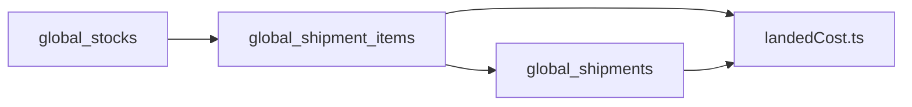
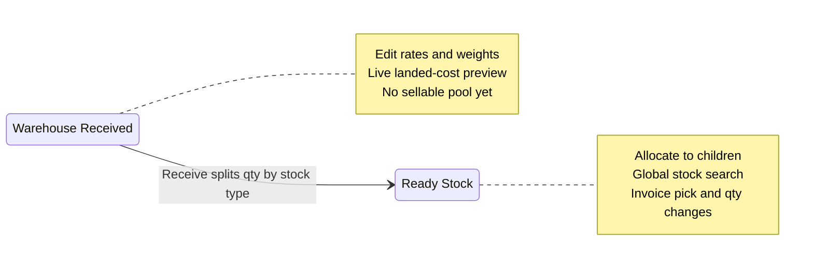

# Procurement & Stock

BrandWala / TradeFlow BD uses a **parent module** for inbound procurement and warehouse inventory. Parent companies receive shipment batches, compute landed cost, and create sellable stock pools. Sister concerns (child tenants) consume stock through allocations and sales modules — they do not own physical inventory.

This document answers:

- What is the Procurement & Stock domain and how does it relate to shipment and stock?
- Which module keys, routes, and tables are used?
- What is the target schema and business flow?
- How is landed cost calculated by shipment type, and where is it stored?
- How should implementation start fresh (drop-and-recreate)?
- How is the module designed to grow with new features?

Related: [MASTER_PLAN.md](MASTER_PLAN.md) (§16 redesign), [REPORTING_TREASURY.md](REPORTING_TREASURY.md), [TENANT_MODEL_AND_ACCESS.md](TENANT_MODEL_AND_ACCESS.md), [APP_SCOPES_AND_ACCESS.md](APP_SCOPES_AND_ACCESS.md), [GLOBAL_REFERENCE_DATA.md](GLOBAL_REFERENCE_DATA.md).

---

## 1. Overview

| Property | Procurement & Stock | Tenant Stock (`inventory`) |
|----------|---------------------|----------------------------|
| Scope | Parent tenant (physical pool) + child allocation bridge | Child tenant (virtual slice view) |
| `tenant_id` | `parent_tenant_id` on stock rows | Child via `child_tenant_id` on allocations |
| Auth surface | App (`memberships` on parent) | App (parent + child) |
| Module gating | `procurement_stock` parent + submodules | `inventory` submodule under same parent |
| Primary UI | `/:slug/app/procurement/*` | `/:slug/app/procurement/tenant-stock` |

### What this domain is

| Capability | Submodule | Responsibility |
|------------|-----------|----------------|
| Inbound batch | `global_shipment` | Group purchases under a customs/cargo batch; capture FX rates and vendor |
| Warehouse pool | `global_stock` | Parent-owned quantity pools; **Allocate Stock** UI writes child slices |
| Tenant allocation view | `inventory` | Child (and parent) read allocated slices from `global_stock_allocations` |
| Stock behaviour | `global_stock_type` *(config, no nav)* | Classify sellable vs damaged/quarantine; gates invoice pick |

### What this domain is not

| Topic | Is not |
|-------|--------|
| **Tenant Stock** | Duplicate physical inventory per child — `global_stock_allocations` are virtual slices of parent `global_stocks` |
| **Commerce inbound** | Commerce does **not** create shipments (locked decision **D2**) |
| **Desk sales** | Invoice creation lives under `global_invoice`; this domain only supplies stock |
| **Reports & treasury** | Shipment P&L and parent dashboards live under `reporting_treasury` — see [REPORTING_TREASURY.md](REPORTING_TREASURY.md) |
| **Child procurement** | Orders and costing files are child inputs (`order_management`, `product_based_costing`) — not part of this parent module |
| **Custom formula builder** | Cost math is **hardcoded** in `landedCost.ts` — admins edit inputs on the shipment UI, not the equation |

### End-to-end flow


Commerce and desk invoices **sell from** `global_stocks`; they do not create inbound batches.

---

## 2. Module hierarchy

**Parent module key:** `procurement_stock`  
**Display name:** Procurement & Stock  
**Nav pattern:** Parent group with submodule children (same model as `global_reference`).

| Key | Display name | `parent_module_key` | Nav route |
|-----|--------------|---------------------|-----------|
| `procurement_stock` | Procurement & Stock | `null` | *(none — group header only)* |
| `global_shipment` | Inbound Shipment | `procurement_stock` | `procurement/shipment` |
| `global_stock` | Warehouse Stock | `procurement_stock` | `procurement/stock`, `procurement/stock/allocate` |
| `inventory` | Tenant Stock | `procurement_stock` | `procurement/tenant-stock` |
| `global_stock_type` | Stock Types | `procurement_stock` | *(config inside Warehouse Stock — no sidebar link)* |

### Tenant stock allocation (in scope)

Yes — **child tenant allocation belongs in this domain**. It is not a separate product area.

| Layer | Table / UI | Who |
|-------|------------|-----|
| Physical pool | `global_stocks` | Parent |
| Parent → child slice | `global_stock_allocations` | Parent writes via **Allocate Stock** (`global_stock`) |
| Child read view | Same allocation rows | Child reads via **Tenant Stock** (`inventory`) + joined stock queries |

**Reconciliation rule:** For each `global_stocks` row, `SUM(global_stock_allocations.quantity)` ≤ `global_stocks.quantity`. Unallocated remainder stays in the parent pool.

Redirect `/app/stock` → `/app/procurement/tenant-stock` for bookmarks.

### Assignment rules

- Superadmin assigns **`procurement_stock`** on a tenant via `tenant_modules`.
- `get_active_module_keys_for_tenant` expands the parent → enabled submodule keys (the parent key itself is not emitted to route guards).
- Platform can disable individual submodules per tenant via `tenant_module_submodules` without removing the parent.
- Submodule keys cannot be assigned directly — assign the parent (enforced by `create_tenant_module` RPC).

### Tenant eligibility

| Tenant type | `procurement_stock` | `global_shipment` | `global_stock` | `inventory` (Tenant Stock) |
|-------------|---------------------|-------------------|----------------|----------------------------|
| Parent company | Yes | Yes | Yes | Yes (allocate + own view) |
| Child (sister concern) | No | No | Read via joined stock queries | Yes (allocated view) |
| Standalone | Yes | Yes | Yes | Yes |

### Legacy keys (transition)

| Legacy key | Status | Notes |
|------------|--------|-------|
| `shipment` | Retire | Superseded by `global_shipment` under `procurement_stock` |
| Old `global_stocks` + `global_stock_quantities` shape | Replace | Dropped and recreated per §3 — not migrated |

---

## 3. Fresh start — drop and recreate

Implementation uses **§16 target tables only**. There is **no data migration** from legacy `shipments`, `shipment_items`, or the interim `global_stocks` / `global_stock_quantities` model.

When a migration creates objects that share a name with an existing table, view, enum, or RPC:

1. **Drop dependents first** (FK order) or use `CASCADE` in a controlled migration.
2. **Recreate** with the schema documented below.
3. **Do not dual-write** to old and new tables (locked decision **D1**).

### Objects to replace (same name, new shape)

| Object | Action |
|--------|--------|
| `global_stocks` | `DROP … CASCADE` → recreate per §5.5 (quantity pool only — no cost/display copies) |
| `global_stock_quantities` | `DROP` (quantities live on `global_stocks`) |
| `child_tenant_stock_allocations` | `DROP` → replace with `global_stock_allocations` |
| Legacy stock/shipment RPCs | `DROP` — phase 1 uses **direct table access** + frontend joins (see §5.0, §6) |

### Objects to keep (legacy, separate stack)

| Object | Reason |
|--------|--------|
| `shipments`, `shipment_items` | Legacy stack; not wired when `procurement_stock` is enabled |
| `shipment` module key | Empty registry; no new tenants |
| `recalculate_shipment_transaction_rate` | Legacy DB trigger only — **do not port** |

### Objects to create (new names)

| Object | Notes |
|--------|-------|
| `global_shipments`, `global_shipment_items` | New inbound stack |
| `global_stock_types`, `global_stock_allocations` | Stock behaviour + child slices |
| Costing | **Frontend `landedCost.ts` only** — hardcoded formulas; no DB triggers or costing RPCs |

### Drop order (reference migration script)

```text
1. Drop legacy RPCs that reference old stock/shipment tables
2. Drop views depending on global_stocks / allocations
3. DROP TABLE global_stock_allocations OR child_tenant_stock_allocations CASCADE
4. DROP TABLE global_stock_quantities CASCADE
5. DROP TABLE global_stocks CASCADE
6. DROP TYPE global_stock_status (if unused elsewhere)
7. CREATE enums → tables → indexes → RLS → grants
```

> **No costing triggers** on the new stack.

> **Warning:** Dropping `global_stocks` breaks FKs from `global_invoices`, `commerce_*`, and ledger tables until retargeted.

---

## 4. Extensibility design

### 4.1 Parent + submodule pattern

Follow **`global_reference`** as the template (one assignable parent, granular submodule keys, `tenant_module_submodules` overrides).

### 4.2 Future submodules (planned slots)

| Future `module_key` | Target table(s) | Purpose |
|---------------------|-----------------|---------|
| `global_stock_transfer` | `global_stock_transfers`, `global_stock_transfer_items` | Move qty between pools or child tenants |
| `global_stock_adjustment` | `global_stock_adjustments` | Cycle count, write-off, corrections |
| `global_stock_reservation` | `global_stock_reservations` | Hold qty for pending orders/invoices |
| `global_shipment_inspection` | `global_shipment_inspections`, `global_shipment_inspection_items` | QC before receive |
| `global_shipment_document` | `global_shipment_documents` | Customs / proforma attachments |
| `global_shipment_cost_line` | `global_shipment_cost_lines` | Extra fixed cost slots (duty, insurance) added in code — not a formula builder |
| `global_batch_code` | `global_batch_codes` | Batch / barcode PC labels |
| `global_warehouse_location` | `global_warehouse_locations`, `global_stock_locations` | Bin / shelf tracking |
| `global_reorder_point` | `global_reorder_rules` | Low-stock alerts |
| `global_stock_return_inbound` | `global_stock_return_receipts` | Return goods back into stock |

### 4.3 Table design for growth

| Pattern | Use |
|---------|-----|
| `global_stocks.shipment_item_id` FK | Cost and display via join — no copies on stock |
| Inputs on header + line only | Rates can change; derived BDT cost in frontend |
| Hardcoded `landedCost.ts` | Two branches: domestic / international — same structure |

### 4.4 Data access — no costing RPCs (phase 1)

| Concern | Approach |
|---------|----------|
| Landed cost math | **Frontend** — `web/src/modules/procurement_stock/utils/landedCost.ts` |
| Stock list / search / invoice pick | `.select()` with join `global_shipment_items` → `global_shipments`; sellable pick when shipment is **`Ready Stock`** |
| Receive | At **`Warehouse Received`**: split line qty by `global_stock_type`; `.insert()` on `global_stocks`; then **`Ready Stock`** |
| DB triggers | **None** for costing |
| Tenant formula UI | **No** — essential input fields on shipment details only |

### 4.5 Shipment UI inputs (what admins edit)

Hardcoded math; **rich input form** on shipment header + lines:

| Field | Header / line | Domestic | International |
|-------|---------------|----------|-----------------|
| `type` | Header | `domestic` | `international` |
| `purchase_price` | Line | BDT | Purchase currency |
| `product_weight`, `package_weight` | Line | Yes | Yes |
| `cargo_rate` | Header | Yes | Yes |
| `received_weight` | Header | Yes (for header `transaction_rate`) | Yes |
| `product_conversion_rate` | Header | Forced `1.0` | Yes |
| `cargo_conversion_rate` | Header | Forced `1.0` | Yes |
| `transaction_rate` | Header | Not used | Computed in frontend (see §5.0) |
| Currency FKs | Header | BDT typical | GBP / other |

Show a **live preview** column (computed BDT per unit) while editing — preview only, not stored on stock.

**When to edit:** Header and line rate fields are entered and revised while the shipment is in workflow, especially at **`Warehouse Received`** before receive. Reuse the existing shipment details page layout (`AdminShipmentDetailsPage`) — same field groups and preview behaviour, wired to `global_*` tables and `landedCost.ts`.

### 4.6 Frontend module boundary

```
web/src/modules/procurement_stock/utils/landedCost.ts   # hardcoded formulas
web/src/modules/shipment/                             # Inbound Shipment UI
web/src/modules/global/                               # Warehouse Stock UI
```

### 4.7 Route namespace

All routes under `/app/procurement/*` (shipment, stock, stock/allocate, tenant-stock). Redirects from `/app/global/*` and `/app/stock`.

---

## 5. Data schema (target — §16)

### 5.0 Landed cost and read model

Shipment rates **can change at any time**. Stock rows must **not** cache cost or display fields.

#### Design principles

| Principle | Rule |
|-----------|------|
| Formula | **Hardcoded** in `landedCost.ts` — no per-tenant formula builder |
| International | Same structure as legacy `costing.ts` |
| Domestic | **Same structure** as international; conversion rates forced to `1.0`; `cargo_rate` still applies |
| Storage | Inputs on header + line only; **no** derived cost on stock or items |
| At sale | Snapshot `unit_cost_price` on `global_invoice_items` only |

#### Shipment type

| `global_shipments.type` | UI label | Legacy `shipment_type` |
|---------------------------|----------|-------------------------|
| `domestic` | Local | `local` |
| `international` | International | `international` |

#### What is stored (inputs only)

| Table | Fields |
|-------|--------|
| `global_shipments` | `type`, `product_conversion_rate`, `cargo_conversion_rate`, `cargo_rate`, `received_weight`, `transaction_rate` (intl, optional cache), currency FKs |
| `global_shipment_items` | `purchase_price`, `product_weight`, `package_weight`, `name`, `product_code`, `barcode`, `image_url` |
| `global_stocks` | `quantity`, `stock_type_id`, `is_usable`, `shipment_item_id` only |

#### What is **not** stored

| Location | Excluded | Reason |
|----------|----------|--------|
| `global_stocks` | `unit_cost`, name, codes, barcode, image | Join + calculate when rates change |
| `global_shipment_items` | `calculated_landed_cost` | Derived in frontend |

#### Hardcoded formula (per unit, BDT)

**Shared base** (domestic and international use the **same structure**):

```text
base = purchase_price
       + ((product_weight + package_weight) / 1000) × cargo_rate
```

Weights are in **grams**; divide by 1000 for kg (matches legacy `costing.ts`).

**Domestic** (`type = 'domestic'`):

- `product_conversion_rate` and `cargo_conversion_rate` are forced to **`1.0`** (UI may hide or lock these fields).
- `transaction_rate` is **not used**.
- `effective_rate = 1.0`

```text
landed_cost_bdt = base
```

**International** (`type = 'international'`):

- Uses legacy `calculateCostBdt` logic (basis: `web/src/modules/shipment/utils/costing.ts`).
- `effective_rate` =
  - header `transaction_rate` when set, else
  - `(product_conversion_rate + cargo_conversion_rate) / 2`

```text
landed_cost_bdt = base × effective_rate
```

#### Header `transaction_rate` (international only, frontend)

Recompute in the frontend when header rates, `received_weight`, or line totals change (replaces legacy DB trigger — **no Supabase function**):

```text
goods_purchase = Σ (purchase_price × ordered_quantity)
goods_bdt      = goods_purchase × product_conversion_rate
cargo_purchase = received_weight × cargo_rate
cargo_bdt      = cargo_purchase × cargo_conversion_rate

transaction_rate = (goods_bdt + cargo_bdt) / (goods_purchase + cargo_purchase)
                   — when denominator > 0; else average of conversion rates
```

Persist `transaction_rate` on `global_shipments` as a **cached input** for line previews (optional column). Domestic shipments keep `transaction_rate` null.

#### When calculation runs

| When | Action |
|------|--------|
| Editing shipment | Live preview column — not written to stock |
| Stock / shipment list | Join item + header → `landedCost.ts` in repository mapper |
| Invoice pick | Join + calc for display |
| **At sale** | Snapshot `unit_cost_price` on `global_invoice_items` — past invoices do not change when rates are edited |

#### Join path for stock reads



```text
global_stocks
  → global_shipment_items (name, codes, prices, weights)
    → global_shipments (type, rates, received_weight, transaction_rate)
```

Index `global_stocks.shipment_item_id`.

---

### 5.1 Enums and status

| Kind | Name | Values |
|------|------|--------|
| Enum | `global_shipment_type` | `domestic`, `international` |
| Enum | `global_shipment_item_add_method` | `order`, `costing`, `manual` |
| Text + CHECK | `global_shipments.status` | Workflow statuses (Draft → Ready Stock) — see table below |

`global_shipments.status` is **`text not null default 'Draft'`** with a CHECK constraint on the values below.

Based on legacy `SHIPMENT_STATUS_OPTIONS` in `web/src/modules/shipment/types/index.ts`, with the **final receive milestone renamed** for the new stack:

| # | Status | Typical use |
|---|--------|-------------|
| 1 | `Draft` | New batch |
| 2 | `Order Placed` | Supplier order sent |
| 3 | `Proforma Generated` | Proforma received |
| 4 | `Payment Done` | Payment cleared |
| 5 | `Delivery Date Received` | Supplier confirmed delivery |
| 6 | `Uk Warehouse Delivery Received` | UK hub received (international path) |
| 7 | `Air Shipment Date Set` | Flight booked |
| 8 | `Airport Arrival` | Cargo at airport |
| 9 | `Airport Released` | Customs cleared |
| 10 | `Warehouse Received` | Goods at parent warehouse — **edit rates, weights, and costs**; run **receive** to split qty into stock by type (see §5.1.1) |
| 11 | `Ready Stock` | Receive completed — `global_stocks` exist; **allocate**, **global search**, and **invoice** pick enabled (replaces legacy `Added to Inventory`) |

#### 5.1.1 Warehouse Received → Ready Stock workflow

Two statuses gate the inbound-to-sellable path. Behaviour follows the existing shipment details UI (`AdminShipmentDetailsPage`) for rate entry and cost preview.



##### While status is `Warehouse Received`

| What | Detail |
|------|--------|
| **Who** | Parent admin / staff on `global_shipment` |
| **`stock_ready`** | `false` — not yet sellable |
| **Rates & costing inputs** | Edit header fields (`cargo_rate`, `product_conversion_rate`, `cargo_conversion_rate`, `received_weight`, `transaction_rate`, currencies) and line fields (`purchase_price`, weights). **Follow existing shipment details UI** for layout and live BDT preview (`landedCost.ts`). |
| **Receive action** | Enabled — opens receive dialog (same UX pattern as legacy `receiving_splits`) |
| **Not allowed yet** | Child allocation, invoice pick, commerce sell from this batch |

##### Receive: split quantity into stock by type

Performed **only** when status is `Warehouse Received`. For each `global_shipment_item`, the user splits `ordered_quantity` across **`global_stock_types`** (e.g. Standard Sellable, Box Damage, Expired).

| Input | Output |
|-------|--------|
| Shipment line + qty per type | One `global_stocks` row per **(shipment_item_id × stock_type_id × is_usable)** |
| Sum of splits per line | Must equal line `ordered_quantity` |

On successful receive:

1. `.insert` rows on `global_stocks` (quantity + FKs only — §5.5)
2. Set `status = 'Ready Stock'`
3. Set `stock_ready = true`

##### While status is `Ready Stock`

| Capability | Scope | Detail |
|------------|-------|--------|
| **Allocate to child** | Parent only | **Allocate Stock** UI writes `global_stock_allocations`. Typically allocate `is_sellable` stock types to sister concerns. |
| **Global stock search** | Parent + child | Joined stock query with `landedCost.ts` for cost/display. **Parent:** full pool. **Child:** own allocation slices + network search when own slice is empty (same idea as legacy `search_stock_network` — modes `page`, `search`, `invoice`). |
| **Invoice module** | Child (and parent context) | Pick lines from `global_stocks` where shipment is `Ready Stock` and type is sellable. **Reduce** parent/allocated quantity on sale; **increase** on returns or adjustments per `global_invoice` rules. Snapshot `unit_cost_price` on invoice line at sale (§5.0). |

Rates on the shipment may still be edited after `Ready Stock`; displayed cost recalculates via join — stock rows are not duplicated (§5.0). Physical **quantity** changes on stock come from allocation, invoice sale, and returns — not from re-receiving the same batch.

**Automation rules:**

- Default on create: `Draft`
- Receive is allowed when status is **`Warehouse Received`** (recommended gate; UI may also require this before opening receive dialog)
- Receive success → **`Ready Stock`** + `stock_ready = true`
- **Allocate, global search (sellable pick), and invoice pick** require **`Ready Stock`** + `stock_ready = true`
- Shipment list filters may include `Warehouse Received` for in-progress batches and `Ready Stock` for sellable batches

> **Legacy mapping:** Old `shipments.status = 'Added to Inventory'` and `inventory_added = true` map to `Ready Stock` + `stock_ready` on `global_shipments`. Legacy `receiving_splits` on `shipment_items` maps to per-type qty on receive into `global_stocks`.

### 5.2 `global_shipments`

| Field | Type | Notes |
|-------|------|-------|
| `id` | bigint PK | |
| `parent_tenant_id` | bigint FK → `tenants` | Owner |
| `vendor_id` | bigint FK → `vendors` | Supplier |
| `name` | text | Batch identifier |
| `tenant_shipment_id` | int | Per-parent display sequence |
| `type` | `global_shipment_type` | Drives cost branch — §5.0 |
| `status` | text | Workflow CHECK — §5.1 |
| `shipment_purchase_currency_id` | bigint FK → `global_currencies` | Goods currency |
| `shipment_cost_currency_id` | bigint FK → `global_currencies` | Freight currency |
| `product_conversion_rate` | numeric | Forced `1.0` when domestic (**D6**) |
| `cargo_conversion_rate` | numeric | Forced `1.0` when domestic |
| `cargo_rate` | numeric | Freight per kg — **both** domestic and international |
| `received_weight` | numeric | Warehouse weight; used for `transaction_rate` (intl) |
| `transaction_rate` | numeric nullable | International only; frontend-computed cache |
| `stock_ready` | boolean | `true` when status is `Ready Stock` — parent pool is sellable |
| `created_at`, `updated_at` | timestamptz | |

### 5.3 `global_shipment_items`

| Field | Type | Notes |
|-------|------|-------|
| `id` | bigint PK | |
| `shipment_id` | bigint FK → `global_shipments` | |
| `product_id` | bigint FK → `products` nullable | |
| `name` | text | Snapshot at purchase |
| `ordered_quantity` | int | |
| `image_url` | text | |
| `add_method` | `global_shipment_item_add_method` | |
| `purchase_price` | numeric | In purchase currency |
| `product_weight` | numeric | Grams |
| `package_weight` | numeric | Grams |
| `barcode`, `product_code` | text | |
| `source_child_tenant_id` | bigint FK nullable | |
| `source_type`, `source_id` | text / bigint nullable | Procurement trace |

No `calculated_landed_cost` column — §5.0.

### 5.4 `global_stock_types`

| Field | Type | Notes |
|-------|------|-------|
| `id` | bigint PK | |
| `parent_tenant_id` | bigint FK | |
| `description` | text | |
| `is_sellable` | boolean | Gates invoice/commerce pick |
| `sort_order` | int | |

**Default seed:** Standard Sellable (sellable), Box Damage, Expired, Stolen, Reserved (not sellable).

### 5.5 `global_stocks`

Quantity pool only — **no cost or display denormalization**.

| Field | Type | Notes |
|-------|------|-------|
| `id` | bigint PK | |
| `parent_tenant_id` | bigint FK | |
| `shipment_item_id` | bigint FK → `global_shipment_items` | Join for cost + display |
| `stock_type_id` | bigint FK → `global_stock_types` | |
| `quantity` | int | ≥ 0 |
| `is_usable` | boolean | |
| `created_at`, `updated_at` | timestamptz | |

One row = shipment line × stock type × usable flag.

### 5.6 `global_stock_allocations`

| Field | Type | Notes |
|-------|------|-------|
| `id` | bigint PK | |
| `parent_tenant_id` | bigint FK | |
| `child_tenant_id` | bigint FK | |
| `stock_id` | bigint FK → `global_stocks` | |
| `quantity` | int | ≤ parent pool qty |
| `created_at`, `updated_at` | timestamptz | |

---

## 6. Data access catalog (phase 1)

Direct Supabase client + RLS. **No costing RPCs or triggers.**

| Operation | Approach |
|-----------|----------|
| Shipment CRUD | `.insert` / `.update` / `.delete` on `global_shipments`, `global_shipment_items` |
| Receive (Warehouse Received → Ready Stock) | Split each line qty by `global_stock_types`; `.insert` on `global_stocks`; set `Ready Stock` + `stock_ready = true` |
| List / search stock | `.select` with nested join; map cost via `landedCost.ts`; **Ready Stock** rows only for sellable pick |
| Global search | Parent: full `Ready Stock` pool. Child: allocations + network pick (`page` / `search` / `invoice` modes) |
| Allocate | `.insert` / `.update` / `.delete` on `global_stock_allocations` — **Ready Stock** + sellable types |
| Invoice consumption | Pick `global_stocks`; decrement qty on sale; increment on return — shipment must be `Ready Stock` |
| `transaction_rate` (intl) | Recompute in frontend on header/line change; optional `.update` on shipment row |

Optional later: pagination-only RPCs. **Excluded:** `recalculate_*` DB functions.

---

## 7. Permissions

| module_key | superadmin | admin | staff | viewer |
|------------|------------|-------|-------|--------|
| `global_shipment` | view | view | view | — |
| `global_stock` | view | view | view | — |
| `inventory` | view | view | view | — |

Parent: CRUD via client + RLS. Child: read allocations + joined stock.

---

## 8. UI surfaces

| Surface | Path | Module key |
|---------|------|------------|
| Inbound Shipment list | `/:slug/app/procurement/shipment` | `global_shipment` |
| Shipment details (rates + receive) | `/:slug/app/procurement/shipment/:id` | `global_shipment` |
| Warehouse Stock list | `/:slug/app/procurement/stock` | `global_stock` |
| Allocate to children | `/:slug/app/procurement/stock/allocate` | `global_stock` |
| Tenant Stock | `/:slug/app/procurement/tenant-stock` | `inventory` |
| Sidebar | **Procurement & Stock** group | `procurement_stock` |

**UI reuse:** `AdminShipmentDetailsPage` — rates, live cost preview, and receive-by-type dialog at **`Warehouse Received`**. `GlobalStockPage` — list, allocate, global search. New repositories only; no legacy `shipments` / `stocks` tables.

---

## 9. Procurement inputs

| Source | `add_method` | Approach |
|--------|--------------|----------|
| `order_items` | `order` | Insert `global_shipment_items` |
| `product_based_costing_items` | `costing` | Same |

Commerce does not create inbound lines (**D2**).

---

## 10. Downstream consumers

| Module | Integration |
|--------|-------------|
| `global_invoice` | Pick `global_stocks` from **`Ready Stock`** shipments only; join + `landedCost.ts` for display; **reduce** stock qty on sale, **increase** on return; snapshot `unit_cost_price` **at sale only** |
| `commerce_shop` | Sell from parent **`Ready Stock`** pool; snapshot at line |
| `reporting_treasury` | Shipment P&L via join + `landedCost.ts` — see [REPORTING_TREASURY.md](REPORTING_TREASURY.md) |
| `inventory` | Child allocations + joined **`Ready Stock`** rows via global search |

---

## 11. Implementation phases

| Phase | Deliverable | Status |
|-------|-------------|--------|
| **P0 — Documentation** | This file | Current |
| **P1 — Module hierarchy** | `procurement_stock` seeder, registry, nav | Planned |
| **P2 — Schema** | Drop-recreate tables, enums, RLS | Planned |
| **P3 — Frontend data layer** | `landedCost.ts`, joins, direct client access | Planned |
| **P4 — UI routes** | `/app/procurement/*` | Planned |
| **P5 — Downstream** | Invoice, commerce, accounting retarget | Planned |

---

## 12. Code references

| Area | Path |
|------|------|
| Legacy costing (international basis) | `web/src/modules/shipment/utils/costing.ts` |
| Landed cost (target) | `web/src/modules/procurement_stock/utils/landedCost.ts` |
| Shipment type helpers | `web/src/modules/shipment/utils/shipmentType.ts` |
| Legacy shipment UI | `web/src/modules/shipment/` |
| Legacy stock UI | `web/src/modules/global/pages/GlobalStockPage.vue` |
| Module registry | `web/src/modules/navigation/moduleRegistry.ts` |

---

## 13. Locked decisions (this domain)

| # | Topic | Decision |
|---|-------|----------|
| D1 | Write model | §16 tables only; no dual-write |
| D2 | Commerce inbound | No inbound shipments from commerce |
| D6 | Domestic | FX rates forced to 1.0; **cargo_rate still applies** |
| D7 | Cost at sale | Join + frontend calc; snapshot on **invoice line at sale only** |
| D-PS1 | Tables | Drop-recreate; no migration |
| D-PS2 | Parent module | `procurement_stock` + shipment / stock / inventory submodules |
| D-PS3 | Allocation | `global_stock_allocations` in scope |
| D-PS4 | Routes | `/app/procurement/*` |
| D-PS5 | Status | Draft → Ready Stock; **Warehouse Received** = edit rates + receive split; **Ready Stock** = allocate, search, invoice |
| D-PS10 | Receive split | Qty per line split across `global_stock_types` into `global_stocks` rows |
| D-PS11 | Sellable gate | Allocate, global search pick, and invoice only when `Ready Stock` + `stock_ready` |
| D-PS6 | Costing | Hardcoded `landedCost.ts`; frontend only; no DB triggers or costing RPCs |
| D-PS7 | Stock shape | Quantity + FKs only; no cost/display copies on `global_stocks` |
| D-PS8 | Formula | **No** tenant formula builder — essential input UI on shipment only |
| D-PS9 | Domestic vs intl | **Same formula structure**; domestic uses `effective_rate = 1`; international follows legacy `costing.ts` |
