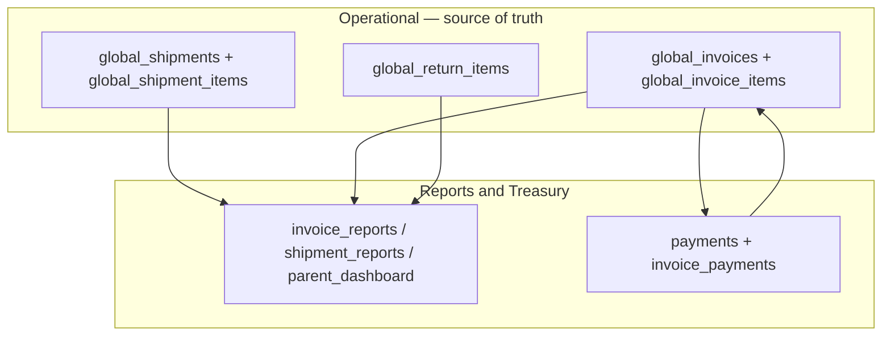

# Reports & Treasury

BrandWala / TradeFlow BD uses a **parent module** for financial visibility and cash settlement. Sister concerns sell from parent stock; this domain **reads** procurement and sales transactions to produce margin reports and **writes** payment allocation rows only. It is **not** full ERP accounting — no double-entry ledger, no shadow P&L tables.

This document answers:

- What reports and settlement flows does a wholesale parent/child business need?
- Which module keys, routes, and tables are used?
- How is margin computed without duplicate accounting tables?
- How do payments, balances, and dropship settlement work?
- What is reused from legacy ledger modules vs the target design?

Related: [MASTER_PLAN.md](MASTER_PLAN.md), [PROCUREMENT_STOCK.md](PROCUREMENT_STOCK.md), [SALES_INVOICE.md](SALES_INVOICE.md), [TENANT_MODEL_AND_ACCESS.md](TENANT_MODEL_AND_ACCESS.md), [APP_SCOPES_AND_ACCESS.md](APP_SCOPES_AND_ACCESS.md).

---

## User stories

### Parent — `reporting_treasury` (Reports & Treasury)

**As a** child-tenant admin or parent company overseer,  
**I want** margin reports and cash settlement in one finance nav group,  
**So that** I can see profit from real transactions and record collections without a separate accounting ledger.

---

### Submodule — `payments` (Payments & Collection)

**As a** finance user,  
**I want to** record cash received and allocate it to invoice balances,  
**So that** wholesale and retail-account AR, retail-direct collections, and dropship COD stay accurate.

| Collection path | User story |
|-----------------|------------|
| **Billing profile** | **As a** finance user, **I want to** post a payment against a buyer account and slice it across open invoices, **so that** credit customers and resellers show correct balances. |
| **Recipient (COD / cash)** | **As a** finance user, **I want to** record cash collected from the end customer on retail-direct and dropship invoices, **so that** invoice `due_amount` reflects real collections without a billing profile. |
| **Middle-man payout** | **As a** finance user, **I want to** pay dropship middle men their margin, **so that** spread and payout status are tracked separately from COD. |

---

### Submodule — `invoice_reports` (Invoice Reports)

**As a** manager,  
**I want to** see gross profit per invoice and by type (wholesale, retail account/direct, dropship),  
**So that** I know desk sales performance from posted invoices only — no shadow ledger.

---

### Submodule — `shipment_reports` (Shipment P&L)

**As a** parent company user,  
**I want to** see landed cost vs realized margin per shipment batch,  
**So that** I know which import batches are profitable and how much stock remains unsold.

---

### Submodule — `billing_balances` (Customer Balances)

**As a** finance user,  
**I want to** see total amount due per billing profile,  
**So that** I can chase wholesale buyers, retail accounts, and dropship middle men with open AR.

**Note:** Retail-direct invoices have no billing profile — use **invoice outstanding** (same module or `invoice_reports` filter) for those balances.

---

### Submodule — `parent_dashboard` (Consolidated Dashboard)

**As a** parent company admin,  
**I want to** roll up sales and margin across sister concerns,  
**So that** I can compare child performance without issuing desk invoices myself.

---

This document answers:

- What reports and settlement flows does a wholesale parent/child business need?
- Which module keys, routes, and tables are used?
- How is margin computed without duplicate accounting tables?
- How do payments, balances, and dropship settlement work?
- What is reused from legacy ledger modules vs the target design?

---

## 1. Overview

| Property | Reports & Treasury | Operational modules |
|----------|-------------------|---------------------|
| Scope | Read margin from transactions; write payments only | Procurement receives stock; sales issues invoices |
| Primary data | **Reads** shipment + invoice tables; **writes** payment tables | Owns `global_shipments`, `global_invoices`, etc. |
| Auth surface | App (`memberships`) | App (`memberships`) |
| Module gating | `reporting_treasury` parent + submodules | `procurement_stock`, `sales_invoice` |
| Primary UI (target) | `/:slug/app/finance/*` | `/app/procurement/*`, `/app/sales/*` |
| Accounting style | Operational P&L + cash — **not** GAAP / double-entry | Transaction source of truth |

### What this domain is

| Capability | Submodule | Responsibility |
|------------|-----------|----------------|
| Cash collection | `payments` | Record payments; allocate slices to invoice balances |
| Invoice margin reports | `invoice_reports` | List and aggregate gross profit from invoice lines + returns |
| Batch / shipment P&L | `shipment_reports` | Landed cost vs sold margin per shipment batch |
| Customer balances | `billing_balances` | Amount due per billing profile (AR summary) |
| Parent rollup | `parent_dashboard` | Consolidated margin and sales across sister concerns |
| Investor slice *(optional)* | `investor_reports` | Profit share per shipment when capital module is enabled |

### What this domain is not

| Topic | Is not |
|-------|--------|
| **Full accounting** | No chart of accounts, journal vouchers, trial balance, or statutory books |
| **Shadow ledger** | No `global_accounting_ledger` or rollup tables as source of truth (target) |
| **Inbound / sales ops** | Does not create shipments, stock, or invoices — reads them |
| **Online shop / cart** | Out of scope — desk `global_invoices` only |
| **Duplicate margin store** | Margin is **computed on read** from invoice line snapshots |

### Design principle

> **Transactions are the accounting. Reports are views over them.**

Operational rows carry immutable snapshots (`unit_cost_price` on invoice lines). Payment rows carry cash facts. This module never maintains a second copy of profit.



---

## 2. Module hierarchy

**Parent module key:** `reporting_treasury`  
**Display name:** Reports & Treasury  
**Nav pattern:** Parent group with submodule children (same model as `procurement_stock`, `sales_invoice`, `global_reference`).

| Key | Display name | `parent_module_key` | Nav route (target) |
|-----|--------------|---------------------|-------------------|
| `reporting_treasury` | Reports & Treasury | `null` | *(none — group header only)* |
| `payments` | Payments & Collection | `reporting_treasury` | `finance/payments` |
| `invoice_reports` | Invoice Reports | `reporting_treasury` | `finance/invoices` |
| `shipment_reports` | Shipment P&L | `reporting_treasury` | `finance/shipments` |
| `billing_balances` | Customer Balances | `reporting_treasury` | `finance/balances` |
| `parent_dashboard` | Consolidated Dashboard | `reporting_treasury` | `finance/dashboard` |
| `investor_reports` | Investor Reports | `reporting_treasury` | `finance/investors` *(optional)* |

### Cross-referenced (legacy keys — retire)

| Legacy key | Target | Notes |
|------------|--------|-------|
| `accounting` | Submodules under `reporting_treasury` | Legacy tenant payment UI |
| `global_accounting_ledger` | **Drop as write target** | Replaced by read-side margin queries |
| `global_invoice_accounting` | `invoice_reports` | Was cached rollup — derive on read |
| `global_shipment_accounting` | `shipment_reports` | Was cached rollup — derive on read |
| `global_payments` | `payments` submodule | Keep payment table shape; submodule rename |

Redirect legacy `/app/accounting/*` and `/app/global/accounting/*` → `/app/finance/*` during transition.

### Assignment rules

- Superadmin assigns **`reporting_treasury`** on a tenant via `tenant_modules`.
- `get_active_module_keys_for_tenant` expands the parent → enabled submodule keys (the parent key itself is not emitted to route guards).
- Platform can disable individual submodules per tenant via `tenant_module_submodules` without removing the parent.
- Submodule keys cannot be assigned directly — assign the parent (enforced by `create_tenant_module` RPC).
- Each route guard uses its **submodule** key — payments gated by `payments`, not `invoice_reports`.

### Tenant eligibility

| Tenant type | `payments` | `invoice_reports` | `shipment_reports` | `billing_balances` | `parent_dashboard` | `investor_reports` |
|-------------|------------|-------------------|--------------------|--------------------|----------------------|----------------------|
| Parent company | Optional (bulk remittance) | Optional (rollup read) | Yes | Optional | Yes | Optional |
| Child (sister concern) | Yes | Yes | No | Yes | No | No |
| Standalone | Yes | Yes | Yes | Yes | Yes | Optional |

**Parent rule:** Parent does not issue desk invoices but needs batch P&L and consolidated rollups. Child needs payments and per-invoice margin; shipment P&L is usually parent-only.

---

## 3. Reports the business needs

Operational questions this domain answers — not statutory accounting.

### 3.1 Procurement / batch (parent) — `shipment_reports`

| Report | Question |
|--------|----------|
| Batch landed cost | What did this shipment cost in BDT? |
| Received vs sold | How much of this batch is still in stock? |
| Batch realized margin | What profit came from sales tied to this shipment? |
| Dead stock value | Unsold quantity × landed unit cost |

### 3.2 Sales (child) — `invoice_reports`

| Report | Question |
|--------|----------|
| Invoice line margin | Profit per line on one invoice |
| Invoice gross profit | Total margin after discount, charges, returns |
| Sales by type | Wholesale vs retail account vs retail direct vs dropship |
| Sales by period | Filter `invoice_date` on **posted** invoices only |
| Overdue invoices | `due_date < today` and `due_amount > 0` (wholesale + retail account) |

### 3.3 Cash / settlement — `payments`, `billing_balances`

| Report | Question |
|--------|----------|
| Invoice balance | Paid / partial / due per **posted** invoice |
| Invoice outstanding | All invoices with `due_amount > 0` — includes **retail direct** (no billing profile) |
| Billing profile balance | Total AR for one buyer / middle man (`billing_profile_id` not null) |
| Unallocated cash | Payment received but not yet sliced to invoices |
| Recipient collection | COD / cash recorded on retail direct + dropship |
| Courier variance | `courier_collected_amount` vs sum of collections (reconciliation) |
| Middle-man payout | Margin owed to billing profile (dropship) |

### 3.4 Parent oversight — `parent_dashboard`

| Report | Question |
|--------|----------|
| Per-child sales | Which sister concern sold how much? |
| Consolidated margin | Sum of invoice margins across children |
| Top batches | Shipments with best/worst realized margin |

### 3.5 Optional — `investor_reports`

Only when `global_investor` / capital modules are enabled: profit share per shipment batch for external investors.

---

## 4. Margin formulas (canonical)

Single source of truth for all report surfaces. Shared util: `margin.ts` (target).

### 4.1 Landed unit cost (display / batch cost)

From [PROCUREMENT_STOCK.md](PROCUREMENT_STOCK.md) — `landedCost.ts` on `global_shipment_items` joined to `global_shipments` header rates. **Not stored on stock rows.**

### 4.2 Line margin (invoice)

```
line_margin = (sell_price_amount - unit_cost_price) × quantity - line_discount_amount
```

- `unit_cost_price` — **immutable snapshot** at post (locked decision **D7**).
- Dropship **accounting** margin uses `sell_price_amount` / `accounting_subtotal_amount`, not recipient face prices.
- **Report filter:** `invoice_status = 'posted'` only — drafts and voided invoices excluded.

### 4.3 Invoice gross profit

```
invoice_gross_profit = Σ line_margin
                     - invoice_discount_amount
                     + charge_effect
                     - return_margin_total
```

| Invoice type | Charges in margin (`charge_effect`) |
|--------------|-------------------------------------|
| Wholesale | Optional `shipping_charge` only |
| Retail (account + direct) | Delivery, COD, print, wrapping — revenue to parent |
| Dropship | Accounting margin from sell prices; face/COD totals for collection reports only |

`fulfillment_status` is **never** included in margin formulas.

### 4.4 Batch / shipment P&L

```
batch_landed_cost   = Σ landedCost(item) × received_qty
batch_sold_cost     = Σ unit_cost_price × sold_qty     -- from invoice lines where shipment_item_id matches
batch_revenue       = Σ sell_price_amount × sold_qty - returns on those lines
batch_gross_profit  = batch_revenue - batch_sold_cost
unsold_value        = (received_qty - sold_qty) × landed_unit_cost
```

Join path: `global_shipment_items.id` ← `global_invoice_items.shipment_item_id`.

### 4.5 Billing profile balance (AR)

```
profile_balance_due = Σ global_invoices.due_amount
                    WHERE billing_profile_id = :id
                    AND invoice_status = 'posted'
                    AND payment_status IN ('due', 'partially_paid')
```

Maintained on invoice header by payment RPCs — reports read `due_amount`, do not recompute from ledger.

### 4.6 Invoice-level outstanding (retail direct + any type)

```
invoice_outstanding = global_invoices.due_amount
                    WHERE invoice_status = 'posted'
                    AND due_amount > 0
```

Used when `billing_profile_id` is null (retail direct) or for per-invoice collection follow-up. No separate ledger table.

---

## 5. Data model — reuse operational tables

### 5.1 Read sources (no duplicate writes)

| Table | Used for |
|-------|----------|
| `global_shipments`, `global_shipment_items` | Batch cost, received qty, shipment status |
| `global_stocks` | Unsold qty bridge (optional join) |
| `global_invoices`, `global_invoice_items` | Revenue, cost snapshot, charges, payment status |
| `global_return_items` | Return margin reversal |
| `billing_profiles` | Customer / middle-man grouping |

### 5.2 Write targets (cash only)

| Table | Purpose |
|-------|---------|
| `global_payments` | Cash-in event (amount, `payment_method_id`, reference, `billing_profile_id` optional) |
| `invoice_payments` | Allocation slice: `payment_id` → `global_invoice_id` + amount |

Target shape per MASTER_PLAN §16.10–16.11. `unallocated_amount` on payment until manually allocated.

### 5.3 Tables to avoid (target)

| Object | Action |
|--------|--------|
| `global_accounting_ledger` | Do not write on sale/return — derive margin from invoice lines |
| `global_invoice_accounting` | Replace with `invoice_reports` read queries |
| `global_shipment_accounting` | Replace with `shipment_reports` read queries |
| Legacy `inventory_accounting_entries` | Not ported to global stack |

### 5.4 Performance (when needed)

| Approach | When |
|----------|------|
| Indexed joins on `shipment_item_id`, `parent_tenant_id`, `billing_profile_id` | Default |
| Postgres **views** | Stable report SQL shared by UI and exports |
| **Materialized views** refreshed on schedule | Large tenants; still derived — never dual-written |
| Cached rollup tables | **Avoid** unless proven performance bottleneck |

---

## 6. Payments and settlement

Aligned with [SALES_INVOICE.md](SALES_INVOICE.md) §8.

| Flow | RPC (target) | Submodule | Applies to |
|------|--------------|-----------|------------|
| Billing profile payment + allocation | `create_billing_profile_payment_with_allocations` | `payments` | Wholesale, retail account |
| Recipient collection (COD / cash) | `record_recipient_invoice_collection` | `payments` | Retail direct, dropship |
| Middle-man payout | `create_middle_man_payout` | `payments` | Dropship |
| Status recompute | `recompute_global_invoice_payment_status` | `payments` | All posted invoices |

**Rules:**

- `collection_source = recipient` — reject billing-profile payment allocation; use recipient collection RPC.
- `collection_source = billing_profile` — payments attach to `billing_profile_id` and allocate to invoices.
- Only **posted** invoices accept payments or collections; drafts have no `due_amount`.
- Every payment RPC updates `global_invoices.paid_amount`, `due_amount`, `payment_status` in the same transaction.
- `courier_collected_amount` is a reconciliation fact on the invoice — does not change line margin.

---

## 7. UI surfaces (target)

| Surface | Path | Submodule key |
|---------|------|---------------|
| Payments list / create | `/:slug/app/finance/payments` | `payments` |
| Payment allocate dialog | on payments detail | `payments` |
| Invoice margin report | `/:slug/app/finance/invoices` | `invoice_reports` |
| Shipment P&L report | `/:slug/app/finance/shipments` | `shipment_reports` |
| Shipment P&L detail | `/:slug/app/finance/shipments/:id` | `shipment_reports` |
| Billing profile balances | `/:slug/app/finance/balances` | `billing_balances` |
| Invoice outstanding | `/:slug/app/finance/invoices?due_only=true` or balances tab | `invoice_reports` / `billing_balances` |
| Parent dashboard | `/:slug/app/finance/dashboard` | `parent_dashboard` |
| Investor shipment profit | `/:slug/app/finance/investors` | `investor_reports` |

**Inline margin on invoice detail** may remain on `sales_invoice` routes — same `margin.ts` helpers, not a second formula.

**Sidebar:** **Reports & Treasury** group under `reporting_treasury` — parallel to Procurement & Stock and Sales & Invoice.

---

## 8. Permissions

| module_key | superadmin | admin | staff | viewer |
|------------|------------|-------|-------|--------|
| `payments` | view | view | view | — |
| `invoice_reports` | view | view | view | — |
| `shipment_reports` | view | view | — | — |
| `billing_balances` | view | view | view | — |
| `parent_dashboard` | view | view | — | — |
| `investor_reports` | view | view | — | — |

Target: extend `modulePermissions.ts` when submodules are seeded. Payment **create** may be staff; reports **view** only for viewer if enabled later.

---

## 9. Upstream and downstream

### Upstream (required data)

| Module | Provides |
|--------|----------|
| `procurement_stock` | Shipments, items, landed cost inputs, stock pools |
| `sales_invoice` | Posted invoices, lines with `unit_cost_price` + `shipment_item_id`, returns, charges, lifecycle status |
| `global_reference` | Currency codes for display (read) |

Without procurement + sales data, reports show empty — this module does not bootstrap transactions.

### Downstream

| Consumer | Notes |
|----------|-------|
| `investor_reports` | Reads shipment margin × cost-share when capital enabled |
| Exports / CSV | Same read RPCs as UI |
| External ERP | Out of scope — optional export only |

---

## 10. Legacy transition

| Legacy | Target |
|--------|--------|
| `accounting` module routes | `finance/*` submodules |
| `global_accounting_ledger` writes on add item | Remove; margin from invoice line |
| `refresh_global_invoice_accounting` | SQL view or list RPC over invoices |
| `refresh_global_shipment_accounting` | SQL view or list RPC over shipment joins |
| `post_global_invoice_item_to_ledger` | Delete in fresh migration set |

During transition, legacy rollup pages may read old tables; new work targets read-side queries only.

---

## 11. Implementation phases

| Phase | Deliverable | Status |
|-------|-------------|--------|
| **P0 — Documentation** | This file | Current |
| **P1 — Module hierarchy** | `reporting_treasury` seeder, registry, nav, `/app/finance/*` routes + redirects | Planned |
| **P2 — margin.ts** | Shared line / invoice / batch formulas; unit tests | Planned |
| **P3 — Read RPCs / views** | `list_invoice_margin_report`, `get_shipment_pnl`, `list_billing_balances`, `list_invoice_outstanding` | Planned |
| **P4 — Payments** | Fresh `global_payments` + `invoice_payments`; allocation UI | Planned |
| **P5 — Dashboards** | Parent consolidated + shipment P&L pages | Planned |
| **P6 — Ledger drop** | Stop writing `global_accounting_ledger`; deprecate rollup tables | Planned |

---

## 12. Code references (target)

| Area | Path |
|------|------|
| Landed cost (batch side) | `web/src/modules/procurement_stock/utils/landedCost.ts` |
| Margin formulas (target) | `web/src/modules/reporting_treasury/utils/margin.ts` |
| Payment UI (reuse patterns) | `web/src/modules/accounting/`, legacy global payment pages |
| Invoice data | `web/src/modules/global/stores/globalInvoiceStore.ts` |
| Module registry | `web/src/modules/navigation/moduleRegistry.ts` |
| Permissions | `web/src/modules/navigation/modulePermissions.ts` |

---

## 13. Locked decisions (this domain)

| # | Topic | Decision |
|---|-------|----------|
| D-RT1 | Source of truth | Margin derived from procurement + sales tables — no shadow P&L ledger |
| D-RT2 | Cost at sale | Use `unit_cost_price` snapshot on invoice line only (**D7**) |
| D-RT3 | Payments | Separate `global_payments` + `invoice_payments` — cash is its own fact |
| D-RT4 | Rollup tables | Do not maintain `global_*_accounting` as write targets |
| D-RT5 | Parent module | `reporting_treasury` + payments / reports / balances / dashboard submodules |
| D-RT6 | Routes | Target `/app/finance/*`; redirect legacy accounting paths |
| D-RT7 | Dropship reports | Accounting margin vs face/COD collection are separate report columns |
| D-RT8 | Performance | Views or materialized views OK; never dual-write margin |
| D-RT9 | Not GAAP | Operational P&L and AR only — out of scope for statutory books |
| D-RT10 | Inline margin | Invoice detail may show margin under `sales_invoice` using same `margin.ts` |
| D-RT11 | Posted only | Margin and AR reports filter `invoice_status = 'posted'`; voided excluded |
| D-RT12 | Retail direct AR | No billing profile balance — use invoice-level `due_amount` |
| D-RT13 | Recipient collection | Same RPC for retail direct and dropship COD; margin still from `sell_price` |
| D-RT14 | Courier variance | `courier_collected_amount` is reconciliation only — not revenue adjustment |
