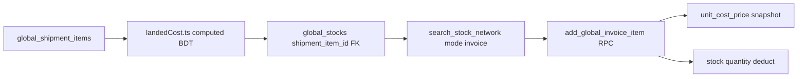
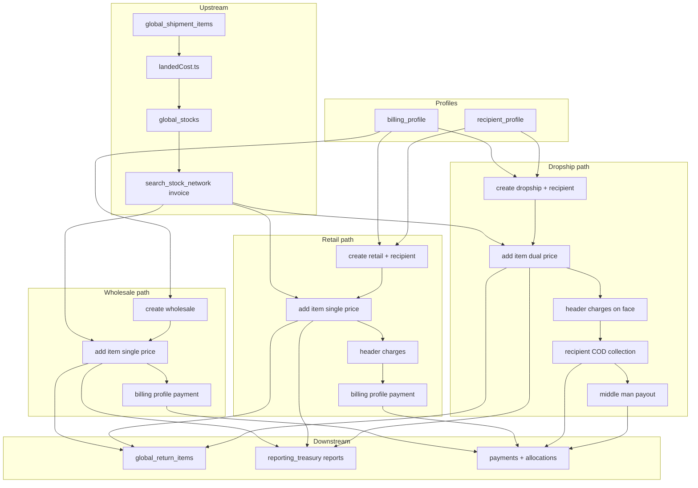
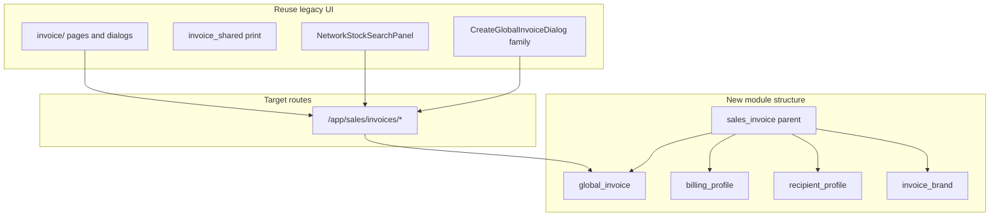

# Sales & Invoice

BrandWala / TradeFlow BD uses a **parent module** for desk sales, customer profiles, and invoice output. Sister concerns (child tenants) issue wholesale, retail, and dropship invoices from parent-owned stock. Billing profiles identify the financial account; recipient profiles identify the delivery endpoint. All sales channels converge on the unified **`global_invoices`** model.

This document answers:

- What is the Sales & Invoice domain and how does it relate to stock, profiles, and payments?
- Which module keys, routes, and tables are used?
- What are the invoice types and business rules (wholesale, retail, dropship)?
- How does stock search work when adding invoice lines?
- Where does line cost come from (shipment item → landed cost)?
- What is the full transaction lifecycle per invoice type?
- How do returns and payments differ by type?
- What is reused from legacy UI vs rebuilt on the backend?
- What is the current schema vs the target redesign?

Related: [MASTER_PLAN.md](MASTER_PLAN.md) (§6.4–6.6, §14 rows 13–17, §16.6–16.9, §17 modules 10–11), [PROCUREMENT_STOCK.md](PROCUREMENT_STOCK.md), [REPORTING_TREASURY.md](REPORTING_TREASURY.md), [TENANT_MODEL_AND_ACCESS.md](TENANT_MODEL_AND_ACCESS.md), [APP_SCOPES_AND_ACCESS.md](APP_SCOPES_AND_ACCESS.md).

---

## 1. Overview

| Property | Desk sales (`global_invoice`) | Shop invoices (`commerce_invoice`) | Legacy (`invoice`) |
|----------|------------------------------|-----------------------------------|-------------------|
| Scope | Child tenant issues desk invoices | Child tenant; generated from commerce orders | Deprecated module key |
| `tenant_id` | Issuing sister concern | Issuing sister concern | Redirects to desk |
| Auth surface | App (`memberships`) | App (`memberships`) | App (redirect) |
| Module gating | `global_invoice` today → `sales_invoice` parent (target) | Separate `commerce_invoice` key | `invoice` → retire |
| Primary UI (today) | `/:slug/app/global/invoices` | `/:slug/app/commerce-shop/invoices` | `/app/invoices/*` → redirect |
| Primary UI (target) | `/:slug/app/sales/invoices` | unchanged | → `sales/invoices` |
| Write target | `global_invoices` | `commerce_invoices` (converge later) | None |

### What this domain is

| Capability | Submodule | Responsibility |
|------------|-----------|----------------|
| Desk sales | `global_invoice` | Wholesale, retail, dropship invoices from parent stock |
| Financial account | `billing_profile` | Buyer, reseller, or dropship middle man — required on every desk invoice |
| Delivery endpoint | `recipient_profile` | End customer address separate from billing (retail/dropship) |
| Print presets | `invoice_brand` *(config, no nav)* | Brand layout for invoice preview and print |
| Returns | *(under `global_invoice`)* | `global_return_items` with dual amounts for dropship |
| Charges | *(under `global_invoice`)* | COD, packing, print, delivery on retail/dropship |
| Shared print | `invoice_shared` *(code, not module)* | Common print sheet for desk and commerce invoices |

### What this domain is not

| Topic | Is not |
|-------|--------|
| **Inbound procurement** | Shipments and stock receive live under `procurement_stock` — this domain only **sells from** stock |
| **Commerce orders** | Order placement is `commerce_order`; shop invoices are generated downstream |
| **Reports & treasury** | Margin reports and payments live under `reporting_treasury` — see [REPORTING_TREASURY.md](REPORTING_TREASURY.md) |
| **Payment collection UI** | Bulk payments and allocation UX live under `accounting` / `global_payments` |
| **Duplicate billing data** | One `billing_profiles` table shared by desk and commerce — not separate catalogs per channel |

### Implementation split

| Layer | Strategy |
|-------|----------|
| **UI** | Reuse legacy invoice pages and components; rewire under `sales_invoice` parent + submodule keys and `/app/sales/*` routes |
| **Backend** | **Fresh start per area** — drop-recreate tables and RPCs (same pattern as PROCUREMENT_STOCK §3); no migration from interim step migrations |

---

## 2. Module hierarchy

**Parent module key (target):** `sales_invoice`  
**Display name:** Sales & Invoice  
**Nav pattern:** Parent group with submodule children (same model as `procurement_stock` and `global_reference`).

| Key | Display name | `parent_module_key` | Nav route (today) | Nav route (target) |
|-----|--------------|---------------------|-------------------|-------------------|
| `sales_invoice` | Sales & Invoice | `null` | *(none — group header)* | *(none — group header)* |
| `global_invoice` | Sales Invoices | `sales_invoice` | `global/invoices` | `sales/invoices` |
| `billing_profile` | Billing Profiles | `sales_invoice` | `global/invoices/billing-profiles` | `sales/invoices/billing-profiles` |
| `recipient_profile` | Recipient Profiles | `sales_invoice` | — | `sales/invoices/recipient-profiles` |
| `invoice_brand` | Invoice Brands | `sales_invoice` | `global/invoices/brands` | `sales/invoices/brands` *(config — no sidebar)* |
| `invoice` | Invoice (Legacy) | `sales_invoice` | redirects | → `sales/invoices` |

Redirect `/app/invoices/*` and `/app/global/invoices/*` → `/app/sales/invoices/*` for bookmarks.

### Cross-referenced (not submodules of `sales_invoice`)

| Key | Domain | Notes |
|-----|--------|-------|
| `commerce_invoice` | Commerce | Shop order invoices; shares `billing_profiles`; converges to `global_invoices` |
| `reporting_treasury` | Reports & Treasury | Parent module — margin reports + payments (see [REPORTING_TREASURY.md](REPORTING_TREASURY.md)) |

### Assignment rules

- Superadmin assigns **`sales_invoice`** on a tenant via `tenant_modules` *(target — today assign `global_invoice` directly)*.
- `get_active_module_keys_for_tenant` expands the parent → enabled submodule keys (the parent key itself is not emitted to route guards).
- Platform can disable individual submodules per tenant via `tenant_module_submodules` without removing the parent.
- Submodule keys cannot be assigned directly — assign the parent (enforced by `create_tenant_module` RPC).
- Each route guard uses its **submodule** key — billing profiles gated by `billing_profile`, not `global_invoice`.

### Tenant eligibility

| Tenant type | `sales_invoice` / `global_invoice` | `billing_profile` | `recipient_profile` |
|-------------|-----------------------------------|---------------------|----------------------|
| Parent company | Optional (rollup read) | Optional | Optional |
| Child (sister concern) | Yes — primary issuer | Yes | Yes |
| Standalone | Yes | Yes | Yes |

**Issuer rule:** Desk invoices are issued by the child `tenant_id`. Parent cannot self-issue via UI. Rollup uses `parent_tenant_id` on invoice rows.

---

## 3. Invoice types summary

Desk invoices support three types. Traditional behavior differs by type; full transaction rules in §5.

| Type | Billing profile role | Recipient | Charges | Collection source |
|------|---------------------|-----------|---------|-------------------|
| **Wholesale** | Bill-to = recipient | Same as profile | None | `billing_profile` |
| **Retail** | Bill-to | Separate delivery party (required) | COD, delivery, print, wrapping | `billing_profile` |
| **Dropship** | Middle man | End customer (required) | Same as retail | `recipient` (COD); payout to middle man |

### Dropship dual totals

| Field | Purpose |
|-------|---------|
| `face_subtotal_amount` | Amount shown to end customer (recipient-facing) |
| `accounting_subtotal_amount` | Amount used for margin and ledger (middle-man accounting) |

Line-level: `sell_price_amount` (accounting), `recipient_price_amount` (dropship face).

### Middle-man settlement

| Field | Notes |
|-------|-------|
| `middle_man_payout_amount` | Amount owed to billing profile (middle man) |
| `middle_man_payout_status` | Settlement tracking |
| `collection_source` | `billing_profile` (wholesale/retail) or `recipient` (dropship COD) |

---

## 4. Stock pick and line cost

Every invoice line is added by **searching sellable stock**, then snapshotting cost from the **shipment item** that created the stock pool.



| Step | Rule |
|------|------|
| Eligibility | Stock from shipments in **Ready Stock** + sellable `global_stock_type` only (see [PROCUREMENT_STOCK.md](PROCUREMENT_STOCK.md) §5.1) |
| Search UI | `NetworkStockSearchPanel` on invoice details; RPC `search_stock_network(context_tenant_id, mode: 'invoice')` |
| Pick order | Child own allocation first; cross-tenant network pick when own slice empty |
| Cost display | Join `global_stocks` → `global_shipment_items` → `global_shipments`; compute BDT unit cost in frontend via `landedCost.ts` |
| Default sell price | UI sets default from computed cost (`GlobalInvoiceDetailsPage` — `onSelectStockRow`) |
| Cost at sale (target) | RPC stores `unit_cost_price` + `shipment_item_id` from joined shipment item landed cost — **immutable snapshot** (D7) |
| Cost today (interim) | Provisional RPC copies `global_stocks.cost` into `cost_amount` — replaced in fresh backend |
| Stock deduct | On add line: decrement stock quantity by `ceil(quantity)` |
| Stock restore | On return: increment same pool (§6) |

**Design principle:** Landed cost lives on the shipment item inputs + `landedCost.ts` formula. Stock rows hold quantity and FKs only — not a cached cost copy (PROCUREMENT_STOCK §5.0).

---

## 5. Invoice transactions by type

Each type follows the same lifecycle stages: **Create → Add items → Charges → Totals → Payment → Return**. Rules below are the **target behavior** (reference: provisional `20260711000000`–`20260711000004` migrations; fresh RPCs implement the same rules).

### 5.1 Wholesale

| Stage | Behavior |
|-------|----------|
| **Create** | `billing_profile_id` required; recipient auto-filled from profile (name, phone, address) |
| **Recipient** | Bill-to = recipient — same party |
| **Add item** | Single price: `sell_price_amount` only; `recipient_price_amount` not used |
| **Charges** | **Not allowed** — wholesale invoices have no COD, delivery, print, or wrapping charges |
| **Totals** | `face_subtotal = accounting_subtotal`; `total_amount = subtotal - discount` |
| **Payment** | `collection_source = billing_profile`; allocate via billing-profile payment RPC |
| **Return** | Face = accounting amounts; optional `return_charge_amount`; stock restored |

Traditional behavior: B2B desk sale to a known billing account. One price, one payer, no surcharges.

### 5.2 Retail

| Stage | Behavior |
|-------|----------|
| **Create** | Billing profile = bill-to; **recipient name required** (separate delivery party); phone/address optional |
| **Recipient** | Delivery party distinct from billing profile |
| **Add item** | Single price: `sell_price_amount`; no dual face price |
| **Charges** | Allowed on header: `delivery`, `cod`, `print`, `packing` (target: inline fields; today: `invoice_charge_lines`) |
| **Totals** | `total = subtotal + charges - discount` |
| **Payment** | `collection_source = billing_profile`; customer pays through billing profile |
| **Return** | Same return RPC as wholesale; reduces billing-profile balance |

Traditional behavior: Sell to end customer but collect from reseller/billing account. Delivery, COD, print, and wrapping appear as invoice charges.

### 5.3 Dropship

| Stage | Behavior |
|-------|----------|
| **Create** | Billing profile = **middle man**; end-customer recipient required; `collection_source = recipient` |
| **Recipient** | End customer — required name; driver uses phone/address |
| **Add item** | **Dual price:** `sell_price_amount` (middle-man accounting) + `recipient_price_amount` (face/COD amount) |
| **Charges** | Same types as retail; added to **face total** (`total_amount`) |
| **Totals** | `accounting_subtotal` from sell prices; `face_subtotal` from recipient prices; `middle_man_payout_amount` = spread `(recipient_price - sell_price) × qty` when not manually overridden |
| **Payment (COD)** | `record_recipient_invoice_collection` — courier/recipient cash; **not** billing-profile payment |
| **Payment (middle man)** | `create_middle_man_payout` — pays middle man their margin against `middle_man_payout_amount` |
| **Print** | Preview shows recipient prices on face document |
| **Return** | Dual amounts: `return_face_amount` and `return_accounting_amount` per unit from line totals |

Traditional behavior: Middle man shows end customer a face-price invoice. Courier collects COD from recipient. Middle man earns spread minus payout to parent.

### 5.4 Type comparison

| Stage | Wholesale | Retail | Dropship |
|-------|-----------|--------|----------|
| Recipient source | Billing profile | Separate party | End customer |
| Line prices | One (`sell_price`) | One (`sell_price`) | Two (`sell_price` + `recipient_price`) |
| Charges | None | Yes | Yes (on face total) |
| Collection | Billing profile | Billing profile | Recipient (COD) |
| Middle-man payout | — | — | Yes |
| Return amounts | Single | Single | Face + accounting split |

---

## 6. Returns

Returns are recorded per invoice line via `add_global_return_item` (target RPC; behavior reference in `20260711000004_global_invoice_returns_step6.sql`).

| Action | Effect |
|--------|--------|
| Validate qty | `0 < return_qty ≤ sold_qty` on line |
| Compute amounts | Per-unit face from `line_face_total_amount / quantity`; per-unit accounting from `line_total_amount / quantity` |
| Insert | `global_return_items` row with `return_face_amount`, `return_accounting_amount`, optional `return_charge_amount` |
| Stock | Restore stock quantity to the same `global_stock_id` pool |
| Invoice | Reduce `subtotal_amount` (accounting) and `total_amount` (face + charge); recompute totals and payment status |

### Returns by invoice type

| Type | Face return | Accounting return | Balance impact |
|------|-------------|-------------------|----------------|
| Wholesale | = accounting | Same | Reduces amount due from billing profile |
| Retail | = accounting | Same | Reduces billing-profile balance |
| Dropship | Recipient-facing | Middle-man books | COD collection and payout rebalanced |

Optional `return_charge_amount` (restocking/handling) reduces the credit given to the customer on the face total.

---

## 7. Payments and settlement

| Flow | RPC (target name) | Applies to |
|------|-------------------|------------|
| Billing profile payment + allocation | `create_billing_profile_payment_with_allocations` | Wholesale, retail |
| Recipient COD collection | `record_recipient_invoice_collection` | Dropship only |
| Middle-man payout | `create_middle_man_payout` | Dropship only |
| Status recompute | `recompute_global_invoice_payment_status` | All — `due` / `partially_paid` / `paid` |

**Dropship rule:** Billing-profile payment allocation is **rejected** when `collection_source = recipient`. COD must use recipient collection RPC.

**Wholesale/retail rule:** Payments attach to `billing_profile_id` and allocate slices to `global_invoice_id` rows.

**Target payments model:** `global_payments` + `invoice_payments` with `unallocated_amount` (MASTER_PLAN §16.10–16.11) — fresh implementation, not patch of legacy `payment_allocations`.

---

## 8. End-to-end business flow



---

## 9. Fresh start — drop and recreate (backend)

Implementation uses **target schema and RPCs only**. There is **no data migration** from legacy `invoices` / `invoice_items` or from interim `20260711*_global_invoice_*` step migrations.

When a migration creates objects that share a name with an existing table or RPC:

1. **Drop dependents first** (FK order) or use `CASCADE` in a controlled migration.
2. **Recreate** with the schema documented in §10.
3. **Do not dual-write** to old and new tables (locked decision **D1**).

### Backend areas — fresh start each

| Area | Action |
|------|--------|
| **Billing profiles** | Keep `billing_profiles` table shape (stable); refresh RLS/grants under `billing_profile` submodule |
| **Recipient profiles** | **Create** `recipient_profiles` clean — no `business_parties` migration |
| **Invoice core** | Drop-recreate `global_invoices`, `global_invoice_items` with `recipient_profile_id`, `shipment_item_id`, `unit_cost_price`, inline header charges |
| **Returns** | Drop-recreate `global_return_items` + return RPC with face/accounting split built-in |
| **Charges** | Inline on `global_invoices` header — drop `invoice_charge_lines`; wholesale never stores charges |
| **Payments** | Fresh `global_payments` / `invoice_payments` or clean rewrite of allocation RPCs |
| **RPCs per type** | Transactional RPCs designed for wholesale, retail, dropship — not layered step1→step6 patches |

### Objects to replace

| Object | Action |
|--------|--------|
| `global_invoices`, `global_invoice_items` | `DROP … CASCADE` → recreate per §10 |
| `global_return_items` | Drop → recreate with dual-amount columns |
| `invoice_charge_lines` | Drop — charges inline on header |
| Invoice RPCs (`create_*`, `add_*`, `return_*`, `payment_*`, `recompute_*`) | Drop → rewrite in one migration set |
| `20260711*_global_invoice_*` step migrations | **Provisional** — superseded by fresh migration |

### Objects to keep (stable)

| Object | Reason |
|--------|--------|
| `billing_profiles` | Stable shape; shared with commerce |
| `invoice_brands` | Print presets — reuse as-is |
| Legacy `invoices` | Separate stack until B7 drop — not wired to new RPCs |

### Drop order (reference)

```text
1. Drop invoice RPCs (create, add_item, return, payment, totals)
2. Drop global_return_items, invoice_charge_lines
3. DROP global_invoice_items CASCADE
4. DROP global_invoices CASCADE
5. CREATE recipient_profiles
6. RECREATE global_invoices / global_invoice_items (target schema)
7. RECREATE returns, payments, RLS, grants
8. No dual-write to legacy invoices table (D1)
```

**Cost in new RPCs:** On add line, join `global_stocks.shipment_item_id` → `global_shipment_items` + shipment header rates; compute landed cost; store `unit_cost_price` + `shipment_item_id` on the line at sale.

---

## 10. Data schema

### 10.1 Billing profile — `billing_profiles` [stable]

| Field | Type | Notes |
|-------|------|-------|
| `id` | bigint PK | |
| `tenant_id` | bigint FK | Child tenant owner |
| `name`, `phone`, `email`, `address` | text | |
| `color` | text | UI accent |
| `customer_group_id` | bigint FK nullable | Pricing tier link |

Shared by desk and commerce billing UIs. Submodule key: `billing_profile`.

### 10.2 Recipient profile — `recipient_profiles` [target — fresh create]

| Field | Type | Notes |
|-------|------|-------|
| `id` | bigint PK | |
| `tenant_id` | bigint FK | Child tenant owner |
| `name` | text | End consumer |
| `address` | text | Delivery address |
| `phone` | text | Driver coordination |

**Interim (to drop):** Inline snapshots on `global_invoices` and `business_parties` / `recipient_party_id`.

**Target:** `recipient_profile_id` FK on `global_invoices`; snapshots retained at issue time for audit.

### 10.3 Global invoice — `global_invoices` [target]

| Field | Notes |
|-------|-------|
| `tenant_id`, `parent_tenant_id` | Issuer and rollup |
| `invoice_no`, `invoice_type`, `invoice_date` | `wholesale` \| `retail` \| `dropship` |
| `billing_profile_id` | Required FK |
| `recipient_profile_id` | FK (target); snapshots: `recipient_name`, `recipient_phone`, `recipient_address` |
| `collection_source` | `billing_profile` \| `recipient` |
| `payment_status`, `total_amount`, `due_amount`, `paid_amount` | Balance |
| `subtotal_amount`, `discount_amount` | Accounting subtotal |
| `face_subtotal_amount`, `accounting_subtotal_amount` | Dropship dual subtotals |
| `middle_man_payout_amount`, `middle_man_payout_status` | Dropship settlement |
| `shipping_charge`, `cod_charge`, `courier_collected_amount`, `wrapping_charge` | Inline header charges (replaces `invoice_charge_lines`) |

### 10.4 Invoice items — `global_invoice_items` [target]

| Field | Notes |
|-------|-------|
| `invoice_id`, `global_stock_id` | FK |
| `shipment_item_id` | Batch traceability — cost source |
| `name_snapshot`, `quantity` | |
| `unit_cost_price` | Immutable landed-cost snapshot at sale (from shipment item via `landedCost.ts`) |
| `sell_price_amount` | Accounting sell price |
| `recipient_price_amount` | Dropship face price |
| `line_discount_amount`, `line_total_amount`, `line_face_total_amount` | |
| `return_quantity` | Cumulative returned qty |

### 10.5 Return items — `global_return_items` [target]

| Field | Notes |
|-------|-------|
| `invoice_id`, `invoice_item_id`, `global_stock_id` | FK |
| `quantity` | |
| `return_face_amount`, `return_accounting_amount` | Dual amounts |
| `return_charge_amount` | Optional handling fee |

### 10.6 Invoice brands — `invoice_brands` [stable]

Print layout presets. Submodule `invoice_brand` — config only, no sidebar link.

### 10.7 Current vs target mapping

| Entity today | Target | Action |
|--------------|--------|--------|
| `business_parties` / inline recipient | `recipient_profiles` | Fresh create + FK |
| `invoice_charge_lines` | Inline on `global_invoices` | Drop charge-lines table |
| `global_stocks.cost` on add item | `unit_cost_price` from shipment item | Fresh RPC |
| `20260711*_global_invoice_*` RPCs | Single fresh RPC set | Drop and rewrite |
| `commerce_invoices` | `global_invoices` | Converge at Step 9+ |
| Legacy `invoices` | `global_invoices` | Fresh insert only; drop legacy (B7) |

---

## 11. Commerce convergence

`commerce_invoice` remains a **separate module** and nav family (`commerce-shop/invoices`). It is not a submodule of `sales_invoice`.

| Aspect | Today | Target |
|--------|-------|--------|
| Table | `commerce_invoices` | Converge to `global_invoices` |
| Billing profiles | Shared `billing_profiles` | Same |
| Print | `invoice_shared` | Same |
| Generation | Auto from `commerce_orders` | Desk + commerce on unified model |

All channels use the same billing profile catalog and align to **`global_invoices`** as the write target.

---

## 12. Permissions

| module_key | superadmin | admin | staff | viewer |
|------------|------------|-------|-------|--------|
| `global_invoice` | view | view | view | — |
| `billing_profile` *(target)* | inherit parent | inherit | inherit | — |
| `recipient_profile` *(target)* | inherit parent | inherit | inherit | — |
| `commerce_invoice` | — | view | view | — |
| `invoice` (legacy) | view | view | view | — |

Target submodule keys get explicit rows in `modulePermissions.ts` when extracted from parent.

---

## 13. UI surfaces

| Surface | Path (today) | Path (target) | Submodule key |
|---------|--------------|---------------|---------------|
| Sales Invoices list | `/:slug/app/global/invoices` | `/:slug/app/sales/invoices` | `global_invoice` |
| Invoice details | `/:slug/app/global/invoices/:id` | `/:slug/app/sales/invoices/:id` | `global_invoice` |
| Print preview | `/:slug/app/global/invoices/:id/preview` | `/:slug/app/sales/invoices/:id/preview` | `global_invoice` |
| Billing Profiles | `/:slug/app/global/invoices/billing-profiles` | `/:slug/app/sales/invoices/billing-profiles` | `billing_profile` |
| Recipient Profiles | — | `/:slug/app/sales/invoices/recipient-profiles` | `recipient_profile` |
| Invoice Brands | `/:slug/app/global/invoices/brands` | `/:slug/app/sales/invoices/brands` | `invoice_brand` |
| Legacy redirect | `/app/invoices/*` | → `sales/invoices` | `invoice` |
| Global redirect | `/app/global/invoices/*` | → `sales/invoices` | — |
| Shop Invoices (related) | `/:slug/app/commerce-shop/invoices` | unchanged | `commerce_invoice` |

**Sidebar (target):** **Sales & Invoice** group under `sales_invoice` — same pattern as Procurement & Stock.

---

## 14. UI reuse and module wiring

**Strategy:** Reuse legacy invoice UI; update module/submodule keys, routes, and data layer only.



| UI surface | Reuse from | Target submodule | Notes |
|------------|------------|------------------|-------|
| Invoice list | `AdminInvoicePage` or `GlobalInvoicesPage` | `global_invoice` | Wire to fresh repository |
| Invoice details | `AdminInvoiceDetailsPage` / `GlobalInvoiceDetailsPage` | `global_invoice` | Stock pick, charges, payments, returns |
| Print preview | `AdminInvoicePreviewPage` / `GlobalInvoicePreviewPage` | `global_invoice` | Type-aware face prices |
| Billing profiles | `AdminBillingProfilesPage` + dialogs | `billing_profile` | Submodule guard |
| Recipient profiles | New page (same patterns as billing) | `recipient_profile` | CRUD + picker on create |
| Invoice brands | `AdminInvoiceBrandsPage` | `invoice_brand` | Config only |
| Create wholesale/retail/dropship | `CreateGlobalInvoiceDialog`, `CreateRetailInvoiceDialog`, `CreateDropshipInvoiceDialog` | `global_invoice` | Type set at create; immutable after |

**Data layer:** Point reused Vue pages at new repositories/RPCs after backend fresh start — **UI layout unchanged** where possible.

**Module registry:** Add `sales_invoice` parent; set `parent_module_key` on submodules; update `routeSegment` to `sales/invoices/*`.

---

## 15. Upstream and downstream

### Upstream

| Module | Integration |
|--------|-------------|
| `global_stock` / `inventory` | Pick sellable stock via `search_stock_network` mode `invoice`; reduce qty on sale; increase on return |
| `procurement_stock` | Stock from **Ready Stock** shipments only; cost from `global_shipment_items` + `landedCost.ts` |

### Downstream

| Module | Integration |
|--------|-------------|
| `reporting_treasury` | Margin reports (read invoice/shipment tables); payments and AR — see [REPORTING_TREASURY.md](REPORTING_TREASURY.md) |

---

## 16. Legacy keys

| Legacy key / object | Status | Notes |
|---------------------|--------|-------|
| `invoice` module key | Retire | Redirects → `sales/invoices` |
| `invoices`, `invoice_items` tables | Drop | Fresh insert on `global_invoices` only |
| `business_parties` | Replace | `recipient_profiles` |
| `invoice_charge_lines` | Drop | Inline header charges |
| `20260711*_global_invoice_*` | Provisional | Superseded by fresh migration set |
| `/app/global/invoices/*` routes | Redirect | → `/app/sales/invoices/*` |

---

## 17. Implementation phases

| Phase | Deliverable | Status |
|-------|-------------|--------|
| **P0 — Documentation** | This file | Current |
| **P1 — Module hierarchy** | `sales_invoice` seeder, registry, nav, `/app/sales/*` routes + redirects | Planned |
| **P2 — Fresh backend** | `recipient_profiles` + drop-recreate invoice tables | Planned |
| **P3 — Fresh RPCs** | Create / add item / return / payment per type + `unit_cost_price` from shipment item | Planned |
| **P4 — Wire UI** | Reuse legacy pages; submodule guards; new repositories | Planned |
| **P5 — Commerce convergence** | Shop invoices → `global_invoices` | Future |

---

## 18. Code references

| Area | Path |
|------|------|
| Legacy invoice UI (reuse) | `web/src/modules/invoice/pages/`, `web/src/modules/invoice/components/` |
| Global invoice UI (reuse) | `web/src/modules/global/pages/`, `web/src/modules/global/components/Create*InvoiceDialog.vue` |
| Stock pick panel | `web/src/modules/global/components/NetworkStockSearchPanel.vue` |
| Print shared layer | `web/src/modules/invoice_shared/components/InvoicePrintSheet.vue` |
| Landed cost formula | `web/src/modules/procurement_stock/utils/landedCost.ts` |
| Store / repository (today) | `web/src/modules/global/stores/globalInvoiceStore.ts`, `globalRepository.ts` |
| Legacy routes (redirects) | `web/src/modules/invoice/routes/index.ts` |
| Global routes (today) | `web/src/modules/global/routes/index.ts` |
| Module registry | `web/src/modules/navigation/moduleRegistry.ts` |
| Permissions | `web/src/modules/navigation/modulePermissions.ts` |
| Provisional RPCs (behavior reference) | `supabase/migrations/20260711000000_global_invoice_billing_profile_step1.sql` through `20260711000004_global_invoice_returns_step6.sql` |
| Initial invoice schema | `supabase/migrations/20260709000300_b4_global_invoices.sql` |

---

## 19. Locked decisions (this domain)

| # | Topic | Decision |
|---|-------|----------|
| D1 | Write model | Global tables only; no dual-write to legacy `invoices` |
| D7 | Cost at sale | `unit_cost_price` snapshot from shipment-item landed cost on invoice line at sale only |
| D9 | Billing vs recipient | Separate profiles — essential for dropship |
| D-SI1 | Parent module | `sales_invoice` + invoice / billing / recipient / brand submodules |
| D-SI2 | Issuer | Child tenant issues desk invoices; parent rollup via `parent_tenant_id` |
| D-SI3 | Invoice types | `wholesale`, `retail`, `dropship` — collection source differs by type |
| D-SI4 | Shared billing | One `billing_profiles` table for desk and commerce |
| D-SI5 | Commerce | Separate module today; converges to `global_invoices` later |
| D-SI6 | Print | `invoice_shared` component; `invoice_brands` presets |
| D-SI7 | Stock pick | Cross-tenant network pick when own allocation empty (`mode: invoice`) |
| D-SI8 | Charges | Inline header fields; drop `invoice_charge_lines` |
| D-SI9 | Wholesale charges | Wholesale invoices cannot have charge lines |
| D-SI10 | Line cost source | Shipment item landed cost via `landedCost.ts`; snapshot at sale only |
| D-SI11 | Collection | Dropship from recipient; wholesale/retail from billing profile |
| D-SI12 | Returns | Restore stock; face/accounting split for dropship |
| D-SI13 | UI reuse | Legacy invoice pages/components; new `sales_invoice` parent + submodule routes |
| D-SI14 | Backend fresh start | Drop-recreate per area; no migration from interim global invoice stack |
| D-SI15 | Routes | Target `/app/sales/*`; redirect `/app/invoices/*` and `/app/global/invoices/*` |
