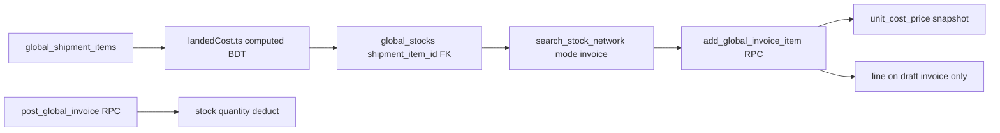
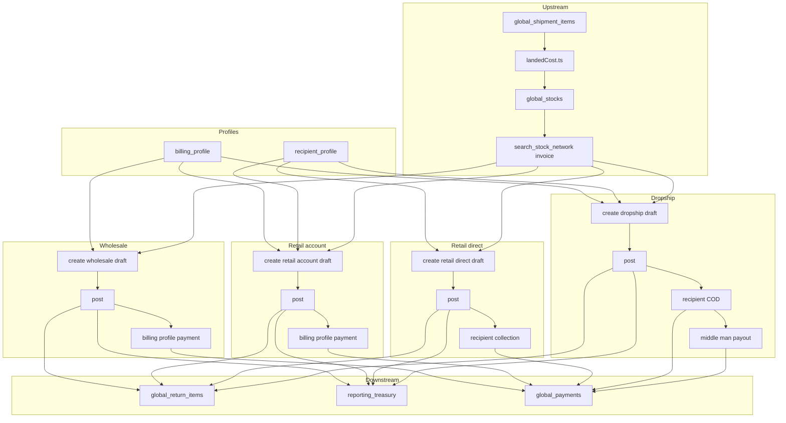

# Sales & Invoice

BrandWala / TradeFlow BD uses a **parent module** for desk sales, customer profiles, and invoice output. Sister concerns (child tenants) issue wholesale, retail, and dropship invoices from parent-owned stock. Billing profiles identify the financial account for wholesale and account-based retail; recipient profiles identify the delivery endpoint. **Desk sales are the only invoice issuance path** — all types write to **`global_invoices`**. End-customer direct sales (no billing account) use **retail direct**.

Related: [MASTER_PLAN.md](MASTER_PLAN.md) (§6.4–6.6, §14 rows 13–17, §16.6–16.9, §17 modules 10–11), [PROCUREMENT_STOCK.md](PROCUREMENT_STOCK.md), [REPORTING_TREASURY.md](REPORTING_TREASURY.md), [SHOP_ORDER.md](SHOP_ORDER.md), [SHOP_ORDER_DROPSHIP.md](SHOP_ORDER_DROPSHIP.md) (shop-originated dropship Process Order → dual invoice), [TENANT_MODEL_AND_ACCESS.md](TENANT_MODEL_AND_ACCESS.md), [APP_SCOPES_AND_ACCESS.md](APP_SCOPES_AND_ACCESS.md).

---

## User stories

### Parent — `sales_invoice` (Sales & Invoice)

**As a** child-tenant admin or staff member,  
**I want** one nav group for desk sales, customer profiles, and invoice printing,  
**So that** I can sell from parent stock, manage buyers and delivery parties, and hand off collections to finance — without mixing procurement.

---

### Submodule — `global_invoice` (Sales Invoices)

**As a** desk salesperson at a sister concern,  
**I want to** create and post invoices from sellable parent stock,  
**So that** stock, margin, and payment balances stay correct for every sale type.

| Invoice type | User story |
|--------------|------------|
| **Wholesale** | **As a** desk salesperson, **I want to** sell to a known billing account (buyer = recipient) at one price with optional credit terms, **so that** I can run the main B2B business and collect via the buyer's account balance. |
| **Retail — account** | **As a** desk salesperson, **I want to** sell to an end customer (or ship to a different address) but bill and collect from a regular reseller or account, **so that** delivery/COD/print charges appear on the invoice while AR stays on the account. |
| **Retail — direct** | **As a** desk salesperson, **I want to** sell once to a walk-in or one-time customer without creating a billing profile, **so that** the customer receives goods and pays me directly (cash or COD) without polluting the account catalog. |
| **Dropship** | **As a** desk salesperson, **I want to** sell through a middle man at a face price to the end customer, **so that** the courier collects COD from the recipient, I track accounting margin separately, and settle the middle man's payout. Shop-originated dropship (Process Order → Create Dual Invoice) is specified in [SHOP_ORDER_DROPSHIP.md](SHOP_ORDER_DROPSHIP.md). |

**Shared invoice capabilities:**

- **Draft → post → void** — build an invoice before committing stock; void mistakes when unpaid.
- **Returns** — partial or full line returns with stock restore.
- **Fulfillment tracking** — packed / shipped / delivered (operational only; does not change margin).
- **Immutable prices after post** — `unit_cost_price` and sell prices are accounting snapshots.

---

### Submodule — `billing_profile` (Billing Profiles)

**As a** desk or finance user,  
**I want to** maintain buyer, reseller, and dropship middle-man accounts,  
**So that** wholesale and account-based retail can attach payments, credit balances, and pricing tiers to a stable financial identity.

**Required for:** wholesale (always), retail account mode, dropship (middle man).  
**Not required for:** retail direct (one-time customer).  
**Scope:** Profiles belong to the **issuing child tenant** only — see §2 Profile ownership.

---

### Submodule — `recipient_profile` (Recipient Profiles)

**As a** desk salesperson,  
**I want to** save and reuse delivery parties (end customers),  
**So that** retail and dropship invoices can pick a recipient quickly and snapshot name/phone/address at issue time.

**Used for:** retail (account and direct), dropship. Optional on create — inline snapshots always stored for audit.  
**Scope:** Same child tenant as the invoice — not shared across sister concerns (§2).

---

### Submodule — `invoice_brand` (Invoice Brands)

**As a** tenant admin,  
**I want to** configure print layout presets,  
**So that** invoice preview and print match our brand without per-invoice design work.

Config only — no sidebar link.

---

This document answers:

- What is the Sales & Invoice domain and how does it relate to stock, profiles, and payments?
- Which module keys, routes, and tables are used?
- What are the invoice types and business rules (wholesale, retail account/direct, dropship)?
- How does invoice lifecycle (draft / posted / voided) interact with stock and accounting?
- How does stock search work when adding invoice lines?
- Where does line cost come from (shipment item → landed cost)?
- What is the full transaction lifecycle per invoice type?
- How do returns and payments differ by type?
- What is reused from legacy UI vs rebuilt on the backend?
- What is the current schema vs the target redesign?

---

## 1. Overview

| Property | Desk sales (`global_invoice`) |
|----------|------------------------------|
| Scope | Child tenant issues desk invoices from parent stock |
| `tenant_id` | Issuing sister concern |
| Auth surface | App (`memberships`) |
| Module gating | `global_invoice` submodule under `sales_invoice` parent |
| Primary UI (target) | `/:slug/app/sales/invoices` |
| Write target | `global_invoices` |

### What this domain is

| Capability | Submodule | Responsibility |
|------------|-----------|----------------|
| Desk sales | `global_invoice` | Wholesale, retail (account + direct), dropship from parent stock |
| Financial account | `billing_profile` | Buyer, reseller, or dropship middle man — required on wholesale, retail account, and dropship |
| Delivery endpoint | `recipient_profile` | End customer / delivery party for retail and dropship |
| Print presets | `invoice_brand` *(config, no nav)* | Brand layout for invoice preview and print |
| Returns | *(under `global_invoice`)* | `global_return_items` with dual amounts for dropship |
| Charges | *(under `global_invoice`)* | COD, packing, print, delivery on retail/dropship; optional shipping on wholesale |
| Shared print | `invoice_shared` *(code, not module)* | Common print sheet for desk invoices |

### What this domain is not

| Topic | Is not |
|-------|--------|
| **Inbound procurement** | Shipments and stock receive live under `procurement_stock` — this domain only **sells from** stock |
| **Reports & treasury** | Margin reports and payments live under `reporting_treasury` — see [REPORTING_TREASURY.md](REPORTING_TREASURY.md) |
| **Payment collection UI** | Bulk payments and allocation UX live under `reporting_treasury` / `global_payments` |
| **Online shop / cart** | Lives under `shop_order` — see [SHOP_ORDER.md](SHOP_ORDER.md); desk **retail direct** remains on `global_invoices` |
| **Statutory accounting** | No chart of accounts or GAAP books — operational invoices + cash only |

### Implementation split

| Layer | Strategy |
|-------|----------|
| **UI** | Reuse legacy invoice pages and components; rewire under `sales_invoice` parent + submodule keys and `/app/sales/*` routes |
| **Backend** | **Fresh start per area** — drop-recreate tables and RPCs (same pattern as PROCUREMENT_STOCK §3); no migration from interim step migrations |

---

## 2. Module hierarchy

**Parent module key (target):** `sales_invoice`  
**Display name:** Sales & Invoice  
**Nav pattern:** Parent group with submodule children (same model as `procurement_stock` and `global_reference`).

| Key | Display name | `parent_module_key` | Nav route (today) | Nav route (target) |
|-----|--------------|---------------------|-------------------|-------------------|
| `sales_invoice` | Sales & Invoice | `null` | *(none — group header)* | *(none — group header)* |
| `global_invoice` | Sales Invoices | `sales_invoice` | `global/invoices` | `sales/invoices` |
| `billing_profile` | Billing Profiles | `sales_invoice` | `global/invoices/billing-profiles` | `sales/invoices/billing-profiles` |
| `recipient_profile` | Recipient Profiles | `sales_invoice` | — | `sales/invoices/recipient-profiles` |
| `invoice_brand` | Invoice Brands | `sales_invoice` | `global/invoices/brands` | `sales/invoices/brands` *(config — no sidebar)* |
| `invoice` | Invoice (Legacy) | `sales_invoice` | redirects | → `sales/invoices` |

Redirect `/app/invoices/*` and `/app/global/invoices/*` → `/app/sales/invoices/*` for bookmarks.

### Cross-referenced (not submodules of `sales_invoice`)

| Key | Domain | Notes |
|-----|--------|-------|
| `reporting_treasury` | Reports & Treasury | Parent module — margin reports + payments (see [REPORTING_TREASURY.md](REPORTING_TREASURY.md)) |

### Assignment rules

- Superadmin assigns **`sales_invoice`** on a tenant via `tenant_modules` *(target — today assign `global_invoice` directly)*.
- `get_active_module_keys_for_tenant` expands the parent → enabled submodule keys (the parent key itself is not emitted to route guards).
- Platform can disable individual submodules per tenant via `tenant_module_submodules` without removing the parent.
- Submodule keys cannot be assigned directly — assign the parent (enforced by `create_tenant_module` RPC).
- Each route guard uses its **submodule** key — billing profiles gated by `billing_profile`, not `global_invoice`.

### Tenant eligibility

| Tenant type | `sales_invoice` / `global_invoice` | `billing_profile` | `recipient_profile` |
|-------------|-----------------------------------|---------------------|----------------------|
| Parent company | Optional (rollup read) | Optional | Optional |
| Child (sister concern) | Yes — primary issuer | Yes | Yes |
| Standalone | Yes | Yes | Yes |

**Issuer rule:** Desk invoices are issued by the child `tenant_id`. Parent cannot self-issue via UI. Rollup uses `parent_tenant_id` on invoice rows.

### Profile ownership (billing & recipient)

`billing_profiles` and `recipient_profiles` are **child-tenant catalogs** — not parent-owned and **not shared** across sister concerns.

| Question | Answer |
|----------|--------|
| Who owns a profile row? | The **child tenant** (`tenant_id` on the profile) |
| Is there one catalog for the whole group? | **No** — each sister concern has its own billing and recipient lists |
| Can Child A use Child B's billing profile on an invoice? | **No** — profile `tenant_id` must match invoice `tenant_id` (issuing child) |
| Does the parent company maintain profiles? | **Optional** module only; desk sales CRUD is on **child** tenants. Parent rollup reads invoices via `parent_tenant_id`, not a merged profile directory |
| Same buyer on two children | **Two separate profile rows** (different `id`, different `tenant_id`) — not one shared account |

**Contrast with stock:** Parent owns `global_stocks` (shared pool). Child owns **customer identity** catalogs (bill-to and ship-to). Stock is group-pooled; profiles are per sister concern.

**RPC validation (target):** On create/post invoice, reject `billing_profile_id` or `recipient_profile_id` when `profile.tenant_id <> invoice.tenant_id`.

**Retail direct:** No `billing_profile_id`. Optional `recipient_profile_id` still follows the same child `tenant_id` rule when linked.

See [TENANT_MODEL_AND_ACCESS.md](TENANT_MODEL_AND_ACCESS.md) for parent vs child data ownership.

Desk invoices support **three types**. Retail has **two billing modes** (`account` | `direct`). Type and retail mode are set at create and immutable after.

| Type | Billing profile | Recipient | Charges | Collection source |
|------|-----------------|-----------|---------|-------------------|
| **Wholesale** | Required — bill-to = recipient | Same as profile | Optional `shipping_charge` only | `billing_profile` |
| **Retail — account** | Required — bill-to account | Delivery party (required; may differ from bill-to) | COD, delivery, print, wrapping | `billing_profile` |
| **Retail — direct** | **Not used** (`null`) | Customer = recipient (required) | Same as retail account | `recipient` |
| **Dropship** | Required — middle man | End customer (required) | Same as retail; on face total | `recipient` (COD) + middle-man payout |

### Retail billing mode

| Field | Values | Notes |
|-------|--------|-------|
| `retail_billing_mode` | `account` \| `direct` | Set only when `invoice_type = retail`; null otherwise |

### Dropship dual totals

| Field | Purpose |
|-------|---------|
| `face_subtotal_amount` | Amount shown to end customer (recipient-facing) |
| `accounting_subtotal_amount` | Amount used for margin and ledger (middle-man accounting) |

Line-level: `sell_price_amount` (accounting), `recipient_price_amount` (dropship face).

### Collection and settlement

| Field | Notes |
|-------|-------|
| `collection_source` | `billing_profile` (wholesale, retail account) or `recipient` (retail direct, dropship COD) |
| `middle_man_payout_amount` | Dropship only — amount owed to billing profile (middle man) |
| `middle_man_payout_status` | Dropship settlement tracking |

### Invoice lifecycle (all types)

| `invoice_status` | Stock | In margin reports | AR / collection |
|------------------|-------|-------------------|-----------------|
| `draft` | Not deducted | No | No |
| `posted` | Deducted on post | Yes | Yes |
| `voided` | Restored if was posted | No | Cleared if unpaid |

---

## 4. Stock pick and line cost

Every invoice line is added by **searching sellable stock**, then snapshotting cost from the **shipment item** that created the stock pool.



| Step | Rule |
|------|------|
| Eligibility | Stock from shipments in **Ready Stock** + sellable `global_stock_type` only (see [PROCUREMENT_STOCK.md](PROCUREMENT_STOCK.md) §5.1) |
| Search UI | `NetworkStockSearchPanel` on invoice details; RPC `search_stock_network(context_tenant_id, mode: 'invoice')` |
| Pick order | Child own allocation first; cross-tenant network pick when own slice empty |
| Cost display | Join `global_stocks` → `global_shipment_items` → `global_shipments`; compute BDT unit cost in frontend via `landedCost.ts` |
| Default sell price | UI suggests from computed cost; if billing profile has `customer_group_id`, suggest tier price (user may override) |
| Cost at sale | RPC stores `unit_cost_price` + `shipment_item_id` on post — **immutable snapshot** (D7) |
| Stock deduct | On **post** (`invoice_status` → `posted`): decrement stock by `ceil(quantity)` per line |
| Stock restore | On return or void: increment same pool |
| Draft edits | Lines may be added/removed while `invoice_status = draft` |
| Posted immutability | After post: block price/qty edits; only returns or void (if unpaid) |

**Design principle:** Landed cost lives on the shipment item inputs + `landedCost.ts` formula. Stock rows hold quantity and FKs only — not a cached cost copy (PROCUREMENT_STOCK §5.0).

---

## 5. Invoice transactions by type

Each type follows: **Create → Add items (draft) → Charges → Post → Payment → Return**. Void is available for unpaid posted invoices.

### 5.1 Wholesale

| Stage | Behavior |
|-------|----------|
| **Create** | `billing_profile_id` required; `retail_billing_mode` null; recipient auto-filled from profile; optional `due_date` for credit terms |
| **Recipient** | Bill-to = recipient — same party |
| **Add item** | Single price: `sell_price_amount` only; `recipient_price_amount` not used |
| **Charges** | Optional **`shipping_charge` only** — no COD, print, or wrapping on wholesale |
| **Post** | `post_global_invoice` — stock deduct, snapshots locked |
| **Totals** | `face_subtotal = accounting_subtotal`; `total_amount = subtotal + shipping_charge - discount` |
| **Payment** | `collection_source = billing_profile`; allocate via billing-profile payment RPC |
| **Return** | Face = accounting amounts; optional `return_charge_amount`; stock restored |
| **Void** | Allowed if `paid_amount = 0`; restore stock; exclude from reports |

Traditional behavior: B2B desk sale to a known billing account. One price, one payer. Credit sales use `due_date` + partial payments.

### 5.2 Retail — account mode

| Stage | Behavior |
|-------|----------|
| **Create** | `retail_billing_mode = account`; `billing_profile_id` required; recipient name required; optional `due_date` |
| **Recipient** | Delivery party — may differ from billing profile (reseller scenario) or match (regular retail account) |
| **Add item** | Single price: `sell_price_amount` |
| **Charges** | Header: `delivery`, `cod`, `print`, `packing` / `wrapping` |
| **Post** | Stock deduct; snapshots locked |
| **Totals** | `total = subtotal + charges - discount` |
| **Payment** | `collection_source = billing_profile` |
| **Return** | Single amounts; reduces billing-profile balance |
| **Void** | Same as wholesale |

Traditional behavior: Sell to end customer but collect from reseller or regular account. Charges on invoice; AR on billing profile.

### 5.3 Retail — direct mode

| Stage | Behavior |
|-------|----------|
| **Create** | `retail_billing_mode = direct`; `billing_profile_id` null; recipient required; `collection_source = recipient` |
| **Recipient** | Customer = delivery party; optional `recipient_profile_id` or inline snapshots |
| **Add item** | Single price: `sell_price_amount` |
| **Charges** | Same as retail account |
| **Post** | Stock deduct; snapshots locked |
| **Totals** | `total = subtotal + charges - discount` |
| **Payment** | `record_recipient_invoice_collection` — cash/COD from customer; **not** billing-profile payment |
| **Return** | Single amounts; rebalances invoice `due_amount` |
| **Void** | Same as wholesale |

Traditional behavior: One-time or walk-in sale. No billing catalog entry. Customer pays directly.

Optional UX: **Save as recipient profile** after create for repeat delivery addresses — not required.

### 5.4 Dropship

| Stage | Behavior |
|-------|----------|
| **Create** | `billing_profile_id` = middle man; end-customer recipient required; `collection_source = recipient` |
| **Recipient** | End customer — required name; driver uses phone/address |
| **Add item** | **Dual price:** `sell_price_amount` (accounting) + `recipient_price_amount` (face/COD) |
| **Charges** | Same types as retail; added to **face total** (`total_amount`) |
| **Post** | Stock deduct; snapshots locked |
| **Totals** | `accounting_subtotal` from sell prices; `face_subtotal` from recipient prices; `middle_man_payout_amount` = spread `(recipient_price - sell_price) × qty` when not overridden |
| **Payment (COD)** | `record_recipient_invoice_collection` — courier/recipient cash |
| **Payment (middle man)** | `create_middle_man_payout` — pays middle man against `middle_man_payout_amount` |
| **Courier reconcile** | `courier_collected_amount` when courier remits (may differ from expected COD) |
| **Print** | Preview shows recipient prices on face document |
| **Return** | Dual amounts: `return_face_amount` and `return_accounting_amount` |
| **Void** | Same as wholesale (reverse COD collections first if any) |

Traditional behavior: Middle man shows end customer a face-price invoice. Courier collects COD. Middle man earns spread minus payout to parent.

### 5.5 Fulfillment (operational — all types)

| `fulfillment_status` | Meaning |
|----------------------|---------|
| `pending` | Default on post |
| `packed` | Ready for courier |
| `shipped` | Handed to courier |
| `delivered` | Confirmed delivery |

Does **not** affect stock, margin, `due_amount`, or payment RPCs. For desk/courier workflow only.

### 5.6 Type comparison

| Stage | Wholesale | Retail account | Retail direct | Dropship |
|-------|-----------|----------------|---------------|----------|
| Billing profile | Required | Required | Null | Required (middle man) |
| Recipient | = profile | Separate or same | = customer | End customer |
| Line prices | One | One | One | Two |
| Charges | Shipping only | Full set | Full set | Full set (on face) |
| Collection | Billing profile | Billing profile | Recipient | Recipient + payout |
| Middle-man payout | — | — | — | Yes |
| Return amounts | Single | Single | Single | Face + accounting |
| AR report | Billing balance | Billing balance | Invoice balance | Invoice + payout |

---

## 6. Void and immutability

### Void — `void_global_invoice`

| Rule | Behavior |
|------|----------|
| Eligibility | `invoice_status = posted` and `paid_amount = 0` (or reverse collections/payments first) |
| Stock | Restore all line quantities to original `global_stock_id` pools |
| Header | `invoice_status = voided`; `due_amount = 0` |
| Reports | Excluded — filter `WHERE invoice_status = 'posted'` |

Use void for mistaken invoices. Use **returns** for partial credit after a valid sale.

### Immutability after post

| Field group | After `posted` | After any payment |
|-------------|----------------|-------------------|
| Line prices, qty | Locked | Locked |
| Header charges, discount | Locked | Locked |
| `settlement_discount_amount` | Editable while `due_amount > 0` (write-off) | Editable while `due_amount > 0` |
| Void | Allowed if unpaid | Blocked until payments reversed |
| Returns | Allowed | Allowed |
| `fulfillment_status` | Editable | Editable |

**Settlement discount (D-SI22):** `settlement_discount_amount` is the one field that may change after post. It is a write-off applied at collection time when the customer settles for less than billed (e.g. billed 123.44, pays 100 → settle 23.44). It reduces `total_amount` and `due_amount` (never below the paid amount), flipping `payment_status` to `paid`, while `subtotal_amount` and line prices keep the original invoiced snapshot. RPC: `apply_global_invoice_settlement_discount(p_invoice_id, p_amount, p_note)` — posted only, `p_amount ≤ due_amount`.

---

## 7. Returns

Returns are recorded per invoice line via `add_global_return_item` on **posted** invoices only.

| Action | Effect |
|--------|--------|
| Validate qty | `0 < return_qty ≤ sold_qty` on line |
| Compute amounts | Per-unit face from `line_face_total_amount / quantity`; per-unit accounting from `line_total_amount / quantity` |
| Insert | `global_return_items` row with `return_face_amount`, `return_accounting_amount`, optional `return_charge_amount` |
| Stock | Restore stock quantity to the same `global_stock_id` pool |
| Invoice | Reduce subtotals and `total_amount`; recompute `due_amount` and `payment_status` |

### Returns by invoice type

| Type | Face return | Accounting return | Balance impact |
|------|-------------|-------------------|----------------|
| Wholesale | = accounting | Same | Reduces billing-profile due |
| Retail account | = accounting | Same | Reduces billing-profile due |
| Retail direct | = accounting | Same | Reduces invoice `due_amount` |
| Dropship | Recipient-facing | Middle-man books | COD collection and payout rebalanced |

Optional `return_charge_amount` (restocking/handling) reduces credit on the face total.

---

## 8. Payments and settlement

| Flow | RPC (target name) | Applies to |
|------|-------------------|------------|
| Post invoice | `post_global_invoice` | All — draft → posted, stock deduct |
| Void invoice | `void_global_invoice` | All — posted → voided when unpaid |
| Billing profile payment + allocation | `create_billing_profile_payment_with_allocations` | Wholesale, retail account |
| Recipient collection (COD / cash) | `record_recipient_invoice_collection` | Retail direct, dropship |
| Settlement discount / write-off | `apply_global_invoice_settlement_discount` | All — closes remaining `due_amount` as a discount |
| Middle-man payout | `create_middle_man_payout` | Dropship only |
| Status recompute | `recompute_global_invoice_payment_status` | All — `due` / `partially_paid` / `paid` |

**Collection rules:**

- `collection_source = recipient` — reject billing-profile payment allocation; use recipient collection RPC. This RPC now writes a real `global_payments` transaction (`billing_profile_id = null`, `collection_source = 'recipient'`, `unallocated_amount = 0`) plus a linking `invoice_payments` row, and accepts an editable `p_payment_date` + `p_method`. So dropship/retail-direct cash surfaces in the treasury Payments list and reconciles to the invoice (`paid_amount` bumped once — no double count).
- `collection_source = billing_profile` — payments attach to `billing_profile_id` and allocate to invoices.
- `global_payments` may include `payment_method_id` (cash, bank, mobile wallet) — treasury only; does not change margin.

**COD / courier reconciliation (retail direct + dropship):**

| Field | Purpose |
|-------|---------|
| Expected total | `total_amount` (face total for dropship; accounting total for retail direct) |
| Collections | Sum of `record_recipient_invoice_collection` amounts |
| `courier_collected_amount` | Actual remittance from courier (short/over pay) |
| Variance | Report column: `courier_collected_amount - collections` — reconciliation only, not a second invoice |

**Target payments model:** `global_payments` + `invoice_payments` with `unallocated_amount` (MASTER_PLAN §16.10–16.11).

See [REPORTING_TREASURY.md](REPORTING_TREASURY.md) for margin formulas and balance reports.

---

## 9. End-to-end business flow



---

## 10. Fresh start — drop and recreate (backend)

Implementation uses **target schema and RPCs only**. There is **no data migration** from legacy `invoices` / `invoice_items` or from interim `20260711*_global_invoice_*` step migrations.

When a migration creates objects that share a name with an existing table or RPC:

1. **Drop dependents first** (FK order) or use `CASCADE` in a controlled migration.
2. **Recreate** with the schema documented in §11.
3. **Do not dual-write** to old and new tables (locked decision **D1**).

### Backend areas — fresh start each

| Area | Action |
|------|--------|
| **Billing profiles** | Keep `billing_profiles` table shape (stable); refresh RLS/grants under `billing_profile` submodule |
| **Recipient profiles** | **Create** `recipient_profiles` clean — no `business_parties` migration |
| **Invoice core** | Drop-recreate `global_invoices`, `global_invoice_items` with lifecycle, retail mode, nullable billing FK, fulfillment |
| **Returns** | Drop-recreate `global_return_items` + return RPC with face/accounting split built-in |
| **Charges** | Inline on `global_invoices` header — drop `invoice_charge_lines` |
| **Payments** | Fresh `global_payments` / `invoice_payments` + post/void/collection RPCs |
| **RPCs per type** | Transactional RPCs for wholesale, retail account/direct, dropship — single migration set |

### Objects to replace

| Object | Action |
|--------|--------|
| `global_invoices`, `global_invoice_items` | `DROP … CASCADE` → recreate per §11 |
| `global_return_items` | Drop → recreate with dual-amount columns |
| `invoice_charge_lines` | Drop — charges inline on header |
| Invoice RPCs (`create_*`, `add_*`, `post_*`, `void_*`, `return_*`, `payment_*`, `recompute_*`) | Drop → rewrite in one migration set |
| `20260711*_global_invoice_*` step migrations | **Provisional** — superseded by fresh migration |

### Objects to keep (stable)

| Object | Reason |
|--------|--------|
| `billing_profiles` | Stable shape; desk sales buyer accounts |
| `invoice_brands` | Print presets — reuse as-is |
| Legacy `invoices` | Separate stack until B7 drop — not wired to new RPCs |

### Drop order (reference)

```text
1. Drop invoice RPCs (create, add_item, post, void, return, payment, totals)
2. Drop global_return_items, invoice_charge_lines
3. DROP global_invoice_items CASCADE
4. DROP global_invoices CASCADE
5. CREATE recipient_profiles
6. RECREATE global_invoices / global_invoice_items (target schema)
7. RECREATE returns, payments, RLS, grants
8. No dual-write to legacy invoices table (D1)
```

**Cost in new RPCs:** On post, join `global_stocks.shipment_item_id` → `global_shipment_items` + shipment header rates; compute landed cost; store `unit_cost_price` + `shipment_item_id` on each line.

---

## 11. Data schema

### 11.1 Billing profile — `billing_profiles` [stable]

| Field | Type | Notes |
|-------|------|-------|
| `id` | bigint PK | |
| `tenant_id` | bigint FK | **Child tenant owner** — not parent; not shared across sister concerns |
| `name`, `phone`, `email`, `address` | text | |
| `color` | text | UI accent |
| `customer_group_id` | bigint FK nullable | Pricing tier — UI suggests default sell price on add line |

Desk sales buyer / middle-man accounts for one sister concern. Submodule key: `billing_profile`. Uniqueness: PK `id` is global; catalog is scoped by `tenant_id` (same buyer name on two children = two rows).

### 11.2 Recipient profile — `recipient_profiles` [target — fresh create]

| Field | Type | Notes |
|-------|------|-------|
| `id` | bigint PK | |
| `tenant_id` | bigint FK | **Child tenant owner** — not parent; not shared across sister concerns |
| `name` | text | End consumer |
| `address` | text | Delivery address |
| `phone` | text | Driver coordination |

Delivery-party catalog for one sister concern. `recipient_profile_id` on `global_invoices` is optional; snapshots retained at post time for audit. Profile `tenant_id` must match invoice `tenant_id`.

### 11.3 Global invoice — `global_invoices` [target]

| Field | Notes |
|-------|-------|
| `tenant_id`, `parent_tenant_id` | Issuer (`tenant_id` = child) and parent rollup (`parent_tenant_id`) |
| `invoice_no`, `invoice_type`, `invoice_date` | `wholesale` \| `retail` \| `dropship` |
| `retail_billing_mode` | `account` \| `direct` — retail only; null otherwise |
| `invoice_status` | `draft` \| `posted` \| `voided` |
| `fulfillment_status` | `pending` \| `packed` \| `shipped` \| `delivered` — ops only |
| `billing_profile_id` | FK — required wholesale/dropship/retail account; **null** retail direct; must match invoice `tenant_id` |
| `recipient_profile_id` | FK optional; must match invoice `tenant_id` when set; snapshots: `recipient_name`, `recipient_phone`, `recipient_address` |
| `collection_source` | `billing_profile` \| `recipient` |
| `due_date` | Optional — wholesale and retail account credit terms |
| `payment_status`, `total_amount`, `due_amount`, `paid_amount` | Balance |
| `subtotal_amount`, `discount_amount` | Accounting subtotal |
| `face_subtotal_amount`, `accounting_subtotal_amount` | Dropship dual subtotals |
| `middle_man_payout_amount`, `middle_man_payout_status` | Dropship settlement |
| `shipping_charge`, `cod_charge`, `courier_collected_amount`, `wrapping_charge`, `print_charge` | Inline header charges |

### 11.4 Invoice items — `global_invoice_items` [target]

| Field | Notes |
|-------|-------|
| `invoice_id`, `global_stock_id` | FK |
| `shipment_item_id` | Batch traceability — cost source |
| `name_snapshot`, `quantity` | |
| `unit_cost_price` | Immutable landed-cost snapshot at post (from shipment item via `landedCost.ts`) |
| `sell_price_amount` | Accounting sell price |
| `recipient_price_amount` | Dropship face price |
| `line_discount_amount`, `line_total_amount`, `line_face_total_amount` | |
| `return_quantity` | Cumulative returned qty |

### 11.5 Return items — `global_return_items` [target]

| Field | Notes |
|-------|-------|
| `invoice_id`, `invoice_item_id`, `global_stock_id` | FK |
| `quantity` | |
| `return_face_amount`, `return_accounting_amount` | Dual amounts (dropship); equal for other types |
| `return_charge_amount` | Optional handling fee |

### 11.6 Invoice brands — `invoice_brands` [stable]

Print layout presets. Submodule `invoice_brand` — config only, no sidebar link.

### 11.7 Current vs target mapping

| Entity today | Target | Action |
|--------------|--------|--------|
| `business_parties` / inline recipient | `recipient_profiles` | Fresh create + FK |
| `invoice_charge_lines` | Inline on `global_invoices` | Drop charge-lines table |
| Stock deduct on add line | Stock deduct on post | Change RPC lifecycle |
| `20260711*_global_invoice_*` RPCs | Single fresh RPC set | Drop and rewrite |

---

## 12. Permissions

| module_key | superadmin | admin | staff | viewer |
|------------|------------|-------|-------|--------|
| `global_invoice` | view | view | view | — |
| `billing_profile` *(target)* | inherit parent | inherit | inherit | — |
| `recipient_profile` *(target)* | inherit parent | inherit | inherit | — |
| `invoice` (legacy) | view | view | view | — |

Target submodule keys get explicit rows in `modulePermissions.ts` when extracted from parent.

---

## 13. UI surfaces

| Surface | Path (today) | Path (target) | Submodule key |
|---------|--------------|---------------|---------------|
| Sales Invoices list | `/:slug/app/global/invoices` | `/:slug/app/sales/invoices` | `global_invoice` |
| Invoice details | `/:slug/app/global/invoices/:id` | `/:slug/app/sales/invoices/:id` | `global_invoice` |
| Print preview | `/:slug/app/global/invoices/:id/preview` | `/:slug/app/sales/invoices/:id/preview` | `global_invoice` |
| Billing Profiles | `/:slug/app/global/invoices/billing-profiles` | `/:slug/app/sales/invoices/billing-profiles` | `billing_profile` |
| Recipient Profiles | — | `/:slug/app/sales/invoices/recipient-profiles` | `recipient_profile` |
| Invoice Brands | `/:slug/app/global/invoices/brands` | `/:slug/app/sales/invoices/brands` | `invoice_brand` |
| Legacy redirect | `/app/invoices/*` | → `sales/invoices` | `invoice` |
| Global redirect | `/app/global/invoices/*` | → `sales/invoices` | — |

**Sidebar (target):** **Sales & Invoice** group under `sales_invoice` — same pattern as Procurement & Stock.

---

## 14. UI reuse and module wiring

**Strategy:** Reuse legacy invoice UI; update module/submodule keys, routes, and data layer only.

| UI surface | Reuse from | Target submodule | Notes |
|------------|------------|------------------|-------|
| Invoice list | `AdminInvoicePage` or `GlobalInvoicesPage` | `global_invoice` | Wire to fresh repository |
| Invoice details | `AdminInvoiceDetailsPage` / `GlobalInvoiceDetailsPage` | `global_invoice` | Draft/post, stock pick, charges, payments, returns, fulfillment |
| Print preview | `AdminInvoicePreviewPage` / `GlobalInvoicePreviewPage` | `global_invoice` | Type-aware face prices |
| Billing profiles | `AdminBillingProfilesPage` + dialogs | `billing_profile` | Submodule guard |
| Recipient profiles | New page (same patterns as billing) | `recipient_profile` | CRUD + picker on create |
| Invoice brands | `AdminInvoiceBrandsPage` | `invoice_brand` | Config only |
| Create wholesale | `CreateGlobalInvoiceDialog` | `global_invoice` | Type + immutable after create |
| Create retail | `CreateRetailInvoiceDialog` | `global_invoice` | Billing mode toggle: account vs direct |
| Create dropship | `CreateDropshipInvoiceDialog` | `global_invoice` | Type immutable after create |

**Data layer:** Point reused Vue pages at new repositories/RPCs after backend fresh start.

**Module registry:** Add `sales_invoice` parent; set `parent_module_key` on submodules; update `routeSegment` to `sales/invoices/*`.

---

## 15. Upstream and downstream

### Upstream

| Module | Integration |
|--------|-------------|
| `global_stock` / `inventory` | Pick sellable stock via `search_stock_network` mode `invoice`; reduce qty on post; increase on return/void |
| `procurement_stock` | Stock from **Ready Stock** shipments only; cost from `global_shipment_items` + `landedCost.ts` |

### Downstream

| Module | Integration |
|--------|-------------|
| `reporting_treasury` | Margin reports (posted invoices only); payments, billing balances, invoice-level AR for retail direct — see [REPORTING_TREASURY.md](REPORTING_TREASURY.md) |

---

## 16. Legacy keys

| Legacy key / object | Status | Notes |
|---------------------|--------|-------|
| `invoice` module key | Retire | Redirects → `sales/invoices` |
| `invoices`, `invoice_items` tables | Drop | Fresh insert on `global_invoices` only |
| `business_parties` | Replace | `recipient_profiles` |
| `invoice_charge_lines` | Drop | Inline header charges |
| `20260711*_global_invoice_*` | Provisional | Superseded by fresh migration set |
| `/app/global/invoices/*` routes | Redirect | → `/app/sales/invoices/*` |

---

## 17. Implementation phases

| Phase | Deliverable | Status |
|-------|-------------|--------|
| **P0 — Documentation** | This file | Current |
| **P1 — Module hierarchy** | `sales_invoice` seeder, registry, nav, `/app/sales/*` routes + redirects | Done |
| **P2 — Fresh backend** | `recipient_profiles` + drop-recreate invoice tables (lifecycle, retail mode) | Done |
| **P3 — Fresh RPCs** | Create / add item / post / void / return / payment per type + `unit_cost_price` on post | Done |
| **P4 — Wire UI** | Desk invoice pages; retail mode toggle; post/void actions; submodule guards | Done |

---

## 18. Code references

| Area | Path |
|------|------|
| Legacy invoice UI (reuse) | `web/src/modules/invoice/pages/`, `web/src/modules/invoice/components/` |
| Global invoice UI (reuse) | `web/src/modules/global/pages/`, `web/src/modules/global/components/Create*InvoiceDialog.vue` |
| Stock pick panel | `web/src/modules/global/components/NetworkStockSearchPanel.vue` |
| Print shared layer | `web/src/modules/invoice_shared/components/InvoicePrintSheet.vue` |
| Landed cost formula | `web/src/modules/procurement_stock/utils/landedCost.ts` |
| Store / repository (today) | `web/src/modules/global/stores/globalInvoiceStore.ts`, `globalRepository.ts` |
| Legacy routes (redirects) | `web/src/modules/invoice/routes/index.ts` |
| Global routes (today) | `web/src/modules/global/routes/index.ts` |
| Module registry | `web/src/modules/navigation/moduleRegistry.ts` |
| Permissions | `web/src/modules/navigation/modulePermissions.ts` |
| Provisional RPCs (behavior reference) | `supabase/migrations/20260711000000_global_invoice_billing_profile_step1.sql` through `20260711000004_global_invoice_returns_step6.sql` |
| Initial invoice schema | `supabase/migrations/20260709000300_b4_global_invoices.sql` |

---

## 19. Locked decisions (this domain)

| # | Topic | Decision |
|---|-------|----------|
| D1 | Write model | Global tables only; no dual-write to legacy `invoices` |
| D7 | Cost at sale | `unit_cost_price` snapshot from shipment-item landed cost on **post** only |
| D9 | Billing vs recipient | Separate profiles — essential for dropship and retail account |
| D-SI1 | Parent module | `sales_invoice` + invoice / billing / recipient / brand submodules |
| D-SI2 | Issuer | Child tenant issues desk invoices; parent rollup via `parent_tenant_id` |
| D-SI3 | Invoice types | `wholesale`, `retail`, `dropship` — three types only |
| D-SI4 | Billing profiles | One `billing_profiles` catalog **per child tenant** — not parent-owned, not shared across sister concerns |
| D-SI5 | Desk-only issuance | All invoices via `global_invoice`; end-customer direct sales use retail direct — no shop invoice module in this domain |
| D-SI6 | Print | `invoice_shared` component; `invoice_brands` presets |
| D-SI7 | Stock pick | Cross-tenant network pick when own allocation empty (`mode: invoice`) |
| D-SI8 | Charges | Inline header fields; drop `invoice_charge_lines` |
| D-SI9 | Wholesale charges | Optional `shipping_charge` only — no COD, print, or wrapping |
| D-SI10 | Line cost source | Shipment item landed cost via `landedCost.ts`; snapshot at post only |
| D-SI11 | Collection | Wholesale + retail account → billing profile; retail direct + dropship COD → recipient |
| D-SI12 | Returns | Restore stock; face/accounting split for dropship only |
| D-SI13 | UI reuse | Legacy invoice pages/components; new `sales_invoice` parent + submodule routes |
| D-SI14 | Backend fresh start | Drop-recreate per area; no migration from interim global invoice stack |
| D-SI15 | Routes | Target `/app/sales/*`; redirect `/app/invoices/*` and `/app/global/invoices/*` |
| D-SI16 | Retail billing mode | `account` (billing profile required) or `direct` (no profile; recipient pays) |
| D-SI17 | Invoice lifecycle | `draft` → `posted` → `voided`; stock deduct on post; reports use posted only |
| D-SI18 | Immutability | Line prices and charges locked after post; void only when unpaid |
| D-SI19 | Fulfillment | `fulfillment_status` is operational — does not affect margin or AR |
| D-SI20 | Courier reconcile | `courier_collected_amount` for COD variance reporting — not a second invoice |
| D-SI21 | Profile ownership | `billing_profiles` and `recipient_profiles` owned by child `tenant_id`; invoice FKs must match issuing child; no parent-wide shared catalog |
| D-SI22 | Settlement discount | Post-post write-off via `settlement_discount_amount`; reduces `total_amount`/`due_amount` to close AR, keeps line/subtotal snapshot; net of discount in Shipment P&L (wholesale/retail; dropship face discount excluded) |
