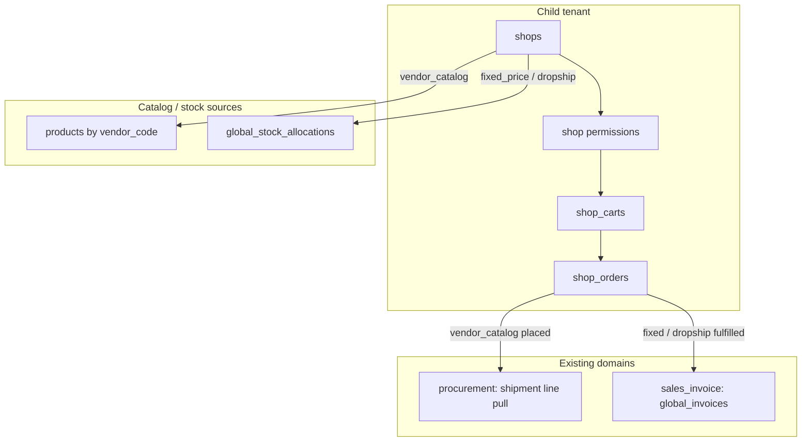
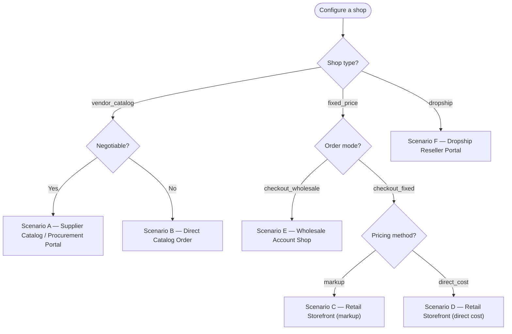
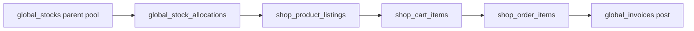
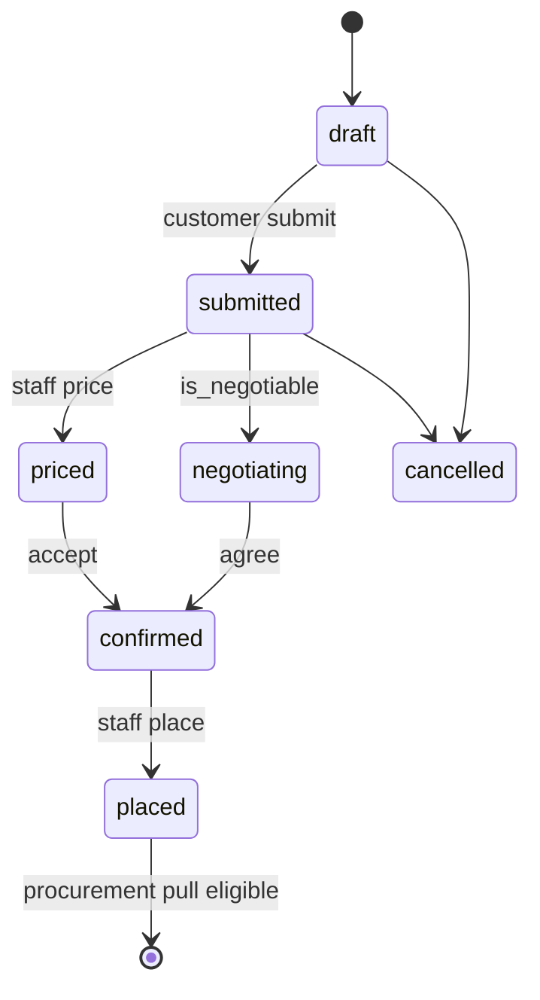
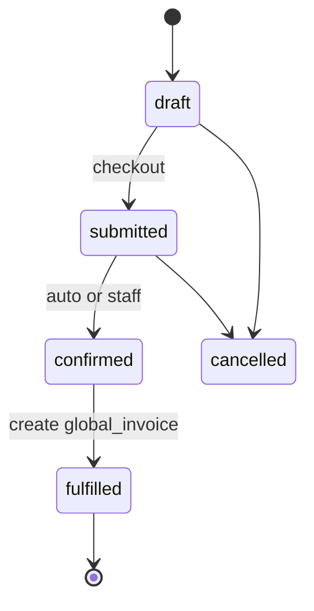

# Shop & Order

BrandWala / TradeFlow BD uses a **parent module** for customer-facing storefronts: shop configuration, carts, and orders. **Child tenants** (sister concerns) create and own their shops. Stock-backed shops sell only from **`global_stock_allocations`** assigned to that child. Vendor-catalog shops expose supplier assortment for procurement intent. Fulfillment converges on existing global domains — procurement pull or **`global_invoices`** — not a parallel commerce ledger.

This document is written as a **reusable domain pattern**: shop types, two-layer customer permissions, multi-currency amounts, and display-vs-sellable quantity are applicable beyond this codebase whenever a B2B portal must serve multiple catalog modes from shared inventory.

Related: [MASTER_PLAN.md](MASTER_PLAN.md), [PROCUREMENT_STOCK.md](PROCUREMENT_STOCK.md), [SALES_INVOICE.md](SALES_INVOICE.md), [SHOP_ORDER_DROPSHIP.md](SHOP_ORDER_DROPSHIP.md) (dropship Process Order + dual invoice), [GLOBAL_REFERENCE_DATA.md](GLOBAL_REFERENCE_DATA.md), [TENANT_MODEL_AND_ACCESS.md](TENANT_MODEL_AND_ACCESS.md), [APP_SCOPES_AND_ACCESS.md](APP_SCOPES_AND_ACCESS.md).

---

## User stories

### Parent — `shop_order` (Shop & Order)

**As a** child-tenant admin,  
**I want** one nav group for shops, customer-group permissions, pricing, carts, and orders,  
**So that** each customer segment gets the right catalog, checkout rules, and fulfillment path — without mixing desk sales or parent procurement.

---

### Submodule — `shop_config` (Shops)

**As a** child-tenant admin,  
**I want to** create shops under my tenant and choose type plus order behaviour,  
**So that** I run vendor catalogs, fixed-price storefronts, or dropship portals independently.

| Shop type | User story |
|-----------|------------|
| **Vendor catalog** | **As an** admin, **I want to** link a shop to a `vendor_code` and show that vendor's available products, **so that** buyers place procurement intent (bulk or small MOQ) with optional price visibility per group. |
| **Fixed price** | **As an** admin, **I want to** list allocated stock lines with a sell price and choose whether customers see quantity, **so that** I sell from my tenant slice at a fixed checkout price. |
| **Dropship** | **As an** admin, **I want to** set sell price and minimum sell price per allocated line, **so that** drop shippers cannot undercut the floor while choosing their customer-facing price. |

---

### Submodule — `shop_permissions` (Customer group access)

**As a** child-tenant admin,  
**I want to** define default shop capabilities per customer group and override them per shop,  
**So that** one group negotiates and sees prices while another only browses and requests quotes.

---

### Submodule — `shop_storefront` (Storefront)

**As a** customer group member,  
**I want to** see only shops my group can access, with prices and quantities governed by my permissions,  
**So that** I get the right experience on each storefront.

---

### Submodule — `shop_cart` (Cart)

**As a** customer,  
**I want to** maintain a cart per shop with soft stock reservation on stock-backed shops,  
**So that** I can build an order before submitting without overselling allocated inventory.

---

### Submodule — `shop_order_mgmt` (Orders)

**As a** customer negotiator,  
**I want to** submit negotiable orders and exchange offers with staff,  
**So that** we agree on price before procurement placement.

**As a** customer staff member,  
**I want to** checkout at the displayed sell price without negotiation,  
**So that** fixed-price and dropship orders complete quickly.

**As an** internal staff member,  
**I want to** review, price, negotiate, approve, or cancel shop orders,  
**So that** only confirmed lines enter shipment pull or invoicing.

---

### Submodule — `shop_fulfillment` (Fulfillment)

**As a** staff user,  
**I want to** convert a placed vendor-catalog order into procurement lines or a stock-backed order into a desk invoice,  
**So that** stock, margin, and payments stay on the global stack.

---

### Submodule — `shop_dropship` (Dropship Orders)

**As a** child-tenant admin or staff member,  
**I want** a dedicated Dropship Orders desk (Process Order → courier → Create Dual Invoice → returns / payout),  
**So that** dropship ops stay separate from vendor-catalog and fixed-price fulfillment.

Full design: [SHOP_ORDER_DROPSHIP.md](SHOP_ORDER_DROPSHIP.md).

---

This document answers:

- What is the Shop & Order domain and how does it relate to stock, products, and invoices?
- Which module keys, routes, and tables are used?
- What are the shop types and order modes?
- How do child-owned shops consume allocated stock?
- How does the two-layer customer permission model work?
- How is multi-currency pricing modeled on products and shop lines?
- How do display quantity and sellable quantity differ?
- What is reused from legacy vs rebuilt fresh?
- What is the implementation phase order?

---

## 1. Overview

| Property | Shop & Order |
|----------|--------------|
| Scope | Child tenant (or standalone) owns shops; parent allocates stock |
| `tenant_id` | Issuing sister concern on all `shop_*` rows |
| Auth surface | App (`memberships`) for config; Shop (`customer_group_members`) for browse/cart/order |
| Module gating | `shop_order` parent + submodules |
| Primary UI (target) | App: `/:slug/app/shop/*` — Shop: `/:slug/shop/*` |
| Write target | `shop_*` tables only (fresh stack) |

### What this domain is

| Capability | Submodule | Responsibility |
|------------|-----------|----------------|
| Shop setup | `shop_config` | Create shops, type, order mode, stock display defaults |
| Group permissions | `shop_permissions` | Tenant-wide group profiles + per-shop access grants |
| Shop pricing | `shop_pricing` | Listings, sell/min prices, display quantity override |
| Storefront | `shop_storefront` | Customer browse with permission-masked fields |
| Cart | `shop_cart` | Per-shop cart, reservations against allocations |
| Orders | `shop_order_mgmt` | Place, negotiate, approve, cancel |
| Fulfillment | `shop_fulfillment` | Procurement pull or `global_invoice` handoff (fixed / vendor paths) |
| Dropship ops | `shop_dropship` | Process Order, consignment, dual invoice, return bearer, payout ledger — [SHOP_ORDER_DROPSHIP.md](SHOP_ORDER_DROPSHIP.md) |

### What this domain is not

| Topic | Is not |
|-------|--------|
| **Desk sales** | Staff invoice UI lives under `sales_invoice` — shop fulfillment **calls into** `global_invoices` |
| **Inbound procurement** | Parent shipments live under `procurement_stock` — vendor-catalog orders are **inputs** to pull, not creators of shipments |
| **Physical stock ownership** | Child does not own `global_stocks` — only `global_stock_allocations` slices |
| **Separate commerce ledger** | No `commerce_accounting` stack — payments follow [REPORTING_TREASURY.md](REPORTING_TREASURY.md) on desk invoices |
| **Legacy shop tables** | No FK to `stores`, `carts`, `orders`, `commerce_*` — concept reuse only |
| **Koba / Thrift** | Isolated verticals — out of scope for `shop_order` v1 |

### Reusable design patterns (portable beyond BrandWala)

| Pattern | Where used | Why reusable |
|---------|------------|--------------|
| **Shop type enum** | `vendor_catalog` \| `fixed_price` \| `dropship` | Any B2B portal mixing catalog browse, fixed checkout, and partner pricing |
| **Two-layer permissions** | Profile defaults + per-resource overrides | Standard RBAC for customer groups without role explosion |
| **Amount + currency FK** | Products, listings, cart snapshots, order lines | ISO-style money without hard-coded column names (`price_gbp`) |
| **Allocation-backed listing** | Fixed + dropship | Tenant slice of shared inventory — applies to any hub-and-spoke stock model |
| **Display vs sellable qty** | `display_quantity_override` vs `available_to_sell` | Marketing buffer without breaking inventory caps |
| **Order mode matrix** | Shop type × `order_mode` × `is_negotiable` | Same cart, different checkout semantics |
| **Fresh tables + legacy UI borrow** | Backend new, frontend patterns from legacy browsers | Safe migration without dual-write |

### End-to-end flow



### Implementation split

| Layer | Strategy |
|-------|----------|
| **Backend** | **Fresh start** — new `shop_*` tables and RPCs; no FK to legacy shop/order/commerce tables (same pattern as [PROCUREMENT_STOCK.md](PROCUREMENT_STOCK.md) §3) |
| **UI** | Reuse UX patterns from legacy `StoreProductsBrowser`, `CommerceStoreProductsBrowser`, order negotiation pages — rewire to new repositories only |
| **Products** | **Migrate in place** — replace `price_gbp` with amount + `global_currencies` FK (prerequisite phase) |

---

## 1a. Gap Analysis & Legacy Negotiation Analysis

Before starting the full-scale implementation of shop order negotiation features, a gap analysis was performed comparing the legacy `brand-wala-wholesale` project against the new architecture in `brandwala-wholesale-quasar-v2`.

### Legacy Negotiation Issues (`brand-wala-wholesale`)
1. **Lack of Shop Configurations**: Legacy had no `shops` or `stores` table/collection concept. All orders were placed directly under a `market_id` and `vendor_id`. Consequently, there was no way to customize features (such as toggling negotiation status, setting currencies, or choosing pricing methods) per storefront.
2. **Rigid Transition Lifecycle**: The status flow (`submitted -> priced -> under_review -> finalized -> ordered`) locked down customer inputs once the order entered `under_review` (the "Negotiate" phase). During this phase, the customer's UI became read-only, preventing any iterative back-and-forth negotiation loops.
3. **Hardcoded Currency Assumptions**: Pricing and offers were hardcoded as BDT (Bangladeshi Taka) for sales and GBP (British Pound) for purchase cost, with no option to modify the transaction currencies per vendor or shop.
4. **No Customer Profile Controls**: There were no profile-based negotiation flags or overrides. Customer capabilities were determined solely by hardcoded roles.

### Current Implementation Gaps in `brandwala-wholesale-quasar-v2`
1. **Shop Currency Settings**: The `shops` table contains only a single `default_currency_id`. It lacks explicit dual-currency configurations (Buy currency vs. Sell currency) and does not enforce the rule that negotiations happen in the Sell currency.
2. **Retail Price Configurations**: There is no database setting or UI configuration allowing admins to decide whether the displayed retail price should use direct cost or a markup percentage. Toggling stock quantity display (original vs. override custom quantity) is also missing.
3. **Dropship Floor Price Validation**: Although the `shop_product_listings` table contains `minimum_sell_price_amount`, the storefront and cart validation rules are missing checks to prevent reseller listings from falling below the minimum sell price.
4. **Bilingual Info ("I") Button**: In both the shop create and edit dialogs (`ShopFormDialog.vue`), the help tooltip modal does not detail the new pricing configurations, currency settings, or negotiation options in both Bangla and English.

---

## 2. Module hierarchy

**Parent module key (target):** `shop_order`  
**Display name:** Shop & Order  
**Nav pattern:** Parent group with submodule children (same model as `procurement_stock`, `sales_invoice`, `global_reference`).

| Key | Display name | `parent_module_key` | Scope | Nav route (target) |
|-----|--------------|---------------------|-------|-------------------|
| `shop_order` | Shop & Order | `null` | — | *(group header)* |
| `shop_config` | Shops | `shop_order` | app | `shop/shops` |
| `shop_permissions` | Customer Access | `shop_order` | app | `shop/customer-groups` |
| `shop_pricing` | Shop Pricing | `shop_order` | app | `shop/shops/:id/pricing` |
| `shop_storefront` | Storefront | `shop_order` | shop | `shop/browse/:shopSlug` |
| `shop_cart` | Cart | `shop_order` | shop | `shop/cart` |
| `shop_order_mgmt` | Orders | `shop_order` | app + shop | `shop/orders`, `app/shop/orders` |
| `shop_fulfillment` | Fulfillment | `shop_order` | app | `app/shop/orders/:id` |
| `shop_dropship` | Dropship Orders | `shop_order` | app | `shop/dropship`, `app/shop/dropship` |

Redirect legacy routes when cut over:

- `/shop/stores` → `/shop/browse`
- `/app/store/*`, `/app/commerce/*` → `/app/shop/*` (per-tenant flag)

### Assignment rules

- Superadmin assigns **`shop_order`** on a tenant via `tenant_modules`.
- `get_active_module_keys_for_tenant` expands parent → enabled submodule keys.
- Platform can disable individual submodules via `tenant_module_submodules`.
- Submodule keys gate nav/pages; cross-module list RPCs (currencies, stock search) remain available where RLS allows.

### Tenant eligibility

| Tenant type | `shop_order` | Who creates shops |
|-------------|--------------|-------------------|
| Parent company | No (by default) | Parent does **not** create child storefronts |
| Child (sister concern) | Yes | Child `admin` / `staff` |
| Standalone | Yes | Tenant `admin` / `staff` |

**Ownership rule (D-SH9):** `shops.tenant_id` = the operating child (or standalone). Parent only **allocates** stock via `global_stock_allocations`; it does not own shop rows.

### Legacy keys (transition)

| Legacy key | Status | Replaced by |
|------------|--------|-------------|
| `store` | Retire | `shop_config` + `shop_storefront` |
| `cart` | Retire | `shop_cart` |
| `order_management` | Retire | `shop_order_mgmt` (vendor path) |
| `commerce_shop` | Retire | `shop_config` + `shop_pricing` |
| `commerce_cart` | Retire | `shop_cart` |
| `commerce_order` | Retire | `shop_order_mgmt` |
| `commerce_invoice` | Retire | Fulfillment → `global_invoices` |
| `commerce_accounting` | Retire | `reporting_treasury` on desk invoices |

Enable `shop_order` on new tenants first; legacy keys stay for existing tenants until cutover.

---

## 3. Shop types and order modes

Shop **type** is set at create and **immutable**. Order **mode** and **negotiation** configure checkout behaviour.

### 3.1 Shop types

| Type | `shop_type` | Catalog source | Stock required | Details / Configurations |
|------|-------------|----------------|----------------|--------------------------|
| **Vendor catalog (Procurement)** | `vendor_catalog` | `products` where `vendor_code = shops.vendor_code` and `is_available` | No | Catalog ordering when product is not present. Order negotiable toggle is set based on the user profile for the shop. If negotiable, full negotiation flow is supported. |
| **Fixed price (Retail)** | `fixed_price` | `shop_product_listings` → `global_stock_allocations` | Yes | Stock-backed. Admin configures display selling price (Direct Cost vs. Markup) and quantity display option (Original Quantity vs. Custom Override). |
| **Dropship** | `dropship` | Same as fixed price | Yes | Reseller storefront. Shows suggested sell price and minimum sell price (floor price constraint) that the reseller must sell at. |

### 3.2 Order modes

| Mode | `order_mode` | Typical shop types | Customer experience |
|------|--------------|-------------------|---------------------|
| **Procurement intent** | `procurement_intent` | `vendor_catalog` | Quote / negotiate → staff places for parent shipment pull |
| **Fixed checkout** | `checkout_fixed` | `fixed_price`, `dropship` | Cart → confirm → invoice |
| **Wholesale checkout** | `checkout_wholesale` | `fixed_price` (optional) | Account-based wholesale invoice path |

### 3.3 Negotiation flag

| Field | Rule |
|-------|------|
| `shops.is_negotiable` | When `true`, order may enter `negotiating` status |
| Effective negotiate | `is_negotiable` **and** `effective(can_negotiate)` from permissions **and** `order_mode` allows it |
| Dropship | `is_negotiable` must be `false` (enforced by check constraint) |

### 3.4 Behaviour matrix

| `shop_type` | `order_mode` | `is_negotiable` | Downstream |
|-------------|--------------|-----------------|------------|
| `vendor_catalog` | `procurement_intent` | true | Negotiate → `placed` → procurement pull |
| `vendor_catalog` | `procurement_intent` | false | Staff prices → `confirmed` → `placed` → pull |
| `fixed_price` | `checkout_fixed` | false | `confirmed` → `fulfilled` → `global_invoice` retail |
| `fixed_price` | `checkout_wholesale` | true/false | `global_invoice` wholesale |
| `dropship` | `checkout_fixed` | false | Process Order desk → Create Dual Invoice (`global_invoice` type `dropship`) — [SHOP_ORDER_DROPSHIP.md](SHOP_ORDER_DROPSHIP.md) |

Not every cart produces the same order path — the matrix above is enforced at `submit_shop_order_from_cart`.

### 3.5 Shop Currency Settings

Every shop must configure dual currencies to distinguish origin costing from retail pricing:
1. **Buy Currency** (`buy_currency_id`): The currency in which the product was or will be purchased from suppliers (e.g., GBP, USD). This drives origin costing snapshots.
2. **Sell Currency** (`sell_currency_id` / `default_currency_id`): The currency in which the product will be listed, sold, and checked out (e.g., BDT).
3. **Negotiation Currency Rule**: All counter-offers, negotiations, and pricing agreements must happen in the **Sell Currency** (`sell_currency_id`).

### 3.6 Shop Configuration Examples

Use this section to pick a named real-world configuration without reading the full spec. Each scenario maps a complete set of `shops` field values to a customer experience and downstream order path.

#### Decision tree

Answer three questions in order — **shop type → order mode → negotiable?** — to land on a named scenario.



> **Note:** `vendor_catalog` shops always use `order_mode = procurement_intent`. `dropship` shops always use `order_mode = checkout_fixed` and `is_negotiable = false`.

#### Scenario A — Supplier Catalog / Procurement Portal

| Field | Value |
|-------|-------|
| `shop_type` | `vendor_catalog` |
| `order_mode` | `procurement_intent` |
| `is_negotiable` | `true` |
| `vendor_code` | Required — links catalog to `products.vendor_code` |
| `buy_currency_id` | Supplier origin currency (e.g. GBP, USD) |
| `sell_currency_id` / `default_currency_id` | Customer-facing currency (e.g. BDT) |

**English:** A B2B procurement portal where the customer browses a supplier's catalog for products not yet in local inventory. Customers with the `can_negotiate` permission can counter-offer on line prices; all negotiation happens in the Sell Currency. Once agreed, the order moves to `placed` and staff pull items into a parent shipment.

**বাংলা:** একটি B2B ক্রয় পোর্টাল যেখানে কাস্টমার স্থানীয় স্টকে নেই এমন পণ্যের জন্য সাপ্লায়ারের ক্যাটালগ ব্রাউজ করে। `can_negotiate` পারমিশন থাকলে কাস্টমার লাইন প্রাইসে দরকষাকষি করতে পারে; সমস্ত দরকষাকষি বিক্রয় কারেন্সিতে হয়। চুক্তি হলে অর্ডার `placed` হয় এবং স্টাফ প্যারেন্ট শিপমেন্টে পুল করে।

**Downstream:** Negotiate → `placed` → procurement pull

#### Scenario B — Direct Catalog Order

| Field | Value |
|-------|-------|
| `shop_type` | `vendor_catalog` |
| `order_mode` | `procurement_intent` |
| `is_negotiable` | `false` |
| `vendor_code` | Required — links catalog to `products.vendor_code` |
| `buy_currency_id` | Supplier origin currency (e.g. GBP, USD) |
| `sell_currency_id` / `default_currency_id` | Customer-facing currency (e.g. BDT) |

**English:** A supplier catalog where customers submit intent-to-buy requests without negotiating. Staff review each order, set final prices, confirm with the customer, then place the order for procurement pull. Suitable when pricing is staff-controlled or catalog prices are indicative only.

**বাংলা:** একটি সাপ্লায়ার ক্যাটালগ যেখানে কাস্টমার দরকষাকষি ছাড়াই ক্রয়ের অনুরোধ জমা দেয়। স্টাফ প্রতিটি অর্ডার পর্যালোচনা করে চূড়ান্ত দাম নির্ধারণ করে, কাস্টমারের সাথে নিশ্চিত করে, তারপর ক্রয় পুলের জন্য অর্ডার প্লেস করে। স্টাফ-নিয়ন্ত্রিত মূল্য বা ইঙ্গিতমূলক ক্যাটালগ দামের ক্ষেত্রে উপযুক্ত।

**Downstream:** Staff prices → `confirmed` → `placed` → procurement pull

#### Scenario C — Retail Storefront (markup)

| Field | Value |
|-------|-------|
| `shop_type` | `fixed_price` |
| `order_mode` | `checkout_fixed` |
| `is_negotiable` | `false` |
| `pricing_method` | `markup` |
| `markup_percentage` | Admin-defined (e.g. `25` for 25%) |
| `quantity_display_mode` | `original` or `custom_override` |
| `show_stock_quantity` | `true` (default) |
| `buy_currency_id` | Origin cost currency |
| `sell_currency_id` / `default_currency_id` | Retail checkout currency |

**English:** A stock-backed retail storefront where checkout prices are calculated by applying a percentage markup over the allocation cost. Customers add items to cart, confirm, and receive a retail invoice. Admins can show actual warehouse stock or a custom marketing quantity override on the storefront.

**বাংলা:** একটি স্টক-ব্যাকড খুচরা দোকান যেখানে চেকআউট দাম অ্যালোকেশন খরচের উপর পার্সেন্টেজ মার্কআপ যোগ করে গণনা করা হয়। কাস্টমার কার্টে পণ্য যোগ করে নিশ্চিত করে এবং খুচরা ইনভয়েস পায়। অ্যাডমিন ওয়্যারহাউসের আসল স্টক বা কাস্টম মার্কেটিং পরিমাণ ওভাররাইড দেখাতে পারেন।

**Downstream:** `confirmed` → `fulfilled` → `global_invoice` (retail)

#### Scenario D — Retail Storefront (direct cost)

| Field | Value |
|-------|-------|
| `shop_type` | `fixed_price` |
| `order_mode` | `checkout_fixed` |
| `is_negotiable` | `false` |
| `pricing_method` | `direct_cost` |
| `quantity_display_mode` | `original` or `custom_override` |
| `show_stock_quantity` | `true` (default) |
| `buy_currency_id` | Origin cost currency |
| `sell_currency_id` / `default_currency_id` | Retail checkout currency |

**English:** A stock-backed retail storefront where checkout prices display the baseline allocation cost directly — no markup applied. Useful for internal transfers, cost-recovery sales, or shops where margin is handled outside the storefront. Cart → confirm → retail invoice flow is identical to Scenario C.

**বাংলা:** একটি স্টক-ব্যাকড খুচরা দোকান যেখানে চেকআউট দাম সরাসরি বেসলাইন অ্যালোকেশন খরচে দেখানো হয় — কোনো মার্কআপ প্রয়োগ হয় না। অভ্যন্তরীণ স্থানান্তর, খরচ পুনরুদ্ধার বিক্রয়, বা মার্জিন দোকানের বাইরে পরিচালিত হয় এমন দোকানের জন্য উপযোগী। কার্ট → নিশ্চিত → খুচরা ইনভয়েস ফ্লো Scenario C-এর মতোই।

**Downstream:** `confirmed` → `fulfilled` → `global_invoice` (retail)

#### Scenario E — Wholesale Account Shop

| Field | Value |
|-------|-------|
| `shop_type` | `fixed_price` |
| `order_mode` | `checkout_wholesale` |
| `is_negotiable` | `true` or `false` |
| `pricing_method` | `direct_cost` or `markup` (display pricing) |
| `quantity_display_mode` | `original` or `custom_override` |
| `show_stock_quantity` | `true` (default) |
| `buy_currency_id` | Origin cost currency |
| `sell_currency_id` / `default_currency_id` | Wholesale checkout currency |

**English:** An account-based wholesale storefront for registered trade customers. Orders follow the wholesale invoice path instead of retail checkout — suitable for B2B buyers with credit terms, volume pricing, or account-managed billing. Negotiation is optional depending on `is_negotiable` and customer group permissions.

**বাংলা:** নিবন্ধিত ট্রেড কাস্টমারদের জন্য অ্যাকাউন্ট-ভিত্তিক পাইকারি দোকান। অর্ডার খুচরা চেকআউটের পরিবর্তে পাইকারি ইনভয়েস পথ অনুসরণ করে — ক্রেডিট শর্ত, ভলিউম প্রাইসিং, বা অ্যাকাউন্ট-পরিচালিত বিলিং সহ B2B ক্রেতাদের জন্য উপযুক্ত। `is_negotiable` এবং কাস্টমার গ্রুপ পারমিশন অনুযায়ী দরকষাকষি ঐচ্ছিক।

**Downstream:** `global_invoice` (wholesale)

#### Scenario F — Dropship Reseller Portal

| Field | Value |
|-------|-------|
| `shop_type` | `dropship` |
| `order_mode` | `checkout_fixed` |
| `is_negotiable` | `false` (enforced) |
| `show_stock_quantity` | `true` (default) |
| `buy_currency_id` | Origin cost currency |
| `sell_currency_id` / `default_currency_id` | Reseller checkout currency |

**English:** A reseller portal where the buyer sets their own customer-facing sell price on each line (subject to a minimum sell price floor). The storefront shows both the suggested sell price and the floor constraint. On fulfillment, the invoice records dual amounts — accounting sell price and recipient face price — per [SALES_INVOICE.md](SALES_INVOICE.md).

**বাংলা:** একটি রিসেলার পোর্টাল যেখানে ক্রেতা প্রতিটি লাইনে নিজের কাস্টমার-ফেসিং বিক্রয়মূল্য সেট করতে পারে (ন্যূনতম বিক্রয়মূল্য ফ্লোর সাপেক্ষে)। স্টোরফ্রন্টে প্রস্তাবিত বিক্রয়মূল্য এবং ফ্লোর সীমা উভয়ই দেখানো হয়। ফুলফিলমেন্টে ইনভয়েসে দ্বৈত পরিমাণ রেকর্ড হয় — অ্যাকাউন্টিং বিক্রয়মূল্য এবং প্রাপকের ফেস প্রাইস — [SALES_INVOICE.md](SALES_INVOICE.md) অনুযায়ী।

**Downstream:** Dropship Process Order desk → Create Dual Invoice (`global_invoice` type `dropship`, dual amounts). See [SHOP_ORDER_DROPSHIP.md](SHOP_ORDER_DROPSHIP.md).

#### Quick-reference matrix

| Scenario | `shop_type` | `order_mode` | `is_negotiable` | `pricing_method` | `quantity_display_mode` | Downstream |
|----------|-------------|--------------|-----------------|----------------|-------------------------|------------|
| **A** — Supplier Catalog / Procurement Portal | `vendor_catalog` | `procurement_intent` | `true` | — | — | Negotiate → `placed` → procurement pull |
| **B** — Direct Catalog Order | `vendor_catalog` | `procurement_intent` | `false` | — | — | Staff prices → `confirmed` → `placed` → pull |
| **C** — Retail Storefront (markup) | `fixed_price` | `checkout_fixed` | `false` | `markup` | `original` / `custom_override` | `confirmed` → `fulfilled` → retail invoice |
| **D** — Retail Storefront (direct cost) | `fixed_price` | `checkout_fixed` | `false` | `direct_cost` | `original` / `custom_override` | `confirmed` → `fulfilled` → retail invoice |
| **E** — Wholesale Account Shop | `fixed_price` | `checkout_wholesale` | `true` / `false` | `direct_cost` / `markup` | `original` / `custom_override` | `global_invoice` (wholesale) |
| **F** — Dropship Reseller Portal | `dropship` | `checkout_fixed` | `false` | — | — | Process Order → dual invoice ([SHOP_ORDER_DROPSHIP.md](SHOP_ORDER_DROPSHIP.md)) |

---

## 4. Stock-backed shops (fixed price & dropship)

### 4.1 Allocation as the sellable slice

Child tenants sell only from rows in `global_stock_allocations` where `child_tenant_id = shops.tenant_id`. See [PROCUREMENT_STOCK.md](PROCUREMENT_STOCK.md) §5.6.



| Rule | Detail |
|------|--------|
| Listing FK | `shop_product_listings.global_stock_allocation_id` required for stock-backed shops |
| Denormalize | `global_stock_id`, `product_id` copied for display joins |
| Eligibility | Parent shipment **Ready Stock** + sellable `global_stock_type` only |
| Deduction | On invoice post (or explicit fulfill RPC) — decrement allocation / parent pool per [SALES_INVOICE.md](SALES_INVOICE.md) |

### 4.2 Quantity model (display vs sellable)

Three quantities drive behaviour. This separation is **reusable** anywhere UI may show marketing stock while checkout stays honest.

| Concept | Source | Purpose |
|---------|--------|---------|
| **Allocated qty** | `global_stock_allocations.quantity` | Physical ceiling for this child |
| **Reserved qty** | `SUM(shop_stock_reservations.quantity)` | Active cart holds |
| **Pending order qty** | Open order lines not yet fulfilled | Soft commit |
| **Display override** | `shop_product_listings.display_quantity_override` | Optional inflated qty shown in UI |

**Computed in RPCs (not stored):**

```text
available_to_sell =
  allocated_qty
  − reserved_qty
  − pending_order_qty

display_qty =
  if NOT effective(can_view_quantity) OR NOT shop.show_stock_quantity → null
  else if display_quantity_override IS NOT NULL → display_quantity_override
  else → GREATEST(0, available_to_sell)
```

| Behaviour | Rule |
|-----------|------|
| Show extra qty | Admin sets `display_quantity_override` **higher** than `available_to_sell` — customer sees more; checkout still capped |
| Hide qty | `shops.show_stock_quantity = false` or listing `show_quantity = false` |
| Checkout guard | `quantity_ordered ≤ available_to_sell` always |
| Per-line override | `shop_product_listings.show_quantity` may hide qty for one line while shop default shows |

### 4.3 Dropship pricing

| Field | Rule |
|-------|------|
| `sell_price_amount` | Suggested / default sell price shown to drop shipper |
| `minimum_sell_price_amount` | Floor — customer-entered sell price must be ≥ minimum |
| `customer_sell_price_amount` | On cart/order line when `effective(can_set_dropship_price)` |
| Dual invoice amounts | On fulfill → `global_invoice` dropship: `sell_price_amount` (accounting) + `recipient_price_amount` (face) per [SALES_INVOICE.md](SALES_INVOICE.md) |

---

## 5. Customer group permissions (two-layer model)

> **Unified permission design:** [PERMISSION_SYSTEM.md](PERMISSION_SYSTEM.md). Shop uses **shop-scoped `tenant_roles`** on `customer_group_members` for module actions, plus **Subsystem B** resource flags below. Tenant admin configures shop roles and member overrides in **Access Control** (`/:slug/app/access-control`).

Portable pattern: **tenant-wide defaults** + **per-shop overrides** with `COALESCE(override, default, safe_fallback)`.

**Member role assignment:** `customer_group_members.tenant_role_id` → shop-scoped `tenant_roles` → `tenant_role_grants`. Optional `customer_group_member_grants` for individual overrides. Enum `customer_group_members.role` remains login gate until future cleanup.

### 5.1 Layer A — `customer_group_shop_profiles`

One row per customer group per child tenant. Defines **default** shop capabilities when a shop grant is created.

| Field | Type | Default | Meaning |
|-------|------|---------|---------|
| `tenant_id` | bigint FK | — | Child tenant |
| `customer_group_id` | bigint FK | — | Group |
| `is_active` | boolean | true | Master switch |
| `default_can_browse` | boolean | true | See shop in list |
| `default_see_price` | boolean | false | Unit prices visible |
| `default_can_add_to_cart` | boolean | true | Add lines |
| `default_can_place_order` | boolean | true | Submit / checkout |
| `default_can_negotiate` | boolean | false | Counter-offers |
| `default_can_view_quantity` | boolean | true | Stock qty when shop shows stock |
| `default_can_set_dropship_price` | boolean | false | Edit dropship sell on line |

**Unique:** `(tenant_id, customer_group_id)`

**Suggested seed from `customer_group_members.role`:**

| Member role | Typical defaults |
|-------------|------------------|
| `admin` | All true except `see_price` per commercial policy |
| `negotiator` | `can_negotiate`, `can_place_order` |
| `staff` | Cart + place; no negotiate |

Roles seed defaults only — **effective permissions always come from profile + access rows**.

### 5.2 Layer B — `shop_customer_group_access`

Per-shop grant for a customer group.

| Field | Type | Notes |
|-------|------|-------|
| `shop_id` | bigint FK | |
| `customer_group_id` | bigint FK | |
| `status` | boolean | Grant on/off |
| `can_browse` … `can_set_dropship_price` | boolean **null** | `null` = inherit from profile default |
| `price_tier_code` | text null | Future tier pricing hook |
| `credit_limit_amount` + `credit_limit_currency_id` | nullable | Optional per-shop+group commercial cap |

**Unique:** `(shop_id, customer_group_id)`

### 5.3 Effective permission resolution

```text
effective(shop, group, flag) =
  IF shop_customer_group_access.status = false
     OR customer_group_shop_profiles.is_active = false
  THEN false
  ELSE COALESCE(
    shop_customer_group_access.<flag>,
    customer_group_shop_profiles.default_<flag>,
    false
  )
```

Safe fallback `false` applies to `see_price`, `can_negotiate`, `can_set_dropship_price`.

### 5.4 Permission × shop type

| Permission | vendor_catalog | fixed_price | dropship |
|------------|----------------|-------------|----------|
| `can_browse` | Vendor products | Listed lines | Listed lines |
| `see_price` | List / reference price | Sell price | Sell + min sell |
| `can_view_quantity` | MOQ only | Display qty | Usually min-sell focus |
| `can_add_to_cart` | Add lines | Add lines | Add lines |
| `can_place_order` | Submit intent | Checkout | Checkout |
| `can_negotiate` | If shop `is_negotiable` | Rare | No |
| `can_set_dropship_price` | — | — | Edit line sell ≥ min |

### 5.5 Security-definer RPCs

| RPC | Returns |
|-----|---------|
| `get_shop_permissions_for_customer(p_shop_id)` | All effective flags for session group |
| `can_customer_access_shop(p_shop_id)` | `effective(can_browse)` |
| `can_customer_see_shop_price(p_shop_id)` | `effective(see_price)` |
| `can_customer_negotiate_on_shop(p_shop_id)` | `effective(can_negotiate) ∧ shop.is_negotiable` |

Storefront and cart RPCs **mask** price, quantity, and dropship fields using these helpers.

---

## 6. Multi-currency product catalog (prerequisite)

Legacy `products.price_gbp` is not reusable across markets. **Phase 0** migrates the catalog before shop tables.

### 6.1 `products` target columns

| Remove | Add |
|--------|-----|
| `price_gbp` | `list_price_amount numeric(12,4) null` |
| — | `list_price_currency_id bigint null → global_currencies(id)` |
| — | `reference_cost_amount numeric(12,4) null` |
| — | `reference_cost_currency_id bigint null → global_currencies(id)` |

**Check:** `(list_price_amount IS NULL) = (list_price_currency_id IS NULL)` — same for reference cost pair.

### 6.2 Money column convention (all shop tables)

Every monetary value uses:

```text
<name>_amount numeric(12,4) NOT NULL
<name>_currency_id bigint NOT NULL REFERENCES global_currencies(id)
```

No `price_gbp`, `price_bdt`, or other currency-specific column names in new tables.

### 6.3 One-time backfill

```sql
-- illustrative
UPDATE products SET
  list_price_amount = price_gbp,
  list_price_currency_id = (SELECT id FROM global_currencies WHERE code = 'GBP')
WHERE price_gbp IS NOT NULL;
-- then DROP price_gbp
```

---

## 7. Target schema

### 7.1 `shops`

| Field | Type | Notes |
|-------|------|-------|
| `id` | bigint PK | |
| `tenant_id` | bigint FK | Child or standalone — **owner** |
| `name`, `slug` | text | Unique `(tenant_id, slug)` |
| `shop_type` | enum | `vendor_catalog` \| `fixed_price` \| `dropship` |
| `vendor_code` | text null | Required when `vendor_catalog` |
| `order_mode` | enum | `procurement_intent` \| `checkout_fixed` \| `checkout_wholesale` |
| `is_negotiable` | boolean | Default false; false forced for dropship |
| `show_stock_quantity` | boolean | Default true; fixed/dropship display |
| `buy_currency_id` | bigint FK | Currency product is bought in (e.g., GBP, USD) |
| `sell_currency_id` | bigint FK | Currency product is sold/negotiated in (e.g., BDT) |
| `default_currency_id` | bigint FK | Shop display/checkout currency (maps to `sell_currency_id`) |
| `pricing_method` | text | For retail (`fixed_price`): `direct_cost` \| `markup` |
| `markup_percentage` | numeric | Used when `pricing_method = markup` |
| `quantity_display_mode` | text | For retail (`fixed_price`): `original` \| `custom_override` |
| `global_stock_type_id` | bigint FK null | Optional filter for listing pick |
| `is_active` | boolean | |
| `created_at`, `updated_at` | timestamptz | |

### 7.2 `customer_group_shop_profiles`

See §5.1.

### 7.3 `shop_customer_group_access`

See §5.2.

### 7.4 `shop_product_listings`

| Field | Type | Notes |
|-------|------|-------|
| `id` | bigint PK | |
| `tenant_id`, `shop_id` | bigint FK | |
| `global_stock_allocation_id` | bigint FK | Required stock-backed |
| `global_stock_id` | bigint FK | Denormalized |
| `product_id` | bigint FK | Denormalized |
| `sell_price_amount`, `sell_price_currency_id` | money pair | |
| `minimum_sell_price_amount`, `minimum_sell_price_currency_id` | money pair | Dropship only |
| `show_quantity` | boolean null | Per-line; null = inherit shop |
| `display_quantity_override` | integer null | Marketing display |
| `is_active` | boolean | |

**Unique:** `(shop_id, global_stock_allocation_id)`

### 7.5 `shop_carts` / `shop_cart_items`

```text
shop_carts
  tenant_id, shop_id, customer_group_id
  see_price_snapshot boolean     -- frozen from permissions at create
  status enum: active | converted | abandoned
  unique (tenant_id, shop_id, customer_group_id) WHERE status = 'active'

shop_cart_items
  cart_id, product_id, global_stock_id, global_stock_allocation_id
  quantity, minimum_quantity
  -- snapshots at add time (money pairs)
  unit_list_price_*, unit_sell_price_*, unit_minimum_sell_price_*
  customer_sell_price_*          -- dropship entry
  name, image_url
```

### 7.6 `shop_stock_reservations`

| Field | Notes |
|-------|-------|
| `cart_item_id` | FK |
| `global_stock_allocation_id` | FK |
| `quantity` | Held until cart converted or abandoned |

### 7.7 `shop_orders` / `shop_order_items`

```text
shop_orders
  tenant_id, shop_id, customer_group_id, cart_id null
  order_no, name
  shop_type_snapshot, order_mode_snapshot, is_negotiable_snapshot
  status enum:
    draft, submitted, cancelled,
    priced, negotiating, confirmed, placed,   -- vendor / wholesale paths
    fulfilled                                 -- checkout paths
  negotiate_round integer
  cargo_rate, conversion_rate, profit_rate   -- vendor catalog costing snapshot
  recipient_name, recipient_phone, shipping_address
  billing_profile_id null                    -- FK billing_profiles when needed
  placed_at, fulfilled_at
  global_invoice_id null
  created_by_email

shop_order_items
  order_id, product_id, global_stock_id, global_stock_allocation_id
  name, image_url, quantity
  -- money pairs: list, sell, min_sell, customer_offer, staff_offer, final
  ordered_quantity, delivered_quantity, returned_quantity
  procurement_pulled boolean default false
```

---

## 8. Order lifecycle

### 8.1 Vendor catalog (procurement intent)



### 8.2 Fixed / dropship checkout



### 8.3 Key RPCs

| RPC | Actor |
|-----|-------|
| `get_or_create_shop_cart` | Customer |
| `add_to_shop_cart` / `update_shop_cart_item_qty` | Customer |
| `submit_shop_order_from_cart` | Customer |
| `staff_price_shop_order` | Staff |
| `customer_counter_offer` / `staff_counter_offer` | Negotiable path |
| `confirm_shop_order` | Staff or auto |
| `place_shop_order_for_procurement` | Staff |
| `fulfill_shop_order_to_invoice` | Staff → `global_invoices` |
| `list_shop_orders_for_customer` / `list_shop_orders_for_staff` | Scoped lists |
| `list_procurement_shop_order_lines` | Parent shipment UI pull source |

---

## 9. Integration with other domains

| Domain | Integration |
|--------|-------------|
| [PROCUREMENT_STOCK.md](PROCUREMENT_STOCK.md) | Stock-backed listings from `global_stock_allocations`; vendor `placed` lines join pull RPC |
| [SALES_INVOICE.md](SALES_INVOICE.md) | Fixed/vendor fulfill → `global_invoices`; dropship dual amounts via Create Dual Invoice |
| [SHOP_ORDER_DROPSHIP.md](SHOP_ORDER_DROPSHIP.md) | Dropship Process Order, consignment, return bearer, payout ledger |
| [REPORTING_TREASURY.md](REPORTING_TREASURY.md) | Payments on fulfilled invoices — no shadow commerce ledger |
| [GLOBAL_REFERENCE_DATA.md](GLOBAL_REFERENCE_DATA.md) | All `*_currency_id` columns |
| [TENANT_MODEL_AND_ACCESS.md](TENANT_MODEL_AND_ACCESS.md) | `customer_groups` child-only; shop actors from `customer_group_members` |

---

## 10. Fresh start — no legacy connection

| Rule | Detail |
|------|--------|
| New table prefix | `shop_*` only |
| No FK | To `stores`, `carts`, `orders`, `commerce_*` |
| No dual-write | Locked decision **D-SH1** |
| UI reuse | Legacy components may be copied/rewired; repositories target new tables |
| Legacy data | Not migrated — parallel run per tenant until cutover |

---

## 11. Implementation phases

> **Agent execution:** phase status and per-phase deliverables → [SHOP_ORDER_PHASES.md](SHOP_ORDER_PHASES.md). Agent index → [.cursor/plans/shop_order_phased_build_0010b204.plan.md](../.cursor/plans/shop_order_phased_build_0010b204.plan.md).

### Backend

| Stage | Deliverables |
|-------|--------------|
| **B-SH0** | Products multi-currency; backfill GBP; drop `price_gbp` |
| **B-SH1** | `shops`, enums, RLS, child-tenant ownership checks |
| **B-SH1b** | `customer_group_shop_profiles`, `shop_customer_group_access`, permission RPCs |
| **B-SH2** | `shop_product_listings`, browse/list RPCs, quantity computations |
| **B-SH3** | `shop_carts`, `shop_cart_items`, `shop_stock_reservations` |
| **B-SH4** | `shop_orders`, `shop_order_items`, negotiation + checkout RPCs |
| **B-SH5** | Procurement pull bridge + `fulfill_shop_order_to_invoice` |
| **B-SH6** | Seed `shop_order` parent + submodules; `MODULE_REGISTRY`; permissions |

### Frontend

| Stage | Route (target) |
|-------|----------------|
| **F-SH0** | `/app/products` — currency picker |
| **F-SH1** | `/app/shop/shops` — shop CRUD |
| **F-SH2** | `/app/shop/customer-groups/:id/permissions` |
| **F-SH3** | `/app/shop/shops/:id/pricing` — allocations, override qty |
| **F-SH4** | `/shop/browse/:shopSlug` |
| **F-SH5** | `/shop/cart`, `/shop/checkout` |
| **F-SH6** | `/shop/orders`, `/app/shop/orders/:id` |

All new pages follow [docs/UI_CONSISTENCY.md](../docs/UI_CONSISTENCY.md).

---

## 12. UI surfaces (target)

| Screen | Path | Submodule |
|--------|------|-----------|
| Shop list | `/app/shop/shops` | `shop_config` |
| Shop access matrix | `/app/shop/shops/:id/access` | `shop_permissions` |
| Group shop profile | `/app/shop/customer-groups/:id/permissions` | `shop_permissions` |
| Shop pricing | `/app/shop/shops/:id/pricing` | `shop_pricing` |
| Allocation picker | `/app/shop/shops/:id/stock-pick` | `shop_pricing` |
| Customer storefront | `/shop/browse/:shopSlug` | `shop_storefront` |
| Cart | `/shop/cart` | `shop_cart` |
| Checkout | `/shop/checkout` | `shop_cart` |
| Customer orders | `/shop/orders` | `shop_order_mgmt` |
| Staff order desk | `/app/shop/orders` | `shop_order_mgmt` |
| Fulfillment | `/app/shop/orders/:id` | `shop_fulfillment` |
| Dropship Orders | `/app/shop/dropship` | `shop_dropship` |
| Dropship process desk | `/app/shop/dropship/:id` | `shop_dropship` |

---

## 12a. Bilingual Information Guide (I Button)

To ensure admin users understand all configuration choices, a bilingual Help Dialog ("I" button) is integrated directly into the Shop Create and Edit forms. The content covers shop types, currencies, and pricing/quantity settings. For complete named configuration examples with all field values, see **§3.6 Shop Configuration Examples**.

### 1. Shop Types (দোকানের ধরন)
*   **English**: 
    *   **Procurement Intent (Vendor Catalog)**: Used when the product is not physically present in inventory. The customer browses the supplier's catalog and places an order. Order negotiation is optional and governed by the user's profile permission for that shop. See **§3.6 Scenario A** (negotiable) or **Scenario B** (staff-priced).
    *   **Retail Shop (Fixed Price)**: Stock-backed storefront. Products are sold directly from branch inventory. Admins configure how prices are calculated (direct cost vs markup) and how quantities are shown (original quantity vs custom display quantity). See **§3.6 Scenario C** (markup), **Scenario D** (direct cost), or **Scenario E** (wholesale account).
    *   **Dropship Shop**: Reseller portal where the buyer sets their own customer price. The listing displays both the Sell Price and the Minimum Sell Price (floor price constraint) to prevent price undercutting. See **§3.6 Scenario F**.
*   **Bangla (বাংলা)**:
    *   **ক্রয় অনুরোধ (ভেন্ডর ক্যাটালগ)**: পণ্য যখন স্টকে থাকে না তখন ব্যবহৃত হয়। কাস্টমার সাপ্লায়ারের ক্যাটালগ দেখে অর্ডারের অনুরোধ করে। দরকষাকষির বিষয়টি ঐচ্ছিক এবং দোকানের জন্য ব্যবহারকারীর প্রোফাইল পারমিশন দ্বারা নির্ধারিত হয়। সম্পূর্ণ কনফিগারেশনের জন্য **§3.6 Scenario A** (দরকষাকষি সহ) বা **Scenario B** (স্টাফ-নির্ধারিত দাম) দেখুন।
    *   **খুচরা দোকান (নির্ধারিত দাম)**: ফিজিক্যাল স্টক-ব্যাকড দোকান। শাখা বা চাইল্ড টেন্যান্টের স্টক থেকে সরাসরি বিক্রি। অ্যাডমিন নির্ধারণ করতে পারেন দাম কীভাবে দেখানো হবে (সরাসরি খরচ নাকি মার্কআপ সহ) এবং স্টকের পরিমাণ কীভাবে প্রদর্শিত হবে (আসল স্টক নাকি কাস্টম সংখ্যা)। **§3.6 Scenario C** (মার্কআপ), **Scenario D** (সরাসরি খরচ), বা **Scenario E** (পাইকারি অ্যাকাউন্ট) দেখুন।
    *   **ড্রপশিপ দোকান**: রিসেলার পোর্টাল যেখানে রিসেলার ক্রেতার কাছে নিজের বিক্রয়মূল্য সেট করতে পারেন। এখানে দুটি মূল্য দেখানো হয়: বিক্রয়মূল্য এবং ন্যূনতম বিক্রয়মূল্য (ফ্লোর প্রাইস), যা রিসেলারকে ন্যূনতম মূল্যের নিচে পণ্য বিক্রি করতে বাধা দেয়। **§3.6 Scenario F** দেখুন।

### 2. Shop Currencies (দোকানের কারেন্সি সেটিংস)
*   **English**: 
    *   Every shop operates with two currencies:
        1. **Buy Currency**: The currency in which the product was or will be purchased from suppliers (e.g. GBP, USD). Used for back-office cost logging.
        2. **Sell Currency**: The currency in which the customer views prices and completes checkout (e.g. BDT).
    *   All customer-facing pricing and active negotiations happen in the **Sell Currency**.
*   **Bangla (বাংলা)**:
    *   প্রতিটি দোকানের দুটি কারেন্সি থাকে:
        ১. **ক্রয় কারেন্সি**: যে কারেন্সিতে পণ্যটি সাপ্লায়ারের কাছ থেকে কেনা হয়েছে বা হবে (যেমন GBP, USD)। এটি ব্যাক-অফিস খরচের হিসাব রাখার জন্য ব্যবহৃত হয়।
        ২. **বিক্রয় কারেন্সি**: যে কারেন্সিতে কাস্টমার দাম দেখবে এবং পেমেন্ট সম্পন্ন করবে (যেমন BDT)।
    *   কাস্টমার-ফেসিং সমস্ত প্রাইসিং এবং দরকষাকষি অবশ্যই **বিক্রয় কারেন্সিতে** সম্পন্ন হবে।

### 3. Retail & Quantity Pricing Configurations (খুচরা মূল্য ও পরিমাণ সেটিংস)
*   **English**:
    *   **Direct Cost vs. Markup**: Decide if checkout price displays the baseline cost directly or applies a customized percentage markup. See **§3.6 Scenario C** (markup) or **Scenario D** (direct cost).
    *   **Original vs. Custom Quantity**: Choose to expose actual physical stock availability or define a custom marketing override quantity to show in the storefront. Applies to Scenarios C, D, and E in **§3.6**.
*   **Bangla (বাংলা)**:
    *   **সরাসরি খরচ বনাম মার্কআপ**: বিক্রয়মূল্য সরাসরি বেসলাইন খরচে নাকি কাস্টম পার্সেন্টেজ মার্কআপ যোগ করে দেখানো হবে তা নির্ধারণ করুন। **§3.6 Scenario C** (মার্কআপ) বা **Scenario D** (সরাসরি খরচ) দেখুন।
    *   **আসল বনাম কাস্টম স্টক**: ওয়্যারহাউজের ফিজিক্যাল আসল স্টক কাস্টমারকে সরাসরি দেখানো হবে নাকি একটি কাস্টম মার্কেটিং সংখ্যা ওভাররাইড হিসেবে দেখানো হবে তা বেছে নিন। **§3.6**-এর Scenario C, D, এবং E-তে প্রযোজ্য।

---

## 13. Legacy feature mapping (concept only)

| Legacy | New |
|--------|-----|
| `stores` + `store_access` | `shops` + `shop_customer_group_access` |
| `store_access.see_price` | `see_price` effective permission |
| `carts` / `cart_items` + `price_gbp` | `shop_carts` / `shop_cart_items` + currency pairs |
| `orders.negotiate` + status enum | `shops.is_negotiable` + `shop_orders.status` |
| `store_product_prices` + `stock_override` | `shop_product_listings` + `display_quantity_override` |
| `commerce_cart` reservations | `shop_stock_reservations` |
| `commerce_orders` | `shop_orders` checkout path |
| `commerce_invoice` | `global_invoices` via fulfillment |

---

## 14. Locked decisions

| # | Topic | Decision |
|---|-------|----------|
| D-SH1 | Legacy isolation | New `shop_*` tables only; no FK to legacy shop/order/commerce |
| D-SH2 | Stock source | Fixed + dropship sell from child `global_stock_allocations` (inherits **D3**) |
| D-SH3 | Vendor downstream | `placed` vendor-catalog lines eligible for parent shipment pull |
| D-SH4 | Currency | Amount + `global_currencies` FK — no currency-named columns |
| D-SH5 | Shop type | Immutable after create |
| D-SH6 | Permissions | Two-layer: `customer_group_shop_profiles` + `shop_customer_group_access` |
| D-SH7 | Invoice handoff | Fulfillment writes `global_invoices` — not `commerce_invoice` |
| D-SH8 | Negotiation | Only when `is_negotiable` and effective `can_negotiate` |
| D-SH9 | Shop ownership | Child (or standalone) creates and owns `shops` |
| D-SH10 | Listing FK | Stock-backed listings reference `global_stock_allocation_id` |
| D-SH11 | Display qty | Override affects display only; checkout capped by `available_to_sell` |
| D-SH12 | Dropship | `minimum_sell_price` floor; dual amounts on invoice per **D-SI***; ops desk per [SHOP_ORDER_DROPSHIP.md](SHOP_ORDER_DROPSHIP.md) **D-SD*** |

---

## 15. Open choices (decide before B-SH1)

| Topic | Options | Recommendation |
|-------|---------|----------------|
| Shop currency | Single `default_currency_id` vs per-line override | Shop default + line override for import catalogs |
| Vendor catalog pricing | Staff-only price step vs always negotiable | Both supported via `is_negotiable` |
| Koba vertical | Fold into `shop_order` vs stay isolated | Stay isolated in v1 |
| Tenant cutover | Big-bang vs parallel modules | `shop_order` on new tenants first |
| Credit limit enforcement | Block checkout vs warn only | Warn in v1; hard block in v2 |

---

## 16. Related documentation

| Doc | Purpose |
|-----|---------|
| [MASTER_PLAN.md](MASTER_PLAN.md) | Index, feature matrix, phases |
| [PROCUREMENT_STOCK.md](PROCUREMENT_STOCK.md) | Allocations, parent pool |
| [SALES_INVOICE.md](SALES_INVOICE.md) | Desk invoice types, dropship dual totals |
| [SHOP_ORDER_DROPSHIP.md](SHOP_ORDER_DROPSHIP.md) | Dropship Process Order, dual invoice handoff, returns & deduction |
| [GLOBAL_REFERENCE_DATA.md](GLOBAL_REFERENCE_DATA.md) | Currencies |
| [TENANT_MODEL_AND_ACCESS.md](TENANT_MODEL_AND_ACCESS.md) | Child tenants, customer groups |
| [APP_SCOPES_AND_ACCESS.md](APP_SCOPES_AND_ACCESS.md) | Shop scope guards |
