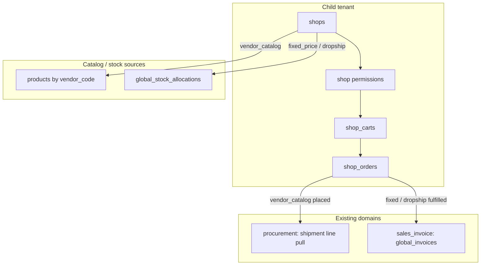
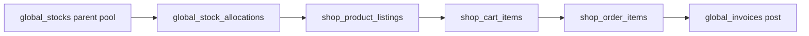
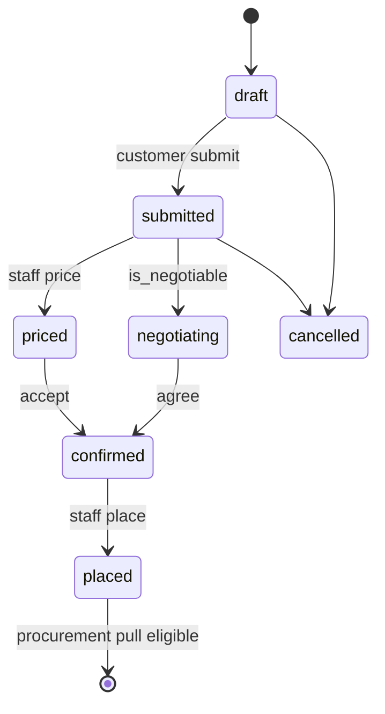
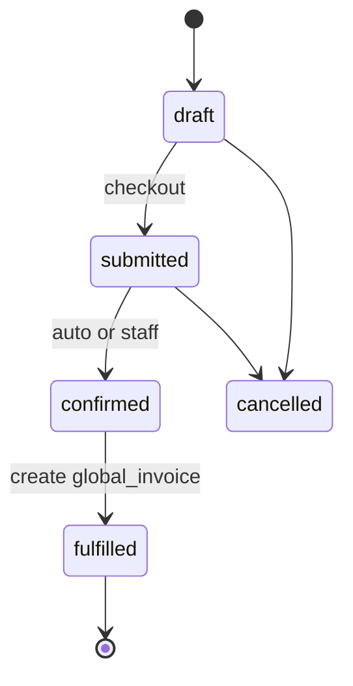

# Shop & Order

BrandWala / TradeFlow BD uses a **parent module** for customer-facing storefronts: shop configuration, carts, and orders. **Child tenants** (sister concerns) create and own their shops. Stock-backed shops sell only from **`global_stock_allocations`** assigned to that child. Vendor-catalog shops expose supplier assortment for procurement intent. Fulfillment converges on existing global domains — procurement pull or **`global_invoices`** — not a parallel commerce ledger.

This document is written as a **reusable domain pattern**: shop types, two-layer customer permissions, multi-currency amounts, and display-vs-sellable quantity are applicable beyond this codebase whenever a B2B portal must serve multiple catalog modes from shared inventory.

Related: [MASTER_PLAN.md](MASTER_PLAN.md), [PROCUREMENT_STOCK.md](PROCUREMENT_STOCK.md), [SALES_INVOICE.md](SALES_INVOICE.md), [GLOBAL_REFERENCE_DATA.md](GLOBAL_REFERENCE_DATA.md), [TENANT_MODEL_AND_ACCESS.md](TENANT_MODEL_AND_ACCESS.md), [APP_SCOPES_AND_ACCESS.md](APP_SCOPES_AND_ACCESS.md).

---

## User stories

### Parent — `shop_order` (Shop & Order)

**As a** child-tenant admin,  
**I want** one nav group for shops, customer-group permissions, pricing, carts, and orders,  
**So that** each customer segment gets the right catalog, checkout rules, and fulfillment path — without mixing desk sales or parent procurement.

---

### Submodule — `shop_config` (Shops)

**As a** child-tenant admin,  
**I want to** create shops under my tenant and choose type plus order behaviour,  
**So that** I run vendor catalogs, fixed-price storefronts, or dropship portals independently.

| Shop type | User story |
|-----------|------------|
| **Vendor catalog** | **As an** admin, **I want to** link a shop to a `vendor_code` and show that vendor's available products, **so that** buyers place procurement intent (bulk or small MOQ) with optional price visibility per group. |
| **Fixed price** | **As an** admin, **I want to** list allocated stock lines with a sell price and choose whether customers see quantity, **so that** I sell from my tenant slice at a fixed checkout price. |
| **Dropship** | **As an** admin, **I want to** set sell price and minimum sell price per allocated line, **so that** drop shippers cannot undercut the floor while choosing their customer-facing price. |

---

### Submodule — `shop_permissions` (Customer group access)

**As a** child-tenant admin,  
**I want to** define default shop capabilities per customer group and override them per shop,  
**So that** one group negotiates and sees prices while another only browses and requests quotes.

---

### Submodule — `shop_storefront` (Storefront)

**As a** customer group member,  
**I want to** see only shops my group can access, with prices and quantities governed by my permissions,  
**So that** I get the right experience on each storefront.

---

### Submodule — `shop_cart` (Cart)

**As a** customer,  
**I want to** maintain a cart per shop with soft stock reservation on stock-backed shops,  
**So that** I can build an order before submitting without overselling allocated inventory.

---

### Submodule — `shop_order_mgmt` (Orders)

**As a** customer negotiator,  
**I want to** submit negotiable orders and exchange offers with staff,  
**So that** we agree on price before procurement placement.

**As a** customer staff member,  
**I want to** checkout at the displayed sell price without negotiation,  
**So that** fixed-price and dropship orders complete quickly.

**As an** internal staff member,  
**I want to** review, price, negotiate, approve, or cancel shop orders,  
**So that** only confirmed lines enter shipment pull or invoicing.

---

### Submodule — `shop_fulfillment` (Fulfillment)

**As a** staff user,  
**I want to** convert a placed vendor-catalog order into procurement lines or a stock-backed order into a desk invoice,  
**So that** stock, margin, and payments stay on the global stack.

---

This document answers:

- What is the Shop & Order domain and how does it relate to stock, products, and invoices?
- Which module keys, routes, and tables are used?
- What are the shop types and order modes?
- How do child-owned shops consume allocated stock?
- How does the two-layer customer permission model work?
- How is multi-currency pricing modeled on products and shop lines?
- How do display quantity and sellable quantity differ?
- What is reused from legacy vs rebuilt fresh?
- What is the implementation phase order?

---

## 1. Overview

| Property | Shop & Order |
|----------|--------------|
| Scope | Child tenant (or standalone) owns shops; parent allocates stock |
| `tenant_id` | Issuing sister concern on all `shop_*` rows |
| Auth surface | App (`memberships`) for config; Shop (`customer_group_members`) for browse/cart/order |
| Module gating | `shop_order` parent + submodules |
| Primary UI (target) | App: `/:slug/app/shop/*` — Shop: `/:slug/shop/*` |
| Write target | `shop_*` tables only (fresh stack) |

### What this domain is

| Capability | Submodule | Responsibility |
|------------|-----------|----------------|
| Shop setup | `shop_config` | Create shops, type, order mode, stock display defaults |
| Group permissions | `shop_permissions` | Tenant-wide group profiles + per-shop access grants |
| Shop pricing | `shop_pricing` | Listings, sell/min prices, display quantity override |
| Storefront | `shop_storefront` | Customer browse with permission-masked fields |
| Cart | `shop_cart` | Per-shop cart, reservations against allocations |
| Orders | `shop_order_mgmt` | Place, negotiate, approve, cancel |
| Fulfillment | `shop_fulfillment` | Procurement pull or `global_invoice` handoff |

### What this domain is not

| Topic | Is not |
|-------|--------|
| **Desk sales** | Staff invoice UI lives under `sales_invoice` — shop fulfillment **calls into** `global_invoices` |
| **Inbound procurement** | Parent shipments live under `procurement_stock` — vendor-catalog orders are **inputs** to pull, not creators of shipments |
| **Physical stock ownership** | Child does not own `global_stocks` — only `global_stock_allocations` slices |
| **Separate commerce ledger** | No `commerce_accounting` stack — payments follow [REPORTING_TREASURY.md](REPORTING_TREASURY.md) on desk invoices |
| **Legacy shop tables** | No FK to `stores`, `carts`, `orders`, `commerce_*` — concept reuse only |
| **Koba / Thrift** | Isolated verticals — out of scope for `shop_order` v1 |

### Reusable design patterns (portable beyond BrandWala)

| Pattern | Where used | Why reusable |
|---------|------------|--------------|
| **Shop type enum** | `vendor_catalog` \| `fixed_price` \| `dropship` | Any B2B portal mixing catalog browse, fixed checkout, and partner pricing |
| **Two-layer permissions** | Profile defaults + per-resource overrides | Standard RBAC for customer groups without role explosion |
| **Amount + currency FK** | Products, listings, cart snapshots, order lines | ISO-style money without hard-coded column names (`price_gbp`) |
| **Allocation-backed listing** | Fixed + dropship | Tenant slice of shared inventory — applies to any hub-and-spoke stock model |
| **Display vs sellable qty** | `display_quantity_override` vs `available_to_sell` | Marketing buffer without breaking inventory caps |
| **Order mode matrix** | Shop type × `order_mode` × `is_negotiable` | Same cart, different checkout semantics |
| **Fresh tables + legacy UI borrow** | Backend new, frontend patterns from legacy browsers | Safe migration without dual-write |

### End-to-end flow



### Implementation split

| Layer | Strategy |
|-------|----------|
| **Backend** | **Fresh start** — new `shop_*` tables and RPCs; no FK to legacy shop/order/commerce tables (same pattern as [PROCUREMENT_STOCK.md](PROCUREMENT_STOCK.md) §3) |
| **UI** | Reuse UX patterns from legacy `StoreProductsBrowser`, `CommerceStoreProductsBrowser`, order negotiation pages — rewire to new repositories only |
| **Products** | **Migrate in place** — replace `price_gbp` with amount + `global_currencies` FK (prerequisite phase) |

---

## 2. Module hierarchy

**Parent module key (target):** `shop_order`  
**Display name:** Shop & Order  
**Nav pattern:** Parent group with submodule children (same model as `procurement_stock`, `sales_invoice`, `global_reference`).

| Key | Display name | `parent_module_key` | Scope | Nav route (target) |
|-----|--------------|---------------------|-------|-------------------|
| `shop_order` | Shop & Order | `null` | — | *(group header)* |
| `shop_config` | Shops | `shop_order` | app | `shop/shops` |
| `shop_permissions` | Customer Access | `shop_order` | app | `shop/customer-groups` |
| `shop_pricing` | Shop Pricing | `shop_order` | app | `shop/shops/:id/pricing` |
| `shop_storefront` | Storefront | `shop_order` | shop | `shop/browse/:shopSlug` |
| `shop_cart` | Cart | `shop_order` | shop | `shop/cart` |
| `shop_order_mgmt` | Orders | `shop_order` | app + shop | `shop/orders`, `app/shop/orders` |
| `shop_fulfillment` | Fulfillment | `shop_order` | app | `app/shop/orders/:id` |

Redirect legacy routes when cut over:

- `/shop/stores` → `/shop/browse`
- `/app/store/*`, `/app/commerce/*` → `/app/shop/*` (per-tenant flag)

### Assignment rules

- Superadmin assigns **`shop_order`** on a tenant via `tenant_modules`.
- `get_active_module_keys_for_tenant` expands parent → enabled submodule keys.
- Platform can disable individual submodules via `tenant_module_submodules`.
- Submodule keys gate nav/pages; cross-module list RPCs (currencies, stock search) remain available where RLS allows.

### Tenant eligibility

| Tenant type | `shop_order` | Who creates shops |
|-------------|--------------|-------------------|
| Parent company | No (by default) | Parent does **not** create child storefronts |
| Child (sister concern) | Yes | Child `admin` / `staff` |
| Standalone | Yes | Tenant `admin` / `staff` |

**Ownership rule (D-SH9):** `shops.tenant_id` = the operating child (or standalone). Parent only **allocates** stock via `global_stock_allocations`; it does not own shop rows.

### Legacy keys (transition)

| Legacy key | Status | Replaced by |
|------------|--------|-------------|
| `store` | Retire | `shop_config` + `shop_storefront` |
| `cart` | Retire | `shop_cart` |
| `order_management` | Retire | `shop_order_mgmt` (vendor path) |
| `commerce_shop` | Retire | `shop_config` + `shop_pricing` |
| `commerce_cart` | Retire | `shop_cart` |
| `commerce_order` | Retire | `shop_order_mgmt` |
| `commerce_invoice` | Retire | Fulfillment → `global_invoices` |
| `commerce_accounting` | Retire | `reporting_treasury` on desk invoices |

Enable `shop_order` on new tenants first; legacy keys stay for existing tenants until cutover.

---

## 3. Shop types and order modes

Shop **type** is set at create and **immutable**. Order **mode** and **negotiation** configure checkout behaviour.

### 3.1 Shop types

| Type | `shop_type` | Catalog source | Stock required |
|------|-------------|----------------|----------------|
| **Vendor catalog** | `vendor_catalog` | `products` where `vendor_code = shops.vendor_code` and `is_available` | No |
| **Fixed price** | `fixed_price` | `shop_product_listings` → `global_stock_allocations` | Yes |
| **Dropship** | `dropship` | Same as fixed price | Yes |

### 3.2 Order modes

| Mode | `order_mode` | Typical shop types | Customer experience |
|------|--------------|-------------------|---------------------|
| **Procurement intent** | `procurement_intent` | `vendor_catalog` | Quote / negotiate → staff places for parent shipment pull |
| **Fixed checkout** | `checkout_fixed` | `fixed_price`, `dropship` | Cart → confirm → invoice |
| **Wholesale checkout** | `checkout_wholesale` | `fixed_price` (optional) | Account-based wholesale invoice path |

### 3.3 Negotiation flag

| Field | Rule |
|-------|------|
| `shops.is_negotiable` | When `true`, order may enter `negotiating` status |
| Effective negotiate | `is_negotiable` **and** `effective(can_negotiate)` from permissions **and** `order_mode` allows it |
| Dropship | `is_negotiable` must be `false` (enforced by check constraint) |

### 3.4 Behaviour matrix

| `shop_type` | `order_mode` | `is_negotiable` | Downstream |
|-------------|--------------|-----------------|------------|
| `vendor_catalog` | `procurement_intent` | true | Negotiate → `placed` → procurement pull |
| `vendor_catalog` | `procurement_intent` | false | Staff prices → `confirmed` → `placed` → pull |
| `fixed_price` | `checkout_fixed` | false | `confirmed` → `fulfilled` → `global_invoice` retail |
| `fixed_price` | `checkout_wholesale` | true/false | `global_invoice` wholesale |
| `dropship` | `checkout_fixed` | false | `global_invoice` type `dropship` (dual amounts) |

Not every cart produces the same order path — the matrix above is enforced at `submit_shop_order_from_cart`.

---

## 4. Stock-backed shops (fixed price & dropship)

### 4.1 Allocation as the sellable slice

Child tenants sell only from rows in `global_stock_allocations` where `child_tenant_id = shops.tenant_id`. See [PROCUREMENT_STOCK.md](PROCUREMENT_STOCK.md) §5.6.



| Rule | Detail |
|------|--------|
| Listing FK | `shop_product_listings.global_stock_allocation_id` required for stock-backed shops |
| Denormalize | `global_stock_id`, `product_id` copied for display joins |
| Eligibility | Parent shipment **Ready Stock** + sellable `global_stock_type` only |
| Deduction | On invoice post (or explicit fulfill RPC) — decrement allocation / parent pool per [SALES_INVOICE.md](SALES_INVOICE.md) |

### 4.2 Quantity model (display vs sellable)

Three quantities drive behaviour. This separation is **reusable** anywhere UI may show marketing stock while checkout stays honest.

| Concept | Source | Purpose |
|---------|--------|---------|
| **Allocated qty** | `global_stock_allocations.quantity` | Physical ceiling for this child |
| **Reserved qty** | `SUM(shop_stock_reservations.quantity)` | Active cart holds |
| **Pending order qty** | Open order lines not yet fulfilled | Soft commit |
| **Display override** | `shop_product_listings.display_quantity_override` | Optional inflated qty shown in UI |

**Computed in RPCs (not stored):**

```text
available_to_sell =
  allocated_qty
  − reserved_qty
  − pending_order_qty

display_qty =
  if NOT effective(can_view_quantity) OR NOT shop.show_stock_quantity → null
  else if display_quantity_override IS NOT NULL → display_quantity_override
  else → GREATEST(0, available_to_sell)
```

| Behaviour | Rule |
|-----------|------|
| Show extra qty | Admin sets `display_quantity_override` **higher** than `available_to_sell` — customer sees more; checkout still capped |
| Hide qty | `shops.show_stock_quantity = false` or listing `show_quantity = false` |
| Checkout guard | `quantity_ordered ≤ available_to_sell` always |
| Per-line override | `shop_product_listings.show_quantity` may hide qty for one line while shop default shows |

### 4.3 Dropship pricing

| Field | Rule |
|-------|------|
| `sell_price_amount` | Suggested / default sell price shown to drop shipper |
| `minimum_sell_price_amount` | Floor — customer-entered sell price must be ≥ minimum |
| `customer_sell_price_amount` | On cart/order line when `effective(can_set_dropship_price)` |
| Dual invoice amounts | On fulfill → `global_invoice` dropship: `sell_price_amount` (accounting) + `recipient_price_amount` (face) per [SALES_INVOICE.md](SALES_INVOICE.md) |

---

## 5. Customer group permissions (two-layer model)

Portable pattern: **tenant-wide defaults** + **per-shop overrides** with `COALESCE(override, default, safe_fallback)`.

### 5.1 Layer A — `customer_group_shop_profiles`

One row per customer group per child tenant. Defines **default** shop capabilities when a shop grant is created.

| Field | Type | Default | Meaning |
|-------|------|---------|---------|
| `tenant_id` | bigint FK | — | Child tenant |
| `customer_group_id` | bigint FK | — | Group |
| `is_active` | boolean | true | Master switch |
| `default_can_browse` | boolean | true | See shop in list |
| `default_see_price` | boolean | false | Unit prices visible |
| `default_can_add_to_cart` | boolean | true | Add lines |
| `default_can_place_order` | boolean | true | Submit / checkout |
| `default_can_negotiate` | boolean | false | Counter-offers |
| `default_can_view_quantity` | boolean | true | Stock qty when shop shows stock |
| `default_can_set_dropship_price` | boolean | false | Edit dropship sell on line |

**Unique:** `(tenant_id, customer_group_id)`

**Suggested seed from `customer_group_members.role`:**

| Member role | Typical defaults |
|-------------|------------------|
| `admin` | All true except `see_price` per commercial policy |
| `negotiator` | `can_negotiate`, `can_place_order` |
| `staff` | Cart + place; no negotiate |

Roles seed defaults only — **effective permissions always come from profile + access rows**.

### 5.2 Layer B — `shop_customer_group_access`

Per-shop grant for a customer group.

| Field | Type | Notes |
|-------|------|-------|
| `shop_id` | bigint FK | |
| `customer_group_id` | bigint FK | |
| `status` | boolean | Grant on/off |
| `can_browse` … `can_set_dropship_price` | boolean **null** | `null` = inherit from profile default |
| `price_tier_code` | text null | Future tier pricing hook |
| `credit_limit_amount` + `credit_limit_currency_id` | nullable | Optional per-shop+group commercial cap |

**Unique:** `(shop_id, customer_group_id)`

### 5.3 Effective permission resolution

```text
effective(shop, group, flag) =
  IF shop_customer_group_access.status = false
     OR customer_group_shop_profiles.is_active = false
  THEN false
  ELSE COALESCE(
    shop_customer_group_access.<flag>,
    customer_group_shop_profiles.default_<flag>,
    false
  )
```

Safe fallback `false` applies to `see_price`, `can_negotiate`, `can_set_dropship_price`.

### 5.4 Permission × shop type

| Permission | vendor_catalog | fixed_price | dropship |
|------------|----------------|-------------|----------|
| `can_browse` | Vendor products | Listed lines | Listed lines |
| `see_price` | List / reference price | Sell price | Sell + min sell |
| `can_view_quantity` | MOQ only | Display qty | Usually min-sell focus |
| `can_add_to_cart` | Add lines | Add lines | Add lines |
| `can_place_order` | Submit intent | Checkout | Checkout |
| `can_negotiate` | If shop `is_negotiable` | Rare | No |
| `can_set_dropship_price` | — | — | Edit line sell ≥ min |

### 5.5 Security-definer RPCs

| RPC | Returns |
|-----|---------|
| `get_shop_permissions_for_customer(p_shop_id)` | All effective flags for session group |
| `can_customer_access_shop(p_shop_id)` | `effective(can_browse)` |
| `can_customer_see_shop_price(p_shop_id)` | `effective(see_price)` |
| `can_customer_negotiate_on_shop(p_shop_id)` | `effective(can_negotiate) ∧ shop.is_negotiable` |

Storefront and cart RPCs **mask** price, quantity, and dropship fields using these helpers.

---

## 6. Multi-currency product catalog (prerequisite)

Legacy `products.price_gbp` is not reusable across markets. **Phase 0** migrates the catalog before shop tables.

### 6.1 `products` target columns

| Remove | Add |
|--------|-----|
| `price_gbp` | `list_price_amount numeric(12,4) null` |
| — | `list_price_currency_id bigint null → global_currencies(id)` |
| — | `reference_cost_amount numeric(12,4) null` |
| — | `reference_cost_currency_id bigint null → global_currencies(id)` |

**Check:** `(list_price_amount IS NULL) = (list_price_currency_id IS NULL)` — same for reference cost pair.

### 6.2 Money column convention (all shop tables)

Every monetary value uses:

```text
<name>_amount numeric(12,4) NOT NULL
<name>_currency_id bigint NOT NULL REFERENCES global_currencies(id)
```

No `price_gbp`, `price_bdt`, or other currency-specific column names in new tables.

### 6.3 One-time backfill

```sql
-- illustrative
UPDATE products SET
  list_price_amount = price_gbp,
  list_price_currency_id = (SELECT id FROM global_currencies WHERE code = 'GBP')
WHERE price_gbp IS NOT NULL;
-- then DROP price_gbp
```

---

## 7. Target schema

### 7.1 `shops`

| Field | Type | Notes |
|-------|------|-------|
| `id` | bigint PK | |
| `tenant_id` | bigint FK | Child or standalone — **owner** |
| `name`, `slug` | text | Unique `(tenant_id, slug)` |
| `shop_type` | enum | `vendor_catalog` \| `fixed_price` \| `dropship` |
| `vendor_code` | text null | Required when `vendor_catalog` |
| `order_mode` | enum | `procurement_intent` \| `checkout_fixed` \| `checkout_wholesale` |
| `is_negotiable` | boolean | Default false; false forced for dropship |
| `show_stock_quantity` | boolean | Default true; fixed/dropship display |
| `default_currency_id` | bigint FK | Shop display/checkout currency |
| `global_stock_type_id` | bigint FK null | Optional filter for listing pick |
| `is_active` | boolean | |
| `created_at`, `updated_at` | timestamptz | |

### 7.2 `customer_group_shop_profiles`

See §5.1.

### 7.3 `shop_customer_group_access`

See §5.2.

### 7.4 `shop_product_listings`

| Field | Type | Notes |
|-------|------|-------|
| `id` | bigint PK | |
| `tenant_id`, `shop_id` | bigint FK | |
| `global_stock_allocation_id` | bigint FK | Required stock-backed |
| `global_stock_id` | bigint FK | Denormalized |
| `product_id` | bigint FK | Denormalized |
| `sell_price_amount`, `sell_price_currency_id` | money pair | |
| `minimum_sell_price_amount`, `minimum_sell_price_currency_id` | money pair | Dropship only |
| `show_quantity` | boolean null | Per-line; null = inherit shop |
| `display_quantity_override` | integer null | Marketing display |
| `is_active` | boolean | |

**Unique:** `(shop_id, global_stock_allocation_id)`

### 7.5 `shop_carts` / `shop_cart_items`

```text
shop_carts
  tenant_id, shop_id, customer_group_id
  see_price_snapshot boolean     -- frozen from permissions at create
  status enum: active | converted | abandoned
  unique (tenant_id, shop_id, customer_group_id) WHERE status = 'active'

shop_cart_items
  cart_id, product_id, global_stock_id, global_stock_allocation_id
  quantity, minimum_quantity
  -- snapshots at add time (money pairs)
  unit_list_price_*, unit_sell_price_*, unit_minimum_sell_price_*
  customer_sell_price_*          -- dropship entry
  name, image_url
```

### 7.6 `shop_stock_reservations`

| Field | Notes |
|-------|-------|
| `cart_item_id` | FK |
| `global_stock_allocation_id` | FK |
| `quantity` | Held until cart converted or abandoned |

### 7.7 `shop_orders` / `shop_order_items`

```text
shop_orders
  tenant_id, shop_id, customer_group_id, cart_id null
  order_no, name
  shop_type_snapshot, order_mode_snapshot, is_negotiable_snapshot
  status enum:
    draft, submitted, cancelled,
    priced, negotiating, confirmed, placed,   -- vendor / wholesale paths
    fulfilled                                 -- checkout paths
  negotiate_round integer
  cargo_rate, conversion_rate, profit_rate   -- vendor catalog costing snapshot
  recipient_name, recipient_phone, shipping_address
  billing_profile_id null                    -- FK billing_profiles when needed
  placed_at, fulfilled_at
  global_invoice_id null
  created_by_email

shop_order_items
  order_id, product_id, global_stock_id, global_stock_allocation_id
  name, image_url, quantity
  -- money pairs: list, sell, min_sell, customer_offer, staff_offer, final
  ordered_quantity, delivered_quantity, returned_quantity
  procurement_pulled boolean default false
```

---

## 8. Order lifecycle

### 8.1 Vendor catalog (procurement intent)



### 8.2 Fixed / dropship checkout



### 8.3 Key RPCs

| RPC | Actor |
|-----|-------|
| `get_or_create_shop_cart` | Customer |
| `add_to_shop_cart` / `update_shop_cart_item_qty` | Customer |
| `submit_shop_order_from_cart` | Customer |
| `staff_price_shop_order` | Staff |
| `customer_counter_offer` / `staff_counter_offer` | Negotiable path |
| `confirm_shop_order` | Staff or auto |
| `place_shop_order_for_procurement` | Staff |
| `fulfill_shop_order_to_invoice` | Staff → `global_invoices` |
| `list_shop_orders_for_customer` / `list_shop_orders_for_staff` | Scoped lists |
| `list_procurement_shop_order_lines` | Parent shipment UI pull source |

---

## 9. Integration with other domains

| Domain | Integration |
|--------|-------------|
| [PROCUREMENT_STOCK.md](PROCUREMENT_STOCK.md) | Stock-backed listings from `global_stock_allocations`; vendor `placed` lines join pull RPC |
| [SALES_INVOICE.md](SALES_INVOICE.md) | `fulfill_shop_order_to_invoice` creates `global_invoices`; dropship dual amounts |
| [REPORTING_TREASURY.md](REPORTING_TREASURY.md) | Payments on fulfilled invoices — no shadow commerce ledger |
| [GLOBAL_REFERENCE_DATA.md](GLOBAL_REFERENCE_DATA.md) | All `*_currency_id` columns |
| [TENANT_MODEL_AND_ACCESS.md](TENANT_MODEL_AND_ACCESS.md) | `customer_groups` child-only; shop actors from `customer_group_members` |

---

## 10. Fresh start — no legacy connection

| Rule | Detail |
|------|--------|
| New table prefix | `shop_*` only |
| No FK | To `stores`, `carts`, `orders`, `commerce_*` |
| No dual-write | Locked decision **D-SH1** |
| UI reuse | Legacy components may be copied/rewired; repositories target new tables |
| Legacy data | Not migrated — parallel run per tenant until cutover |

---

## 11. Implementation phases

### Backend

| Stage | Deliverables |
|-------|--------------|
| **B-SH0** | Products multi-currency; backfill GBP; drop `price_gbp` |
| **B-SH1** | `shops`, enums, RLS, child-tenant ownership checks |
| **B-SH1b** | `customer_group_shop_profiles`, `shop_customer_group_access`, permission RPCs |
| **B-SH2** | `shop_product_listings`, browse/list RPCs, quantity computations |
| **B-SH3** | `shop_carts`, `shop_cart_items`, `shop_stock_reservations` |
| **B-SH4** | `shop_orders`, `shop_order_items`, negotiation + checkout RPCs |
| **B-SH5** | Procurement pull bridge + `fulfill_shop_order_to_invoice` |
| **B-SH6** | Seed `shop_order` parent + submodules; `MODULE_REGISTRY`; permissions |

### Frontend

| Stage | Route (target) |
|-------|----------------|
| **F-SH0** | `/app/products` — currency picker |
| **F-SH1** | `/app/shop/shops` — shop CRUD |
| **F-SH2** | `/app/shop/customer-groups/:id/permissions` |
| **F-SH3** | `/app/shop/shops/:id/pricing` — allocations, override qty |
| **F-SH4** | `/shop/browse/:shopSlug` |
| **F-SH5** | `/shop/cart`, `/shop/checkout` |
| **F-SH6** | `/shop/orders`, `/app/shop/orders/:id` |

All new pages follow [frontend style guide](frontend%20style%20guilde.md) and [UI_CONSISTENCY_GUIDE.md](../web/UI_CONSISTENCY_GUIDE.md).

---

## 12. UI surfaces (target)

| Screen | Path | Submodule |
|--------|------|-----------|
| Shop list | `/app/shop/shops` | `shop_config` |
| Shop access matrix | `/app/shop/shops/:id/access` | `shop_permissions` |
| Group shop profile | `/app/shop/customer-groups/:id/permissions` | `shop_permissions` |
| Shop pricing | `/app/shop/shops/:id/pricing` | `shop_pricing` |
| Allocation picker | `/app/shop/shops/:id/stock-pick` | `shop_pricing` |
| Customer storefront | `/shop/browse/:shopSlug` | `shop_storefront` |
| Cart | `/shop/cart` | `shop_cart` |
| Checkout | `/shop/checkout` | `shop_cart` |
| Customer orders | `/shop/orders` | `shop_order_mgmt` |
| Staff order desk | `/app/shop/orders` | `shop_order_mgmt` |
| Fulfillment | `/app/shop/orders/:id` | `shop_fulfillment` |

---

## 13. Legacy feature mapping (concept only)

| Legacy | New |
|--------|-----|
| `stores` + `store_access` | `shops` + `shop_customer_group_access` |
| `store_access.see_price` | `see_price` effective permission |
| `carts` / `cart_items` + `price_gbp` | `shop_carts` / `shop_cart_items` + currency pairs |
| `orders.negotiate` + status enum | `shops.is_negotiable` + `shop_orders.status` |
| `store_product_prices` + `stock_override` | `shop_product_listings` + `display_quantity_override` |
| `commerce_cart` reservations | `shop_stock_reservations` |
| `commerce_orders` | `shop_orders` checkout path |
| `commerce_invoice` | `global_invoices` via fulfillment |

---

## 14. Locked decisions

| # | Topic | Decision |
|---|-------|----------|
| D-SH1 | Legacy isolation | New `shop_*` tables only; no FK to legacy shop/order/commerce |
| D-SH2 | Stock source | Fixed + dropship sell from child `global_stock_allocations` (inherits **D3**) |
| D-SH3 | Vendor downstream | `placed` vendor-catalog lines eligible for parent shipment pull |
| D-SH4 | Currency | Amount + `global_currencies` FK — no currency-named columns |
| D-SH5 | Shop type | Immutable after create |
| D-SH6 | Permissions | Two-layer: `customer_group_shop_profiles` + `shop_customer_group_access` |
| D-SH7 | Invoice handoff | Fulfillment writes `global_invoices` — not `commerce_invoice` |
| D-SH8 | Negotiation | Only when `is_negotiable` and effective `can_negotiate` |
| D-SH9 | Shop ownership | Child (or standalone) creates and owns `shops` |
| D-SH10 | Listing FK | Stock-backed listings reference `global_stock_allocation_id` |
| D-SH11 | Display qty | Override affects display only; checkout capped by `available_to_sell` |
| D-SH12 | Dropship | `minimum_sell_price` floor; dual amounts on invoice per **D-SI*** |

---

## 15. Open choices (decide before B-SH1)

| Topic | Options | Recommendation |
|-------|---------|----------------|
| Shop currency | Single `default_currency_id` vs per-line override | Shop default + line override for import catalogs |
| Vendor catalog pricing | Staff-only price step vs always negotiable | Both supported via `is_negotiable` |
| Koba vertical | Fold into `shop_order` vs stay isolated | Stay isolated in v1 |
| Tenant cutover | Big-bang vs parallel modules | `shop_order` on new tenants first |
| Credit limit enforcement | Block checkout vs warn only | Warn in v1; hard block in v2 |

---

## 16. Related documentation

| Doc | Purpose |
|-----|---------|
| [MASTER_PLAN.md](MASTER_PLAN.md) | Index, feature matrix, phases |
| [PROCUREMENT_STOCK.md](PROCUREMENT_STOCK.md) | Allocations, parent pool |
| [SALES_INVOICE.md](SALES_INVOICE.md) | Desk invoice types, dropship dual totals |
| [GLOBAL_REFERENCE_DATA.md](GLOBAL_REFERENCE_DATA.md) | Currencies |
| [TENANT_MODEL_AND_ACCESS.md](TENANT_MODEL_AND_ACCESS.md) | Child tenants, customer groups |
| [APP_SCOPES_AND_ACCESS.md](APP_SCOPES_AND_ACCESS.md) | Shop scope guards |
