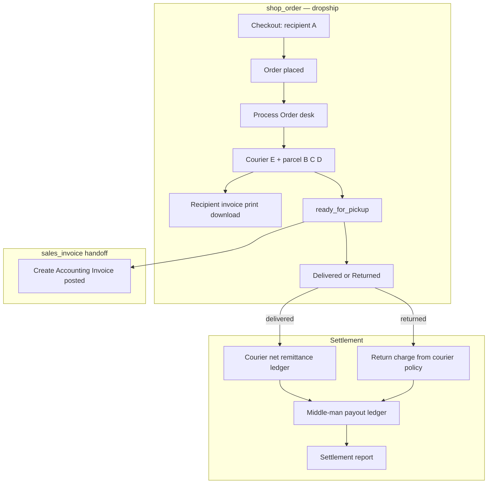
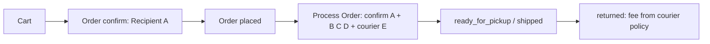
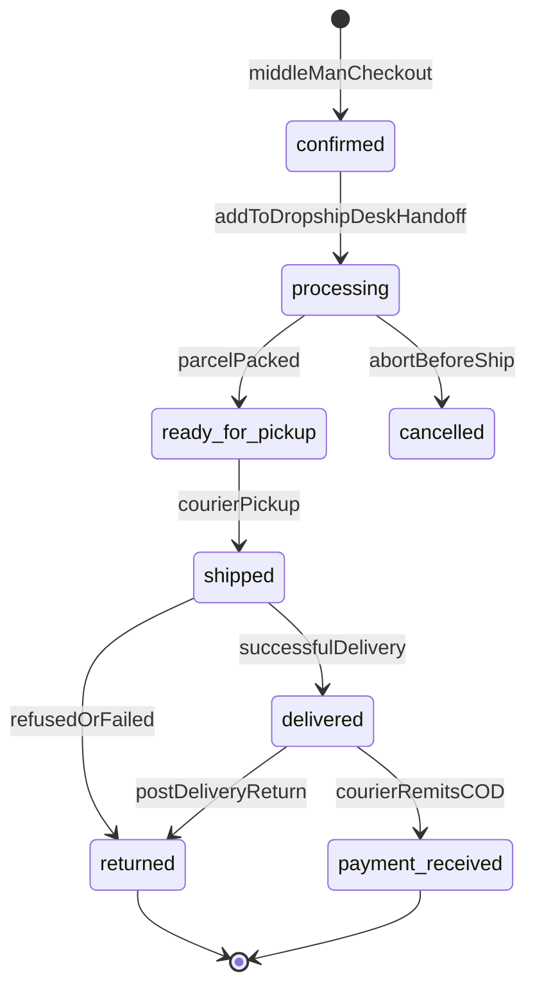
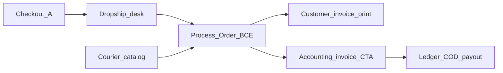

# Shop & Order — Dropship Ops, Invoice Timing & Settlement

BrandWala / TradeFlow BD dropship is a **stock-backed shop type** under the parent module **`shop_order`**. The middle man (reseller) places orders on a dropship storefront with **courier-ready recipient details at checkout**; the seller runs an **ops desk** (Process Order → courier consignment → deliver/return). **Recipient (customer) invoice** is print/download from the order at `processing`. **Accounting invoice** is one posted `global_invoices` dropship row (dual amounts) created at `ready_for_pickup`. After `delivered`, courier remits COD **net of charges** and middle-man profit is settled on the **payout ledger** for reporting.

This document is the domain design for that ops + settlement path. Catalog, cart, pricing floor, and non-COD outbound charge toggles remain in [SHOP_ORDER.md](SHOP_ORDER.md). Desk invoice field shapes and payment RPCs remain in [SALES_INVOICE.md](SALES_INVOICE.md).

Related: [MASTER_PLAN.md](MASTER_PLAN.md), [SHOP_ORDER.md](SHOP_ORDER.md), [SALES_INVOICE.md](SALES_INVOICE.md), [REPORTING_TREASURY.md](REPORTING_TREASURY.md), [TENANT_MODEL_AND_ACCESS.md](TENANT_MODEL_AND_ACCESS.md).

---

## User stories

### Submodule — `shop_dropship` (Dropship Orders)

**As a** child-tenant admin or staff member,  
**I want** a dedicated Dropship Orders desk under Shop & Order,  
**So that** I process courier consignments, customer prints, accounting invoices, and settlement without mixing vendor-catalog or fixed-price order workflows.

---

| Story | Narrative |
|-------|-----------|
| **Checkout recipient** | **As** a middle man, **I want** to enter full courier-ready recipient details at order confirm (name, primary + secondary phone, address, district, thana), **so that** the parcel can be routed without staff chasing missing data. |
| **Process order** | **As** staff, **I want** a **Process Order** action (not immediate fulfill-to-invoice), **so that** I confirm recipient, pick courier, and enter parcel/sender details before the parcel leaves. |
| **Consignment** | **As** staff, **I want** to record parcel & payment (COD collect, weight, category, description), sender/merchant pickup, tracking (AWB, consignment id, tracking URL), and driver notes, **so that** the parcel is ready for pickup and statuses stay visible on the order. |
| **Packing slip / label** | **As** staff, **I want** to print a packing slip and courier label before pickup, **so that** the parcel can leave with recipient face details and an AWB without posting books. |
| **Recipient invoice print** | **As** staff, **I want** to download/print the **customer (recipient) invoice** from `processing`, **so that** the end customer / courier slip shows face prices and middle-man brand **without** creating a `global_invoices` row. |
| **Courier policies** | **As** admin, **I want** a maintainable courier catalog (Steadfast / Pathao / REDX) with COD and return-fee rules, **so that** each courier’s policy drives suggestions instead of hard-coded shop defaults. |
| **COD on courier** | **As** staff, **I want** COD fee rules to come from the **selected courier**, not the shop, **so that** Pathao vs Steadfast COD pricing stays accurate — and prepaid orders (`cod_collect_amount = 0`) skip courier COD fees. |
| **Accounting invoice** | **As** staff, **I want** to create the **accounting invoice** when the order reaches **`ready_for_pickup`**, **so that** books use middle-man sell price + shipment cost (dual amounts on one dropship row) while the customer copy stays the ops print from the order. |
| **Outbound margin (non-COD)** | **As** admin, **I want** delivery / print / packing toggles on the shop to bill the recipient or deduct from middle-man margin, **so that** commercial terms match the shop (COD is separate — on courier; only when collect > 0). |
| **Return bearer** | **As** admin, **I want** a shop setting for whether return courier fees are deducted from the middle man or absorbed by the seller, **so that** failed-delivery risk is explicit. |
| **Return on desk** | **As** staff, **I want** return fee suggested from the courier policy + zone, then confirm actual fee and who pays, **so that** stock and the payout ledger stay correct. |
| **Payout ledger** | **As** staff, **I want** a middle-man payout ledger of credits (profit at accounting invoice) and debits (return charges / clawbacks, including uninvoiced return fees), **so that** I settle one balance across many orders and can generate a settlement report. |
| **COD remittance** | **As** staff, **I want** after **delivery** to record what the courier paid us **net after cutting charges** (batch / bank trx + collection amount), **so that** money-in is on the ledger/payments trail and reconciles to the accounting invoice. |
| **Middle-man settle** | **As** staff, **I want** to pay the middle-man profit margin and post a **payout ledger** entry, **so that** money-out is reportable against the same order/invoice. |
| **Middle-man visibility** | **As** a middle man, **I want** order status (including returned), tracking URL, and any charge cut from my profit to be visible on my orders, **so that** payouts are transparent. |

---

This document answers:

- How does dropship differ from fixed-price fulfillment under `shop_order`?
- What recipient fields are required at cart → order confirm?
- What statuses and consignment fields does the Process Order path use?
- Why is COD owned by the courier catalog, not the shop — and when is the COD fee skipped?
- How do recipient print (order) and posted accounting invoice stay decoupled?
- When is the accounting invoice created vs when is customer invoice printed?
- How do courier net remittance and middle-man payout land on the ledger for reports?
- How do courier return policies (Steadfast / Pathao / REDX) drive suggested return fees?
- What are the return scenarios, exchange, uninvoiced ledger debits, and locked defaults?

---

## 1. Overview

| Property | Dropship under `shop_order` |
|----------|-----------------------------|
| Scope | Child (or standalone) tenant; `shop_type = dropship` only |
| Parent module | `shop_order` |
| Submodule key (target) | `shop_dropship` |
| Auth surface | App (`memberships`) for ops desk; Shop (`customer_group_members`) for place/track |
| Primary UI (target) | `/:slug/app/shop/dropship/*` |
| Order rows | `shop_orders` / `shop_order_items` (same tables; dropship status + consignment fields) |
| Courier catalog | `courier_services` — COD + return/attempt/open-box policies |
| Invoice write | `global_invoices` type `dropship` via **Create Accounting Invoice** (dual amounts) — sole **invoice** write path (not a parallel commerce ledger) |
| Recipient customer copy | Print/download from `shop_orders` at `processing`+ — **not** a second invoice table |
| Settlement journal | Middle-man payout ledger + recipient collections — separate from invoice create; reportable money-in / money-out |
| Settlements | Courier COD remittance (net) + middle-man payout → [SALES_INVOICE.md](SALES_INVOICE.md) / [REPORTING_TREASURY.md](REPORTING_TREASURY.md) |

### What this feature is

| Capability | Responsibility |
|------------|----------------|
| Dropship order list / desk | Ops-first lifecycle for dropship shops only |
| Checkout recipient | Courier-ready recipient block at order confirm |
| Process Order | Consignment entry; packing slip / label print before pickup |
| Courier catalog | Per-courier COD + return policies |
| Recipient invoice print | Download/print customer face copy from order at **`processing`** (no books post) |
| Accounting invoice handoff | Posted dual-amount `global_invoices` dropship row at **`ready_for_pickup`** |
| Charge policy | Shop toggles for delivery/print/packing (non-COD); **COD on courier** only when `cod_collect_amount > 0`; independent return-fee bearer |
| Courier remittance + ledger | After **`delivered`**: courier pays seller net of charges → collection ledger; then middle-man profit payout ledger |
| Middle-man ledger | Credits/debits for profit, remittance trail, payouts, return clawbacks (including `return_fee_uninvoiced`) |

### What this feature is not

| Topic | Is not |
|-------|--------|
| **Vendor-catalog / fixed-price orders** | Stay on `shop_order_mgmt` / `shop_fulfillment` paths |
| **Desk-created dropship without a shop order** | Remains available under `sales_invoice` desk create — this doc covers the **shop-order-originated** path |
| **Separate recipient invoice table** | Customer copy is **order print**; books are one dropship row with dual amounts (**D-SD1**) |
| **Shop-owned COD fee rules** | Deprecated for dropship — COD lives on `courier_services` (**D-SD11**) |
| **GAAP chart of accounts** | Operational invoices + COD + payout ledger only |
| **Live courier API sync (v1)** | Catalog is admin-editable; fields match future API payload shape |
| **Changing landed cost formula** | Cost still from shipment item → [PROCUREMENT_STOCK.md](PROCUREMENT_STOCK.md) / [SALES_INVOICE.md](SALES_INVOICE.md) |

### Design principle

> **Ops print, then books at pickup-ready, then money after delivery.** Recipient data at checkout; courier reality on Process Order; **customer invoice printable at `processing`** without posting books; **accounting invoice posted at `ready_for_pickup`**. After **`delivered`**, courier remits COD net of charges (collection ledger), then seller pays middle-man profit (payout ledger) for reports. Returns before or after invoice follow §10. **COD is a courier commercial rule, not a shop default** — and only applies when collect amount > 0.



---

## 2. Module hierarchy

Dropship ops is a **submodule of `shop_order`**, not a new parent module.

| Key | Display name | `parent_module_key` | Scope | Nav route (target) |
|-----|--------------|---------------------|-------|-------------------|
| `shop_order` | Shop & Order | `null` | — | *(group header)* |
| … | *(existing submodules — see [SHOP_ORDER.md](SHOP_ORDER.md) §2)* | | | |
| `shop_dropship` | Dropship Orders | `shop_order` | app (+ shop read of status) | `shop/dropship`, `app/shop/dropship` |

| Rule | Detail |
|------|--------|
| Assignment | Enabled when parent `shop_order` is assigned; platform may disable via `tenant_module_submodules` |
| Separation | Generic **Orders** list stays for vendor/fixed paths; **Dropship Orders** filters `shop_type_snapshot = dropship` |
| Fulfillment | Dropship desk **does not** use the fixed-price “Fulfill to Invoice” as the primary CTA — use **Process Order**; print customer invoice at `processing`; **Create Accounting Invoice** at `ready_for_pickup` |

---

## 3. Actors and money roles

| Actor | Role |
|-------|------|
| **Seller** | Child tenant that owns the dropship shop and stock allocation |
| **Middle man** | Customer-group member placing the order; billing profile for payout / white-label brand |
| **Recipient** | End customer; full delivery identity on order; COD party |
| **Courier** | Shipment company (`courier_services`); owns COD fee + return policy; collects COD; remits to seller |

---

## 4. Capture surface split

| Block | Who | When | Surface |
|-------|-----|------|---------|
| **A. Recipient** | Middle man | Cart → **order confirm / checkout** | Required to place dropship order |
| **A. Recipient (edit)** | Staff | Process Order (before ship) | Correct typos / routing |
| **B. Parcel & payment** | Staff | Process Order | Ops desk |
| **C. Sender / merchant** | Staff (shop/tenant defaults) | Process Order | Ops desk |
| **D. Driver instructions** | Staff | Process Order | Open-box + free-text notes |
| **E. Courier service** | Staff | Process Order | Pick from `courier_services` → COD + return suggestions |



---

## 5. Process Order lifecycle

Statuses already seeded include `processing`, `shipped`, `delivered`, `payment_received`. Target set for dropship ops:

| Status | Meaning |
|--------|---------|
| `submitted` / `confirmed` | Middle man checkout complete (lives on Orders / Service Desk queue; not yet on Dropship Operations Desk) |
| `processing` | Staff clicked **Add to Dropship Desk** (`confirmed` → `processing`); order enters Dropship Operations Desk queue; consignment editable; **Download/Print Customer (recipient) Invoice** available (order face — no books) |
| `ready_for_pickup` | Parcel packed; packing slip / courier label available; awaiting courier pickup; unlocks **Create Accounting Invoice** (posted dual-amount dropship row) |
| `shipped` | Courier has the parcel |
| `delivered` | Successful delivery; stamps `delivered_at`; unlocks **courier remittance / settlement** (not invoice create) |
| `payment_received` | COD remitted / reconciled (`courier_remittance_ref` / `courier_bank_trx_id`); collection ledger written; enough to close ops money-in state |
| `returned` | Refused, failed delivery, or post-delivery return; stamps `returned_at` |
| `cancelled` | Aborted before ship |



Block advance to `ready_for_pickup` / `shipped` if mandatory B/C fields or `courier_service_id` are missing.

**Ops print (print ≠ post):** From `processing`+, staff may **Print packing slip**, **Print / download courier label** (when AWB present), and **Download / Print Customer (recipient) Invoice** — face prices + recipient A from the **order**. None of these create a `global_invoices` row.

**Books (status → invoice):** When status reaches **`ready_for_pickup`** (or later if not yet linked), staff **Create Accounting Invoice** → posted `global_invoices` dropship with dual amounts; sets `shop_orders.global_invoice_id`. No draft invoice earlier. Failed delivery **after** books post uses void/return (§10) — not “never invent a sale”; product accepts books at pickup-ready (**D-SD4**).

Status transitions stamp timestamps: `delivered` → `delivered_at`; `returned` → `returned_at` (SLA and payout eligibility).

`shop_orders.global_invoice_id` is set **only** when **posted** Create Accounting Invoice succeeds (from **`ready_for_pickup`**+).

---

## 6. Consignment field model

District/thana stay **text** (same pattern as Koba); v1 uses columns on `shop_orders` (no separate geo reference table). Dropdown options may be static lists in UI.

### 6.1 A — Recipient (mandatory at order confirm)

| Field | Required | Rule |
|-------|----------|------|
| `recipient_name` | Yes | Full / recognizable name |
| `recipient_phone` | Yes | Active 11-digit BD mobile (`01xxxxxxxxx`) |
| `recipient_phone_secondary` | Soft-required | Second 11-digit mobile if primary busy |
| `shipping_address` | Yes | **Inside major cities:** House/Holding, Road, Block/Sector, Area (e.g. House 12, Road 4, Sector 3, Uttara). **Outside:** Village/Para, landmarks (e.g. Near High School, Kaliakair, Gazipur) |
| `shipping_district` | Yes | District for courier routing (dropdown → text) |
| `shipping_thana` | Yes | Thana/Upazila for courier routing (dropdown → text) |

**Checkout rules:**

- Dropship order confirm UI must collect all A fields (not only name/phone).
- `submit_shop_order_from_cart` rejects dropship submit if mandatory A fields are missing or phone format is invalid.
- UI helper copy explains inside-city vs outside-city address format.
- Values persist on `shop_orders` and show on customer + staff order detail; staff may edit before ship.

### 6.2 B — Parcel & payment (mandatory on Process Order before pickup)

| Field | Required | Rule |
|-------|----------|------|
| `cod_collect_amount` | Yes | Amount courier must collect (face product + face delivery if billed to recipient + **courier COD fee**). `৳0` if pre-paid |
| `package_weight_band` | Yes | e.g. `under_1kg`, `1_2kg`, `2_3kg`, `over_3kg` |
| `item_category` | Yes | Clothing, Electronics, Books, Cosmetics, Other |
| `parcel_description` | Yes | Brief contents, e.g. `1x Black Polo Shirt (Size M)` |
| `courier_order_ref` | Yes | Internal order / invoice ref for courier tracking (defaults to `order_no`) |
| `delivery_zone` | Yes for return/COD suggestion | `inside_dhaka` \| `outside_dhaka` (set at Process Order; may derive from district) |

`cod_collect_amount` is **confirmed after** `courier_service_id` is selected (COD fee from courier policy). Checkout may show a provisional face total **without** locking shop COD.

### 6.3 C — Sender / merchant (mandatory; tenant/shop defaults + per-order override)

| Field | Required | Rule |
|-------|----------|------|
| `sender_name` | Yes | Business / page / brand name for courier |
| `pickup_phone` | Yes | Active number for pickup driver |
| `pickup_address` | Yes | Warehouse / shop / home for pickup |
| `payout_account_type` | Yes for COD remittance setup | `bank` \| `bkash` \| `nagad` \| `other` |
| `payout_account_info` | Yes when COD collect > 0 | Account / MFS details for remittance |

Defaults live on shop/tenant dropship pickup settings; copied onto the order at Process Order.

### 6.4 D — Driver instructions (optional)

| Field | Required | Rule |
|-------|----------|------|
| `allow_open_box` | Yes (default **false**) | Couriers deny open-box unless merchant authorizes |
| `delivery_instruction_notes` | No | e.g. call before arriving, deliver after 3:00 PM, allow/deny check product |

If open-box is denied and customer refuses without opening → standard return. If open-box allowed and customer rejects on the spot → rider takes back; standard return fees apply.

### 6.5 E — Courier on the order

| Field | Notes |
|-------|-------|
| `courier_service_id` | FK → `courier_services` |
| `courier_tracking_number` | Customer-facing tracking code |
| `courier_awb_number` | Airway bill / barcode (may equal tracking for some couriers) |
| `courier_consignment_id` | Courier-platform internal ID (Pathao / REDX / Steadfast) |
| `tracking_url` | Self-service deep link for middle man / recipient |
| `courier_cost_amount` + currency | Forward / outbound courier cost |
| `middle_man_reference` | Optional external ref |
| `delivered_at` | Set when status → `delivered` |
| `returned_at` | Set when status → `returned` |
| `courier_remittance_ref` | Courier bulk remittance / settlement batch ID (at `payment_received`) |
| `courier_bank_trx_id` | Optional bank / MFS transaction id for the COD deposit |
| `replacement_of_order_id` | Optional FK when this order replaces a returned exchange original |

---

## 7. Courier services & policies

Couriers do **not** share one COD or return rule. Maintain **`courier_services`** so Process Order and return RPCs look up policy instead of hard-coding or using shop COD defaults.

### 7.1 Fix — COD owned by courier (not shop)

| Concern | Wrong (legacy) | Correct (target) |
|---------|----------------|------------------|
| COD fee rate / amount | `shops.default_cod_charge_pct` (+ cart/order snapshot) | `courier_services` COD columns |
| Deduct COD from middle-man margin? | `shops.deduct_cod_from_margin` | Courier default + per-order override after courier chosen |
| When COD is firm | Guessed at checkout from shop | Confirmed on Process Order after `courier_service_id` |

**Delivery / print / packing** remain shop commercial toggles (**non-COD outbound charges**). They do **not** imply a courier COD fee on prepaid orders. **COD specifically moves to courier.** Shop-level COD fields are **deprecated for dropship** (migrate / ignore).

### 7.2 `courier_services` columns

| Column | Purpose |
|--------|---------|
| `id`, `tenant_id` | Platform seed (`tenant_id` null) or child override |
| `code` | `steadfast`, `pathao`, `redx`, … |
| `name`, `is_active` | |
| **COD** | |
| `cod_fee_mode` | `none` \| `percent_of_collect` \| `flat` \| `tiered_manual` |
| `cod_fee_percent` / `cod_fee_flat_amount` | Courier-specific COD service charge |
| `cod_fee_notes` | How this courier bills COD handling |
| `deduct_cod_from_margin_default` | Typical margin treatment; order may override |
| **Return fee** | |
| `return_fee_mode` | `none` \| `percent_of_forward` \| `flat` \| `tiered_manual` |
| `return_fee_percent` | e.g. Pathao outside Dhaka **50** |
| `return_fee_inside_dhaka_mode` | Often `none` / waived |
| `return_fee_outside_dhaka_mode` | Pathao: `percent_of_forward`; REDX: `tiered_manual` |
| `return_fee_notes` | Policy summary for UI |
| **Attempts & hold** | |
| `delivery_attempt_count` | Steadfast/Pathao 2–3; REDX typically 2 |
| `hub_hold_hours_min` / `hub_hold_hours_max` | 24–48 typical |
| `attempt_notes` | SMS / call behaviour |
| **Open-box** | |
| `open_box_default_allowed` | **false** for seed couriers |
| `open_box_notes` | Only if merchant authorizes on order |
| **Return transit** | |
| `return_transit_days_inside_dhaka_min` / `_max` | 2–4 |
| `return_transit_days_outside_dhaka_min` / `_max` | 5–10 |

### 7.3 Seed comparison

| Courier | Return fee policy | How it works |
|---------|-------------------|--------------|
| **Steadfast** | 0% extra return fee | Pay original forward delivery charge; **no extra** fee to bring the parcel back |
| **Pathao** | 50% return fee **outside Dhaka** | Inside Dhaka metro usually **no** return surcharge; outside/suburbs ≈ **50% of forward delivery charge** |
| **REDX** | Varies by tier / area | Often waives inside Dhaka for regular merchants; outside = partial or flat by weight — staff enters actual (`tiered_manual`) |

| Courier | Attempts before return | Hold at hub |
|---------|------------------------|-------------|
| Steadfast / Pathao | 2–3 attempts over consecutive days + phone contact | 24–48h if customer delays |
| REDX | Typically 2 attempts; automated SMS | 24–48h typical |

| Topic | Rule |
|-------|------|
| Open-box (all three) | Default **deny**; allow only if order `allow_open_box = true` |
| Return processing | Inside Dhaka 2–4 business days; outside / remote 5–10 (hub consolidation) |

### 7.4 Policy → COD collect and return fee

**On Process Order (courier selected):**

1. If prepaid (`cod_collect_amount = 0` or staff sets collect to ৳0): **skip** courier COD fee suggestion; COD fee component = 0.
2. Else (`cod_collect_amount > 0`): load courier COD policy → suggest COD fee component.
3. Compute / confirm `cod_collect_amount` (face product + face delivery if billed to recipient + courier COD fee when collect > 0).
4. Show attempt/hold/open-box expectations from the policy row (read-only guidance).

**On mark returned:**

1. Use order `courier_service_id` + `delivery_zone`.
2. Suggest `return_charge_amount`:
   - Steadfast → `0` extra
   - Pathao + `outside_dhaka` → `0.5 × forward_delivery_charge` (`courier_cost_amount` or recorded forward fee)
   - Pathao + `inside_dhaka` → `0`
   - REDX → blank / require staff entry
3. Staff confirms actual fee; `deduct_return_charge_from_middle_man` decides who bears it.

---

## 8. Accounting invoice + recipient print

**One** posted `global_invoices` row with `invoice_type = dropship` (dual-amount model) for **books**. The **recipient / customer invoice** is an ops **print/download** from the order — not a second table and not required to wait for post (**D-SD1**, **D-SD4**, **D-SD16**).

| Document | Audience | Line prices | When | Storage |
|----------|----------|-------------|------|---------|
| **Recipient (customer) invoice** | End customer + courier COD slip | Face / `customer_sell_price` on order | From **`processing`** | Order print only — no `global_invoices` row |
| **Accounting invoice** | Seller books / margin / payout | `sell_price_amount` + `recipient_price_amount` on one row | From **`ready_for_pickup`** | Posted `global_invoices` dropship |

| Rule | Detail |
|------|--------|
| Cost | `unit_cost_price` from shipment item landed cost on post — same as other invoice types |
| Charges on face (books) | Delivery / print / packing per shop toggles; **COD fee per courier policy** only when `cod_collect_amount > 0` |
| Recipient snapshot on books | Copy recipient A (name/phone/address; profile id when set) onto invoice at create |
| Payout amount | `middle_man_payout_amount` from spread and policy (see §9); profit credit may land on ledger at invoice create |
| Collection | `collection_source = recipient`; after delivery courier remits net → §11 |
| **Ops print (print ≠ post)** | Packing slip / **Download Customer Invoice** from `shop_orders` at `processing`+ — face prices + consignment; **no** `global_invoices` row |
| **Books (posted)** | Create Accounting Invoice from **`ready_for_pickup`**+; sets `global_invoice_id`. Optional later print of accounting document from invoice detail |
| Remittance snapshot | When COD remits, copy `courier_remittance_ref` / `courier_bank_trx_id` onto collection fields — see [SALES_INVOICE.md](SALES_INVOICE.md) / §11 |

Desk-only dropship create (no shop order) remains in [SALES_INVOICE.md](SALES_INVOICE.md) §5.4; this submodule **wires shop orders into that invoice type**.

---

## 9. Outbound charges vs margin deduction

| Charge | Source of truth | Margin / face behaviour |
|--------|-----------------|-------------------------|
| **COD fee** | **`courier_services`** (+ order override) | Apply **only if `cod_collect_amount > 0`**; then `deduct_cod_from_margin` from courier default / order — **not** shop. If collect = 0 (prepaid) → COD fee = 0 |
| Delivery | Shop `deduct_delivery_from_margin` | Face vs margin (non-COD outbound) |
| Print | Shop `deduct_print_from_margin` | Face vs margin (non-COD outbound) |
| Packing | Shop `deduct_packing_from_margin` | Face vs margin (non-COD outbound) |

**Rule:** `IF cod_collect_amount > 0 THEN apply_courier_cod_fee ELSE COD fee = 0`.

**Success-path payout (conceptual):**

```text
middle_man_payout =
  face_line_total (recipient prices × qty)
  + face_charges_paid_by_recipient
  − accounting_line_total (sell_price × qty)
  − charges_deducted_from_margin
    // includes courier COD fee only when cod_collect_amount > 0 AND deduct_cod_from_margin
  − outbound_courier_cost          // when policy assigns forward cost to middle man
```

---

## 10. Return policy and deduction

### 10.1 Return stages

| Stage | Invoice | Stock | COD | Action |
|-------|---------|-------|-----|--------|
| **A. Before ship** | None | Release reservation | None | Cancel |
| **B. Shipped, refused / failed (no accounting invoice yet)** | None | Restore when parcel received | None collected | `returned` + `returned_at`; return fee from **courier policy**; ledger `return_fee_uninvoiced` if middle man bears |
| **B2. Failed after accounting invoice** (`ready_for_pickup`+ already invoiced) | Posted accounting invoice | Restore / void or return lines | None or reverse collection | Void or dual return per [SALES_INVOICE.md](SALES_INVOICE.md); rebalance payout |
| **C. After delivery / remittance** | Posted accounting invoice | `global_return_items` if return | May be remitted | Dual return amounts + return charge; rebalance COD and payout |
| **D. Partial accept** | Adjust lines | Partial restore | Partial COD | Per-line face/accounting/payout recalc |

### 10.2 Charge types on return

| Charge | Meaning |
|--------|---------|
| **Return courier fee** | Suggested from `courier_services` + zone; staff confirms actual |
| **Restocking / handling** | Optional seller fee; v1 may be zero |

### 10.3 Who pays the return courier fee

Shop setting (dropship-only), overridable per return:

| Mode | Config | Effect |
|------|--------|--------|
| Middle man bears (**default**) | `deduct_return_charge_from_middle_man = true` | Debit middle-man payout ledger by `return_charge_amount` |
| Seller absorbs | `false` | Fee on seller P&L only |

**Do not** reuse `deduct_delivery_from_margin` or shop COD flags for return fees.

### 10.4 Post-invoice return math

Use [SALES_INVOICE.md](SALES_INVOICE.md) return dual columns: `return_face_amount`, `return_accounting_amount`, `return_charge_amount`.

```text
revised_middle_man_payout =
  original_payout
  − (returned_face − returned_accounting)
  − (return_charge if deduct_return_charge_from_middle_man)
  ± COD already collected / refunded / short-paid adjustments
```

### 10.5 Failed delivery before accounting invoice

- Status → `returned`; stamp `returned_at`
- **Do not** invent a posted sale if `global_invoice_id` is still null
- Restore stock when warehouse confirms
- If middle man bears return fee → ledger debit **`return_fee_uninvoiced`** (settlement journal, not invoice write)

If an accounting invoice was already posted at `ready_for_pickup`, use void/return (§10.1 B2 / §10.4) instead.

### 10.6 Edge cases

| Case | Rule |
|------|------|
| Return after middle man already paid | Clawback / negative ledger entry; do not rewrite historical paid payout rows |
| Courier short-pay on COD | `courier_collected_amount` variance is seller↔courier unless staff passes it through |
| Lost in transit | No recipient COD; payout 0 for that order; loss/return fee bearer uses same toggle |
| Negative middle-man balance | Allowed; payout blocked until balance covers amount (or pay positive portion only) |
| Outbound charges never collected | Do not double-charge middle man for face charges on failed COD; only apply return-fee policy |
| **Customer exchange** | No dedicated exchange status in v1. Mark original `returned` (return fee per policy); create a **replacement shop order** linked via `replacement_of_order_id`; run Process Order again (second forward courier cost on the new consignment) |

---

## 11. Ledger infrastructure (courier money + middle-man settlement)

The ledger is a **settlement journal**, not an invoice path. Entries reference `shop_order_id` (and `global_invoice_id` when an accounting invoice exists). `global_invoices` remains the sole **invoice** write path (§1). Together with `record_recipient_invoice_collection` / payments, this trail supports a **settlement report**.

### 11.1 After delivery — courier pays seller (net)

1. Recipient paid COD to courier (face collect on order / invoice due).
2. Courier remits to seller **after cutting courier charges** — staff records the **net remitted** amount (variance vs face due is visible).
3. Advance toward **`payment_received`** with `courier_remittance_ref` + `courier_bank_trx_id`.
4. Write money-in via **`record_recipient_invoice_collection`** against the linked accounting invoice (and remittance refs on order/invoice where supported).

### 11.2 Middle-man profit payout

1. Accounting invoice already holds `middle_man_payout_amount` (and may have posted a **profit credit** on create).
2. When seller pays the middle man, call **`create_middle_man_payout`** → **Payout paid** ledger entry (reduces payable).

### 11.3 Ledger entry types

| Entry type | When | Sign |
|------------|------|------|
| Profit credit | Accounting invoice created / eligible payout | + |
| Collection / remittance | Courier net COD lands (`payment_received` path) | money-in via payments + invoice collection (not always a ledger row type — see payments) |
| Return fee debit | Return with middle-man bearer **after** accounting invoice | − |
| `return_fee_uninvoiced` | Failed / returned **before** accounting invoice; middle man bears return fee | − |
| Clawback | Post-payout return | − |
| Payout paid | Admin settles cash/transfer to middle man | reduces payable |

UI: Dropship **ledger** page + process-desk settlement actions after `delivered`. Integrates with `create_middle_man_payout` / `record_recipient_invoice_collection` from [SALES_INVOICE.md](SALES_INVOICE.md). Report = filterable ledger + payment list by middle man / date / order / invoice.

---

## 12. Branding (Recipient invoice)

| Field (target) | On |
|----------------|-----|
| Custom brand name | Middle man’s `billing_profiles` (or shop-linked profile) |
| Custom logo URL | Same |

Recipient customer print uses middle-man brand (billing profile name / target custom logo); accounting print uses tenant `invoice_brands` as today.

---

## 13. Target schema additions

### 13.1 `shops` (dropship config)

| Field | Notes |
|-------|-------|
| `deduct_delivery_from_margin` / print / packing | Remain shop commercial toggles |
| `deduct_return_charge_from_middle_man` | boolean, default `true` |
| Pickup defaults | `default_sender_name`, `default_pickup_phone`, `default_pickup_address`, payout account defaults |
| **Deprecated for dropship COD** | `default_cod_charge_pct`, `deduct_cod_from_margin` — do not use as source of truth (**D-SD11**) |

### 13.2 `courier_services`

See §7.2. Seed Steadfast, Pathao, REDX.

### 13.3 `shop_orders` consignment columns

| Group | Fields |
|-------|--------|
| Recipient A | `recipient_name`, `recipient_phone`, `recipient_phone_secondary`, `shipping_address`, `shipping_district`, `shipping_thana` (**snapshots**); `recipient_profile_id` FK → `recipient_profiles` (upsert by phone on submit / process desk; multi-address in profile `addresses` jsonb) |
| Parcel B | `cod_collect_amount`, `package_weight_band`, `item_category`, `parcel_description`, `courier_order_ref`, `delivery_zone` |
| Sender C | `sender_name`, `pickup_phone`, `pickup_address`, `payout_account_type`, `payout_account_info` |
| Instructions D | `allow_open_box`, `delivery_instruction_notes` |
| Courier E | `courier_service_id`, `courier_tracking_number`, `courier_awb_number`, `courier_consignment_id`, `tracking_url`, `courier_cost_amount`, `middle_man_reference` |
| Timestamps | `delivered_at`, `returned_at` |
| Remittance | `courier_remittance_ref`, `courier_bank_trx_id` (set at `payment_received`) |
| Exchange | `replacement_of_order_id` (optional FK to original returned order) |
| Return | `return_charge_amount`, `deduct_return_charge_from_middle_man` (snapshot/override) |
| Invoice | `global_invoice_id` — set on **posted** Create Accounting Invoice only (`ready_for_pickup`+) |

### 13.4 Status enum

Ensure: `processing`, `ready_for_pickup`, `shipped`, `delivered`, `payment_received`, `returned` (plus existing cart/checkout statuses).

### 13.5 Invoice / returns

Reuse `global_invoices`, `global_invoice_items`, `global_return_items` dual columns — no second invoice table (**D-SD1**). Recipient customer copy does not require extra invoice snapshot columns beyond existing name/phone/address.

---

## 14. Key RPCs (target names)

| RPC | Actor | Purpose |
|-----|-------|---------|
| `submit_shop_order_from_cart` | Customer | Dropship: validate full recipient A |
| `list_dropship_shop_orders_for_staff` | Staff | Dropship-only list |
| `process_dropship_shop_order` | Staff | → `processing`; open consignment |
| `update_dropship_consignment` | Staff | A–E fields (incl. AWB, consignment id, tracking URL); load courier COD suggestion only if collect > 0 |
| `advance_dropship_order_status` | Staff | ready_for_pickup / shipped / delivered / payment_received; stamps `delivered_at` / remittance refs on `payment_received` |
| `mark_dropship_order_returned` | Staff | Suggest return fee from courier policy; bearer + stock; `returned_at`; ledger `return_fee_uninvoiced` when no invoice |
| `create_dual_invoice_from_dropship_order` | Staff | From **`ready_for_pickup`**+ → posted `global_invoices` dropship (accounting dual amounts); set `global_invoice_id` |
| `list/upsert_courier_services` | Admin | Maintain courier catalog |
| Existing recipient collection / middle-man payout | Finance | `record_recipient_invoice_collection` (courier net remit) + `create_middle_man_payout` — [SALES_INVOICE.md](SALES_INVOICE.md) |

Packing slip / courier label / **customer invoice** print is **client-side** from the order payload on the process desk (no courier API in v1).

---

## 15. UI surfaces (target)

| Screen | Path | Submodule |
|--------|------|-----------|
| Dropship order confirm | `/shop/checkout` (dropship shop) | `shop_cart` — full recipient A |
| Dropship order list | `/app/shop/dropship` | `shop_dropship` |
| Dropship process desk | `/app/shop/dropship/:id` | `shop_dropship` — Process Order; customer invoice print @ `processing`; accounting invoice @ `ready_for_pickup`; remittance/payout @ `delivered`+ |
| Courier services admin | `/app/shop/dropship/couriers` | `shop_dropship` |
| Middle-man payout ledger | `/app/shop/dropship/ledger` | `shop_dropship` — settlement report surface |
| Customer order status | `/shop/orders/:id` | `shop_order_mgmt` — status + `tracking_url` |
| Accounting invoice detail | `/app/sales/invoices/:id` | `global_invoice` — books view after post |

Replace primary **Fulfill to Invoice** on dropship order detail with **Process Order**; show **Download/Print Customer Invoice** from `processing`+; show **Create Accounting Invoice** from `ready_for_pickup`+; settlement actions after `delivered`. Expand [ShopCheckoutPage.vue](../web/src/modules/shop_order/pages/ShopCheckoutPage.vue) for block A on dropship.

---

## 16. Implementation phases

**Build order (locked):** dummy UI flow → backend (schema/RPCs) → API integration. §16a is Iteration 0 (clickable shells). Phases **D1–D6** remain the backend-ordered work after UI shells; detail in §16a will be enhanced later.

| Phase | Deliverable |
|-------|-------------|
| **D0 — Documentation** | This file + links from [SHOP_ORDER.md](SHOP_ORDER.md) / [MASTER_PLAN.md](MASTER_PLAN.md) |
| **I0 — Dummy UI** | Routes, forms, steppers, print stubs with local/mock state — no new RPCs (see §16a) |
| **D1 — Recipient + status** | Checkout A fields; enum gaps (`ready_for_pickup`, `returned`); `delivered_at` / `returned_at` |
| **D2 — Courier catalog** | `courier_services` + seeds; COD on courier (skip fee when collect = 0); deprecate shop COD for dropship |
| **D3 — Dropship desk UI** | Menu, list, Process Order (B–E incl. AWB / tracking URL), packing slip / label print, status stepper — wire §16a shells to RPCs |
| **D4 — Create Accounting Invoice** | Handoff RPC from **`ready_for_pickup`**+; recipient print remains order-only (print ≠ post) |
| **D5 — Returns** | Policy-suggested fee, bearer, stock restore, dual return when invoiced; `return_fee_uninvoiced` ledger when no invoice yet; exchange = replacement order |
| **D6 — Ledger + courier settlement** | Profit credit, courier net remittance → collection, middle-man payout paid, remittance refs on `payment_received`, settlement report |
| **I2 — Wire-up** | Replace remaining mocks with repository/service calls after D1–D6 RPCs land |



---

## 16a. Iteration 0 — Dummy UI (page inventory)

**UI task spec:** [SHOP_ORDER_DROPSHIP_UI.md](SHOP_ORDER_DROPSHIP_UI.md) — full page inventory, implementation sequence, and checklist.

Clickable shells first. No new migrations/RPCs in I0. Enhanced later as fields and flows firm up.

### Iteration map

| Iter | Goal |
|------|------|
| **I0 Dummy UI** | Routes, forms, steppers, print stubs with local/mock state — no new RPCs |
| **I1 Backend** | Migrations + RPCs per §14 (status, consignment, courier, accounting invoice, ledger) — aligns with D1–D6 |
| **I2 Wire-up** | Replace mocks with real repository/service calls |

### Pages to create or update

#### 1. Order placement (checkout recipient)

| | |
|--|--|
| **Feature** | Middle man enters full courier-ready recipient at confirm |
| **Update** | [ShopCheckoutPage.vue](../web/src/modules/shop_order/pages/ShopCheckoutPage.vue), i18n `shop` keys |
| **UI** | Expand dropship block: name, phone, secondary phone, address + inside/outside helper, district, thana (static dropdowns → text). Keep face total / charges as today; COD fee stays provisional (not locked to courier yet). |

#### 2. Recipient module

| | |
|--|--|
| **Feature** | Reusable recipient profile matches courier fields (desk + save-from-checkout via phone upsert) |
| **Update** | [RecipientProfilesPage.vue](../web/src/modules/sales_invoice/pages/RecipientProfilesPage.vue) + create/edit dialog; types under `sales_invoice` |
| **UI** | Secondary phone, district, thana persisted; unique `(tenant_id, phone)`; checkout blur autofills from profile |

#### 3. Merchant / sender (pickup defaults)

| | |
|--|--|
| **Feature** | Shop-level sender defaults copied onto Process Order (block C) |
| **Update** | [ShopFormDialog.vue](../web/src/modules/shop_order/components/ShopFormDialog.vue) (dropship section) and/or panel on process desk |
| **UI** | Fields: sender name, pickup phone, pickup address, payout account type + info. Shown only when `shop_type = dropship`. |

#### 4. Courier service admin

| | |
|--|--|
| **Feature** | Maintain Steadfast / Pathao / REDX catalog (COD + active flag) |
| **Create** | `web/src/modules/shop_order/pages/DropshipCouriersPage.vue` |
| **Route** | `/:slug/app/shop/dropship/couriers` via `adminRoutes.ts`; nav under Shop & Order |
| **UI** | Table + edit dialog: name, code, active, COD mode/percent/flat, notes. Seed three rows in mock store. |

#### 5. Courier return policy UI

| | |
|--|--|
| **Feature** | Per-courier return fee / attempts / open-box policy (same catalog, second tab) |
| **Update** | Same `DropshipCouriersPage.vue` (tab **Return policy**) — not a separate route in I0 |
| **UI** | Return fee mode, inside/outside Dhaka rules, attempt count, hub hold, open-box default + notes. Policy summary chip reused later on return dialog. |

#### 6. Dropship order list (ops desk)

| | |
|--|--|
| **Feature** | Dropship-only order queue (separate from vendor/fixed-price) |
| **Create** | `web/src/modules/shop_order/pages/DropshipOrdersPage.vue` |
| **Route** | `/:slug/app/shop/dropship` |
| **UI** | Status filter chips; columns: order no, middle man, recipient, courier, AWB, status, COD collect. Row → process desk. **Quick Actions**: <br>1. **Mark Collected / Delivered** for `shipped` orders. <br>2. **Create Accounting Invoice** for `ready_for_pickup`+ without `global_invoice_id`. <br>3. **Record remittance / settle** for `delivered`+ with invoice. |

#### 7. Courier shipment entry (Process Order desk)

| | |
|--|--|
| **Feature** | Process Order → parcel/payment (B), sender (C), driver notes (D), courier tracking (E); packing slip / label print stubs |
| **Create** | `web/src/modules/shop_order/pages/DropshipOrderDetailPage.vue` (preferred over branching [StaffOrderDetailPage.vue](../web/src/modules/shop_order/pages/StaffOrderDetailPage.vue)) |
| **Route** | `/:slug/app/shop/dropship/:id` |
| **UI** | Primary CTA **Process Order** (not Fulfill to Invoice). Sections: editable recipient A; parcel + COD; sender; open-box + notes; courier picker + AWB / consignment id / tracking URL. Status stepper (`processing` → `ready_for_pickup` → `shipped` → `delivered` / `returned`). **Download/Print Customer Invoice** from `processing`+. **Create Accounting Invoice** from `ready_for_pickup`+. Settlement (courier remittance / middle-man payout) from `delivered`+. <br>**Items & Margins Table**: quantity, accounting sell, recipient face, margin per item. |

#### 8. Accounting invoice + customer print

| | |
|--|--|
| **Feature** | Customer invoice print from order at `processing`; accounting invoice create at `ready_for_pickup` |
| **Update** | Process desk CTAs → invoice detail [InvoiceDetailsPage.vue](../web/src/modules/sales_invoice/pages/InvoiceDetailsPage.vue); print sheet from order for customer copy |
| **UI** | Confirm dialog for accounting create (dual amounts preview). Customer print = `window.print` / download from order face. |

#### 9. Middle-man payout + courier COD collection

| | |
|--|--|
| **Feature** | Settlement desk: ledger; courier net remittance; middle-man payout; reportable trail |
| **Create** | `web/src/modules/shop_order/pages/DropshipLedgerPage.vue` |
| **Route** | `/:slug/app/shop/dropship/ledger` |
| **Update (light)** | [InvoiceDetailsPage.vue](../web/src/modules/sales_invoice/pages/InvoiceDetailsPage.vue) payout/collection panels — remittance refs |
| **UI** | Ledger table: order, type (profit credit / payout paid / `return_fee_uninvoiced` / clawback), amount, balance. Actions: **Record courier remittance** (net amount + batch id + bank trx), **Settle middle-man payout**. |

#### 10. Customer / middle-man order visibility

| | |
|--|--|
| **Feature** | Show dropship status + tracking on customer orders |
| **Update** | [CustomerOrderDetailPage.vue](../web/src/modules/shop_order/pages/CustomerOrderDetailPage.vue), [CustomerOrdersPage.vue](../web/src/modules/shop_order/pages/CustomerOrdersPage.vue) |
| **UI** | Status includes `returned` / `ready_for_pickup`; tracking URL link when present; optional “charge cut from profit” line when dummy charge exists. |

### Shared wiring (I0 only)

| File | Change |
|------|--------|
| [adminRoutes.ts](../web/src/modules/shop_order/routes/adminRoutes.ts) | Register dropship list, detail, couriers, ledger |
| [moduleRegistry.ts](../web/src/modules/navigation/moduleRegistry.ts) | Menu under Shop & Order (`shop_dropship` stub grant or reuse `shop_order_mgmt`) |
| [types/index.ts](../web/src/modules/shop_order/types/index.ts) | Client types for consignment A–E + courier mock |
| i18n `en-US` / `bn` `shop_admin` / `shop` | Labels for new fields and CTAs |
| Optional mock | `web/src/modules/shop_order/stores/dropshipDummyStore.ts` — in-memory courier + consignment until I2 |

### Out of I0

- Migrations / RPCs in §14
- Live courier API
- Regenerating `supabase.ts`
- Real ledger posting and COD remittance batch matching

---

## 17. Locked decisions

| # | Topic | Decision |
|---|-------|----------|
| D-SD1 | Invoice storage | Single `global_invoices` dropship row with dual amounts — not two physical invoice tables |
| D-SD2 | Module home | Feature lives under **`shop_order`** as submodule `shop_dropship` |
| D-SD3 | Primary CTA | **Process Order**; customer print at `processing`; accounting invoice at `ready_for_pickup` |
| D-SD4 | Invoice timing | **Recipient print** from order at **`processing`+** (no books). **Posted accounting invoice** from **`ready_for_pickup`+**. After **`delivered`**: courier net remittance + middle-man payout on ledger |
| D-SD5 | Return fee bearer | Shop flag `deduct_return_charge_from_middle_man` default **true**; per-return override |
| D-SD6 | Return vs outbound toggles | Return fee independent of `deduct_delivery_from_margin` |
| D-SD7 | Failed before accounting invoice | No fake posted sale if still pre-`ready_for_pickup`; stock + optional ledger debit `return_fee_uninvoiced`. After invoice: void/return path |
| D-SD8 | Negative ledger | Allowed; net on future payouts |
| D-SD9 | Cost source | Unchanged — shipment landed cost on invoice post |
| D-SD10 | Desk dropship without shop order | Remains `sales_invoice` path; this doc owns shop-order path |
| D-SD11 | COD ownership | **COD fee rules live on `courier_services`**, not shop; deprecate shop COD defaults for dropship |
| D-SD12 | Recipient capture | Full recipient A at **order confirm**; staff may edit before ship |
| D-SD13 | Courier policy catalog | Maintainable `courier_services` with return/COD/attempts/open-box; seed Steadfast, Pathao, REDX |
| D-SD14 | Open-box default | `allow_open_box = false` unless staff authorizes |
| D-SD15 | Consignment storage | Columns on `shop_orders` for v1 |
| D-SD16 | Print ≠ post | Packing slip / courier label / **customer invoice** from order at `processing`+; no early draft on `global_invoices` |
| D-SD17 | Prepaid COD fee | Apply courier COD fee **only when `cod_collect_amount > 0`** |
| D-SD18 | Uninvoiced return ledger | Entry type `return_fee_uninvoiced`; ledger is settlement journal, not invoice write |
| D-SD19 | Exchange | v1: original → `returned` + replacement shop order via `replacement_of_order_id`; no single-order exchange state machine |
| D-SD20 | Settlement report | Courier net remittance (collection) + middle-man payout ledger entries are the reportable money trail after delivery |

---

## 18. Open choices

| Topic | Options | Recommendation |
|-------|---------|----------------|
| Lost-package policy | Same as return bearer vs dedicated claim flow | Same bearer in v1 |
| Ledger location | Dropship menu vs billing-profile page | Dropship menu + link from profile |
| District/thana source | Static JSON dropdown vs DB geo table | Static → text in v1 |

---

## 19. Related documentation

| Doc | Purpose |
|-----|---------|
| [SHOP_ORDER.md](SHOP_ORDER.md) | Shop types, cart, dropship floor price, non-COD charge toggles, base order schema |
| [SALES_INVOICE.md](SALES_INVOICE.md) | Dropship dual totals, returns, recipient collections, middle-man payout RPCs |
| [REPORTING_TREASURY.md](REPORTING_TREASURY.md) | Margin / payments surfaces |
| [MASTER_PLAN.md](MASTER_PLAN.md) | Index and feature matrix |
| [SHOP_ORDER_PHASES.md](SHOP_ORDER_PHASES.md) | Prior shop_order build phases |
