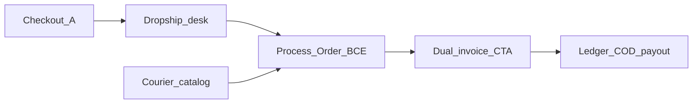

# Shop & Order — Dropship Iteration 0 (Dummy UI)

Clickable UI shells for dropship ops before backend RPCs land. Domain rules (fields, statuses, policies) stay in [SHOP_ORDER_DROPSHIP.md](SHOP_ORDER_DROPSHIP.md). This file is the **UI task spec** — page inventory, build sequence, and file targets. Detail will be enhanced later.

Related: [SHOP_ORDER.md](SHOP_ORDER.md), [SALES_INVOICE.md](SALES_INVOICE.md), [SHOP_ORDER_DROPSHIP.md](SHOP_ORDER_DROPSHIP.md) §16–16a.

---

## Goal

Ship a **dummy end-to-end flow** so staff and middle men can click through checkout → Process Order → dual invoice → settlement without new migrations or RPCs. Local/mock state only in I0.

**Build order (locked):** dummy UI flow → backend (schema/RPCs) → API integration.

---

## Iteration map

| Iter | Goal |
|------|------|
| **I0 Dummy UI** | Routes, forms, steppers, print stubs with local/mock state — no new RPCs |
| **I1 Backend** | Migrations + RPCs per [SHOP_ORDER_DROPSHIP.md](SHOP_ORDER_DROPSHIP.md) §14 (status, consignment, courier, dual invoice, ledger) |
| **I2 Wire-up** | Replace mocks with real repository/service calls |

---

## Implementation sequence (I0)

Work in this order. Later steps depend on routes, types, and mock store from step 1.

| Seq | Task | Pages / files | Depends |
|-----|------|---------------|---------|
| **1** | Routes, nav, types, i18n, dummy store | `adminRoutes.ts`, `moduleRegistry.ts`, `types/index.ts`, `dropshipDummyStore.ts`, i18n | — |
| **2** | Checkout recipient (block A) | `ShopCheckoutPage.vue` | 1 |
| **3** | Recipient profiles | `RecipientProfilesPage.vue` | 1 |
| **4** | Merchant sender defaults | `ShopFormDialog.vue` | 1 |
| **5** | Courier catalog + return policy | `DropshipCouriersPage.vue` | 1 |
| **6** | Dropship order list | `DropshipOrdersPage.vue` | 1, 5 |
| **7** | Process Order desk (B–E) | `DropshipOrderDetailPage.vue` | 1, 4, 5, 6 |
| **8** | Dual invoice stubs | `CreateDropshipInvoiceDialog.vue`, `InvoiceDetailsPage.vue`, `InvoicePreviewPage.vue` | 7 |
| **9** | Ledger + COD / payout stubs | `DropshipLedgerPage.vue`, light `InvoiceDetailsPage.vue` | 1, 7 |
| **10** | Customer order visibility | `CustomerOrderDetailPage.vue`, `CustomerOrdersPage.vue` | 1 |

---

## Task checklist

| ID | Task | Status |
|----|------|--------|
| `i0-routes-nav` | `adminRoutes` + `moduleRegistry` + i18n + dummy store | completed |
| `i0-checkout-recipient` | `ShopCheckoutPage` + `RecipientProfilesPage` block A fields | completed |
| `i0-merchant-courier` | `ShopFormDialog` sender defaults + `DropshipCouriersPage` | completed |
| `i0-desk-process` | `DropshipOrdersPage` + `DropshipOrderDetailPage` Process Order / print stubs | completed |
| `i0-dual-settle` | Dual invoice CTA stubs + `DropshipLedgerPage` + customer tracking | completed |

---

## Pages to create or update (I0)

### 1. Order placement (checkout recipient)

| | |
|--|--|
| **Feature** | Middle man enters full courier-ready recipient at confirm |
| **Update** | [ShopCheckoutPage.vue](../web/src/modules/shop_order/pages/ShopCheckoutPage.vue), i18n `shop` keys |
| **UI** | Expand dropship block: name, phone, secondary phone, address + inside/outside helper, district, thana (static dropdowns → text). Keep face total / charges as today; COD fee stays provisional (not locked to courier yet). |

### 2. Recipient module

| | |
|--|--|
| **Feature** | Reusable recipient profile matches courier fields (for desk + future save-from-checkout) |
| **Update** | [RecipientProfilesPage.vue](../web/src/modules/sales_invoice/pages/RecipientProfilesPage.vue) + create/edit dialog if present; types under `sales_invoice` |
| **UI** | Add secondary phone, district, thana to list columns and form. Dummy: client-only fields until schema lands. |

### 3. Merchant / sender (pickup defaults)

| | |
|--|--|
| **Feature** | Shop-level sender defaults copied onto Process Order (block C) |
| **Update** | [ShopFormDialog.vue](../web/src/modules/shop_order/components/ShopFormDialog.vue) (dropship section) and/or small panel on process desk |
| **UI** | Fields: sender name, pickup phone, pickup address, payout account type + info. Shown only when `shop_type = dropship`. |

### 4. Courier service admin

| | |
|--|--|
| **Feature** | Maintain Steadfast / Pathao / REDX catalog (COD + active flag) |
| **Create** | `web/src/modules/shop_order/pages/DropshipCouriersPage.vue` |
| **Route** | `/:slug/app/shop/dropship/couriers` via [adminRoutes.ts](../web/src/modules/shop_order/routes/adminRoutes.ts); nav under Shop & Order |
| **UI** | Table + edit dialog: name, code, active, COD mode/percent/flat, notes. Seed three rows in mock store. |

### 5. Courier return policy UI

| | |
|--|--|
| **Feature** | Per-courier return fee / attempts / open-box policy (same catalog, second tab or section) |
| **Update** | Same `DropshipCouriersPage.vue` (tab **Return policy**) — not a separate route in I0 |
| **UI** | Return fee mode, inside/outside Dhaka rules, attempt count, hub hold, open-box default + notes. Read-only policy summary chip used later on return dialog. |

### 6. Dropship order list (ops desk)

| | |
|--|--|
| **Feature** | Dropship-only order queue (separate from vendor/fixed-price) |
| **Create** | `web/src/modules/shop_order/pages/DropshipOrdersPage.vue` |
| **Route** | `/:slug/app/shop/dropship` |
| **UI** | Filter by status stepper chips; columns: order no, middle man, recipient, courier, AWB, status, COD collect. Row → process desk. Dummy: filter existing orders by `shop_type_snapshot === 'dropship'` or mock list. |

### 7. Courier shipment entry (Process Order desk)

| | |
|--|--|
| **Feature** | Process Order → enter parcel/payment (B), sender (C), driver notes (D), courier tracking (E); print packing slip/label stubs |
| **Create** | `web/src/modules/shop_order/pages/DropshipOrderDetailPage.vue` (preferred) **or** heavy branch on [StaffOrderDetailPage.vue](../web/src/modules/shop_order/pages/StaffOrderDetailPage.vue) |
| **Route** | `/:slug/app/shop/dropship/:id` |
| **UI** | Replace primary **Fulfill to Invoice** with **Process Order**. Sections: editable recipient A; parcel + COD; sender; open-box + notes; courier picker + AWB / consignment id / tracking URL. Status stepper (processing → ready_for_pickup → shipped → delivered / returned). Buttons: Print packing slip, Print label (window.print stubs). **Create Dual Invoice** visible only after delivered (navigates stub or toast). |

### 8. Dual invoice (create + views)

| | |
|--|--|
| **Feature** | From delivered order, open dual invoice (accounting vs recipient face) |
| **Update** | Process desk CTA → [CreateDropshipInvoiceDialog.vue](../web/src/modules/sales_invoice/components/CreateDropshipInvoiceDialog.vue) / [InvoiceDetailsPage.vue](../web/src/modules/sales_invoice/pages/InvoiceDetailsPage.vue) / [InvoicePreviewPage.vue](../web/src/modules/sales_invoice/pages/InvoicePreviewPage.vue) |
| **UI** | I0: CTA + confirm dialog prefilled from order mock; on details page, toggle **Accounting / Recipient** print view (brand + face prices). No post RPC yet — toast “dummy create”. |

### 9. Middle-man payout + courier COD collection

| | |
|--|--|
| **Feature** | Settlement desk: ledger credits/debits; record courier remittance vs middle-man payout |
| **Create** | `web/src/modules/shop_order/pages/DropshipLedgerPage.vue` |
| **Route** | `/:slug/app/shop/dropship/ledger` |
| **Update (light)** | [InvoiceDetailsPage.vue](../web/src/modules/sales_invoice/pages/InvoiceDetailsPage.vue) payout/collection panels already show middle-man — keep; add remittance ref fields as disabled stubs until I1 |
| **UI** | Ledger table: order, type (credit profit / return_fee_uninvoiced / clawback), amount, balance. Actions: **Record courier remittance** (batch id + bank trx), **Settle middle-man payout** (dummy confirm). |

### 10. Customer / middle-man order visibility

| | |
|--|--|
| **Feature** | Show dropship status + tracking on customer order detail |
| **Update** | [CustomerOrderDetailPage.vue](../web/src/modules/shop_order/pages/CustomerOrderDetailPage.vue), [CustomerOrdersPage.vue](../web/src/modules/shop_order/pages/CustomerOrdersPage.vue) |
| **UI** | Status includes returned / ready_for_pickup; tracking URL link when present; optional “charge cut from profit” line when dummy charge exists. |

---

## Shared wiring (I0 only)

| File | Change |
|------|--------|
| [adminRoutes.ts](../web/src/modules/shop_order/routes/adminRoutes.ts) | Register dropship list, detail, couriers, ledger |
| [moduleRegistry.ts](../web/src/modules/navigation/moduleRegistry.ts) | Menu entries under Shop & Order (`shop_dropship` stub grant or reuse `shop_order_mgmt`) |
| [types/index.ts](../web/src/modules/shop_order/types/index.ts) | Client types for consignment A–E + courier mock |
| i18n `en-US` / `bn` `shop_admin` / `shop` | Labels for new fields and CTAs |
| Optional mock | `web/src/modules/shop_order/stores/dropshipDummyStore.ts` — in-memory courier + consignment until I2 |

### New routes (target)

| Screen | Path | Submodule |
|--------|------|-----------|
| Dropship order list | `/:slug/app/shop/dropship` | `shop_dropship` |
| Process Order desk | `/:slug/app/shop/dropship/:id` | `shop_dropship` |
| Courier services admin | `/:slug/app/shop/dropship/couriers` | `shop_dropship` |
| Middle-man payout ledger | `/:slug/app/shop/dropship/ledger` | `shop_dropship` |
| Dropship order confirm | `/:slug/shop/checkout` (dropship shop) | `shop_cart` |
| Customer order status | `/:slug/shop/orders/:id` | `shop_order_mgmt` |

---

## Out of I0 (later iterations)

- Migrations / RPCs in [SHOP_ORDER_DROPSHIP.md](SHOP_ORDER_DROPSHIP.md) §14
- Live courier API
- Regenerating `supabase.ts`
- Real ledger posting and COD remittance batch matching

---

## Agent notes

- Update task checklist status in this file when a slice completes.
- Do not add backend migrations in I0.
- Prefer new `DropshipOrderDetailPage.vue` over branching `StaffOrderDetailPage.vue` heavily.
- Print packing slip / label = `window.print` stubs from order mock; no `global_invoices` row in I0.
