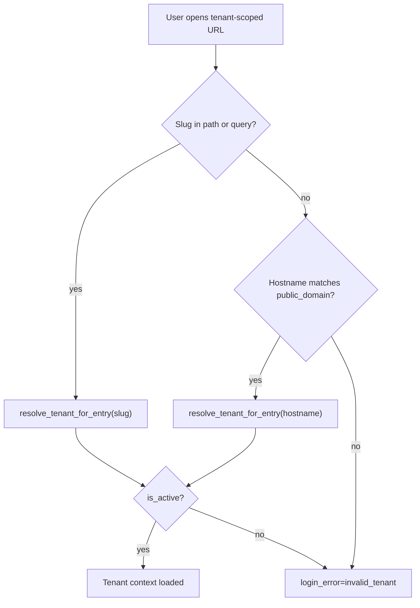
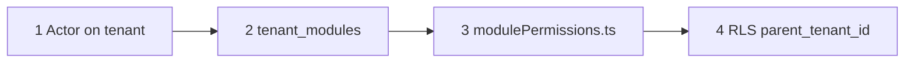
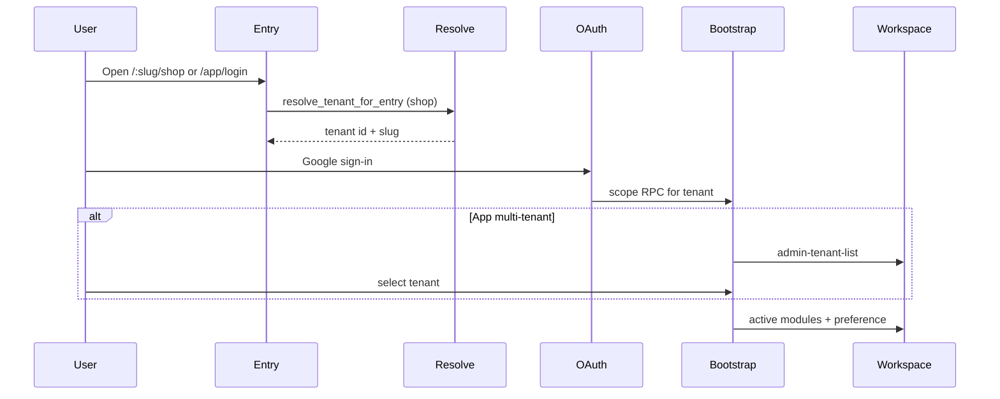

# Tenant Model and Access Control

BrandWala / TradeFlow BD is a **multi-tenant platform** for parent companies and sister concerns (child tenants). Every business operation runs inside a **tenant workspace** identified by slug, modules, and hierarchy role.

This document answers:

- What is a tenant and what types exist?
- What is each tenant type responsible for?
- How is a tenant resolved from URLs and hostnames?
- How does tenant context drive access, modules, and data?

For application scopes (Platform, App, Shop, Investor), see [APP_SCOPES_AND_ACCESS.md](APP_SCOPES_AND_ACCESS.md). For full architecture and module catalog, see [MASTER_PLAN.md](MASTER_PLAN.md). For global reference catalogs (currency, market, payment methods, units), see [GLOBAL_REFERENCE_DATA.md](GLOBAL_REFERENCE_DATA.md). For login implementation detail, see [LOGIN_NAV_PERMISSION_FLOW.md](LOGIN_NAV_PERMISSION_FLOW.md).

---

## 1. Tenant overview

| Tenant type | `tenants.parent_id` | Typical slug use | Primary operators | Auth surface |
|-------------|---------------------|------------------|-------------------|--------------|
| **Parent company** | `NULL` (top-level) | `/{parent-slug}/app` | Parent admin, staff | `memberships` on parent tenant |
| **Child (sister concern)** | `= parent.id` | `/{child-slug}/app`, `/{child-slug}/shop` | Child admin, staff; customer group members | `memberships` + `customer_group_members` |
| **Standalone** | `NULL`, no children | `/{slug}/app` | Same as combined parent+child in one tenant | `memberships`; `parent_tenant_id := tenant_id` in data |

**Hierarchy rule:** Only **one layer**. A child cannot have children. A parent with children cannot be assigned a parent.

### What each tenant type is not

| Type | Is not |
|------|--------|
| **Parent** | A customer-facing shop tenant by default. Parent runs shipments, global stock, consolidated ledger; shop modules usually live on child slugs. |
| **Child** | The owner of physical global stock. Child sees **allocations** and issues invoices; parent owns `global_stocks`. |
| **Standalone** | A special schema — it uses the same global tables with `parent_tenant_id = tenant_id`. |

### Core tenant record

| Field | Purpose |
|-------|---------|
| `id` | Primary key (`bigint`) |
| `name` | Display name |
| `slug` | URL identifier; unique; lowercase hyphenated |
| `public_domain` | Optional hostname for shop entry without slug (globally unique) |
| `parent_id` | `NULL` = parent or standalone; set = child of that parent |
| `is_active` | Inactive tenants cannot be resolved for entry |
| `preference` | JSON settings (module-specific defaults, UI config) |

---

## 2. What each tenant type is used for

### Parent company

Owns consolidated operations across sister concerns:

| Domain | Responsibility | Typical modules |
|--------|----------------|-----------------|
| Procurement intake | Receives child orders/costing into shipments | `global_shipment`, legacy `shipment` |
| Stock | Physical inventory pools | `global_stock`, `global_stock_type` |
| Allocation | Virtual slices to children | `global_stock` (allocate UI), child reads via `inventory` |
| Consolidated ledger | Parent-wide accounting | `global_accounting_ledger`, `global_shipment_accounting` |
| Capital | Investors and cash circulation | `global_investor`, `global_investor_shipment`, `investor_portal` |
| Administration | Parent tenant settings, memberships | Platform-assigned modules; parent `admin` membership |

Parent **does not** self-issue desk invoices via UI (`global_invoice` issues from child `tenant_id`). Parent admins are members of the **parent tenant only** — not automatically members of every child.

### Child (sister concern)

Operating company facing customers and day-to-day sales:

| Domain | Responsibility | Typical modules |
|--------|----------------|-----------------|
| Customer CRM | Customer groups and shop users | `customer_groups`, shop auth |
| Procurement | Orders, costing files, product-based costing | `order_management`, `costing_file`, `product_based_costing` |
| Tenant stock | View allocated parent stock | `inventory` (Tenant Stock) |
| Sales | Desk and commerce invoices | `global_invoice`, `commerce_*` |
| Shop | B2B and commerce customer portals | `store`, `cart`, `commerce_shop`, `commerce_cart` |
| Local accounting views | Tenant shipment/invoice accounting | `accounting`, `commerce_accounting` |

Child business data carries `tenant_id` = child and `parent_tenant_id` = parent for rollup RPCs.

### Standalone

Single company with no sister concerns:

- Same module mix as parent + child combined for that business
- `resolve_parent_tenant_id(tenant_id)` returns the tenant's own id
- Enables global tables without maintaining a separate parent row

### End-to-end flow (parent + child)

```mermaid
flowchart LR
  childOrders["Child: orders / costing"] --> parentShip["Parent: shipment"]
  parentShip --> globalStock["Parent: global_stocks"]
  globalStock --> alloc["child_tenant_stock_allocations"]
  alloc --> childInvoice["Child or parent: invoice"]
  childInvoice --> ledger["global_accounting_ledger"]
  ledger --> capital["Parent: cash + investors"]
```



Commerce sells from **parent `global_stocks`**; it does not create inbound shipments.

---

## 3. URL model and tenant resolution

Tenant-scoped scopes use the pattern `/:tenantSlug/<scope>/...`. The slug is the tenant's canonical public identifier.

### Canonical patterns

| Context | Pattern | Example |
|---------|---------|---------|
| App workspace | `/:tenantSlug/app/*` | `/acme-retail/app/dashboard` |
| Shop portal | `/:tenantSlug/shop/*` | `/acme-retail/shop/dashboard` |
| Investor portal | `/:tenantSlug/investor/*` | `/acme-holdings/investor/portfolio` |
| App tenant picker | `/:tenantSlug?/app/tenants` | `/app/tenants` or `/acme/app/tenants` |
| Tenant admin (parent admin) | `/:tenantSlug/app/tenants/:id` | Membership and preferences |
| Platform tenant CRUD | `/platform/tenants` | Superadmin only; no slug |

### Resolution methods



| Method | When used | Notes |
|--------|-----------|-------|
| **Route slug** | `/:tenantSlug/shop/login`, App routes after tenant selection | Primary; `getTenantSlugFromRoute()` also reads `?tenant_slug=` |
| **Public domain** | Production shop on custom hostname | `tenants.public_domain` must match `window.location.hostname`; not used on `localhost` |
| **RPC** | `resolve_tenant_for_entry(p_slug, p_hostname)` | Called before shop login; hostname match takes priority over slug when both present |

### App tenant selection and slug alignment

Internal users may belong to **multiple tenants** via separate `memberships` rows.

| Step | Behavior |
|------|----------|
| Login without slug | Redirect to `admin-tenant-list` if multiple memberships |
| User picks tenant | `get_app_bootstrap_context` loads modules + preference |
| Navigate modules | Route slug must match `authStore.selectedTenant.slug` |
| Slug mismatch | Guard rewrites URL via `getAppRouteLocation()` |

Post-selection navigation by role:

- **admin** → `/:slug/app/tenants/:id` (tenant admin hub)
- **staff** → `/:slug/app/dashboard`
- **viewer** → `/:slug/app/costing/viewer`

Implemented in `useAdminTenantSelection.ts`.

### Shop tenant binding

After shop login, session is bound to **one tenant**. If the user hits a different slug in the URL, guards redirect to the session tenant dashboard. Shop cannot switch tenants without logging out and entering another tenant's shop URL.

### Legacy redirects

Old path orders are rewritten in `web/src/router/routes.ts`:

- `/app/:tenantSlug/...` → `/:tenantSlug/app/...`
- `/shop/:tenantSlug/...` → `/:tenantSlug/shop/...`

---

## 4. Access control model

Tenant access uses **four layers**. Tenant identity is the anchor for layers 2–4.



| Layer | Source | Tenant-specific control |
|-------|--------|-------------------------|
| **1 — Actor** | `memberships`, `customer_group_members` | Which human can act **for** this tenant |
| **2 — Modules** | `tenant_modules` | Which features are on for this tenant (no parent→child inheritance) |
| **3 — Role matrix** | `modulePermissions.ts` | Role abilities inside enabled modules |
| **4 — Data** | RLS + RPCs | Rows filtered by `tenant_id` / `parent_tenant_id` |

**Effective permission:**

```
valid actor for tenant
  AND module enabled on that tenant
  AND role allowed in matrix
  AND RLS permits row
```

### Membership (`memberships`)

| Role | `tenant_id` | Scope | Notes |
|------|-------------|-------|-------|
| `superadmin` | `NULL` | Platform only | Cross-tenant administration |
| `admin` | tenant id | App | Full tenant admin |
| `staff` | tenant id | App | Operational access |
| `viewer` | tenant id | App | Limited (costing file viewer) |
| `investor` | parent tenant id | Investor only | External capital partner; linked to `investors` profile |

Rules:

- One membership row per email + tenant (unique)
- Parent admin on parent tenant does **not** auto-access child tenants
- Cross-tenant parent visibility uses **RPCs** with `parent_tenant_id`, not extra membership rows
- **`investor` is scope-isolated:** login on `/:tenantSlug/investor` only; does **not** grant App, Shop, or Platform access
- **`investor` is parent-tenant only:** assigned on the company that owns capital (`global_investor`); not on child sister concerns
- Parent admins create investor memberships from tenant admin (`/:tenantSlug/app/tenants/:id`); each row links to an `investors` capital profile via `investor_id` (planned column)

**Investor membership vs capital profile**

| Concern | Table | Managed in |
|---------|-------|------------|
| Capital balances, shipment cost-share | `investors`, `investor_transactions`, `shipment_investments` | App — `global_investor` modules |
| Portal login (who can open Investor scope) | `memberships` (`role = 'investor'`) | App — tenant membership admin |

> **Migration note:** Today portal auth still uses `investor_accounts`. The target model replaces that with `memberships.role = 'investor'` + `investor_id`. See §10.

### Customer groups (child tenants)

| Table | Scope |
|-------|-------|
| `customer_groups` | Belongs to child `tenant_id`; optional `parent_tenant_id` |
| `customer_group_members` | Shop auth; roles: `admin`, `negotiator`, `staff` |

`customer_groups` are **child-tenant only** (enforced by CHECK). Shop users are always scoped to one tenant + one customer group per session.

### Module enablement (`tenant_modules`)

- Superadmin assigns modules per tenant on Platform (`/platform/modules` or tenant details)
- **No inheritance:** enabling `global_stock` on parent does not enable it on children
- Bootstrap RPCs return `active_module_keys` for the current tenant only
- Each guarded route checks `requiredModule` against that list

Typical assignment by tenant type — full table in MASTER_PLAN §15.5:

| Module family | Parent | Child | Standalone |
|---------------|--------|-------|------------|
| `global_shipment`, `global_stock` | Yes | — | Yes |
| `order_management`, `commerce_*` | — | Yes | Yes |
| `inventory` (Tenant Stock) | Yes | Yes | Yes |
| `global_accounting_ledger` | Yes | — | Yes |
| `investor_portal` | Yes (parent slug) | — | Optional |

---

## 5. Route guards and tenant context

App and Shop guards enforce tenant alignment in addition to scope and module checks.

### App guard pattern

1. `requireTenantContext: true` — `authStore.tenantId` must be set
2. `validateAccess` compares `getTenantSlugFromRoute(to)` vs `authStore.selectedTenant.slug`
3. Missing selected tenant on dashboard → `admin-tenant-list`
4. Module routes add `requiredModule: '<key>'`

### Shop guard pattern

1. Requires `actorType === 'customer_group_member'`
2. Requires `customerGroupId` and session tenant slug
3. Normalizes URL to session tenant when slug missing or wrong

### Platform tenant routes

`/platform/tenants` — superadmin only; manages all tenants, `parent_id`, `public_domain`, active flag.

### Tenant admin routes (App)

`/:tenantSlug/app/tenants/:id` — tenant `admin` only; membership management and preferences for **selected tenant id** must match route `:id`. Includes internal roles (`admin`, `staff`, `viewer`) and **`investor`** portal access on parent tenants.

### Investor guard pattern

1. Requires `scope === 'investor'` and `role === 'investor'` (session `matchedRole`)
2. Requires `investor_portal` in `activeModuleKeys`
3. Tenant slug in URL must match session tenant
4. Investor memberships are **excluded** from App tenant picker and `get_app_bootstrap_context`

---

## 6. Login and workspace flow



### Bootstrap RPCs

| Scope | RPC | Returns |
|-------|-----|---------|
| App | `get_app_bootstrap_context(p_email, p_tenant_id, p_membership_id)` | Member, tenant, `active_module_keys`, `tenant_preference` |
| Shop | `check_shop_login_access` + shop bootstrap | Customer group, modules |
| Investor | `check_login_membership(p_email, 'investor')` then investor bootstrap | Membership (`role = 'investor'`), linked `investor_id`, `investor_portal` module |

### Session tenant fields

Stored in `AuthAccessSnapshot` (`brandwala.auth.access.v2`):

- `tenant.id`, `tenant.slug`, `tenant.name`
- `activeModuleKeys` for this tenant
- App: `tenantStore.selectedTenant` mirrors selection for guards

### Tenant preferences

- Stored in `tenants.preference` (JSONB)
- Admin UI: `/:tenantSlug/app/tenants/:id/preferences`
- Registry: `config/tenantPreferenceFields.ts`
- Cached in `tenantPreferenceStore` on login/switch

---

## 7. Data ownership and isolation

### `parent_tenant_id` convention

Many global tables carry both:

- `tenant_id` — operating sister concern (issuer, child context)
- `parent_tenant_id` — rollup parent for consolidated RPCs

Standalone: `parent_tenant_id = tenant_id`.

### Stock network

`search_stock_network(context_tenant_id, mode)`:

| Tenant type | `page` mode | `invoice` mode |
|-------------|-------------|----------------|
| Parent | Full global stock pool | Cross-tenant pick for network |
| Child | Allocated quantities only | Falls back to parent pool when own allocation empty |

### Parent consolidated access

Parent views child data through **security-definer RPCs** filtered by `parent_tenant_id`, not by giving parent users membership on child tenants.

---

## 8. Platform administration

Superadmin tenant lifecycle (`/platform/tenants`):

| Action | RPC |
|--------|-----|
| List | `list_tenants_for_superadmin` |
| Create | `create_tenant_for_superadmin(name, slug, is_active, public_domain, parent_id)` |
| Update | `update_tenant_for_superadmin` |
| Delete | `delete_tenant_for_superadmin` |

**`parent_id` constraints** (DB trigger `enforce_tenant_one_layer_hierarchy`):

- Parent must be top-level (`parent_id IS NULL`)
- Tenant with children cannot become a child
- No self-reference

**Slug rules:** lowercase, hyphenated, unique. Auto-generated from name in UI unless edited manually.

**`public_domain` rules:** optional, globally unique, normalized (no scheme/port).

---

## 9. Key code references

| Concern | File |
|---------|------|
| Tenant types | `web/src/modules/tenant/types/index.ts` |
| Tenant CRUD store/service | `web/src/modules/tenant/stores/tenantStore.ts`, `services/tenantService.ts` |
| Slug and entry resolution | `web/src/modules/tenant/utils/tenantRouteContext.ts` |
| Admin tenant selection | `web/src/modules/tenant/composables/useAdminTenantSelection.ts` |
| Tenant routes | `web/src/modules/tenant/routes/index.ts` |
| Preference registry | `web/src/modules/tenant/config/tenantPreferenceFields.ts` |
| Entry RPC | `supabase/migrations/20260402170000_tenant_entry_resolution.sql` |
| Hierarchy trigger | `supabase/migrations/20260709000000_b1_global_foundation.sql` |
| Parent/child RPCs | `supabase/migrations/20260703000000_tenant_parent_child_relationship.sql` |

---

## 10. Investor membership — target model and rollout

The **`investor` member type** unifies portal provisioning with tenant membership admin. Investor scope stays isolated; only the auth source moves from `investor_accounts` into `memberships`.

### Target `memberships` shape (planned)

| Field | `investor` role |
|-------|-----------------|
| `role` | `'investor'` (new `app_role` enum value) |
| `tenant_id` | Parent company tenant |
| `email` | Google OAuth login email |
| `investor_id` | FK → `investors.id` (capital profile) |
| `is_active` | Admin can revoke portal access without deleting capital history |

### Scope isolation rules

| Login scope | Matching membership roles |
|-------------|---------------------------|
| `platform` | `superadmin` only |
| `app` | `admin`, `staff`, `viewer` — **never** `investor` |
| `investor` | `investor` only |

Same email may hold both `staff` and `investor` on one tenant; each scope login uses its own role filter.

### Implementation checklist (not yet done)

1. **DB:** Add `investor` to `app_role`; add `memberships.investor_id`; migrate `investor_accounts` → memberships; tighten RLS so `investor` role reads only its linked `investor_id`
2. **RPCs:** Extend `check_login_membership` for `'investor'` scope; update investor bootstrap; exclude `investor` from App bootstrap and tenant list
3. **Policies:** Extend `can_assign_membership_role` so parent tenant admins can assign `investor`
4. **Frontend:** Tenant admin UI to add investor members; investor login uses `actorType: 'membership'`, `role: 'investor'`
5. **Deprecate:** `investor_accounts` after migration

---

## 11. Related documentation

| Document | Contents |
|----------|----------|
| [APP_SCOPES_AND_ACCESS.md](APP_SCOPES_AND_ACCESS.md) | Platform / App / Shop / Investor scopes and redirects |
| [MASTER_PLAN.md](MASTER_PLAN.md) | Index: tenant summary, §15 permissions, module assignment |
| [INVESTOR_CAPITAL.md](INVESTOR_CAPITAL.md) | Investor membership, capital module, portal scope |
| [LOGIN_NAV_PERMISSION_FLOW.md](LOGIN_NAV_PERMISSION_FLOW.md) | Auth bootstrap and navigation |
| [document/core-backend-architecture.md](../document/core-backend-architecture.md) | Membership and customer actor tables |
| [web/src/modules/tenant/README.md](../web/src/modules/tenant/README.md) | Tenant module RPC and preference notes |

---

## Quick reference

**One-line tenant flow:**

```
resolve tenant (slug or domain) → authenticate actor for that tenant → load tenant_modules → enforce role matrix → RLS by tenant_id / parent_tenant_id
```

**Which tenant for whom:**

- Parent warehouse team → `/{parent-slug}/app` (shipments, global stock, ledger)
- Sister concern sales team → `/{child-slug}/app` (invoices, commerce admin)
- Wholesale buyer → `/{child-slug}/shop`
- External investor → `/{parent-slug}/investor`
