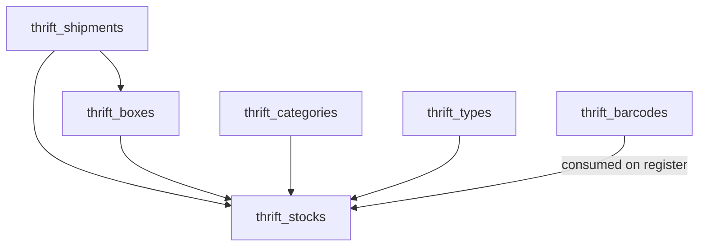
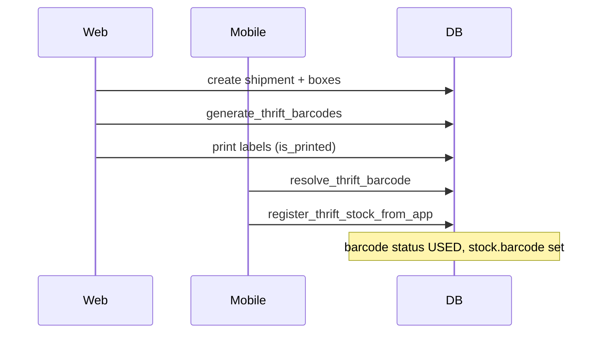

# Thrift — Stock & Catalog

BrandWala / TradeFlow BD includes a **standalone Thrift vertical** for second-hand retail: inbound shipments, box tracking, stock registration with barcodes, and a shared category/type catalog. Thrift is **tenant-scoped** and **not integrated** with the global entity model in phase 1 (locked decision **D12** in [MASTER_PLAN.md](MASTER_PLAN.md)).

Related: [MASTER_PLAN.md](MASTER_PLAN.md) (§14 row 32, §17, D12), [APP_SCOPES_AND_ACCESS.md](APP_SCOPES_AND_ACCESS.md), [GLOBAL_REFERENCE_DATA.md](GLOBAL_REFERENCE_DATA.md) (currencies), Thrift-app [AI_ARCHITECTURE.md](../../Thrift-app/AI_ARCHITECTURE.md) (mobile registration flows).

---

This document answers:

- What is the Thrift vertical and how do shipment, box, stock, barcode, category, and type relate?
- Which module keys, routes, tables, and RPCs are used today?
- What is the barcode lifecycle and how does stock registration work (web + mobile)?
- What is implemented vs still backend-only?
- How is the web code organized today, and what refactor is planned?

---

## 1. Overview

| Property | Thrift vertical |
|----------|-----------------|
| Scope | Per-tenant; isolated from `global_stocks` / `global_invoices` |
| `tenant_id` | Owning tenant on every row |
| Auth surface | App (`memberships`) |
| Module gating | Individual `thrift_*` keys via `tenant_modules` |
| Primary UI | `/:slug/app/thrift/*` |
| Mobile client | Separate **Thrift-app** repo (Capacitor/Android) |
| Status | **STABLE** — catalog/inventory pipeline complete on web + DB |

### Domain flow

```
thrift_shipment → box → stock  (+ barcode assigned at registration)
                              → invoice (DB only — no web UI yet)
```



### What this domain is not

| Topic | Is not |
|-------|--------|
| **Wholesale / global stock** | Does not use `global_stocks` or procurement flows |
| **Box barcodes** | Boxes are identified by text `name` only — no scannable box barcode |
| **Phase 1 global integration** | No parent/child stock sharing across tenants (D12) |
| **Invoice UI** | `thrift_invoices` and accounting ledger exist in DB only |

---

## 2. Entity reference

Each subsection: **purpose**, **table**, **key columns**, **module key**, **route**, **UI**, **scope rules**.

### 2.1 Shipment

| | |
|--|--|
| **Purpose** | Top-level inbound batch — groups boxes and stock from one purchase/shipment |
| **Table** | `thrift_shipments` |
| **Module key** | `thrift_shipment` |
| **Route** | `/app/thrift/shipments` |
| **Page** | `web/src/modules/thrift/pages/ThriftShipmentPage.vue` |
| **TypeScript** | `ThriftShipment` in `web/src/modules/thrift/types.ts` |

| Column | Type | Notes |
|--------|------|-------|
| `id` | bigserial PK | |
| `tenant_id` | bigint FK → `tenants` | |
| `name` | text | Display name |
| `purchase_currency_id` | bigint FK → `global_currencies` | Origin purchase currency |
| `cost_currency_id` | bigint FK → `global_currencies` | Local cost currency |
| `cargo_conversion_rate` | numeric(12,4) nullable | |
| `cargo_rate` | numeric(12,4) nullable | |
| `product_conversion_rate` | numeric(12,4) nullable | |
| `inserted_by`, `created_at`, `updated_at` | | |

Parent of `thrift_boxes` and `thrift_stocks`. Originally referenced wholesale `shipments`; migrated to dedicated `thrift_shipments` (`20260630000300_create_thrift_shipments.sql`).

---

### 2.2 Box

| | |
|--|--|
| **Purpose** | Physical container within a shipment; stock optionally links back to a box |
| **Table** | `thrift_boxes` |
| **Module key** | `thrift_box` |
| **Route** | `/app/thrift/boxes` |
| **Page** | `web/src/modules/thrift/pages/ThriftBoxPage.vue` |
| **TypeScript** | `ThriftBox` in `web/src/modules/thrift/types.ts` |

| Column | Type | Notes |
|--------|------|-------|
| `id` | bigserial PK | |
| `tenant_id` | bigint FK | |
| `shipment_id` | bigint FK → `thrift_shipments` | Required parent |
| `name` | text | **Box identifier (text only — not a barcode)** |
| `weight` | numeric(12,3) nullable | Shown as kg in UI |
| `received_weight` | numeric(12,3) nullable | Shown as kg in UI |
| `inserted_by`, timestamps | | |

**Box barcode:** does not exist. There is no barcode column, table, or scan flow for boxes. Stock items carry barcodes; `box_id` on stock is an optional FK for provenance.

---

### 2.3 Stock

| | |
|--|--|
| **Purpose** | Sellable inventory item — one row per registered piece (or bulk quantity) |
| **Table** | `thrift_stocks` (+ `thrift_pricings`, `thrift_stock_images`) |
| **Module key** | `thrift_stock` |
| **Route** | `/app/thrift/stocks` |
| **Page** | `web/src/modules/thrift_stock/pages/ThriftStockPage.vue` |
| **TypeScript** | `ThriftStock` in `web/src/modules/thrift_stock/types.ts` |

| Column | Type | Notes |
|--------|------|-------|
| `id` | bigserial PK | |
| `tenant_id` | bigint FK | |
| `shipment_id` | bigint FK → `thrift_shipments` | Required |
| `box_id` | bigint FK → `thrift_boxes` nullable | Optional box link |
| `category_id` | bigint FK → `thrift_categories` nullable | |
| `type_id` | bigint FK → `thrift_types` nullable | |
| `shelf_id` | bigint FK → `thrift_shelves` nullable | |
| `barcode` | text nullable | Unique per `(tenant_id, barcode)`; was `sku` until Jul 2026 |
| `name` | text nullable | Optional since mobile registration |
| `brand_name`, `color`, `size`, `note` | text nullable | |
| `section` | enum `thrift_section` nullable | `MALE`, `FEMALE`, `UNISEX`, `KIDS`, `HOME` |
| `condition` | enum `thrift_condition` nullable | `NEW_WITH_TAGS`, `EXCELLENT`, `GOOD`, `FAIR` |
| `stock_type` | enum `thrift_stock_type` | `SINGLE`, `BULK` |
| `status` | enum `thrift_stock_status` | `AVAILABLE`, `OUT_OF_STOCK`, `DAMAGED`, `STOLEN` |
| `quantity` | integer | Default 1 |
| `product_weight`, `extra_weight` | numeric nullable | Stored in **grams** (UI converts from kg) |
| `origin_purchase_price` | numeric nullable | |
| `extra_origin_purchase_expense` | numeric nullable | |
| `inserted_by`, timestamps | | |

**Related tables:**

| Table | Purpose |
|-------|---------|
| `thrift_pricings` | 1:1 — `cost_of_goods_sold`, `target_price`, `listed_price`, `extra_expense_cost` (edited inline on stock page) |
| `thrift_stock_images` | `image_url`, `drive_file_id`, `is_primary` |

**List RPC:** `list_thrift_stocks_paginated` — paginated stock with pricing and images.

---

### 2.4 Barcode (stock-level)

| | |
|--|--|
| **Purpose** | Pre-printed label catalog for stock items — not box labels |
| **Table** | `thrift_barcodes` |
| **Module key** | `thrift_barcode` |
| **Routes** | `/app/thrift/barcodes`, `/app/thrift/barcodes/print-preview` |
| **Pages** | `ThriftBarcodePage.vue`, `ThriftBarcodePrintPreviewPage.vue` |
| **TypeScript** | `ThriftBarcode` in `web/src/modules/thrift_barcode/types.ts` |

| Column | Type | Notes |
|--------|------|-------|
| `id` | bigserial PK | |
| `tenant_id` | bigint FK | |
| `barcode_id` | text | Unique per tenant; e.g. `AA-26-000001` |
| `status` | text | `AVAILABLE` or `USED` |
| `is_printed` | smallint | `0` or `1` |
| `inserted_by`, timestamps | | |

**Format:** `{prefix}-{year}-{6-digit-seq}` where `prefix` is 2 characters and `year` is 2 digits (e.g. `AA-26-000001`). Generated in bulk via `generate_thrift_barcodes(p_tenant_id, p_prefix, p_year, p_quantity, p_inserted_by)` — quantities: 50, 100, 150, 200, 300, 400, 500.

**Lifecycle:**

1. Bulk-generated in web → status `AVAILABLE`, `is_printed = 0`
2. Assigned to stock on registration → status `USED`; value copied to `thrift_stocks.barcode`
3. On stock delete → trigger `release_thrift_barcode_on_stock_delete` returns barcode to `AVAILABLE`

**Scan RPC:** `resolve_thrift_barcode` — normalizes scanned input to canonical `barcode_id` (used by Thrift-app).

---

### 2.5 Category

| | |
|--|--|
| **Purpose** | High-level classification (e.g. "Women Clothing") |
| **Table** | `thrift_categories` |
| **Module key** | `thrift_category` |
| **Route** | `/app/thrift/categories` |
| **Page** | `web/src/modules/thrift/pages/ThriftCategoryPage.vue` |
| **TypeScript** | `ThriftCategory` in `web/src/modules/thrift/types.ts` |

| Column | Type | Notes |
|--------|------|-------|
| `id` | bigserial PK | |
| `tenant_id` | bigint nullable | `NULL` when global |
| `is_global` | boolean | Global rows: `tenant_id IS NULL` |
| `name` | text | Unique globally or per tenant |
| `description` | text nullable | |
| `inserted_by`, timestamps | | |

**Scope rules:**

| Scope | `is_global` | `tenant_id` | UI |
|-------|-------------|-------------|-----|
| Global | `true` | `NULL` | Read-only (seeded catalog) |
| Tenant | `false` | tenant FK | CRUD for admin/staff |

**Seeded global:** "Women Clothing" (+ description) in `20260721000000_thrift_global_category_type_catalog.sql`.

---

### 2.6 Type

| | |
|--|--|
| **Purpose** | Product style within a category (e.g. "Midi Dress", "Wrap Dress") |
| **Table** | `thrift_types` |
| **Module key** | `thrift_type` |
| **Route** | `/app/thrift/types` |
| **Page** | `web/src/modules/thrift/pages/ThriftTypePage.vue` |
| **TypeScript** | `ThriftType` in `web/src/modules/thrift/types.ts` |

Same shape as category, plus:

| Column | Type | Notes |
|--------|------|-------|
| `icon` | text nullable | Rendered via `ThriftTypeLabel` component |

**Seeded globals:** 24 dress types under Women Clothing (Mini Dress, Midi Dress, Maxi Dress, …) in the same migration.

---

## 3. Relationships and registration flow

### Web (desk)

1. Create a **shipment** (optionally set purchase/cost currencies and conversion rates).
2. Create **boxes** under the shipment (text `name` + optional weights).
3. Bulk-generate **barcodes** on the barcode page; print labels.
4. Register or edit **stock** on the stock page — assign shipment, box, category, type, shelf, pricing, image.

### Mobile (Thrift-app)

1. Select shipment (and optionally box) in app session state.
2. Scan barcode → `resolve_thrift_barcode`.
3. Register via `register_thrift_stock_from_app` — consumes barcode, writes stock + pricing + image.

Key mobile composable: `Thrift-app/src/composables/useThriftStockRegister.ts`.



---

## 4. RPCs and data access

| RPC / access | Used for |
|--------------|----------|
| `generate_thrift_barcodes` | Web — bulk barcode create |
| `list_thrift_barcodes_paginated` | Web — barcode list + stats |
| `list_thrift_stocks_paginated` | Web — stock list with pricing/images |
| `resolve_thrift_barcode` | Mobile — scan lookup |
| `resolve_thrift_barcode_id_internal` | Internal normalization |
| `register_thrift_stock_from_app` | Mobile — stock create/update |
| `mark_thrift_items_as_sold` | DB only — invoice + stock deduction + ledger |
| Direct Supabase CRUD | Shipments, boxes, categories, types, shelves via `thriftRepository.ts` |

---

## 5. Current state summary

| Area | Web UI | Mobile (Thrift-app) | DB |
|------|--------|---------------------|-----|
| Shipment | Yes | Select in session | Yes |
| Box | Yes | Select in session | Yes |
| Stock | Yes | Register + list + detail | Yes |
| Barcode | Yes + print preview | Scan | Yes |
| Category | Yes | Catalog picker | Yes |
| Type | Yes | Catalog picker | Yes |
| Shelf | Yes | Optional on register | Yes |
| Settings | Yes | — | Yes |
| Invoices / accounting | **No** | **No** | Yes |
| Box barcode | **Does not exist** | — | — |
| Global platform integration | Excluded (D12) | — | — |

**Currency note:** `thrift_currency` module key is deactivated. Currencies live in `global_currencies`; thrift reads them via `thrift_currency` store/repository (also used by tenant preferences and `AppCurrenciesPage`).

---

## 6. Permissions

Module keys (from `modulePermissions.ts`): `thrift_stock`, `thrift_shipment`, `thrift_box`, `thrift_shelf`, `thrift_barcode`, `thrift_category`, `thrift_type`, `thrift_settings`.

| Role | Ability |
|------|---------|
| admin, staff | `view` on all thrift module keys |
| Enabled per tenant | via `tenant_modules` — no parent/child inheritance (D13) |

Each route guard uses its **own** submodule key (e.g. stock page requires `thrift_stock`, not a parent key).

---

## 7. Web module layout — Refactored Structure

Thrift web code has been unified into a single `thrift` module under `web/src/modules/thrift/`:

| Folder | Contents | Module keys |
|--------|----------|-------------|
| `thrift/routes/` | Route definitions for all submodules and single `index.ts` aggregator | `thrift_shipment`, `thrift_box`, `thrift_shelf`, `thrift_category`, `thrift_type`, `thrift_stock`, `thrift_barcode`, `thrift_settings` |
| `thrift/shared/` | Shared components (`ThriftTypeLabel.vue`), stores (`thriftStore.ts`), and repositories (`thriftRepository.ts`) | Shared across all submodules |
| `thrift/shipment/` | Inbound shipments page and type definitions | `thrift_shipment` |
| `thrift/box/` | Box page and type definitions | `thrift_box` |
| `thrift/shelf/` | Shelf page and type definitions | `thrift_shelf` |
| `thrift/category/` | Category page and type definitions | `thrift_category` |
| `thrift/type/` | Type page, typeIcon utils, and type definitions | `thrift_type` |
| `thrift/stock/` | Stock page, stock store, and stock repository | `thrift_stock` |
| `thrift/barcode/` | Barcode management pages, store, repo, and renderer | `thrift_barcode` |
| `thrift/settings/` | Settings page, store, and repository | `thrift_settings` |
| `thrift/currency/` | Currency store, repo, and format utils (reused globally) | Legacy `thrift_currency` |

---

## 8. Refactor Status — COMPLETED

The folder refactoring has been successfully completed. 

### Goal Achieved
One parent module folder with submodule subfolders aligned with the domain scope, simplifying imports, cleaning up `web/src/router/routes.ts` down to a single imported thrift route module, and organizing page, component, and type concerns by domain entity.

### Verification Performed
1. Verified that the `web` build passes successfully (`npm run build`).
2. Confirmed that there are no remaining references to the old `modules/thrift_` paths in `web/src`.
3. Validated that all route guards, component UI, and Pinia stores remain fully functioning without altering behavior or IDs.

---

## 9. Key source files

| Purpose | Path |
|---------|------|
| Core schema + enums | `supabase/migrations/20260628000000_create_thrift_module.sql` |
| Boxes + weight fields | `supabase/migrations/20260629000000_thrift_boxes_and_weight_fields.sql` |
| Dedicated shipments | `supabase/migrations/20260630000300_create_thrift_shipments.sql` |
| Barcode module | `supabase/migrations/20260701000000_thrift_barcodes_module.sql` |
| sku → barcode | `supabase/migrations/20260704000000_replace_sku_with_barcode.sql` |
| Mobile registration RPC | `supabase/migrations/20260706000000_register_thrift_stock_from_app.sql` |
| Global category/type seed | `supabase/migrations/20260721000000_thrift_global_category_type_catalog.sql` |
| Barcode release on delete | `supabase/migrations/20260810000000_release_thrift_barcode_on_stock_delete.sql` |
| Generated DB types | `web/src/types/supabase.ts` |
| Nav registry | `web/src/modules/navigation/moduleRegistry.ts` |
| Route aggregation (today) | `web/src/router/routes.ts` |
