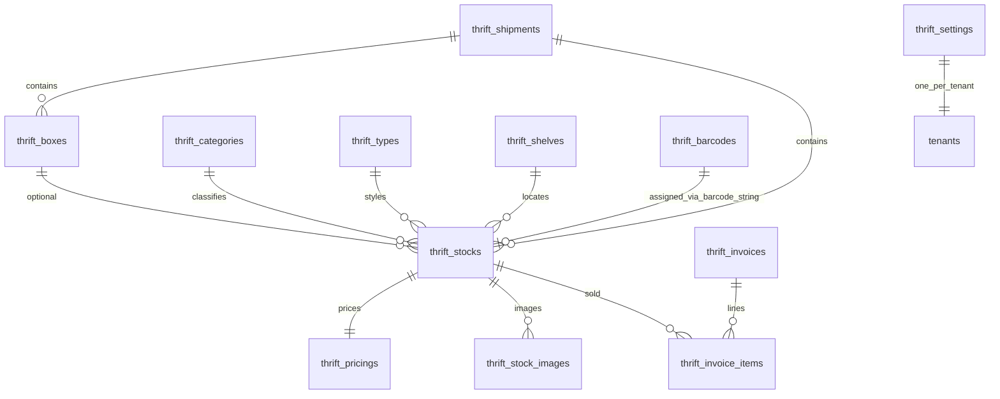
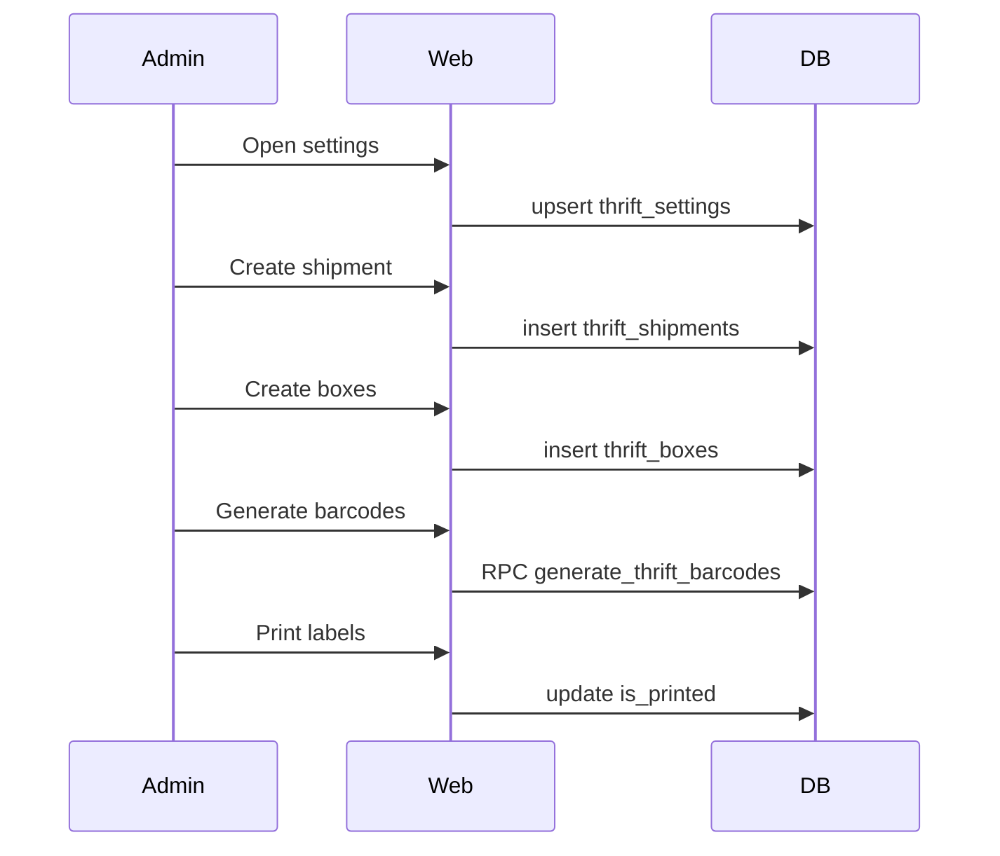
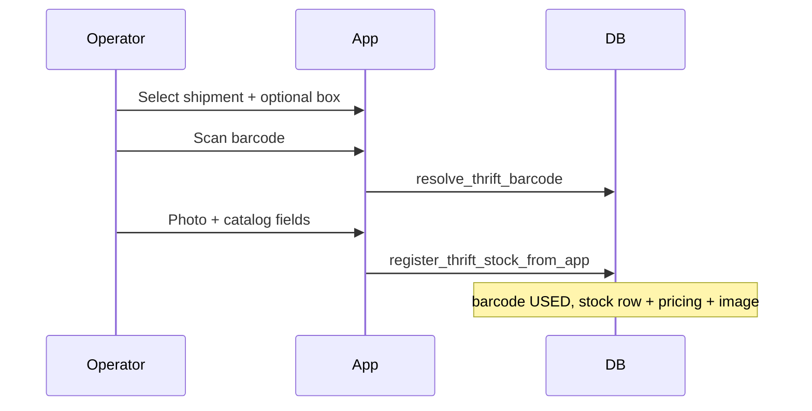
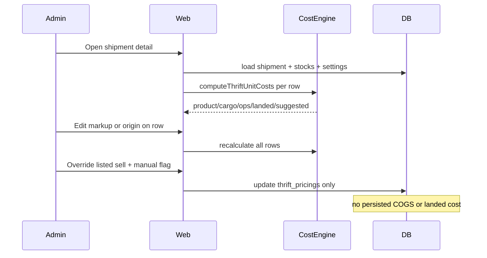
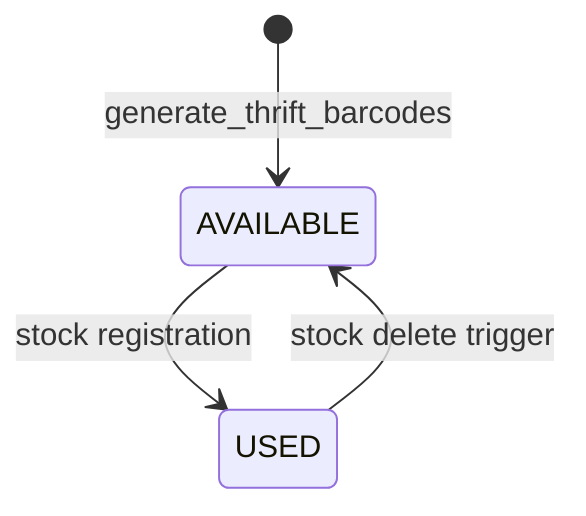
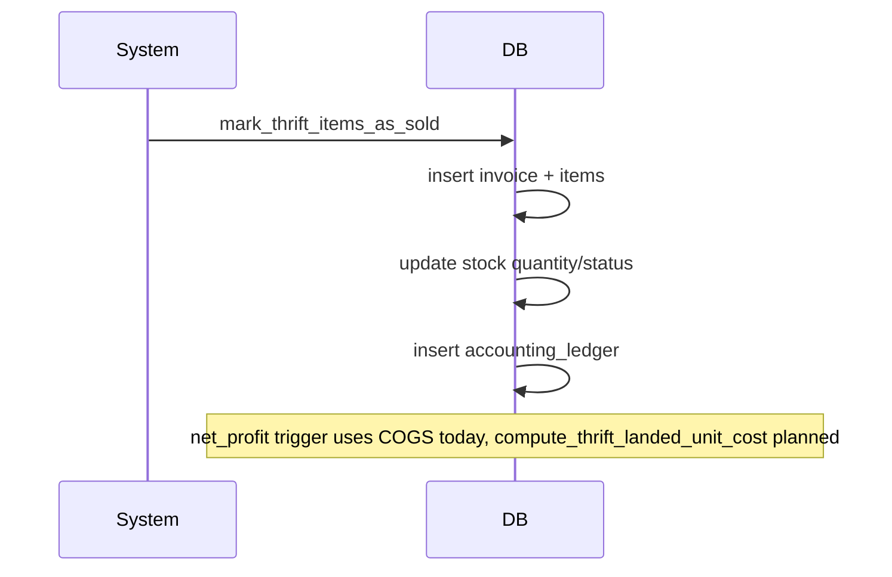

# Thrift — Stock & Catalog

BrandWala / TradeFlow BD includes a **standalone Thrift vertical** for second-hand retail: inbound shipments, box tracking, stock registration with barcodes, and a shared category/type catalog. Thrift is **tenant-scoped** and **not integrated** with the global entity model in phase 1 (locked decision **D12** in [MASTER_PLAN.md](MASTER_PLAN.md)).

Related: [MASTER_PLAN.md](MASTER_PLAN.md), [APP_SCOPES_AND_ACCESS.md](APP_SCOPES_AND_ACCESS.md), [GLOBAL_REFERENCE_DATA.md](GLOBAL_REFERENCE_DATA.md), Thrift-app [AI_ARCHITECTURE.md](../../Thrift-app/AI_ARCHITECTURE.md).

---

This document answers:

- Who uses each Thrift module and why (user stories)?
- What is stored in each table, and what is each table for?
- How are permissions and RLS enforced?
- What is the API surface (RPCs, direct access, routes)?
- What are the end-to-end flow sequences (web + mobile)?
- How does the cost engine work, and what is planned vs implemented?

---

## 1. Overview

| Property | Thrift vertical |
|----------|-----------------|
| Scope | Per-tenant; isolated from `global_stocks` / `global_invoices` |
| `tenant_id` | Owning tenant on every row |
| Auth surface | App (`memberships`) — `admin` / `staff` roles |
| Module gating | Individual `thrift_*` keys via `tenant_modules` (D13) |
| Primary UI | `/:slug/app/thrift/*` |
| Mobile client | **Thrift-app** (Capacitor/Android) |
| Status | Catalog/inventory **STABLE**; costing engine + shipment detail **planned** |

### Domain flow

```
settings + tenant prefs → shipment → box → stock (+ barcode at register)
                              ↓
                    shipment detail (pricing) → invoice (DB only)
```

### Costing design principles (target)

| # | Decision |
|---|----------|
| D-T1 | Stock stores **3 cost inputs only:** `origin_unit_price`, `extra_origin_unit_price`, `additional_charges_cost` |
| D-T2 | Shipment stores rates, cargo weight, labour/transport totals, markup |
| D-T3 | Settings store default origin + hand-tag / sticker unit costs |
| D-T4 | `U` = `SUM(quantity)` per shipment — divisor for cargo and ops |
| D-T5 | Cargo allocated: `shipment_cargo_cost / U` per unit |
| D-T6 | Sell price = `landed_unit_cost × (1 + default_markup_rate)` unless manual override |
| D-T7 | Deprecate stored `cost_of_goods_sold`, `extra_expense_cost`, `target_price` |
| D-T8 | **Scope lock** — barcode, images, catalog, registration flows **unchanged**; only shipment + cost fields change |

---

## 2. User stories

### 2.1 Shipment — `thrift_shipment`

**As a** thrift admin,  
**I want to** create a shipment with purchase/cost currencies and conversion rates,  
**So that** all stock in that batch shares one financial context.

**As a** thrift admin,  
**I want to** record cargo weight, cargo rate, labour total, and transportation total on a shipment,  
**So that** freight and ops costs split across units automatically when rates change.

**As a** thrift admin,  
**I want to** open a **shipment detail** page with every item and a markup rate,  
**So that** I can review landed cost and adjust sell prices in one place.

**As a** thrift admin,  
**I want to** download shipment images from Cloudinary,  
**So that** I can archive media for an inbound batch.

### 2.2 Box — `thrift_box`

**As a** warehouse user,  
**I want to** label physical boxes within a shipment,  
**So that** I can trace which stock came from which container (text name only — no box barcode).

### 2.3 Stock — `thrift_stock`

**As a** desk user,  
**I want** a paginated stock catalog with inline edit, filters, and images,  
**So that** I can manage inventory without leaving the list.

**As a** desk user,  
**I want** origin price to default from settings but stay editable per item,  
**So that** costing inputs are fast yet accurate for outliers.

**As a** desk user,  
**I want** product cost, cargo share, ops share, and landed cost to **recalculate in the UI**,  
**So that** I never maintain stale COGS in the database.

**As a** desk user,  
**I want** suggested sell price from markup with per-row manual override,  
**So that** formula pricing stays flexible.

### 2.4 Barcode — `thrift_barcode`

**As a** thrift admin,  
**I want to** bulk-generate and print barcodes,  
**So that** labels are ready before mobile registration.

**As a** mobile operator,  
**I want to** scan a barcode and register stock against it,  
**So that** each physical item maps to one catalog row.

### 2.5 Category & type — `thrift_category`, `thrift_type`

**As a** thrift admin,  
**I want** a global read-only catalog plus tenant-specific types,  
**So that** registration pickers are consistent but extensible.

### 2.6 Shelf — `thrift_shelf`

**As a** warehouse user,  
**I want to** assign shelf codes to stock,  
**So that** I can find items on the shop floor.

### 2.7 Settings — `thrift_settings`

**As a** thrift admin,  
**I want** default origin unit price and hand-tag / sticker unit costs in settings,  
**So that** registration and ops cost totals stay consistent.

**As a** tenant admin,  
**I want** default shipment currencies in tenant preferences,  
**So that** new shipments pre-fill purchase and cost currency.

### 2.8 Mobile — Thrift-app

**As a** floor operator,  
**I want to** select shipment/box, scan barcode, photograph item, and register stock,  
**So that** intake is fast at the warehouse (costing UI deferred to web).

### 2.9 Invoice — `thrift_invoices` (DB only today)

**As a** future desk user,  
**I want to** sell stock and record profit,  
**So that** revenue and COGS flow to `thrift_accounting_ledger` (no web UI yet).

---

## 3. Data model

Legend: **Today** = in production DB | **Target** = planned costing work | **Stored** vs **Computed**

### 3.0 Table index

| Table | Use case | Module key |
|-------|----------|------------|
| `thrift_shipments` | Inbound batch; rates; shared cost allocation | `thrift_shipment` |
| `thrift_boxes` | Physical containers within a shipment | `thrift_box` |
| `thrift_stocks` | Sellable inventory item | `thrift_stock` |
| `thrift_pricings` | Sell price persistence (1:1 stock) | `thrift_stock` |
| `thrift_stock_images` | Product photos | `thrift_stock` |
| `thrift_barcodes` | Pre-printed label catalog | `thrift_barcode` |
| `thrift_categories` | High-level classification | `thrift_category` |
| `thrift_types` | Style within category | `thrift_type` |
| `thrift_shelves` | Physical shelf location | `thrift_shelf` |
| `thrift_settings` | Tenant defaults (origin, label unit costs) | `thrift_settings` |
| `thrift_invoices` | Sales header | *(no UI)* |
| `thrift_invoice_items` | Sales lines | *(no UI)* |
| `thrift_accounting_ledger` | Revenue/expense/loss entries | *(no UI)* |



---

### 3.1 `thrift_shipments`

**Use case:** Groups an inbound purchase batch. Owns conversion rates, cargo inputs, labour/transport totals, and default markup. All stock in the shipment inherits these for cost allocation.

| Column | Today | Target | Stored |
|--------|-------|--------|--------|
| `id` | PK | | Yes |
| `tenant_id` | FK → `tenants` | | Yes |
| `name` | text | | Yes |
| `purchase_currency_id` | FK → `global_currencies` | | Yes |
| `cost_currency_id` | FK → `global_currencies` | | Yes |
| `product_conversion_rate` | numeric | | Yes |
| `cargo_conversion_rate` | numeric | | Yes |
| `cargo_rate` | numeric | | Yes |
| `total_cargo_weight_kg` | — | numeric | Yes |
| `labor_total_cost` | — | numeric | Yes |
| `transportation_total_cost` | — | numeric | Yes |
| `default_markup_rate` | — | numeric | Yes |
| `inserted_by`, timestamps | | | Yes |

**Computed (never stored):** `U`, `shipment_cargo_cost`, `shipment_ops_cost`.

**Access:** Direct Supabase CRUD from `ThriftShipmentPage.vue`. Detail page **planned**.

---

### 3.2 `thrift_boxes`

**Use case:** Track physical packing boxes inside a shipment. Stock optionally references `box_id` for provenance. **No box barcode.**

| Column | Type | Notes |
|--------|------|-------|
| `id` | bigserial PK | |
| `tenant_id` | FK | |
| `shipment_id` | FK → `thrift_shipments` | Required |
| `name` | text | Box label (text only) |
| `weight`, `received_weight` | numeric | kg in UI |
| `inserted_by`, timestamps | | |

**Access:** `thriftRepository` + `ThriftBoxPage.vue`.

---

### 3.3 `thrift_stocks`

**Use case:** One sellable item (or bulk quantity). Links to shipment, optional box, catalog FKs, barcode string, and cost **inputs**. Catalog/registration attrs unchanged by costing work (D-T8).

| Column | Today | Target | Stored | Notes |
|--------|-------|--------|--------|-------|
| `id`, `tenant_id` | | | Yes | |
| `shipment_id` | FK | | Yes | Required |
| `box_id` | FK nullable | | Yes | |
| `category_id`, `type_id` | FK nullable | | Yes | |
| `shelf_id` | FK nullable | | Yes | |
| `barcode` | text | | Yes | Unique per tenant; from `thrift_barcodes` |
| `name`, `brand_name`, `color`, `size`, `note` | text | | Yes | |
| `section` | enum | | Yes | MALE, FEMALE, … |
| `condition` | enum | | Yes | |
| `stock_type` | enum | | Yes | SINGLE, BULK |
| `status` | enum | | Yes | AVAILABLE, OUT_OF_STOCK, … |
| `quantity` | integer | | Yes | Contributes to `U` |
| `product_weight`, `extra_weight` | numeric | | Yes | Grams in DB |
| `origin_unit_price` | `origin_purchase_price` | rename | Yes | Purchase ccy |
| `extra_origin_unit_price` | `extra_origin_purchase_expense` | rename | Yes | Purchase ccy |
| `additional_charges_cost` | — | new | Yes | Cost ccy |
| `inserted_by`, timestamps | | | Yes | |

**Computed per row:** `product_unit_cost`, `cargo_share_per_unit`, `ops_share_per_unit`, `landed_unit_cost`, `suggested_sell_unit_price`.

---

### 3.4 `thrift_pricings`

**Use case:** 1:1 sell-price row per stock. Target: persist only customer-facing price + manual flag; stop storing computed costs.

| Column | Today | Target |
|--------|-------|--------|
| `stock_id` | FK unique | Keep |
| `listed_price` | numeric | → `listed_unit_price` |
| `is_listed_price_manual` | — | **New** |
| `cost_of_goods_sold` | numeric | **Deprecate** (compute) |
| `extra_expense_cost` | numeric | **Deprecate** (compute) |
| `target_price` | numeric | **Deprecate** (→ suggested sell) |

---

### 3.5 `thrift_stock_images`

**Use case:** Product photos (Cloudinary URL + optional Google Drive `drive_file_id`). Primary flag for list thumbnail. **Unchanged by costing work.**

| Column | Notes |
|--------|-------|
| `stock_id` | FK → `thrift_stocks` |
| `image_url` | Cloudinary URL |
| `drive_file_id` | Optional Drive sync |
| `is_primary` | boolean |

---

### 3.6 `thrift_barcodes`

**Use case:** Pre-generated label pool. Bulk-created on web; consumed on stock registration; released on stock delete. **Unchanged by costing work.**

| Column | Notes |
|--------|-------|
| `barcode_id` | e.g. `AA-26-000001` |
| `status` | `AVAILABLE` / `USED` |
| `is_printed` | 0 / 1 |

---

### 3.7 `thrift_categories` / `thrift_types`

**Use case:** Classification catalog. Global rows (`is_global = true`, `tenant_id IS NULL`) are read-only; tenant rows are CRUD. Types may have `icon`. **Unchanged by costing work.**

| Column | Categories | Types |
|--------|------------|-------|
| `name`, `description` | Yes | Yes |
| `is_global`, `tenant_id` | Yes | Yes |
| `icon` | — | Yes |

---

### 3.8 `thrift_shelves`

**Use case:** Physical shelf codes for stock location. **Unchanged by costing work.**

| Column | Notes |
|--------|-------|
| `name`, `shelf_code`, `location_bay` | Unique `shelf_code` per tenant |

---

### 3.9 `thrift_settings`

**Use case:** Per-tenant defaults for registration and ops cost inputs (one row per `tenant_id`).

| Column | Today | Target |
|--------|-------|--------|
| `tenant_id` | PK/FK | Keep |
| `default_origin_unit_price` | `default_origin_purchase_price` | rename |
| `hand_tag_unit_cost` | — | **New** |
| `hand_tag_unit_currency_id` | — | FK |
| `sticker_unit_cost` | — | **New** |
| `sticker_unit_currency_id` | — | FK |

**Tenant preference (not this table):** `thrift.default_purchase_currency`, `thrift.default_cost_currency` on `tenants.preference`.

---

### 3.10 `thrift_invoices` / `thrift_invoice_items` (DB only)

**Use case:** Record sales, compute line profit, deduct stock. Web UI not built.

| Table | Use case |
|-------|----------|
| `thrift_invoices` | Header: recipient, charges, payment/delivery status |
| `thrift_invoice_items` | Line: `stock_id`, `sold_price`, fees, `net_profit` (trigger) |

**RPC:** `mark_thrift_items_as_sold` — creates invoice, items, updates stock, writes ledger.

---

### 3.11 `thrift_accounting_ledger` (DB only)

**Use case:** Auto-logged revenue, expense, refund, loss from invoices and stock status changes (DAMAGED/STOLEN).

---

## 4. Permissions and access control

### 4.1 Module keys

| Key | Route | Guard |
|-----|-------|-------|
| `thrift_shipment` | `/app/thrift/shipments` | `createAccessGuard` |
| `thrift_box` | `/app/thrift/boxes` | same pattern |
| `thrift_stock` | `/app/thrift/stocks` | |
| `thrift_barcode` | `/app/thrift/barcodes` | |
| `thrift_category` | `/app/thrift/categories` | |
| `thrift_type` | `/app/thrift/types` | |
| `thrift_shelf` | `/app/thrift/shelves` | |
| `thrift_settings` | `/app/thrift/settings` | |

All routes: `requiredScope: 'app'`, `allowedRoles: ['admin', 'staff']`, `requireTenantContext: true`.

### 4.2 Role matrix (`modulePermissions.ts`)

| Role | thrift_* modules |
|------|------------------|
| `admin` | `view` on all 8 keys |
| `staff` | `view` on all 8 keys |
| `superadmin` | `view` on all 8 keys |
| `customer`, `investor`, `vendor`, `guest` | **NO_ACCESS** |

Today only the **`view`** ability exists in code — CRUD is not split by ability; route access implies full page CRUD for admin/staff.

### 4.3 Tenant enablement

- Modules assigned per tenant via `tenant_modules` (D13 — no parent/child inheritance).
- Disabled module → route guard blocks navigation.
- Global categories/types: `SELECT` for all authenticated members; `WRITE` only tenant-scoped rows (`is_global = false`).

### 4.4 Row Level Security (RLS)

Standard pattern on all `thrift_*` tables:

| Operation | Policy |
|-----------|--------|
| **SELECT** | Active `memberships` row for `tenant_id` + `current_user_email()` |
| **INSERT/UPDATE/DELETE** | Same + `role IN ('admin', 'staff')` |
| **Global catalog** | `is_global = true` → SELECT all authenticated; WRITE tenant rows only |

Child tables (`thrift_pricings`, `thrift_stock_images`) join through `thrift_stocks.tenant_id`.

### 4.5 Special cases

| Case | Rule |
|------|------|
| Tenant preferences (`thrift.default_*_currency`) | Tenant admin via `update_tenant_preference_for_admin` |
| `global_currencies` read | All authenticated (for currency pickers) |
| Mobile RPCs | `security definer` — enforce `tenant_id` + membership inside function |

---

## 5. API surface

### 5.1 RPCs (Postgres)

| RPC | Caller | Purpose | Status |
|-----|--------|---------|--------|
| `generate_thrift_barcodes(tenant_id, prefix, year, quantity, inserted_by)` | Web | Bulk create labels | Today |
| `list_thrift_barcodes_paginated(...)` | Web | Barcode list + stats | Today |
| `list_thrift_stocks_paginated(...)` | Web | Stock list + pricing + images | Today |
| `resolve_thrift_barcode(tenant_id, scanned)` | Mobile | Normalize scan → `barcode_id` | Today |
| `resolve_thrift_barcode_id_internal(...)` | Internal | Canonical barcode lookup | Today |
| `register_thrift_stock_from_app(...)` | Mobile | Create/update stock + pricing + image | Today |
| `mark_thrift_items_as_sold(...)` | *(none — DB only)* | Invoice + stock deduction + ledger | Today |
| `compute_thrift_landed_unit_cost(stock_id)` | Invoice trigger / RPC | SQL cost engine mirror | **Planned** |

### 5.2 Direct Supabase table access (web)

| Entity | Repository / page | Operations |
|--------|-------------------|------------|
| Shipments | `ThriftShipmentPage` — direct `supabase.from('thrift_shipments')` | CRUD |
| Boxes, categories, types, shelves | `thriftRepository` | CRUD |
| Stock | `thriftStockRepository` | CRUD + pricing + images |
| Settings | `thriftSettingsRepository` | fetch + upsert |
| Barcodes | `thriftBarcodeRepository` | list RPC + generate RPC + update `is_printed` |
| Currencies | `thriftCurrencyRepository` | read `global_currencies` |

### 5.3 Web routes

| Route | Page | Module |
|-------|------|--------|
| `/:slug/app/thrift/shipments` | `ThriftShipmentPage` | `thrift_shipment` |
| `/:slug/app/thrift/shipments/:id` | `ThriftShipmentDetailsPage` | `thrift_shipment` — **planned** |
| `/:slug/app/thrift/boxes` | `ThriftBoxPage` | `thrift_box` |
| `/:slug/app/thrift/stocks` | `ThriftStockPage` | `thrift_stock` |
| `/:slug/app/thrift/barcodes` | `ThriftBarcodePage` | `thrift_barcode` |
| `/:slug/app/thrift/barcodes/print-preview` | `ThriftBarcodePrintPreviewPage` | `thrift_barcode` |
| `/:slug/app/thrift/categories` | `ThriftCategoryPage` | `thrift_category` |
| `/:slug/app/thrift/types` | `ThriftTypePage` | `thrift_type` |
| `/:slug/app/thrift/shelves` | `ThriftShelfPage` | `thrift_shelf` |
| `/:slug/app/thrift/settings` | `ThriftSettingsPage` | `thrift_settings` |

### 5.4 Mobile API (Thrift-app)

| Step | API |
|------|-----|
| Login | Supabase auth + tenant bootstrap |
| Load catalog | Direct `SELECT` on categories, types, boxes, shelves |
| Scan | `resolve_thrift_barcode` |
| Register | `register_thrift_stock_from_app` |
| Images | Cloudinary upload → URL in RPC |

---

## 6. Flow sequences

### 6.1 Inbound catalog setup (web)



### 6.2 Mobile stock registration (today — unchanged)



### 6.3 Shipment costing and pricing (planned)



### 6.4 Barcode lifecycle (unchanged)



### 6.5 Sale (DB only today)



---

## 7. Current state summary

| Area | Web | Mobile | DB |
|------|-----|--------|-----|
| Shipment list | Yes | Select | Yes |
| Shipment detail + costing grid | **Planned** | — | Partial |
| Computed costing engine | **Planned** | — | Stores COGS today |
| Stock catalog | Yes | Yes | Yes |
| Barcode generate/print/scan | Yes | Yes | Yes |
| Images / Drive sync | Yes | Yes | Yes |
| Settings (hand tag / sticker) | **Planned** | — | Partial |
| Box, shelf, category, type | Yes | Partial | Yes |
| Invoice UI | No | No | Yes |

---

## 8. Web module layout

Unified under `web/src/modules/thrift/` — folder refactor **completed**.

| Folder | Contents |
|--------|----------|
| `routes/` | Aggregated route definitions |
| `shared/` | `thriftStore`, `thriftRepository`, `computeThriftUnitCosts.ts` (**planned**) |
| `shipment/`, `box/`, `shelf/`, `category/`, `type/` | Entity pages |
| `stock/`, `barcode/`, `settings/`, `currency/` | Stock, barcodes, settings, currency reader |

---

## 9. Planned work — UI columns (costing only, D-T8)

Legend: **S** stored | **C** computed | **F** display | **A** action

### 9.1 Shipment list

| # | Column | Field | Type |
|---|--------|-------|------|
| 1–3 | SL, ID, Shipment | `name` | S link |
| 4 | Units | `U` | C |
| 5–6 | Purchase/Cost ccy | FKs | F |
| 7–10 | Product conv., cargo rate/conv., cargo kg | shipment cols | S |
| 11 | Cargo total | `shipment_cargo_cost` | C |
| 12–13 | Labour, Transport | shipment cols | S |
| 14 | Ops total | `shipment_ops_cost` | C |
| 15 | Markup % | `default_markup_rate` | S |
| 16 | Actions | — | A |

### 9.2 Shipment detail — items table

Catalog cols (barcode, image, category, type) **unchanged**. Cost block: origin, extra origin, product cost (C), cargo/unit (C), ops/unit (C), add'l charges, landed (C), suggested sell (C), listed sell, manual flag.

### 9.3 Stock catalog

Cols 1–15 (image, barcode, catalog, weights) **unchanged**. Cols 16–25 are cost block per §3.3 / plan rev 2.

### 9.4 Implementation phases

1. Migration — cost columns only  
2. `computeThriftUnitCosts.ts` + SQL function  
3. Settings — hand tag / sticker  
4. Shipment list + detail  
5. Stock page — replace cost columns only  
6. Mobile RPC — cost param renames only  
7. Invoice trigger — computed landed cost  

---

## 10. Cost engine reference

`U` = `SUM(quantity)` per shipment (min 1 in UI).

```
product_unit_cost = (origin_unit_price + extra_origin_unit_price) × product_conversion_rate

shipment_cargo_cost = (total_cargo_weight_kg × cargo_rate) × cargo_conversion_rate

shipment_ops_cost = (hand_tag_unit_cost × U) + (sticker_unit_cost × U) + labor_total_cost + transportation_total_cost

cargo_share_per_unit = shipment_cargo_cost / U
ops_share_per_unit   = shipment_ops_cost / U

landed_unit_cost = product_unit_cost + cargo_share_per_unit + ops_share_per_unit + additional_charges_cost

suggested_sell_unit_price = landed_unit_cost × (1 + default_markup_rate)
listed_unit_price = is_listed_price_manual ? stored : suggested_sell_unit_price
```

**Code (planned):** `web/src/modules/thrift/shared/utils/computeThriftUnitCosts.ts`

---

## 11. Migration and scope

### In scope

Cost column renames, shipment columns, settings unit costs, deprecate stored COGS/extra_expense/target, `is_listed_price_manual`, compute function for invoice profit.

### Explicitly unchanged (D-T8)

`thrift_barcodes`, `thrift_stock_images`, barcode RPCs, scan/register flow, catalog FKs and attrs, box/shelf/category/type/barcode modules.

### Out of scope

Thrift-app costing UI, invoice web UI, laundry/wash costs, moving shipment currencies from tenant preference.

---

## 12. Key source files

| Purpose | Path |
|---------|------|
| Core schema | `supabase/migrations/20260628000000_create_thrift_module.sql` |
| Shipments | `supabase/migrations/20260630000300_create_thrift_shipments.sql` |
| Barcodes | `supabase/migrations/20260701000000_thrift_barcodes_module.sql` |
| Mobile register | `supabase/migrations/20260706000000_register_thrift_stock_from_app.sql` |
| Permissions | `web/src/modules/navigation/modulePermissions.ts` |
| Routes | `web/src/modules/thrift/routes/` |
| Landed-cost reference | `web/src/modules/procurement_stock/utils/landedCost.ts` |
