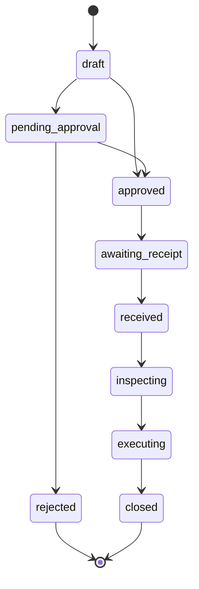

# After-Sales Module (Returns, Replacement & Warranty)

The **After-Sales** domain defines **parent-configurable policies**, **customer cases (RMA)**, and a **Returns Hub** for wholesale B2B and dropship sales: return-for-credit, DOA replacement, and warranty/repair. It sits **above** existing return engines — it does not replace invoice math, stock movements, or wallet rules.

**Channels:** Wholesale (customer files in-app) and dropship (recipient reports off-system). See channel docs below.

**Primary UI:** [`RETURNS_HUB.md`](./RETURNS_HUB.md) — `/app/after-sales`.

**Out of scope:** Koba vertical, Thrift vertical.

**Status:** Design / blueprint only. Wholesale credit return and dropship return finalize are **live** without linked cases.

---

## 0. Glossary

| Term | Meaning |
| :--- | :--- |
| **Customer** | B2B buyer = `billing_profiles` (wholesale invoice or dropship merchant). |
| **Merchant** | Dropship reseller — our **customer** on the shop order. |
| **Recipient** | End parcel buyer on `shop_orders` — **not** a system user; reports off-system for dropship. |
| **Parent / child** | Parent owns stock and books; child desk sells (`issued_by_tenant_id` / `operating_tenant_id`). |

---

## 1. Problem Statement

**Wholesale (live credit path):** Staff can process credit on issued invoices (`WholesaleInvoiceReturnPage` → `process_wholesale_invoice_return`). Math is correct; policy and cases are missing.

**Dropship (live return path):** Staff finalize returns from management desk (`finalize_dropship_return`). Recipients report problems **outside the app** to company or merchant — nothing tracks that intake today.

| Gap | Impact |
| :--- | :--- |
| No **Returns Hub** | Return work scattered across invoice and dropship pages |
| No **policy** per parent | Ad hoc fees and windows |
| No **case** before execution | No approval, receive/inspect, or external-report audit |
| Dropship **off-system intake** not logged | Cannot prove who was contacted first (company vs merchant) |
| No replacement / warranty orchestration | Manual workarounds |

---

## 2. Two channels

| | Wholesale | Dropship |
| :--- | :--- | :--- |
| **Who has the problem** | B2B **customer** (`billing_profiles`) | End **recipient** (order snapshot) |
| **How they report** | In-app case / desk (planned) | **Off-system** — phone, WhatsApp, in person |
| **Who they contact** | Company desk / portal | **Company** or **merchant** (reseller) |
| **Who logs it** | Customer or staff | Staff only — hub **intake** |
| **Source document** | `sales_invoices` | `shop_orders` (+ B2B invoice when exists) |
| **Execution RPC** | `process_wholesale_invoice_return` | `finalize_dropship_return` |
| **Channel doc** | [`WHOLESALE_AFTER_SALES.md`](./WHOLESALE_AFTER_SALES.md) | [`DROPSHIP_AFTER_SALES.md`](./DROPSHIP_AFTER_SALES.md) |

---

## 3. Architectural layers

```text
┌─────────────────────────────────────────────────────────────┐
│  Returns Hub UI (/app/after-sales)                          │
├─────────────────────────────────────────────────────────────┤
│  Layer 1 — POLICY (parent tenant configures rules)          │
├─────────────────────────────────────────────────────────────┤
│  Layer 2 — CASE (RMA: approval, intake, inspect)            │
├─────────────────────────────────────────────────────────────┤
│  Layer 3 — EXECUTION (existing RPCs per channel)          │
└─────────────────────────────────────────────────────────────┘
```

### 3.1 Case header — channel & ownership

```text
One after-sales case
├── parent_tenant_id      = Books owner (resolve_parent_tenant_id). Policy lives here.
├── operating_tenant_id   = Child desk that opened or executed the case
├── source_channel        = wholesale | dropship
├── sales_invoice_id      = Required wholesale; optional dropship (B2B leg)
├── shop_order_id         = Required dropship; null wholesale
├── billing_profile_id    = B2B customer (wholesale) or merchant (dropship)
└── policy_snapshot       = Frozen at open
```

### 3.2 Dropship external intake fields

| Field | Purpose |
| :--- | :--- |
| `intake_source` | `phone`, `whatsapp`, `in_person`, `email`, `other` |
| `reported_to` | `company` \| `merchant` — who recipient contacted first |
| `reporter_name` / `reporter_phone` | Recipient snapshot |
| `merchant_billing_profile_id` | Reseller on order |
| `merchant_forwarded_at` | When merchant escalated to company |
| `intake_note` | Free text |
| `intake_logged_by_user_id` | Staff who logged report |

### 3.3 Parent vs child processing

| Actor | List scope | Open case | Approve | Execute return | Policy edit |
| :--- | :--- | :---: | :---: | :---: | :---: |
| **Parent desk staff** | All cases on `parent_tenant_id`; filter by child | Any invoice/order on network | Yes | Wholesale + dropship | Parent admin |
| **Child desk staff** | `operating_tenant_id` = child or invoice `issued_by_tenant_id` = child | Own desk sales only | Per policy | Same RPCs; stock on parent | Read-only |
| **Parent operator** | Full network (`user_can_manage_parent_tenant`) | Any child’s sales | Yes | Any case | Parent admin |
| **Merchant (shop)** | Own dropship cases (phase D4) | No wholesale | No | View only | None |

**Locked rules:**

- `parent_tenant_id` on every case = stock + ledger books.
- Child staff cannot process another child’s cases without parent-operator access.
- Parent workspace may hide shop nav; Returns Hub still shows dropship cases with `after_sales.view`.

See [`doc/tenant_auth/TENANT_AUTH.md`](../tenant_auth/TENANT_AUTH.md), [`doc/wallet/WALLET.md`](../wallet/WALLET.md) §1.1.

---

## 4. Policy programs (parent configures)

Four programs (enum `after_sales_program`): `return_credit`, `doa`, `replacement`, `warranty`.

| Program | Plain meaning | Typical window | Restock fee |
| :--- | :--- | :--- | :--- |
| `return_credit` | Change of mind, unused goods | 3–14 days | Yes |
| `doa` | Dead / wrong at delivery | 1–7 days | **No** |
| `replacement` | Swap unit | Same as DOA | **No** |
| `warranty` | Failed after working | 30d – 12mo | **No** (repair first) |

### Policy row fields (`after_sales_policies`)

| Field | Notes |
| :--- | :--- |
| `parent_tenant_id` | Unique per `(parent_tenant_id, program)` in v1 |
| `window_days` | After `window_anchor` |
| `window_anchor` | `invoice_date` (wholesale default) \| `delivery_date` (dropship default) |
| `allowed_outcomes` | `credit`, `replace`, `repair`, `reject` |
| `restock_fee_type` / `restock_fee_value` | `none` \| `percent` \| `flat_bdt` |
| `default_to_availability` | Usually `held` |
| `requires_approval` / `approval_threshold_bdt` | Manager gate |
| `customer_visible_note` | Optional portal text |

**Resolver:** `resolve_after_sales_policy(...)` → effective policy + `policy_snapshot` on case open.

Override tables (phase 2): customer group, product/brand — see [`IMPLEMENTATION_ORDER.md`](./IMPLEMENTATION_ORDER.md).

---

## 5. Case model (RMA)

### Header: `after_sales_cases`

| Field | Notes |
| :--- | :--- |
| `case_no` | e.g. `RMA-WS-20260907-0001` / `RMA-DS-...` |
| `status` | State machine below |
| `source_channel` | `wholesale` \| `dropship` |
| `reason_code` | `unused`, `wrong_item`, `doa`, `warranty`, `other` |
| `program` | Resolved program |
| `policy_snapshot` | jsonb frozen at open |
| `sales_invoice_id` | Required wholesale |
| `shop_order_id` | Required dropship |
| `billing_profile_id` | Denormalized |
| Intake fields | §3.2 when dropship |
| `approved_by_user_id` | Nullable |
| `closed_at` | Terminal |

### Lines: `after_sales_case_lines`

| Field | Notes |
| :--- | :--- |
| `invoice_item_id` | Wholesale lines |
| `shop_order_item_id` | Dropship lines (when multi-line cases ship) |
| `requested_qty` / `received_qty` | |
| `outcome` | `pending`, `credit`, `replace`, `repair`, `reject` |
| `replacement_global_stock_id` | Replace outcome |
| `restock_fee_amount` | From policy |
| `execution_ref` | Return log or replacement id |

### Status state machine



---

## 6. Outcome execution

Book rules in §7 are **locked**. Channel-specific execution:

| Outcome | Wholesale | Dropship |
| :--- | :--- | :--- |
| **Credit** | `process_wholesale_invoice_return` | `finalize_dropship_return` + invoice return lines |
| **Replace** | `process_after_sales_replacement` (phase 3) | Deferred — new order or manual |
| **Repair** | Case status + held stock (phase 4) | Same pattern |
| **Reject** | No financial write | No financial write |

Details: §5.1–5.4 in prior spec unchanged for wholesale; dropship wallet unwind in [`DROPSHIP_MANAGEMENT.md`](../shop_order/DROPSHIP_MANAGEMENT.md) §7.1.1.

### 6.1 Wholesale credit (live)

| System | Action |
| :--- | :--- |
| RPC | `process_wholesale_invoice_return` |
| Wallet | Due first; customer wallet only on overpay |
| Stock | `return_inbound` |
| Audit | `sales_return_items` + `after_sales_case_id` (planned) |

### 6.2 Replacement & repair

See [`WHOLESALE_AFTER_SALES.md`](./WHOLESALE_AFTER_SALES.md). Restock fee **0** for DOA/replacement programs.

---

## 7. Non-negotiable book rules

1. Wholesale **due on invoice** — not customer wallet on issue.
2. Return **credit reduces due first**; wallet credit only on overpayment.
3. **Restock fee** on invoice, not wallet debit.
4. Sold **`quantity` unchanged** — only `return_quantity` grows.
5. Physical returns via **`return_inbound`** (or issue for replacement out).
6. Ledger: **`parent_tenant_id`** + **`operating_tenant_id`**.
7. **Policy snapshot** immutable per case.
8. Customer dues **returned** bucket per [`CUSTOMER_DUES.md`](../reporting_treasury/CUSTOMER_DUES.md).

---

## 8. Cross-module boundaries

| Module | Relationship |
| :--- | :--- |
| [`sales_invoice`](../sales_invoice/SALES_INVOICE.md) | Wholesale source + credit RPC |
| [`shop_order`](../shop_order/SHOP_ORDER.md) | Dropship orders; `finalize_dropship_return` |
| [`DROPSHIP_MANAGEMENT.md`](../shop_order/DROPSHIP_MANAGEMENT.md) | Settlement return finalize (execution) |
| [`customer`](../customer/CUSTOMER.md) | Billing profiles; overrides |
| [`wallet`](../wallet/WALLET.md) | Store credit, dropship unwind |
| [`procurement_stock`](../procurement_stock/PROCUREMENT_STOCK.md) | Vendor return after defective intake |
| [`thrift`](../thrift/THRIFT.md) / [`koba`](../koba/KOBA.md) | Separate — do not merge |

---

## 9. Permissions

Grant: **`after_sales`**

| Action | Who |
| :--- | :--- |
| `view` | Hub + case list |
| `create` | Open case / log intake |
| `approve` | Manager when policy requires |
| `execute` | Post credit / replace / repair |
| `manage` | Parent policy + fee/window override |

---

## 10. UI & routes

Canonical map: **[`RETURNS_HUB.md`](./RETURNS_HUB.md)**.

Staff flows: **[`UI_FLOW.md`](./UI_FLOW.md)**.

---

## 11. RPC inventory (planned)

| RPC | Phase |
| :--- | :---: |
| `resolve_after_sales_policy` | 1 |
| `upsert_after_sales_policies` | 1 |
| `list_after_sales_cases_paginated` | 2 / H1 |
| `create_after_sales_case` | 2 |
| `approve_after_sales_case` | 2 |
| `receive_after_sales_case_lines` | 2 |
| `execute_after_sales_case_line` | 2–3 |
| `process_after_sales_replacement` | 3 |

**Existing (do not rewrite):** `process_wholesale_invoice_return`, `finalize_dropship_return`, `create_and_post_stock_movement`, `record_ledger_transaction`.

---

## 12. Related documents

| Doc | Content |
| :--- | :--- |
| [`RETURNS_HUB.md`](./RETURNS_HUB.md) | Hub UI, routes, parent/child list scope |
| [`WHOLESALE_AFTER_SALES.md`](./WHOLESALE_AFTER_SALES.md) | B2B customer filing |
| [`DROPSHIP_AFTER_SALES.md`](./DROPSHIP_AFTER_SALES.md) | Off-system recipient intake |
| [`IMPLEMENTATION_ORDER.md`](./IMPLEMENTATION_ORDER.md) | Phased delivery |
| [`UI_FLOW.md`](./UI_FLOW.md) | Hub-first staff flows |
