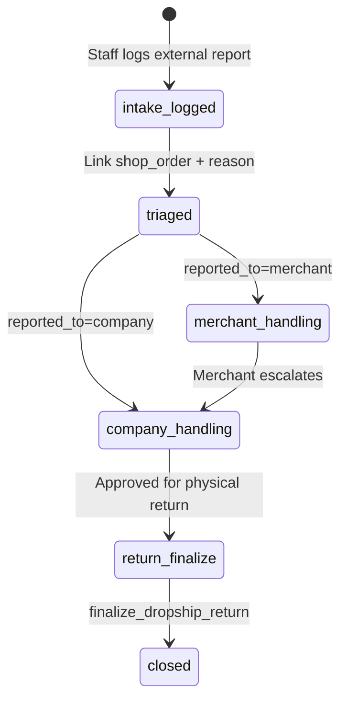

# Dropship After-Sales (Off-System Recipient Reports)

Dropship after-sales covers **end recipients** who report problems **outside the app** — phone, WhatsApp, in person — and contact either the **company** (operator) or the **merchant** (reseller / our B2B customer on the order).

**Primary UI:** Returns Hub → Dropship queue and intake — see [`RETURNS_HUB.md`](./RETURNS_HUB.md).  
**Execution:** Existing `finalize_dropship_return` — see [`doc/shop_order/DROPSHIP_MANAGEMENT.md`](../shop_order/DROPSHIP_MANAGEMENT.md) §7.1.

**Status:** Design only. Live today: staff can finalize dropship returns from management desk without a linked case.

---

## 1. Actors & glossary

| Term | Who |
| :--- | :--- |
| **Recipient** | End buyer on the parcel (`shop_orders.recipient_name` / `recipient_phone`). Not a system user. |
| **Merchant** | Reseller / middleman (`billing_profiles` on the shop order). Our B2B **customer** in dropship commerce. |
| **Company** | Parent or child desk staff operating the warehouse and settlement. |
| **Courier** | Context only for refused-parcel returns; no case intake from courier portal in v1. |

---

## 2. How intake differs from wholesale

| | Dropship | Wholesale |
| :--- | :--- | :--- |
| Reporter | Recipient (off-system) | B2B **customer** (billing profile) — in-app or desk |
| First contact | Company **or** merchant | Always the billing profile / desk |
| Staff action | **Log** external report in hub intake | Customer files case or desk opens from invoice |
| Source document | `shop_orders` | `sales_invoices` |
| Policy window anchor | Prefer `delivery_date` / `shipped_at` | Prefer `invoice_date` |

---

## 3. Intake workflow (before return finalize)

### `reported_to` rules

| Value | Meaning |
| :--- | :--- |
| `merchant` | Recipient contacted the reseller first. Company may still open a case for audit when merchant escalates or for SLA tracking. |
| `company` | Recipient contacted operator directly. Optional future step: notify merchant (doc only in v1 — no notification RPC). |

### Intake fields (on `after_sales_cases` when `source_channel = dropship`)

| Field | Purpose |
| :--- | :--- |
| `intake_source` | `phone`, `whatsapp`, `in_person`, `email`, `other` |
| `reported_to` | `company` \| `merchant` |
| `reporter_name` / `reporter_phone` | Recipient snapshot; default from order |
| `merchant_billing_profile_id` | Denormalized from order |
| `merchant_forwarded_at` | When merchant told company (nullable) |
| `intake_note` | e.g. “WhatsApp screenshot from shop”, “called main line” |
| `intake_logged_by_user_id` | Staff who created the case |
| `shop_order_id` | Required |

---

## 4. Hub entry & secondary shortcuts

| Entry | Route / action |
| :--- | :--- |
| **Primary** | Returns Hub → **Dropship complaints** or **Log dropship complaint** |
| **Shortcut** | Dropship management detail → **Log complaint** → intake with `orderId` prefilled |
| **Shortcut** | Dropship management → **Mark as returned** (existing); prompt **Link to case?** if none |

After case approval, case detail → **Proceed to return finalize** →  
`/app/shop/dropship/management/:orderId/return?case_id=:caseId`

---

## 5. Execution — wallet & stock (do not duplicate)

Physical return and money unwind are **not** re-specified here. Use:

- [`DROPSHIP_MANAGEMENT.md`](../shop_order/DROPSHIP_MANAGEMENT.md) §7.1 — return finalize page, return cost + payer, per-line grade
- §7.1.1 — wallet scenarios A–D (refused while shipped vs post-delivered unwind)

Case layer adds: intake audit, policy window, approval, and `after_sales_case_id` on finalize RPC (planned).

---

## 6. Policy reuse

Same four parent programs as [`AFTER_SALES.md`](./AFTER_SALES.md) §3 (`return_credit`, `doa`, `replacement`, `warranty`).

Dropship defaults (recommended in policy seed):

- `window_anchor = delivery_date` (fallback `shipped_at` if not delivered)
- `return_credit` restock fee often **0** when recipient refused before delivery (company policy choice)

---

## 7. Replacement & warranty on dropship

**Deferred (phase 3+).** v1 dropship cases track intake + refused-parcel / return finalize. Sending a replacement unit may be a **new shop order** or manual desk until `process_after_sales_replacement` supports dropship context.

---

## 8. Parent vs child

Both parent and child desk staff can log intake and execute dropship returns **for orders in scope** — see [`AFTER_SALES.md`](./AFTER_SALES.md) §2.3.

- `operating_tenant_id` = desk that logged or executed
- Stock `return_inbound` always on `parent_tenant_id`
- Parent workspace list shows all network dropship cases; child list scoped to self unless parent operator

---

## 9. Related documents

| Doc | Topic |
| :--- | :--- |
| [`RETURNS_HUB.md`](./RETURNS_HUB.md) | Hub routes and queues |
| [`AFTER_SALES.md`](./AFTER_SALES.md) | Shared case model and book rules |
| [`UI_FLOW.md`](./UI_FLOW.md) | Staff flows (hub-first) |
| [`IMPLEMENTATION_ORDER.md`](./IMPLEMENTATION_ORDER.md) | Dropship track D1–D4 |
