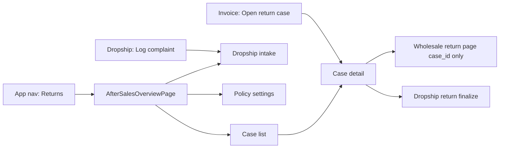

# Returns Hub (Primary After-Sales UI)

The **Returns Hub** is the dedicated app entry for all return, replacement, and warranty work — wholesale and dropship. It follows the same pattern as the Sales Invoice Overview Hub ([`InvoiceOverviewPage.vue`](../../web/src/modules/sales_invoice/pages/InvoiceOverviewPage.vue) at `/app/sales/invoices`).

Invoice details expose **Open return case** only — **no** standalone **Process return** button. The `/return` execution page is reached from case detail with `?case_id=`.

**Status:** Planned — no hub pages shipped yet. Live today: `WholesaleInvoiceReturnPage` (to be gated behind cases).

---

## 1. Navigation

| Item | Value |
| :--- | :--- |
| **Module grant** | `after_sales` / `view` |
| **Nav label** | Returns |
| **Root route** | `/:tenantSlug?/app/after-sales` |
| **Hub page** | `AfterSalesOverviewPage.vue` (planned) |

Parent and child workspaces use the **same route**; list RPCs scope rows by membership (see §5).

---

## 2. Hub overview layout

### KPI cards (top)

Scoped to books tenant (`parent_tenant_id`); child workspace sees child slice unless parent operator.

| Card | Metric |
| :--- | :--- |
| Open cases | `status` not in `closed`, `rejected` |
| Pending approval | `pending_approval` |
| Awaiting receipt | `approved`, `awaiting_receipt` |
| Wholesale / Dropship | Count by `source_channel` |
| Closed this month | Optional |

### Hub cards (navigation)

| Card | Route | Audience |
| :--- | :--- | :--- |
| **All cases** | `/app/after-sales/cases` | Parent + child |
| **Wholesale returns** | `/app/after-sales/wholesale` | Parent + child (scoped) |
| **Dropship complaints** | `/app/after-sales/dropship` | Parent + child (scoped) |
| **Log dropship complaint** | `/app/after-sales/dropship/intake` | Staff |
| **Return policy** | `/app/settings/after-sales` | Parent admin only |

### Quick actions

- **New wholesale case** — invoice search dialog
- **Log dropship complaint** — intake form
- **Pending my approval** — filtered list (approvers only)

---

## 3. Full route inventory

| Route | Page | Purpose |
| :--- | :--- | :--- |
| `/app/after-sales` | `AfterSalesOverviewPage.vue` | Hub overview |
| `/app/after-sales/cases` | `AfterSalesCaseListPage.vue` | Unified inbox |
| `/app/after-sales/wholesale` | Same list, `channel=wholesale` | Wholesale queue |
| `/app/after-sales/dropship` | Same list, `channel=dropship` | Dropship queue |
| `/app/after-sales/dropship/intake` | `DropshipIntakePage.vue` | Log off-system recipient report |
| `/app/after-sales/:id` | `AfterSalesCaseDetailPage.vue` | Timeline, approve, execute |
| `/app/settings/after-sales` | `AfterSalesPolicyPage.vue` | Parent policy programs |

### Execution deep links (from case detail)

| Channel | Navigate to |
| :--- | :--- |
| Wholesale credit | `/app/sales/invoices/:id/return?case_id=` |
| Dropship return | `/app/shop/dropship/management/:orderId/return?case_id=` |

After success → redirect to case detail or hub inbox.

---

## 4. Case list columns

| Column | Notes |
| :--- | :--- |
| Case no | Link to detail |
| Channel | Wholesale / Dropship badge |
| Customer / merchant | Billing profile name |
| Source | `invoice_no` or `order_no` |
| Reason | Badge |
| Status | Badge |
| Operating tenant | Child name — **parent view only** |
| Opened | Date |
| Age | Days open |

**Filters:** channel, status, reason, customer search, date range, **child tenant** (parent only), pending approval.

---

## 5. Parent vs child on hub UI

| UI element | Parent workspace | Child workspace |
| :--- | :--- | :--- |
| Child tenant filter | Shown (all sisters) | Hidden or locked to self |
| Policy card on hub | Shown for parent admin | Hidden; optional read-only “View parent policy” |
| Execute buttons | All cases on network | `operating_tenant_id` = self unless parent operator |
| KPI scope | Full `parent_tenant_id` books | Child slice; “View all” if parent operator |
| Dropship cases | Visible even if shop modules hidden on parent desk | Scoped to own orders |

Parent company workspaces may hide shop-order nav modules; **Returns Hub still lists dropship cases** when staff have `after_sales.view` on parent books.

---

## 6. Invoice entry (no direct Process Return)

| Location | Button | Behavior |
| :--- | :--- | :--- |
| Invoice details (issued) | **Open return case** | Create or open case → hub detail → execute |
| Invoice details | ~~Process return~~ | **Remove** — do not ship standalone quick return |
| Invoice details | View linked case | When case exists for this invoice |

Dropship management keeps **Log complaint** / **View case**; **Mark as returned** runs from case flow when implemented.

---

## 7. Query keys (planned)

- `['after_sales', 'hub', parentTenantId]`
- `['after_sales', 'cases', parentTenantId, params]`
- `['after_sales', 'case', caseId]`

---

## 8. Related documents

| Doc | Topic |
| :--- | :--- |
| [`AFTER_SALES.md`](./AFTER_SALES.md) | Domain model, parent/child rules |
| [`WHOLESALE_AFTER_SALES.md`](./WHOLESALE_AFTER_SALES.md) | Wholesale channel |
| [`DROPSHIP_AFTER_SALES.md`](./DROPSHIP_AFTER_SALES.md) | Dropship off-system intake |
| [`UI_FLOW.md`](./UI_FLOW.md) | Step-by-step staff flows |
