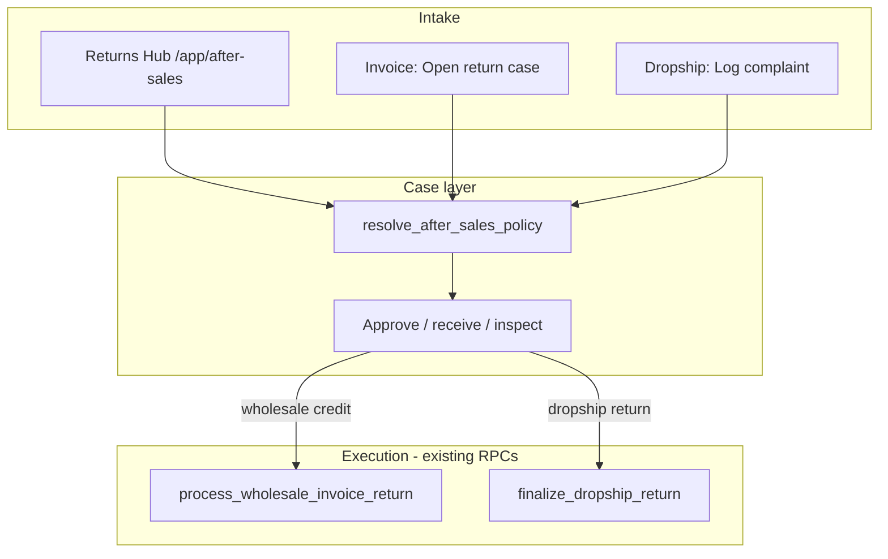

# Execution Task Matrix: After-Sales (Returns Hub, Policies & Cases)

> **Blueprint docs:** [`AFTER_SALES.md`](./AFTER_SALES.md) · [`RETURNS_HUB.md`](./RETURNS_HUB.md) · [`WHOLESALE_AFTER_SALES.md`](./WHOLESALE_AFTER_SALES.md) · [`DROPSHIP_AFTER_SALES.md`](./DROPSHIP_AFTER_SALES.md) · [`UI_FLOW.md`](./UI_FLOW.md)  
> **Architecture phases (high level):** [`IMPLEMENTATION_ORDER.md`](./IMPLEMENTATION_ORDER.md)  
> **Workflow SOP:** [`docs/AI_WORKFLOW_SOP.md`](../../docs/AI_WORKFLOW_SOP.md) — one phase per session; UI mock → API → wire.

---

## Purpose

Build parent-configurable **return, replacement, and warranty** policies and a unified **Returns Hub** for:

- **Wholesale** — B2B customer files a case (in-app or via desk).
- **Dropship** — staff logs off-system recipient complaints (phone, WhatsApp, etc.) to company or merchant.

Reuse existing money and stock RPCs. Do **not** rewrite `process_wholesale_invoice_return` or `finalize_dropship_return` financial math.

---

## Goal

1. **Remove** direct **Process Return** from invoice toolbars.
2. All returns flow: **Returns Hub** or **Open return case** → case lifecycle → execute on `/return?case_id=` (wholesale) or dropship finalize with `case_id`.
3. **Parent** sets policy; **parent and child** desks process cases within scope (see [`AFTER_SALES.md`](./AFTER_SALES.md) §3.3).

---

## End-to-end flow

---

## What changes vs today

| Today | After |
| :--- | :--- |
| **Process Return** on `CreateWholesaleInvoicePage.vue` + `GlobalInvoiceDetailPaper.vue` | **Removed** |
| `InvoiceDetailsPage.vue` return dialog (`add_global_return_item`) + navigate to `/return` | **Removed**; **Open return case** / **View case** only |
| `WholesaleInvoiceReturnPage.vue` open without case | **Gated** — requires `?case_id=` |
| No after-sales module | New `web/src/modules/after_sales/` + nav **Returns** |
| Dropship return only on management desk | Plus hub intake + linked case |

## What we keep and reuse

| Asset | Use |
| :--- | :--- |
| `invoiceRepository.processWholesaleInvoiceReturn` | Case **Execute credit** step |
| `WholesaleInvoiceReturnPage.vue` | Execution UI; policy hints; case link |
| `DropshipReturnFinalizePage.vue` | Add optional `case_id` in Track D3 |
| `wholesaleReturnEngine.ts` | Return preview math on execution page |
| Invoice return history display on paper | Read-only; unchanged |

## How to run phases

1. Execute **one phase block** per agent session.
2. **Review gate:** confirm in browser (UI phases) or RPC smoke (backend) before continuing.
3. After any SQL phase: `pnpm run backend:local` + `pnpm run backend:types:local`.
4. **Abort:** revert phase files; note drift in this doc under the phase **Status** line.

---

# Track A — Cleanup

## Phase A0: Remove legacy invoice return entry points

- **Goal:** No standalone Process Return; `/return` requires a case context.
- **Depends on:** None (can run before Track B).
- **Files to change:**
  - `web/src/modules/sales_invoice/pages/CreateWholesaleInvoicePage.vue` — remove Process Return button + `goToReturnPage`
  - `web/src/modules/sales_invoice/components/GlobalInvoiceDetailPaper.vue` — remove `process-return` emit + toolbar button
  - `web/src/modules/sales_invoice/pages/InvoiceDetailsPage.vue` — remove `onProcessReturnFromPaper`, `returnDialog`, `add_global_return_item` submit, `@process-return`
  - `web/src/modules/sales_invoice/pages/WholesaleInvoiceReturnPage.vue` — if no `case_id` query: redirect to `/app/after-sales` or empty state “Open a case first”
  - `web/src/modules/sales_invoice/routes/index.ts` — optional `meta.requiresCaseId: true` on return route
- **Specification:**
  - Do **not** delete return route, `processWholesaleInvoiceReturn` repository method, or return history on invoice paper.
  - Do **not** remove Thrift or shop_order return flows.
- **Out of scope:** New hub pages; case creation.
- **Rollback:** `git checkout -- web/src/modules/sales_invoice/`
- **Review gate:** Issued wholesale invoice has no Process Return; visiting `/return` without `case_id` is blocked or redirected.
- **Status:** Pending

---

# Track B — Full UI with mocks (verify flow in browser)

## Phase B1: After-sales module scaffold

- **Goal:** Module folder, types, mock fixtures, routes shell, grant registration.
- **Depends on:** Phase A0 recommended (not strict).
- **Files to create:**
  - `web/src/modules/after_sales/types/afterSales.types.ts`
  - `web/src/modules/after_sales/fixtures/mockAfterSales.ts`
  - `web/src/modules/after_sales/services/afterSalesQueryKeys.ts`
  - `web/src/modules/after_sales/repositories/afterSalesRepository.stub.ts` — reads mocks only
  - `web/src/modules/after_sales/routes/index.ts`
  - Register routes in app router; `after_sales` in `web/src/modules/navigation/modulePermissions.ts` (dev grant until bootstrap seed)
- **Specification:**
  - Types mirror enums in [`AFTER_SALES.md`](./AFTER_SALES.md): `source_channel`, `after_sales_program`, case `status`, dropship `intake_source`, `reported_to`.
  - Mock at least: 2 wholesale cases, 2 dropship cases, hub KPI object, 4 policy program rows.
- **Out of scope:** Real Supabase calls.
- **Rollback:** `git checkout -- web/src/modules/after_sales/` + permission/route registration lines.
- **Review gate:** App builds; routes resolve (can 404 on empty pages until B2).
- **Status:** Pending

## Phase B2a: Returns Hub overview + list (mock)

- **Goal:** Primary navigation home for returns.
- **Depends on:** Phase B1.
- **Files to create:**
  - `web/src/modules/after_sales/pages/AfterSalesOverviewPage.vue`
  - `web/src/modules/after_sales/pages/AfterSalesCaseListPage.vue`
  - `web/src/modules/after_sales/components/AfterSalesHubKpiRow.vue`
  - `web/src/modules/after_sales/components/AfterSalesCaseTable.vue`
- **Files to edit:**
  - `web/src/modules/after_sales/routes/index.ts` — `/app/after-sales`, `/cases`, `/wholesale`, `/dropship`
  - Workspace nav — **Returns** entry with `after_sales` grant
- **Specification:**
  - Hub: KPI row + cards per [`RETURNS_HUB.md`](./RETURNS_HUB.md) §2.
  - List: columns include channel, customer/merchant, source doc, status, operating tenant (parent view).
  - Parent workspace: child-tenant filter (mock).
  - Child workspace: list filtered to mock `operating_tenant_id`.
  - Use stub repository; TanStack Query keys from `afterSalesQueryKeys.ts`.
  - Page layout per [`docs/PAGE_LAYOUT_AND_LOADERS.md`](../../docs/PAGE_LAYOUT_AND_LOADERS.md).
- **Out of scope:** Real pagination RPC.
- **Rollback:** Remove pages + nav entry.
- **Review gate:** Click Hub → cards → filtered lists; parent vs child filter behaves on mock data.
- **Status:** Pending

## Phase B3a: Policy settings UI (mock)

- **Goal:** Parent admin edits four policy programs (mock save).
- **Depends on:** Phase B1.
- **Files to create:**
  - `web/src/modules/after_sales/pages/AfterSalesPolicyPage.vue`
  - `web/src/modules/after_sales/components/AfterSalesPolicyProgramCard.vue`
- **Files to edit:**
  - Routes: `/app/settings/after-sales`
  - Settings hub card (parent admin only)
- **Specification:**
  - Four cards: `return_credit`, `doa`, `replacement`, `warranty`.
  - Fields per [`UI_FLOW.md`](./UI_FLOW.md) §6.
  - Child tenant: read-only + “Managed by parent company” banner.
  - Save updates in-memory mock / session fixture only.
- **Out of scope:** `upsert_after_sales_policies` RPC.
- **Rollback:** Remove policy page + route.
- **Review gate:** Parent can edit and save (mock); child sees read-only.
- **Status:** Pending

## Phase B4a: Case detail + open-case dialog + dropship intake (mock)

- **Goal:** Full case lifecycle UI on mock data.
- **Depends on:** Phase B2a.
- **Files to create:**
  - `web/src/modules/after_sales/pages/AfterSalesCaseDetailPage.vue`
  - `web/src/modules/after_sales/components/AfterSalesCaseTimeline.vue`
  - `web/src/modules/after_sales/components/OpenWholesaleReturnCaseDialog.vue`
  - `web/src/modules/after_sales/pages/DropshipIntakePage.vue`
- **Files to edit:**
  - `InvoiceDetailsPage.vue` — stub **Open return case** button (opens dialog); **View case** when mock link exists
  - Routes: `/app/after-sales/:id`, `/app/after-sales/dropship/intake`
- **Specification:**
  - Case detail: status-driven footer actions per [`UI_FLOW.md`](./UI_FLOW.md) §5.
  - Wholesale **Execute credit** → `router.push` to `/app/sales/invoices/:id/return?case_id=:mockId`.
  - Dropship intake: fields per [`DROPSHIP_AFTER_SALES.md`](./DROPSHIP_AFTER_SALES.md) §3.
  - Open-case dialog: reason, lines, qty, policy preview (mock resolver).
- **Out of scope:** Real `create_after_sales_case` RPC.
- **Rollback:** Remove new pages/components; revert invoice button stub.
- **Review gate:** Hub → case → approve (mock) → execute navigates to return URL; intake form creates mock case in list.
- **Status:** Pending

## Phase B5a: Return execution page — mock policy gate

- **Goal:** `WholesaleInvoiceReturnPage` only works with `case_id`; shows policy hints from mock.
- **Depends on:** Phase A0, B4a.
- **Files to edit:**
  - `web/src/modules/sales_invoice/pages/WholesaleInvoiceReturnPage.vue`
  - Optional: `web/src/modules/after_sales/services/mockPolicyResolver.ts`
- **Specification:**
  - Read `case_id` from query; load mock case + policy snapshot.
  - Pre-fill restock fee; show window warning banner.
  - Title copy: “Execute return credit” (not “Process Return”).
  - Submit: **mock only** until Track D2 — toast success + navigate to mock case detail.
- **Out of scope:** Live `processWholesaleInvoiceReturn` in this phase.
- **Rollback:** Revert return page changes.
- **Review gate:** Full mock walk: hub → case → execute → mock closed case.
- **Status:** Pending

---

# Track C — Backend (schema + RPCs)

## Phase C0: Schema & grants

- **Goal:** Tables, enums, RLS, module grant; link on `sales_return_items`.
- **Depends on:** None (can parallel Track B after A0).
- **Files to create:**
  - `supabase/schemas/after_sales/01_types.sql`
  - `supabase/schemas/after_sales/02_tables.sql`
  - `supabase/schemas/after_sales/03_rpcs.sql` (stubs ok for C1/C2 split)
  - `supabase/schemas/after_sales/04_rls.sql`
  - Migration via `pnpm run backend:schema:diff`
- **Specification:**
  - Tables: `after_sales_policies`, `after_sales_cases`, `after_sales_case_lines`, `after_sales_case_events`.
  - `sales_return_items.after_sales_case_id` nullable FK.
  - Bootstrap or migration seed: `after_sales` module actions `view`, `create`, `approve`, `execute`, `manage`.
  - RLS: parent books + `user_can_manage_parent_tenant` pattern.
- **Out of scope:** UI wiring.
- **Rollback:** Revert migration; restore schema files.
- **Review gate:** `pnpm run backend:local` + `pnpm run backend:types:local` green.
- **Status:** Pending

## Phase C1b: Policy RPCs

- **Goal:** Resolve and upsert parent policies.
- **Depends on:** Phase C0.
- **Files to edit:**
  - `supabase/schemas/after_sales/03_rpcs.sql`
- **RPCs:**
  - `resolve_after_sales_policy(p_invoice_item_id, p_reason_code)` or json payload for dropship
  - `upsert_after_sales_policies(p_parent_tenant_id, p_payload jsonb)`
  - `list_after_sales_policies_for_staff(p_tenant_id)`
- **Out of scope:** Case CRUD.
- **Rollback:** Revert RPC migration.
- **Review gate:** SQL smoke: upsert policy → resolve returns `within_window`, `suggested_restock_fee`.
- **Status:** Pending

## Phase C2b: Case & hub RPCs

- **Goal:** Case lifecycle and hub summary/list.
- **Depends on:** Phase C0.
- **RPCs:**
  - `get_after_sales_hub_summary(p_tenant_id)`
  - `list_after_sales_cases_paginated(p_tenant_id, p_filters jsonb)`
  - `get_after_sales_case(p_case_id)`
  - `create_after_sales_case(p_payload jsonb)`
  - `approve_after_sales_case`, `reject_after_sales_case`
  - `receive_after_sales_case_lines`
  - `generate_after_sales_case_number`
- **Specification:**
  - List scopes per [`AFTER_SALES.md`](./AFTER_SALES.md) §3.3 (parent vs child vs operator).
  - Dropship payload includes intake fields §3.2.
  - `policy_snapshot` frozen on create.
- **Out of scope:** Execution hooks.
- **Rollback:** Revert RPC migration.
- **Review gate:** Create wholesale + dropship case via SQL/RPC; list returns correct scope.
- **Status:** Pending

## Phase C3b: Execution hooks

- **Goal:** Link return RPCs to cases.
- **Depends on:** Phase C2b.
- **Files to edit:**
  - `supabase/schemas/sales_invoice/03_rpcs.sql` — `process_wholesale_invoice_return` optional `p_case_id`
  - `supabase/schemas/shop_order/03_rpcs.sql` — `finalize_dropship_return` optional `p_after_sales_case_id` (D3)
- **Specification:**
  - On success: update case line `outcome`, append `after_sales_case_events`, close case when all lines done.
  - Do not change invoice AR math.
- **Out of scope:** Replacement RPC.
- **Rollback:** Revert function bodies.
- **Review gate:** Return with `p_case_id` closes case; without case still works for migration window (optional deprecate later).
- **Status:** Pending

---

# Track D — Wiring (live data)

## Phase D1c: Wire hub + policy

- **Goal:** Replace mock repository with Supabase RPCs for hub, list, policy.
- **Depends on:** Phase B2a, B3a, C1b, C2b (hub summary + list).
- **Files to create:**
  - `web/src/modules/after_sales/repositories/afterSalesRepository.ts`
- **Files to edit:**
  - Remove or gate `afterSalesRepository.stub.ts`
  - `AfterSalesOverviewPage.vue`, `AfterSalesCaseListPage.vue`, `AfterSalesPolicyPage.vue`
  - TanStack Query hooks in `web/src/modules/after_sales/composables/`
- **Specification:**
  - Follow [`docs/TANSTACK_QUERY_GUIDE.md`](../../docs/TANSTACK_QUERY_GUIDE.md).
  - Invalidate keys on policy save.
- **Out of scope:** Case create from invoice; live return submit.
- **Rollback:** Switch imports back to stub.
- **Review gate:** Hub KPIs and list load from local DB; policy save persists.
- **Status:** Pending

## Phase D2c: Wire wholesale cases + invoice + return submit

- **Goal:** End-to-end wholesale credit return through case.
- **Depends on:** Phase B4a, B5a, C2b, C3b, D1c.
- **Files to edit:**
  - `OpenWholesaleReturnCaseDialog.vue` → `create_after_sales_case`
  - `AfterSalesCaseDetailPage.vue` — live status transitions
  - `InvoiceDetailsPage.vue` — **Open return case** / **View case** live
  - `WholesaleInvoiceReturnPage.vue` — live `resolve_after_sales_policy` + `processWholesaleInvoiceReturn` + case close
- **Out of scope:** Dropship finalize link.
- **Rollback:** Feature-flag live repository for case create only.
- **Review gate:** Real issued invoice → case → execute credit → invoice `return_quantity` updated; case `closed`.
- **Status:** Pending

## Phase D3c: Wire dropship intake + management shortcuts

- **Goal:** Dropship complaints logged in hub; linked to finalize.
- **Depends on:** Phase D2c, C3b (dropship case_id on finalize).
- **Files to edit:**
  - `DropshipIntakePage.vue` — live create
  - `web/src/modules/shop_order/pages/DropshipManagementDetailPage.vue` — Log complaint / View case
  - `DropshipReturnFinalizePage.vue` — `case_id` query; post success update case
- **Out of scope:** Merchant shop read-only list (D4).
- **Rollback:** Hide intake nav; management shortcuts optional.
- **Review gate:** Log intake → case → finalize return → case closed; stock/wallet per existing dropship docs.
- **Status:** Pending

---

# Track E — Deferred (no tasks yet)

| Item | Reference |
| :--- | :--- |
| Replacement (`process_after_sales_replacement`) | [`IMPLEMENTATION_ORDER.md`](./IMPLEMENTATION_ORDER.md) Phase 3 |
| Warranty / repair line statuses | Phase 4 |
| Customer portal return request | Phase 5 |
| Policy overrides (customer group / product) | Phase 5 |
| Merchant read-only shop cases | D4 |
| Vendor claim handoff to procurement | Phase 6 |
| Thrift / Koba | Out of module |

---

## Phase index (quick jump)

| Phase | Track | Summary |
| :---: | :--- | :--- |
| A0 | Cleanup | Remove Process Return; gate `/return` |
| B1 | UI mock | Module scaffold + fixtures |
| B2a | UI mock | Returns Hub + case list |
| B3a | UI mock | Policy settings page |
| B4a | UI mock | Case detail, open-case dialog, dropship intake |
| B5a | UI mock | Return page policy gate (mock submit) |
| C0 | Backend | Schema + RLS + grants |
| C1b | Backend | Policy RPCs |
| C2b | Backend | Case + hub RPCs |
| C3b | Backend | `p_case_id` on return RPCs |
| D1c | Wire | Hub + policy live |
| D2c | Wire | Wholesale case + return live |
| D3c | Wire | Dropship intake + finalize link |

---

*Created for execution per [`docs/AI_WORKFLOW_SOP.md`](../../docs/AI_WORKFLOW_SOP.md). Update **Status** on each phase when done.*
