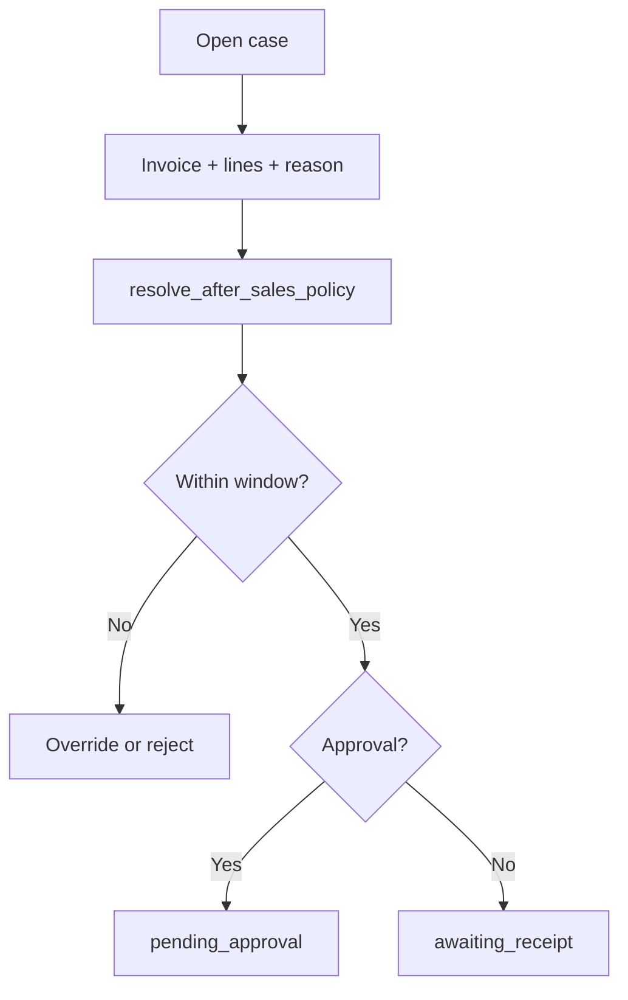

# After-Sales — UI Flow

Hub-first staff flows for wholesale and dropship returns. **Planned** except live execution pages noted below.

**Canonical route map:** [`RETURNS_HUB.md`](./RETURNS_HUB.md)

**Live today:** [`WholesaleInvoiceReturnPage.vue`](../../web/src/modules/sales_invoice/pages/WholesaleInvoiceReturnPage.vue), [`DropshipReturnFinalizePage.vue`](../../web/src/modules/shop_order/pages/DropshipReturnFinalizePage.vue).

---

## 1. Personas

| Persona | Typical tasks |
| :--- | :--- |
| **Parent admin** | Edit policy; approve network-wide; see all children on hub |
| **Parent desk staff** | Triage any channel; execute returns on parent books |
| **Child desk staff** | Open cases for own sales; execute within scope |
| **Parent operator** | `user_can_manage_parent_tenant` — all children’s cases |
| **Warehouse** | Receive goods; grade + availability |
| **Merchant (shop)** | View own dropship cases (phase D4) — no execute |

---

## 2. Returns Hub (primary entry)

**Route:** `/:tenantSlug?/app/after-sales`

Staff land on **overview** → KPI cards → hub cards (all cases, wholesale, dropship, intake, policy).

| Quick action | Goes to |
| :--- | :--- |
| New wholesale case | Invoice search → create case |
| Log dropship complaint | `/app/after-sales/dropship/intake` |
| Pending my approval | `/app/after-sales/cases?status=pending_approval` |

**Parent view:** child tenant filter on list; **Operating tenant** column.  
**Child view:** list scoped to self; no policy card unless read-only link.

Full layout: [`RETURNS_HUB.md`](./RETURNS_HUB.md).

---

## 3. Wholesale case flow

**Channel doc:** [`WHOLESALE_AFTER_SALES.md`](./WHOLESALE_AFTER_SALES.md)

### Open case

| Entry | Path |
| :--- | :--- |
| Hub | **New wholesale case** |
| Shortcut | Invoice details → **Open return case** |

### Execute credit

Case detail → **Execute credit** → `/app/sales/invoices/:id/return?case_id=` → submit → back to case or hub.

Invoice toolbar: **Open return case** only. **Remove** standalone **Process return** from `InvoiceDetailsPage` and `CreateWholesaleInvoicePage` when after-sales ships.

---

## 4. Dropship intake & case flow

**Channel doc:** [`DROPSHIP_AFTER_SALES.md`](./DROPSHIP_AFTER_SALES.md)

### Log external report

**Route:** `/app/after-sales/dropship/intake`

| Field | Rule |
| :--- | :--- |
| Order search | By `order_no`, recipient phone |
| `intake_source` | phone, whatsapp, in_person, email, other |
| `reported_to` | company \| merchant |
| Reporter | Name / phone (default from order) |
| Reason | doa, wrong_item, warranty, other |
| Note | Required context |

**Shortcut:** Dropship management → **Log complaint** with `?orderId=` prefilled.

### Triage → return finalize

Case detail → approve → receive → **Proceed to return finalize** →  
`/app/shop/dropship/management/:orderId/return?case_id=`

Wallet/stock rules: [`DROPSHIP_MANAGEMENT.md`](../shop_order/DROPSHIP_MANAGEMENT.md) §7.1.

---

## 5. Case detail (both channels)

**Route:** `/app/after-sales/:id`

| Status | Actions |
| :--- | :--- |
| `pending_approval` | Approve / Reject |
| `awaiting_receipt` | Mark received |
| `inspecting` | Per-line outcome + grade |
| `executing` | Execute line / Execute all |
| `closed` | Read-only; links to return log / order |

---

## 6. Policy settings

**Route:** `/app/settings/after-sales` — parent admin only.

Four program cards — see [`AFTER_SALES.md`](./AFTER_SALES.md) §4. Child: read-only banner.

---

## 7. Invoice buttons (after after-sales ships)

| Location | Show | Hide |
| :--- | :--- | :--- |
| Invoice details (issued) | **Open return case**, **View case** (if linked) | **Process return** |
| Create wholesale (issued) | Same as details if applicable | **Process return** |

Returns Hub remains **home**. `/return` page stays as **execution** step behind a case.

---

## 8. List page columns

**Route:** `/app/after-sales/cases` (and `/wholesale`, `/dropship` presets)

Case no, channel, customer/merchant, invoice/order, reason, status, **operating tenant** (parent), opened, age.

Filters: channel, status, child tenant (parent), approval queue.

---

## 9. Button matrix (invoice details)

| Invoice status | Open case | Process return | Record payment |
| :--- | :---: | :---: | :---: |
| `issued` | ✓ | **No** (removed) | If due/partial |
| Other | — | — | — |

---

## 10. Edge cases

| Situation | UX |
| :--- | :--- |
| Outside policy window | Block; manager override |
| Child case on parent stock | `operating_tenant_id` = child; stock RPC = parent |
| Dropship, reported_to=merchant | Flag on case; escalate to company_handling |
| No linked case on finalize | Prompt to create or link case |
| Parent desk, no shop nav | Dropship cases still in hub |

---

## 11. Related documents

| Doc | Topic |
| :--- | :--- |
| [`RETURNS_HUB.md`](./RETURNS_HUB.md) | Routes & hub layout |
| [`AFTER_SALES.md`](./AFTER_SALES.md) | Domain & book rules |
| [`doc/sales_invoice/UI_FLOW.md`](../sales_invoice/UI_FLOW.md) | Live wholesale return page |
