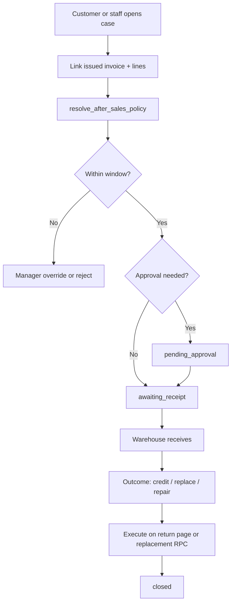

# Wholesale After-Sales (B2B Customer Filing)

Wholesale after-sales is the **straightforward** channel: the **B2B customer** (`billing_profiles`) files a return or problem against an issued wholesale invoice — in the app (planned) or via the desk on their behalf.

**Primary UI:** Returns Hub → Wholesale queue — see [`RETURNS_HUB.md`](./RETURNS_HUB.md).  
**Execution:** `process_wholesale_invoice_return` — see [`doc/sales_invoice/SALES_INVOICE.md`](../sales_invoice/SALES_INVOICE.md) §2.3.

**Status:** Credit return page is **live**. Cases, policy, and customer self-service are **planned**.

---

## 1. Actors

| Term | Who |
| :--- | :--- |
| **Customer** | B2B buyer = `billing_profiles` on the invoice (not the end recipient unless retail account model). |
| **Desk staff** | Parent or child tenant staff with `after_sales` grants. |
| **Warehouse** | Receives goods; sets grade + availability on case lines. |

No `reported_to` field — counterparty is always the billing profile on the invoice.

---

## 2. Intake paths

| Path | Who starts | Entry |
| :--- | :--- | :--- |
| **Returns Hub** | Staff | Primary — new case, queues, intake |
| **Customer portal** (phase 5) | Customer group member | Return request → case |
| **Invoice** | Staff | **Open return case** only — **no Process Return button** |
| **Execute credit** | Staff | Case detail → `/return?case_id=` (not from invoice toolbar) |

---

## 3. Typical flow

---

## 4. Hub entry (invoice has no direct return)

| Entry | Route / action |
| :--- | :--- |
| **Primary** | Returns Hub → **Wholesale returns** or **New wholesale case** |
| **Invoice** | **Open return case** → case detail (remove **Process return** from toolbar) |
| **Execution** | Case detail → **Execute credit** → `/app/sales/invoices/:id/return?case_id=` |

---

## 5. Policy

Parent tenant programs per [`AFTER_SALES.md`](./AFTER_SALES.md) §3.

Wholesale defaults (recommended seed):

- `window_anchor = invoice_date`
- `return_credit` with restock fee % for change-of-mind
- `doa` / `replacement` with 0 restock fee

Future: per–customer-group overrides — [`doc/customer/CUSTOMER.md`](../customer/CUSTOMER.md).

---

## 6. Parent vs child

| Capability | Parent desk | Child desk |
| :--- | :---: | :---: |
| See all network wholesale cases | ✓ (filter by child) | Own `operating_tenant_id` / `issued_by_tenant_id` only |
| Open case on any network invoice | ✓ | Own sales only |
| Execute credit return | ✓ | ✓ (own scope) |
| Edit policy | Parent admin | Read-only |

Stock and ledger always post on `parent_tenant_id`; `operating_tenant_id` records which desk ran the return.

---

## 7. Book rules (summary)

Must match [`AFTER_SALES.md`](./AFTER_SALES.md) §6 — due on invoice first, wallet credit only on overpay, sold qty unchanged, restock fee on invoice.

---

## 8. Related documents

| Doc | Topic |
| :--- | :--- |
| [`RETURNS_HUB.md`](./RETURNS_HUB.md) | Hub routes |
| [`AFTER_SALES.md`](./AFTER_SALES.md) | Full domain spec |
| [`doc/sales_invoice/UI_FLOW.md`](../sales_invoice/UI_FLOW.md) | Live return page behavior |
