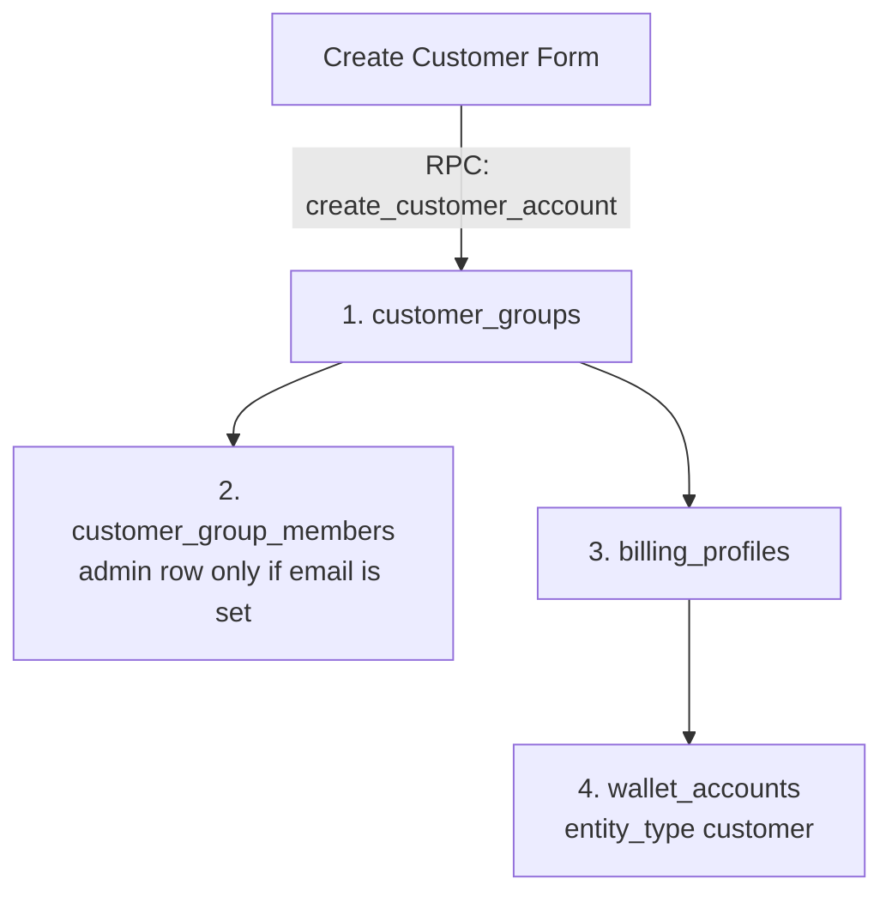

# Customer Module

The **Customer** domain is the canonical place to create and edit B2B buyer groups, billing identity, storefront members, and the linked wallet. Shop setup’s **Customer Groups** card opens this module. Old `/app/shop/customer-groups` URLs redirect here.

Grant key: `customer`. Recipient address book uses `recipient_profile`.

---

## 1. Domain Architecture & Provisioning

Save on **Create Customer** calls RPC `create_customer_account` in one transaction.

### Create form fields

| Field | Required | Notes |
| :--- | :--- | :--- |
| Group / company name | Yes | Stored on `customer_groups.name`. |
| Primary contact / admin name | Yes | Stored as billing profile name; used as the first member name when email is set. |
| Brand accent color | Yes | Default `#B45F34`. Shown on the hub list. |
| Admin email | No | If set, inserts first `customer_group_members` row with role `admin`. If empty, **no member row** is created. |
| Phone | No | Copied to the billing profile. |
| Address | No | Copied to the billing profile. |

### Entity responsibilities

| Entity | Table | Responsibility |
| :--- | :--- | :--- |
| **Customer group** | `customer_groups` | Organization profile, active flag, brand accent color. |
| **Billing profile** | `billing_profiles` | Financial identity for wholesale/retail invoices. |
| **Customer member** | `customer_group_members` | Storefront login users. Roles: `admin`, `manager`, `staff` (`customer_group_role`). |
| **Wallet account** | `wallet_accounts` | Ledger account (`entity_type = 'customer'`, `entity_id = billing_profile_id`). |
| **Recipient profile** | `recipient_profiles` | Delivery endpoints. Grant key: `recipient_profile`. |

### Member email uniqueness

- Per group: unique index `customer_group_members_group_email_unique` on `(customer_group_id, lower(trim(email)))`.
- Per tenant: trigger `trg_customer_group_members_email_unique_per_tenant` stores email as `lower(trim(email))` and blocks the same address on another customer user in that tenant.
- `create_customer_account` inserts the first admin member only when email is present. It does **not** use `ON CONFLICT` on members.

### Shop member roles

| `customer_group_role` | Shop access role | Default tenant role slug |
| :--- | :--- | :--- |
| `admin` | `customer_admin` | `customer-admin` |
| `manager` | `customer_manager` | `manager` |
| `staff` | `customer_staff` | `customer-staff` |

Access Control still assigns shop grants per group. Per-shop catalog rights stay on the shop **Access matrix** (`shop_permissions`).

---

## 2. Page & Component Inventory

| Route | Main page | Notes |
| :--- | :--- | :--- |
| `/:tenantSlug?/app/customers` | [`CustomerHubPage.vue`](file:///Users/daviditc/Documents/personal_projects/brandwala-wholesale-quasar-v2/web/src/modules/customer/pages/CustomerHubPage.vue) | Search, list, click row to open drawer. |
| `/:tenantSlug?/app/customers/create` | [`CreateCustomerPage.vue`](file:///Users/daviditc/Documents/personal_projects/brandwala-wholesale-quasar-v2/web/src/modules/customer/pages/CreateCustomerPage.vue) | Create form. Needs `customer` + `create`. |
| `/:tenantSlug?/app/customers/recipient-profiles` | [`RecipientProfilesPage.vue`](file:///Users/daviditc/Documents/personal_projects/brandwala-wholesale-quasar-v2/web/src/modules/sales_invoice/pages/RecipientProfilesPage.vue) | Delivery address book. |
| `/:tenantSlug?/app/shop/customer-groups` | Redirect | Sends staff to `app-customers`. |

Shop hub (`/:tenantSlug?/app/shop/shops`) **Customer Groups** card → `app-customers`.

Click a hub row → [`CustomerDetailDrawer.vue`](file:///Users/daviditc/Documents/personal_projects/brandwala-wholesale-quasar-v2/web/src/modules/customer/components/CustomerDetailDrawer.vue):

- **General** — edit group name, admin name, email, phone, address, accent color, active.
- **Members** — list; add/edit name, email, role (`admin` / `manager` / `staff`), active.
- **Wallet** — shows `wallet_available_balance` from the hub list RPC (not a live ledger query).

---

## 3. Page to API / RPC Matrix

| Component | Action / Trigger | Hook / Endpoint | Caching |
| :--- | :--- | :--- | :--- |
| **`CustomerHubPage`** | Mount / search | `useCustomerListQuery()` → `RPC: list_customer_accounts` | `staleTime: 60s`, `['customers', 'list', tenantId, search]` |
| **`CreateCustomerPage`** | Save Customer | `createCustomerMutation` → `RPC: create_customer_account` | Optimistic prepend, invalidates `['customers']` |
| **`CustomerDetailDrawer`** | Save general | `updateCustomerMutation` → `customer_groups`, `billing_profiles` | Invalidates `['customers']` |
| **`CustomerDetailDrawer`** | Members tab | `useCustomerMembersQuery()` → `customer_group_members` | `staleTime: 30s`, `['customers', 'members', groupId]` |
| **`CustomerDetailDrawer`** | Add / update / delete member | mutations on `customer_group_members` | Invalidates members + `['customers']` |
| **`CustomerDetailDrawer`** | Wallet tab | Balance from selected list row (`wallet_available_balance`) | No extra query |

---

## 4. Query Keys & Server State

[`customerQueryKeys.ts`](file:///Users/daviditc/Documents/personal_projects/brandwala-wholesale-quasar-v2/web/src/modules/customer/services/customerQueryKeys.ts):

* `customerKeys.all` → `['customers']`
* `customerKeys.lists()` → `['customers', 'list']`
* `customerKeys.list(tenantId, search)` → `['customers', 'list', tenantId, search]`
* `customerKeys.members(groupId)` → `['customers', 'members', groupId]`
