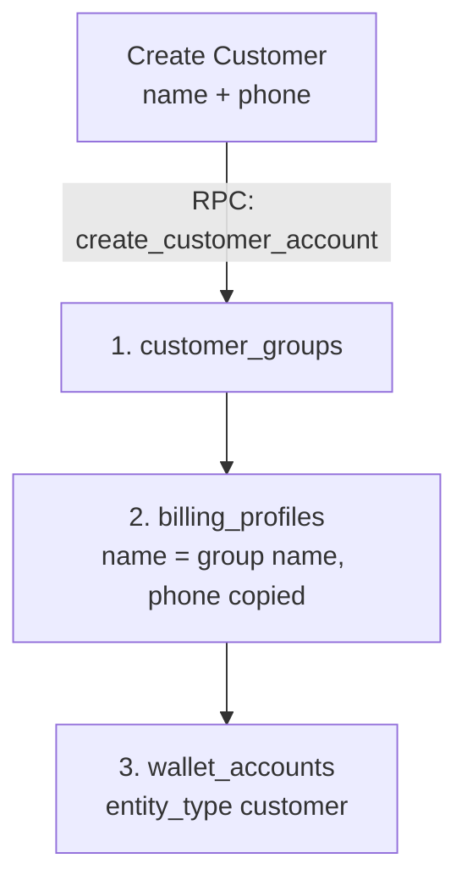

# Customer Module

The **Customer** domain is the canonical place to create and edit B2B buyer groups, billing identity, storefront members, and the linked wallet. Shop setup’s **Customer Groups** card opens this module. Old `/app/shop/customer-groups` URLs redirect here.

Grant key: `customer`. Recipient address book uses `recipient_profile`.

---

## 1. Domain Architecture & Provisioning

Save on **Create Customer** calls RPC `create_customer_account` in one transaction.

No member row on create. Add admins later on the Members tab.

### Create form fields

| Field | Required | Notes |
| :--- | :--- | :--- |
| Group / company name | Yes | `customer_groups.name`. Also copied to `billing_profiles.name`. |
| Phone | Yes | National number on `billing_profiles.phone`. Country calling code on `billing_profiles.phone_country_code` (e.g. `+880`). Unique per books tenant + country code + number. |

Create is a dialog on the hub list, not a separate page. Press Enter on phone or name to check duplicates.

Nothing else on this form. Accent color defaults. Email, address, and members are later edits.

If that phone already exists on a profile under the same books tenant, create fails (or reuse — do not insert a second profile).

### Target table columns (books-owned)

See [`TEMP_PARENT_CUSTOMER_GROUP.md`](./TEMP_PARENT_CUSTOMER_GROUP.md) until this is merged as as-built.

**`customer_groups`:** `id`, `name`, `parent_tenant_id` (books tenant; no `tenant_id`), `is_active`, `deleted_at`, `accent_color`, `created_at`, `updated_at`.

**`billing_profiles`:** `id`, `parent_tenant_id` (books, required), `customer_group_id` (optional; unique when set), `name`, `email`, `phone`, `address`, `created_at`, `updated_at`. No operating `tenant_id`, no `color`. Null group = one-off invoice account (no members, no shop).

Hub list / account RPCs use `customer_groups.parent_tenant_id` = books and skip `deleted_at`. One-off profiles (no group) are not hub customers; they show on invoice / wallet lists.

### Entity responsibilities

| Entity | Table | Responsibility |
| :--- | :--- | :--- |
| **Customer group** | `customer_groups` | Company on the books parent. Active flag, soft delete, brand accent color. |
| **Billing profile** | `billing_profiles` | Money account. Linked to a group when this is a company; null group for a one-off invoice. |
| **Customer member** | `customer_group_members` | Storefront login users. Roles: `admin`, `manager`, `staff` (`customer_group_role`). |
| **Wallet account** | `wallet_accounts` | Ledger account (`entity_type = 'customer'`, `entity_id = billing_profile_id`). |
| **Recipient profile** | `recipient_profiles` | Delivery endpoints. Grant key: `recipient_profile`. |

### Identity: unique phone (company / money)

- **Books unique:** one `billing_profiles.phone` per `parent_tenant_id` (normalized). This is the company key for grouped and one-off profiles.
- **Do not** put phone on `customer_groups`. Create copies name + phone onto the linked profile.
- **Members:** unique email **inside one group** only (`customer_group_members_group_email_unique`). Many admins per group. No tenant-wide “one admin email.”
- Drop target: `find_customer_admin_email_conflict` / tenant-wide admin-email trigger. Shop login is email + that shop’s grant.

### Shop member roles

| `customer_group_role` | Shop access role | Default tenant role slug |
| :--- | :--- | :--- |
| `admin` | `customer_admin` | `customer-admin` |
| `manager` | `customer_manager` | `manager` |
| `staff` | `customer_staff` | `customer-staff` |

Access Control still assigns shop grants per group. Per-shop catalog rights stay on the shop **Access matrix** (`shop_permissions`).

---

## 2. Page & Component Inventory

| Route | Main page | Notes |
| :--- | :--- | :--- |
| `/:tenantSlug?/app/customers` | [`CustomerHubPage.vue`](file:///Users/daviditc/Documents/personal_projects/brandwala-wholesale-quasar-v2/web/src/modules/customer/pages/CustomerHubPage.vue) | Search, list, create dialog (name + phone). Click row to open drawer. |
| `/:tenantSlug?/app/customers/create` | Redirect | Sends staff to the customer list. |
| `/:tenantSlug?/app/customers/recipient-profiles` | [`RecipientProfilesPage.vue`](file:///Users/daviditc/Documents/personal_projects/brandwala-wholesale-quasar-v2/web/src/modules/sales_invoice/pages/RecipientProfilesPage.vue) | Delivery address book. |
| `/:tenantSlug?/app/shop/customer-groups` | Redirect | Sends staff to `app-customers`. |

Shop hub (`/:tenantSlug?/app/shop/shops`) **Customer Groups** card → `app-customers`.

Click a hub row → [`CustomerDetailDrawer.vue`](file:///Users/daviditc/Documents/personal_projects/brandwala-wholesale-quasar-v2/web/src/modules/customer/components/CustomerDetailDrawer.vue):

- **General** — customer group (name, accent, active) and billing profile (contact name, required phone with country code, email, address).
- **Members** — list; add/edit name, email, role (`admin` / `manager` / `staff`), active.
- **Account** — invoice dues vs wallet balance (two pots); open invoices; collect / deposit / credit / withdraw. See [`CUSTOMER_ACCOUNT_SUMMARY_RPC.md`](./CUSTOMER_ACCOUNT_SUMMARY_RPC.md).
- **Wallet Ledger** — full immutable ledger history (`useWalletQuery`).

---

## 3. Page to API / RPC Matrix

| Component | Action / Trigger | Hook / Endpoint | Caching |
| :--- | :--- | :--- | :--- |
| **`CustomerHubPage`** | Mount / search / page | `useCustomerListQuery()` → `RPC: list_customer_accounts_paginated` | `staleTime: 60s`, `['customer', 'list', tenantId, search, page, pageSize]` |
| **`CustomerHubPage`** | Delete | Confirm → `deleteCustomerGroupMutation` → `RPC: delete_customer_group` (sets `deleted_at`) | Invalidates `['customers']` |
| **`CustomerDetailDrawer`** | Save general | `updateCustomerMutation` → `customer_groups`, `billing_profiles` | Invalidates `['customers']` |
| **`CustomerDetailDrawer`** | Members tab | `useCustomerMembersQuery()` → `customer_group_members` | `staleTime: 30s`, `['customers', 'members', groupId]` |
| **`CustomerDetailDrawer`** | Add / update / delete member | mutations on `customer_group_members` | Invalidates members + `['customers']` |
| **`CustomerDetailDrawer`** | Account tab | `useCustomerAccountQuery()` → `RPC: get_customer_account_summary_for_staff` | `staleTime: 30s`, `['customer', 'account', tenantId, groupId]` |
| **`CustomerDetailDrawer`** | Account collect | `invoiceRepository.collectWholesaleInvoicePayment` | Invalidates account + wallet + customer list |
| **`CustomerDetailDrawer`** | Account wallet actions | `walletRepository.recordManualTransaction` | Invalidates account + wallet + customer list |
| **`CustomerDetailDrawer`** | Wallet Ledger tab | `useWalletQuery('customer', billingProfileId)` | `staleTime: 30s` |

---

## 4. Query Keys & Server State

[`customerQueryKeys.ts`](file:///Users/daviditc/Documents/personal_projects/brandwala-wholesale-quasar-v2/web/src/modules/customer/services/customerQueryKeys.ts):

* `customerKeys.all` → `['customers']`
* `customerKeys.lists()` → `['customers', 'list']`
* `customerKeys.list(tenantId, search)` → `['customers', 'list', tenantId, search]`
* `customerKeys.members(groupId)` → `['customers', 'members', groupId]`
* `customerKeys.account(tenantId, groupId)` → `['customer', 'account', tenantId, groupId]`
