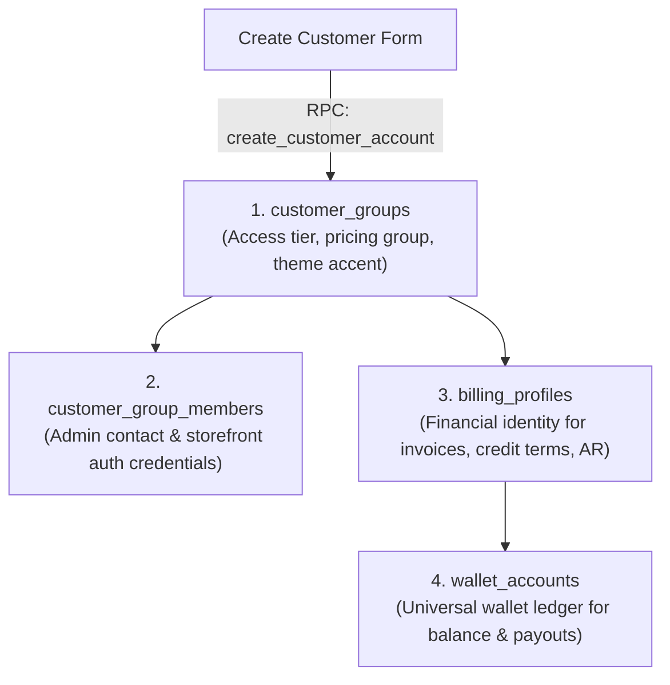

# Customer Module

The **Customer** domain consolidates B2B customer accounts, storefront access tiers, billing identities, delivery recipients, contact members, and financial wallet linkage into a unified module.

---

## 1. Domain Architecture & Provisioning

When a new customer is created, the system executes an atomic transaction (RPC: `create_customer_account`) that automatically provisions four linked entities:

### Entity Responsibilities

| Entity | Table | Responsibility |
| :--- | :--- | :--- |
| **Customer Group** | `customer_groups` | Organization profile, tier, bulk discount rules, active status, and brand accent color. |
| **Billing Profile** | `billing_profiles` | Financial account for wholesale and retail invoices, AR balances, and ledger accounting. |
| **Customer Member** | `customer_group_members` | Contact persons and login users attached to the customer group. |
| **Wallet Account** | `wallet_accounts` | Universal wallet balance (`entity_type = 'customer'`, `entity_id = billing_profile_id`). |
| **Recipient Profile** | `recipient_profiles` | Delivery endpoint (name, phone, address). Used by invoices and shop orders. Grant key: `recipient_profile`. |

---

## 2. Page & Component Inventory

| Route | Main Page | Key Components & Drawers |
| :--- | :--- | :--- |
| `/:tenantSlug?/app/customers` | [`CustomerHubPage.vue`](file:///Users/daviditc/Documents/personal_projects/brandwala-wholesale-quasar-v2/web/src/modules/customer/pages/CustomerHubPage.vue) | [`CustomerDetailDrawer.vue`](file:///Users/daviditc/Documents/personal_projects/brandwala-wholesale-quasar-v2/web/src/modules/customer/components/CustomerDetailDrawer.vue), search box, count badge, status chip. |
| `/:tenantSlug?/app/customers/create` | [`CreateCustomerPage.vue`](file:///Users/daviditc/Documents/personal_projects/brandwala-wholesale-quasar-v2/web/src/modules/customer/pages/CreateCustomerPage.vue) | Multi-column customer identity form card, color picker, live preview card. |
| `/:tenantSlug?/app/customers/recipient-profiles` | [`RecipientProfilesPage.vue`](file:///Users/daviditc/Documents/personal_projects/brandwala-wholesale-quasar-v2/web/src/modules/sales_invoice/pages/RecipientProfilesPage.vue) | Delivery recipient address book |

---

## 3. Page to API / RPC Matrix

| Component | Action / Trigger | Hook / Endpoint | Caching Strategy |
| :--- | :--- | :--- | :--- |
| **`CustomerHubPage`** | Page Mount / Search Debounce | `useCustomerListQuery()` $\rightarrow$ `RPC: list_customer_accounts` | `staleTime: 60s`, Key: `['customers', 'list', tenantId, search]` |
| **`CreateCustomerPage`** | Click "Save Customer" | `createCustomerMutation` $\rightarrow$ `RPC: create_customer_account` | Optimistic prepend (`setQueryData`), invalidates `['customers']` |
| **`CustomerDetailDrawer`** | Submit Edit Form | `updateCustomerMutation` $\rightarrow$ `Tables: customer_groups, billing_profiles` | Invalidates `['customers']` root |
| **`CustomerDetailDrawer`** | Open Members Tab | `useCustomerMembersQuery()` $\rightarrow$ `Table: customer_group_members` | `staleTime: 30s`, Key: `['customers', 'members', groupId]` |
| **`CustomerDetailDrawer`** | Add / Update Member | `createMemberMutation` / `updateMemberMutation` $\rightarrow$ `Table: customer_group_members` | Invalidates `['customers', 'members', groupId]` |
| **`CustomerDetailDrawer`** | Delete Member | `deleteMemberMutation` $\rightarrow$ `Table: customer_group_members` | Invalidates `['customers', 'members', groupId]` |
| **`CustomerDetailDrawer`** | Open Wallet Tab | `useQuery` $\rightarrow$ `Table: universal_wallet_ledger` | `staleTime: 30s`, Key: `['wallet', 'ledger', entityId]` |

---

## 4. Query Keys & Server State

Server state is managed via **TanStack Query** in [`customerQueryKeys.ts`](file:///Users/daviditc/Documents/personal_projects/brandwala-wholesale-quasar-v2/web/src/modules/customer/services/customerQueryKeys.ts):

* `customerKeys.all` $\rightarrow$ `['customers']`
* `customerKeys.lists()` $\rightarrow$ `['customers', 'list']`
* `customerKeys.list(tenantId, search)` $\rightarrow$ `['customers', 'list', tenantId, search]`
* `customerKeys.members(groupId)` $\rightarrow$ `['customers', 'members', groupId]`
