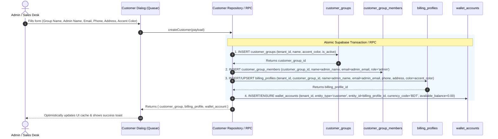

# Customer Creation Specification & Automated Provisioning

## 1. Overview
When a new **Customer** is created, the system must collect a unified set of identity fields and automatically provision the corresponding **Customer Group**, **Admin Member Account**, **Billing Profile**, and **Universal Wallet Account** in a single atomic transaction.

---

## 2. Required Creation Fields

| Field Name | Type | Required | Description | Example |
|---|---|:---:|---|---|
| **`group_name`** | `TEXT` | **Yes** | Name of the customer group / organization / business entity. | `Retail Alpha Buyers` |
| **`admin_name`** | `TEXT` | **Yes** | Full name of the primary contact person / account administrator. | `Rahim Chowdhury` |
| **`admin_email`** | `TEXT` | **Yes** | Primary email address for notifications and storefront member auth. | `rahim@alphabuyers.com` |
| **`phone`** | `TEXT` | **Yes** | Primary phone number for SMS notifications and invoice contact. | `+8801712345678` |
| **`address`** | `TEXT` | **Yes** | Physical office or delivery address for billing/invoices. | `House 12, Road 4, Sector 7, Uttara, Dhaka` |
| **`accent_color`** | `TEXT` | **Yes** | Theme HEX or brand color used for badges, avatar accents, and invoice header accents. | `#B45F34` |

---

## 3. Automated Provisioning Flow (Step-by-Step)



---

## 4. Database Schema Impact & Constraints

### 4.1 `customer_groups`
```sql
INSERT INTO public.customer_groups (
  tenant_id,
  name,
  accent_color,
  is_active
) VALUES (
  :tenant_id,
  :group_name,
  :accent_color,
  true
) RETURNING id;
```

### 4.2 `customer_group_members` (Admin User)
```sql
INSERT INTO public.customer_group_members (
  customer_group_id,
  name,
  email,
  role,
  is_active
) VALUES (
  :customer_group_id,
  :admin_name,
  LOWER(TRIM(:admin_email)),
  'admin',
  true
);
```

### 4.3 `billing_profiles` (Invoice & Financial Identity)
```sql
INSERT INTO public.billing_profiles (
  tenant_id,
  customer_group_id,
  name,
  email,
  phone,
  address,
  color
) VALUES (
  :tenant_id,
  :customer_group_id,
  :admin_name,
  LOWER(TRIM(:admin_email)),
  :phone,
  :address,
  :accent_color
) RETURNING id;
```

### 4.4 `wallet_accounts` (Universal Wallet Ledger Anchor)
```sql
INSERT INTO public.wallet_accounts (
  tenant_id,
  entity_type,
  entity_id,
  currency_code,
  available_balance,
  locked_balance,
  pending_balance
) VALUES (
  :tenant_id,
  'customer',
  :billing_profile_id,
  'BDT',
  0.00,
  0.00,
  0.00
)
ON CONFLICT (tenant_id, entity_type, entity_id, currency_code) DO NOTHING;
```

---

## 5. UI Form & Validation Specs

1. **Form Layout**: Compact Quasar modal (`CustomerCreateDialog.vue`).
2. **Form Controls**:
   - `group_name` (`q-input outlined dense`, required).
   - `admin_name` (`q-input outlined dense`, required).
   - `admin_email` (`q-input outlined dense`, email format validation).
   - `phone` (`q-input outlined dense`, phone validation).
   - `address` (`q-input outlined dense type="textarea" rows="2"`, required).
   - `accent_color` (`q-color` picker + quick preset palette swatches).
3. **Buttons**:
   - Primary: "Create Customer" (`unelevated action-btn text-weight-bold`, 8px square radius).
   - Secondary: "Cancel" (`flat text-grey-7`).
4. **Post-Submission**:
   - Invalidate TanStack query cache: `customerQueryKeys.groups(tenantId)`, `customerQueryKeys.billingProfiles(tenantId)`, and `walletQueryKeys.accounts(tenantId)`.
   - Show success notification (`showSuccessNotification('Customer account & billing profile created successfully.')`).
