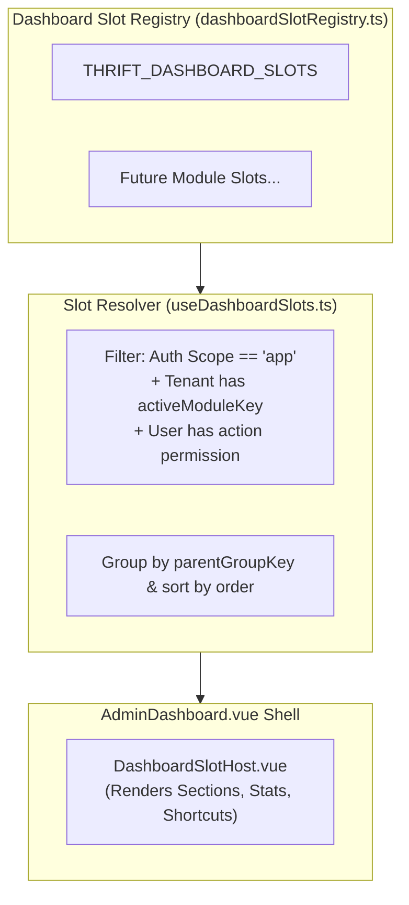

# Dashboard & Widget Registry

The **Dashboard** module provides a dynamic, registry-composed home surface for tenant administrators and storefront customers. Instead of monolithic dashboards, features register modular widget slots that are filtered automatically based on tenant module enablement and user role permissions.

---

## 1. Dashboard Architecture & Dynamic Slot Registry

The Admin Dashboard (`/:tenantSlug?/app/dashboard`) renders widgets via a decentralized slot registry:

### Slot Kinds & Lifecycle

| Slot Kind | API Calls | Typical Usage | Example in Thrift |
| :--- | :---: | :--- | :--- |
| **`section`** | Optional (Internal) | Complex interactive panel / chart / action bar | `ThriftDashboardActions.vue`, `ThriftInsightsPanel.vue` |
| **`shortcut`** | None | Navigation tile to a module sub-page | `Sales & Invoices`, `Thrift Stock`, `Reports` tiles |
| **`stat`** | Yes (Internal) | Snapshot KPI card or metric gauge | Snapshot numbers |
| **`attention`** | Yes (Internal) | Urgent action queue / pending approvals | Pending COD reminders |

---

## 2. Thrift Dashboard Implementation

The **Thrift** vertical is the reference implementation of the dashboard registry:

### 2.1 Action Bar (`ThriftDashboardActions.vue`)
* Slot ID: `thrift.ops.actions` (`kind: 'section'`, `order: 5`)
* Renders quick-intent CTA buttons (`New sale`, `Sales`, `Shipments`, `Stock`) conditionally based on `useModulePermissions().hasModuleAccess`.

### 2.2 Shop Glance & Analytics (`ThriftInsightsPanel.vue`)
* Slot ID: `thrift.ops.insights` (`kind: 'section'`, `order: 10`, gated by `thrift_reports`)
* Visualizes real-time inventory and sales metrics:
  * **Available vs Sold Items**: Count badges with stock availability percentage.
  * **COD Waiting**: Pending COD package count and expected collection value (BDT).
  * **Sales Today**: Daily completed invoice counter.
  * **Chart.js Doughnut**: Dynamic visual breakdown of in-stock vs sold inventory share (`chartSetup.ts`).

### 2.3 Direct Navigation Shortcuts
* `thrift.sales.list` $\rightarrow$ `/thrift/sales`
* `thrift.sales.returns` $\rightarrow$ `/thrift/sales/returns`
* `thrift.stock.list` $\rightarrow$ `/thrift/stock`
* `thrift.shipment.list` $\rightarrow$ `/thrift/shipments`
* `thrift.reports.hub` $\rightarrow$ `/thrift/reports`

---

## 3. Page & Component Inventory

| Route | Main Page | Key Components & Widgets |
| :--- | :--- | :--- |
| `/:tenantSlug?/app/dashboard` | [`AdminDashboard.vue`](file:///Users/daviditc/Documents/personal_projects/brandwala-wholesale-quasar-v2/web/src/modules/dashboard/pages/AdminDashboard.vue) | [`DashboardGroup.vue`](file:///Users/daviditc/Documents/personal_projects/brandwala-wholesale-quasar-v2/web/src/modules/dashboard/components/DashboardGroup.vue), [`DashboardSlotHost.vue`](file:///Users/daviditc/Documents/personal_projects/brandwala-wholesale-quasar-v2/web/src/modules/dashboard/components/DashboardSlotHost.vue), [`ThriftInsightsPanel.vue`](file:///Users/daviditc/Documents/personal_projects/brandwala-wholesale-quasar-v2/web/src/modules/thrift/dashboard/ThriftInsightsPanel.vue), [`ThriftDashboardActions.vue`](file:///Users/daviditc/Documents/personal_projects/brandwala-wholesale-quasar-v2/web/src/modules/thrift/dashboard/ThriftDashboardActions.vue) |
| `/:tenantSlug?/shop/dashboard` | [`CustomerDashboard.vue`](file:///Users/daviditc/Documents/personal_projects/brandwala-wholesale-quasar-v2/web/src/modules/dashboard/pages/CustomerDashboard.vue) | `CustomerDashboardHero.vue`, `CustomerDashboardStatusStrip.vue`, `CustomerDashboardRecentOrders.vue`, `CustomerDashboardResumeRow.vue` |
| `/superadmin/dashboard` | [`SuperadminDashboard.vue`](file:///Users/daviditc/Documents/personal_projects/brandwala-wholesale-quasar-v2/web/src/modules/dashboard/pages/SuperadminDashboard.vue) | Platform tenant counts, system health |

---

## 4. Page to API / RPC Matrix

| Component | Action / Trigger | Hook / Endpoint | Caching Strategy |
| :--- | :--- | :--- | :--- |
| **`AdminDashboard`** | Mount / Tenant Switch | `useDashboardSlots()` | Client-side computed from permissions & registry |
| **`ThriftInsightsPanel`** | Mount / Period Poll | `useThriftDashboardMetricsQuery()` $\rightarrow$ `RPC: get_thrift_dashboard_metrics` | `staleTime: 30s`, Key: `['thrift', 'dashboard_metrics', tenantId]` |
| **`CustomerDashboard`** | Mount / Profile Load | `useQuery` $\rightarrow$ `RPC: get_customer_dashboard_summary` | `staleTime: 60s`, Key: `['customer', 'dashboard', customerId]` |

---

## 5. How to Register Widgets for a New Module

1. Create `web/src/modules/<module>/dashboard/<module>DashboardSlots.ts` exporting `readonly DashboardSlot[]`.
2. Import and register the array in [`dashboardSlotRegistry.ts`](file:///Users/daviditc/Documents/personal_projects/brandwala-wholesale-quasar-v2/web/src/modules/dashboard/registry/dashboardSlotRegistry.ts).
3. Do **not** modify `AdminDashboard.vue` directly — let the permission resolver dynamically mount the components.
