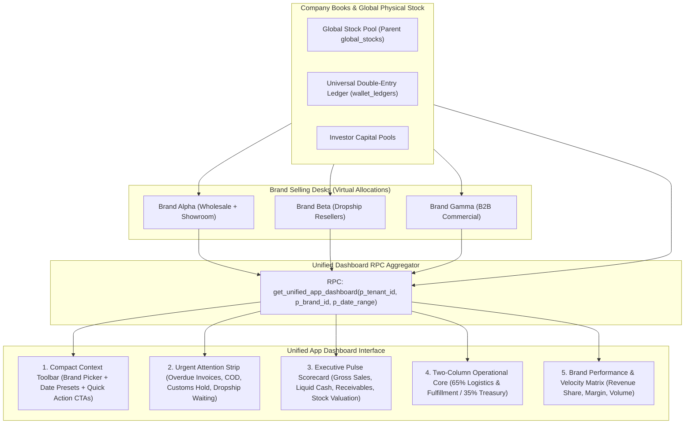
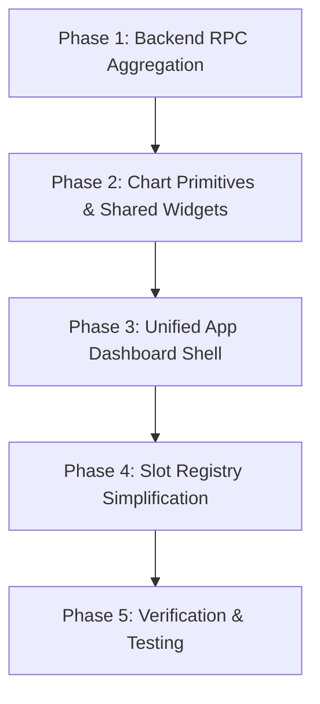

# Unified Enterprise App Dashboard — Master Architecture & Redesign Plan

This document defines the canonical architectural and visual specification for the **TradeFlow BD Unified App Dashboard** (`/:tenantSlug?/app/dashboard`).

---

## 1. Executive Summary & Paradigm Shift

### From Split Workspaces to Single-Tenant Multi-Brand
Under the previous architecture, the dashboard was bifurcated between:
- **Parent Workspace**: Supply chain, customs, global stock, investor capital.
- **Child Workspace**: Retail orders, dropship processing, POS invoices, local courier cash.

As established in [`doc/TENANT_UX_AND_FEATURE_ENABLEMENT.md`](../TENANT_UX_AND_FEATURE_ENABLEMENT.md) and [`doc/MASTER_PLAN.md`](../MASTER_PLAN.md), **child tenants are now unified as Brands** under a single parent company. Consequently:
1. **One App Dashboard**: There is only **one consolidated app workspace dashboard** for staff and administrators.
2. **Zero Context-Switching**: Staff never switch accounts to see a brand's operations. The global top bar features an **Entity / Brand Filter** (`All Brands` or select specific brand) that dynamically slices the entire dashboard.
3. **Operational Cockpit First**: The dashboard prioritizes urgent triage (bottlenecks, stuck shipments, overdue receivables, COD awaiting remittance) before long-term trend analysis.

---

## 2. End-to-End Enterprise Information Architecture



---

## 3. Comprehensive Dashboard Inventory (Tabular Specification)

| # | Section / Tier | Component / Metric | Business Intent & ERP Value | Recommended Visualization | Data Source / Domain RPC | Action Route / Deep-Link |
|:--|:--|:--|:--|:--|:--|:--|
| **1** | **Header Context** | **Brand & Period Scoping Toolbar** | Filters the entire workspace without full-page reloads. | Compact 38px toolbar with `<q-select>` (Brand avatar + name) & date pills (`Today`, `7D`, `30D`, `Month`). | Client-side reactive filter state syncing query params. | URL query sync (`?brand=12&period=month`) |
| **2** | **Action Strip** | **Needs Action Today (Attention Center)** | Real-time operational exception handling; surfaces bottlenecks requiring immediate staff intervention. | Horizontal scrollable flex row of high-contrast status alert badges (`inset 3px 0 0` accent border). | `useDashboardAttention` aggregated across modules. | Individual triage deep-links |
| 2.1 | *Attention* | *Overdue Invoices* | Identifies credit accounts past terms to minimize bad debt exposure. | Rose warning pill (`14 Overdue • ৳ 4.85L`) | `sales_invoice` (`overdueCount`, `overdueAmount`) | `/invoices?payment_status=overdue` |
| 2.2 | *Attention* | *Courier COD in Holding* | In-transit cash held by logistics partners (Pathao/Steadfast) awaiting bank settlement. | Amber highlight pill (`৳ 9.20L COD in Transit`) | `wallet` (`courier_cod_holding_total`) | `/wallet/remittances` |
| 2.3 | *Attention* | *Dropship Orders Pending Pick* | Reseller orders submitted awaiting warehouse inventory allocation. | Cyan action pill (`23 Dropship Pending`) | `shop_order` (`dropshipSubmittedCount`) | `/orders/dropship?status=submitted` |
| 2.4 | *Attention* | *Shipments in Customs Clearance* | Commercial freight held at port customs requiring documentation/duty payment. | Orange alert pill (`2 Batches at Port Customs`) | `procurement_stock` (`customsClearanceCount`) | `/procurement/shipments?status=customs` |
| 2.5 | *Attention* | *Critical Low Stock SKUs* | Warehouse items below minimum buffer threshold risking stockouts. | Amber alert pill (`18 SKUs Below Buffer`) | `procurement_stock` (`lowStockCount`) | `/stock/alerts` |
| 2.6 | *Attention* | *Investor Payouts Due* | Batch profit yields scheduled for partner disbursement. | Violet info pill (`৳ 3.40L Yield Due Sep 30`) | `investor_capital` (`dueToInvestors`) | `/capital/ledger?filter=due` |
| **3** | **Executive Pulse** | **4-Card KPI Scorecard with Trendlines** | Instant financial & operational health check comparing current period vs. previous period. | 4 Flat surface cards with large figures, percentage delta pills, and 7-day canvas micro-sparklines. | `get_unified_app_dashboard` summary object. | Respective ledger and reporting views |
| 3.1 | *KPI Card 1* | **Gross Invoiced Revenue** | Total commercial wholesale & retail billings (excluding cancellations). | BDT Amount + `+14.8% vs last period` + Green sparkline | `sales_invoice` summary | `/reports/sales-summary` |
| 3.2 | *KPI Card 2* | **Liquid Cash & Bank Position** | True net cash available in liquid operating accounts for payroll and logistics. | BDT Amount + Multi-account count + Neutral blue sparkline | `wallet` (`company_cash_reserve_total`) | `/wallet` |
| 3.3 | *KPI Card 3* | **Customer Receivables (Dues)** | Total outstanding B2B credit portfolio with aging health warning. | BDT Amount + `38% > 30 Days` amber pill + Amber sparkline | `sales_invoice` (`total_unpaid_amount`) | `/reports/customer-dues` |
| 3.4 | *KPI Card 4* | **Warehouse Stock Valuation** | Landed value of live inventory pooled in warehouse bins. | BDT Landed Value + `18,450 Units In Stock` pill | `procurement_stock` (`total_stock_value_bdt`) | `/stock/valuation` |
| **4** | **Operations (65%)** | **Orders & Fulfillment Pipeline** | Live tracking of customer orders moving through warehouse and courier fulfillment. | 4-Stage visual flow meter (Funnel) with stage counts, values, and percentage velocity. | `shop_order` & `sales_invoice` fulfillment states. | `/orders?tab=fulfillment` |
| 4.1 | *Flow Stage 1* | *Pending Approval / Draft* | New wholesale quotes and reseller orders awaiting review. | Badge counter + total value | `/orders?status=pending` |
| 4.2 | *Flow Stage 2* | *Picking & Packing* | Stock allocated; warehouse staff packing items into parcel bins. | Badge counter + unit count | `/orders?status=processing` |
| 4.3 | *Flow Stage 3* | *Dispatched to Courier* | Parcels handed to courier partners with tracking numbers assigned. | Badge counter + courier split | `/orders?status=dispatched` |
| 4.4 | *Flow Stage 4* | *Delivered & Settled* | Completed customer deliveries with cash collected. | Badge counter + settlement rate | `/orders?status=delivered` |
| **5** | **Operations (65%)** | **Inbound Procurement & Stock Intake** | Visual tracking of sea/air containers moving from international suppliers to physical bins. | Stepper timeline for active shipments + Donut chart of physical stock allocation (Available vs Allocated vs In-Transit). | `procurement_stock` active shipments & batch RPCs. | `/procurement/shipments` |
| **6** | **Treasury (35%)** | **Working Capital & Liquidity Matrix** | Real-time reconciliation of expected cash inflows vs pending cash outflows over the next 30 days. | Bi-directional progress bar / horizontal balance gauge with Net Liquidity indicator. | `wallet` double-entry accounts + `reporting_treasury`. | `/wallet/treasury` |
| 6.1 | *Inflow Assets* | *Liquid Bank + COD Holding + Receivables* | Immediate cash assets scheduled to enter company accounts. | Stacked positive bar (Emerald / Teal / Blue) | Breakdown modal |
| 6.2 | *Outflow Liabilities* | *Vendor Freight Payables + Supplier Dues + Investor Yields* | Debts and payables committed for payout. | Stacked negative bar (Rose / Orange / Purple) | Payables ledger |
| 6.3 | *Net Working Capital* | *Projected Operating Buffer* | Inflows minus Outflows to ensure ongoing operational solvency. | Prominent delta pill (`+ ৳ 14.2L Net Buffer`) | Financial forecast |
| **7** | **Brand Velocity** | **Multi-Brand Contribution Matrix** | Benchmark performance across sister brands (e.g. Brand A vs Brand B vs Brand C). | Stacked horizontal bar chart (Revenue share) + Micro-table with Brand Avatar, Sales BDT, Orders, and Gross Margin %. | Consolidated brand aggregation RPC. | Click row to scope dashboard to that brand |
| **8** | **Specialized Hubs** | **Collapsible Sub-Panels (Thrift / Tasks / After-Sales)** | Secondary operational domains that render only when tenant has the macro-app enabled. | Clean modular expander or side-tab strip using `DashboardPulseCard`. | Conditional module slot registry. | Respective module root |

---

## 4. Visual Layout Architecture & Wireframe

The design follows the **Table List Design System & UI Consistency Guidelines**:
- **Zero In-Page Headers**: No redundant `<h1>` or `AppPageHeader`. The global top breadcrumb displays the page location.
- **Fixed Layout Ergonomics**: Dashboard controls remain anchored, while individual story panels scroll smoothly.
- **Flat Surfaces & Inset Borders**: Modern flat surfaces (`var(--bw-theme-surface)`) with 1px border (`var(--bw-theme-border)`) and 3px status inset bars.

```
┌──────────────────────────────────────────────────────────────────────────────────────────────────────────────────┐
│ TOP BREADCRUMB: TradeFlow BD > Operations Desk                                                                   │
├──────────────────────────────────────────────────────────────────────────────────────────────────────────────────┤
│ DASHBOARD TOOLBAR (38px Compact Bar)                                                                             │
│ [🏢 All Brands ▾] [📅 This Month (Sep 2026) ▾]    [Search SKU/Order...]   [⚡ + Invoice] [📦 + Inbound] [🔄 Refresh]│
├──────────────────────────────────────────────────────────────────────────────────────────────────────────────────┤
│ 1. URGENT ATTENTION STRIP (Horizontal Triage Center)                                                             │
│ ┌────────────────────────┐ ┌────────────────────────┐ ┌────────────────────────┐ ┌─────────────────────────────┐ │
│ │ ⚠️ 14 Overdue Invoices │ │ 🚚 ৳ 9.20L COD Waiting │ │ 📦 23 Dropship Pending │ │ ⚓ 2 Batches at Customs Hold │ │
│ │   ৳ 4,85,000 to recover│ │   With Pathao/Steadfast│ │   Stock pick needed    │ │   Port clearance required │ │
│ └────────────────────────┘ └────────────────────────┘ └────────────────────────┘ └─────────────────────────────┘ │
├──────────────────────────────────────────────────────────────────────────────────────────────────────────────────┤
│ 2. EXECUTIVE PULSE SCORECARD (4 Key Financial & Stock Gauges with 7-Day Trend Sparklines)                        │
│ ┌───────────────────────┐ ┌───────────────────────┐ ┌────────────────────────┐ ┌───────────────────────────────┐ │
│ │ Gross Invoiced Sales  │ │ Liquid Cash & Bank    │ │ Customer Receivables   │ │ Warehouse Stock Asset         │ │
│ │ ৳ 4,820,500           │ │ ৳ 1,840,000           │ │ ৳ 1,220,400            │ │ ৳ 14,850,000                  │ │
│ │ ▲ +14.8% vs last mo   │ │ 4 Active Accounts     │ │ ⚠️ 38% > 30 Days Due   │ │ 18,450 Units in 4 Warehouses  │ │
│ │ [∿∿∿∿∿ Micro Sparkline]│ │ [∿∿∿∿∿ Micro Sparkline]│ │ [∿∿∿∿∿ Micro Sparkline]│ │ [∿∿∿∿∿ Micro Sparkline]       │ │
│ └───────────────────────┘ └───────────────────────┘ └────────────────────────┘ └───────────────────────────────┘ │
├──────────────────────────────────────────────────────────────────────────────────────────────────────────────────┤
│ 3. OPERATIONAL SPLIT CORE                                                                                        │
│ ┌────────────────────────────────────────────────────────┐ ┌────────────────────────────────────────────────────┐ │
│ │ 3A. COMMERCIAL & LOGISTICS PIPELINE (65% Width)        │ │ 3B. TREASURY & WORKING CAPITAL (35% Width)         │ │
│ │                                                        │ │                                                    │ │
│ │ FULFILLMENT & DROPSHIP VELOCITY                        │ │ LIQUIDITY RUNWAY (Next 30 Days)                    │ │
│ │ [28 New] ──► [42 Picking] ──► [86 In Transit] ──► [154]│ │ Projected Inflows:     ৳ 27,60,000                │ │
│ │                                                        │ │ Committed Outflows:  - ৳ 18,40,000                 │ │
│ │ INBOUND SHIPMENTS & CUSTOMS INTAKE                     │ │ ───────────────────────────────────                │ │
│ │ • Batch #CN-2026-09 (Sea Container) — Customs Port     │ │ Net Cash Position:   + ৳  9,20,000 (Healthy)       │ │
│ │ • Batch #UK-2026-03 (Air Cargo) — Clearance Dhaka      │ │ [■■■■■■■■■■■■■■■■□□□□] 68% Coverage Ratio        │ │
│ │                                                        │ │                                                    │ │
│ │ PHYSICAL STOCK ALLOCATION (Donut Chart)                │ │ COURIER COD RECONCILIATION                         │ │
│ │ • Available for Sale: 62% (11,400 pcs)                 │ │ • Steadfast: ৳ 5,40,000 (Awaiting Bank Batch)      │ │
│ │ • Reserved / Allocated: 26% (4,800 pcs)                │ │ • Pathao:    ৳ 3,80,000 (Remitted Tomorrow)        │ │
│ │ • In Transit: 12% (2,250 pcs)                          │ │                                                    │ │
│ └────────────────────────────────────────────────────────┘ └────────────────────────────────────────────────────┘ │
├──────────────────────────────────────────────────────────────────────────────────────────────────────────────────┤
│ 4. BRAND PERFORMANCE & CONTRIBUTION MATRIX (Horizontal Comparison Across Child Brands)                           │
│ ┌──────────────────────────────────────────────────────────────────────────────────────────────────────────────┐ │
│ │ Brand Name           Revenue (BDT)   Share %     Orders    Gross Margin %   Velocity Status                  │ │
│ │ 🏷️ Brand Alpha       ৳ 2,450,000     50.8%       342       31.4%            🟢 Fast Moving                   │ │
│ │ 🏷️ Brand Beta (DS)   ৳ 1,520,000     31.5%       210       24.8%            🟢 Steady                        │ │
│ │ 🏷️ Brand Gamma       ৳   850,500     17.7%        98       28.2%            🟡 Needs Promotion               │ │
│ └──────────────────────────────────────────────────────────────────────────────────────────────────────────────┘ │
└──────────────────────────────────────────────────────────────────────────────────────────────────────────────────┘
```

---

## 5. Modern Visual Engine & Chart Specifications (ApexCharts / SaaS Aesthetics)

To eliminate the backdated Bootstrap/AdminLTE look and achieve a world-class **Linear / Stripe / Mercury** standard, visual components are upgraded to modern SaaS design patterns:

### Visual Upgrade Principles
1. **Obsidian Typography & Reduced Color Fatigue**: Large figures use crisp **Obsidian Ink** (`#0f172a` / `#1e293b`) rather than harsh neon colors. Color is reserved strictly for micro status badges and trend indicators.
2. **Balanced 4-Column KPI Grid**: Strictly locked 4-column grid (`grid-template-columns: repeat(4, 1fr)` on desktop, 2x2 on tablet, 1 on mobile). Eliminates awkward orphaned cards and empty voids.
3. **Smooth Glowing Area Sparklines**: Replaces crude wavy lines with smooth bezier spline area charts (`height: 36px`) with 15% gradient opacity, zero-axis chrome, and interactive hover crosshairs.
4. **Sleek Radial Gauge & Segmented Allocation Bar**: Replaces thick, cut-off doughnuts with modern **Radial Arc Gauges** (Apple/Stripe style) or **Segmented Distribution Bars** with non-clipped legends.
5. **Continuous Fulfillment Conveyor**: Replaces stiff isolated gray boxes with a seamless horizontal flow track featuring connected status chevrons, stage velocity bars, and subtle pastel hues.

---

### Chart 1: Order Fulfillment Flow Conveyor
* **Type**: Connected Flow Stepper / Velocity Conveyor.
* **Aesthetics**:
  - Connected chevron flow links with animated pulse markers on active stages.
  - Micro progress bars within each stage showing stage throughput.
  - Soft stage tints (`rgba(13, 107, 92, 0.08)`, `rgba(245, 158, 11, 0.08)`, `rgba(14, 165, 233, 0.08)`, `rgba(34, 197, 94, 0.08)`).
* **Interactive Tooltip**: Displays stage count, total valuation (BDT), and average cycle time.

### Chart 2: Warehouse Stock Allocation (Radial Arc / Segmented Bar)
* **Type**: Modern Radial Arc Gauge or Segmented Proportional Bar (`height: 12px`, `borderRadius: 6px`).
* **Aesthetics**:
  - Thin 10px rounded stroke with soft drop-shadow glow.
  - Segments: Available (`#22c55e`), Reserved (`#f59e0b`), Inbound (`#0ea5e9`), Held (`#ef4444`).
  - High-density non-clipped legend grid with tabular counts and percentage shares.

### Chart 3: Treasury Liquidity Runway (Dual Balance Stream)
* **Type**: Bi-directional balance stream bar with centered net operating delta badge.
* **Positive Side (Inflows)**: Emerald-to-Teal gradient (`#22c55e` to `#0d9488`).
* **Negative Side (Outflows)**: Rose-to-Crimson gradient (`#f43f5e` to `#e11d48`).
* **Coverage Gauge**: Clean circular or pill progress indicator showing 30-day liquidity coverage ratio.

### Chart 4: Multi-Brand Velocity Matrix
* **Type**: Horizontal grouped bar or micro-distribution track comparing sister brands.
* **Interactivity**: Clicking any brand scopes the entire workspace without full-page reloads.
* **Strict Parent Rule**: Only brands whose `parent_id` matches the active company tenant are rendered; if no child brands exist, the matrix is hidden.

### Chart 5: 7-Day Glowing Area Sparklines (ApexCharts / Vue-ApexCharts)
* **Type**: Smooth Spline Area Chart (`curve: 'smooth'`, `dropShadow: { enabled: true, blur: 4, opacity: 0.15 }`).
* **Gradients**: Modern vertical fade from 25% opacity down to 0% transparent fill.
* **Chrome**: Zero axis lines, zero grid ticks, minimal interactive tooltip.
* **Delta Legend**: Net Gross Margin percentage labeled at the end of each bar.

### Chart 5: 7-Day Sparkline Primitives for KPI Cards
* **Type**: Minimalist Chart.js Line (`tension: 0.35`, `pointRadius: 0`, `borderWidth: 2`, `fill: true`).
* **Gradient**: Background fill fades from 20% opacity to transparent (`rgba(..., 0.20)` -> `rgba(..., 0)`).
* **Zero Chrome**: All scales (X & Y) and gridlines disabled; strictly communicates 7-day trend trajectory.

---

## 6. Technical Implementation Roadmap & File Changes



### Phase 1: Database & RPC Layer
- **New Stored Procedure**: Create atomic RPC `get_unified_app_dashboard(p_tenant_id bigint, p_brand_id bigint DEFAULT NULL, p_date_range text DEFAULT 'month')` returning JSONB with:
  - `attention`: Array of alert items (overdue invoices, COD waiting, dropship submitted, customs hold).
  - `kpis`: Revenue, cash position, customer dues, stock asset valuation with prior period comparisons.
  - `fulfillment`: Order counts and values grouped by fulfillment stage.
  - `procurement`: Active shipment statuses and physical stock allocation breakdown.
  - `treasury`: Inflows (COD + Dues + Bank) vs Outflows (Vendor + Freight + Investor Yields).
  - `brands`: Performance array across all active brands for the tenant.

### Phase 2: Design System & Chart Primitives
- Enhance [`web/src/modules/dashboard/utils/dashboardChartSetup.ts`](file:///Users/daviditc/Documents/personal_projects/brandwala-wholesale-quasar-v2/web/src/modules/dashboard/utils/dashboardChartSetup.ts) with brand-aware palette helpers and tooltip formatters.
- Create [`DashboardSparkline.vue`](file:///Users/daviditc/Documents/personal_projects/brandwala-wholesale-quasar-v2/web/src/modules/dashboard/components/DashboardSparkline.vue) for the 4 executive KPI cards.
- Create [`DashboardFulfillmentFunnel.vue`](file:///Users/daviditc/Documents/personal_projects/brandwala-wholesale-quasar-v2/web/src/modules/dashboard/components/DashboardFulfillmentFunnel.vue) for horizontal order tracking.
- Create [`DashboardLiquidityGauge.vue`](file:///Users/daviditc/Documents/personal_projects/brandwala-wholesale-quasar-v2/web/src/modules/dashboard/components/DashboardLiquidityGauge.vue) for treasury inflows vs outflows.

### Phase 3: Unified Shell Refactor
- Update [`AdminDashboard.vue`](file:///Users/daviditc/Documents/personal_projects/brandwala-wholesale-quasar-v2/web/src/modules/dashboard/pages/AdminDashboard.vue):
  - Replace legacy `AppPageHeader` with the compact 38px toolbar containing the **Brand Filter** and **Date Range Selector**.
  - Mount the high-priority **Attention Strip** at the top.
  - Render the **Executive KPI Scorecard** with micro-sparklines.
  - Render the **Two-Column Operational Core** (65% Logistics & Fulfillment, 35% Treasury).
  - Render the **Brand Contribution Matrix**.

### Phase 4: Registry & Permissions Cleanup
- Remove legacy `hierarchyScope: 'parent_only' | 'child_only'` filters from [`dashboardSlotRegistry.ts`](file:///Users/daviditc/Documents/personal_projects/brandwala-wholesale-quasar-v2/web/src/modules/dashboard/registry/dashboardSlotRegistry.ts) since all domains belong to the unified app scope.
- Align feature checks with Top-Level Macro-Apps (`procurement_stock`, `shop_order`, `sales_invoice`, `universal_wallet`, `investor_capital`, `tasks`, `thrift`).

---

## 7. Verification & Design System Checklist

- [ ] **Zero In-Page Headers**: Verified that no `<h1>`, `AppPageHeader`, or redundant titles appear inside the dashboard body.
- [ ] **Brand Selector Reactivity**: Selecting "All Brands" aggregates metrics across all branches; selecting "Brand Alpha" filters invoice and fulfillment metrics to Brand Alpha while maintaining physical stock visibility.
- [ ] **Chart Polish**: No empty donut charts or dashed wells. Charts render only when real numerical data exists.
- [ ] **High-Contrast Attention Strip**: Overdue alerts use soft status hues (`rgba(..., 0.08)`) with `3px` left accent borders and bold text.
- [ ] **Performance & Caching**: TanStack Query cache key incorporates `['dashboard', tenantId, selectedBrandId, dateRange]` with a `30s` stale time and zero redundant network waterfalls.
- [ ] **Mobile & Tablet Responsive**: Responsive CSS grid collapses gracefully from 2 columns on desktop (1440p/1080p) to a single stacked column on tablets (<1024px) and mobile (<720px).
