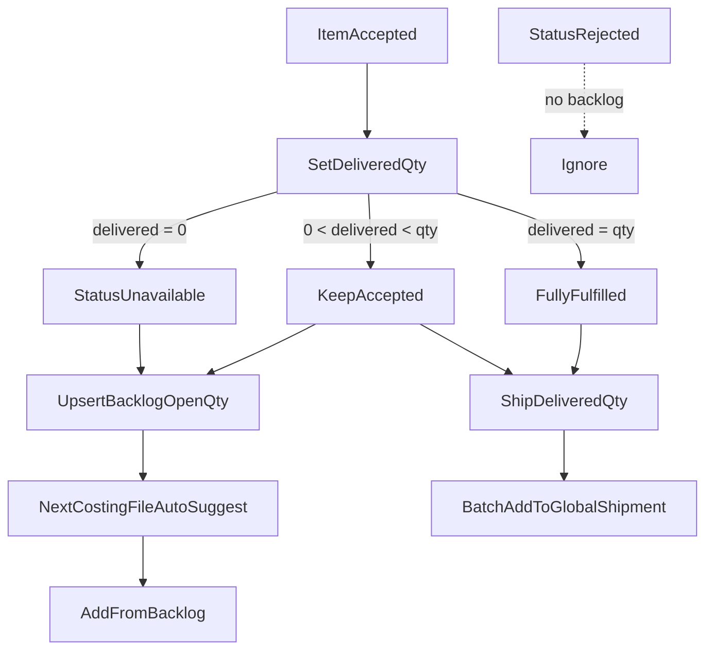

# Feature Blueprint: Product Based Costing Backlog And Shipment

## 1. User Story & Core Logic
### User Story
As a merchant operations user managing Product Based Costing (PBC) files:
- I want unfulfilled customer demand (items wanted by a billing profile but unavailable or only partially fulfilled in a given costing batch) to automatically form an open demand **backlog** for that billing profile.
- When creating or viewing a new costing file for that billing profile, I want to see an **auto-suggested backlog panel** and one-click add available backlog items directly into the current costing file.
- I want to bind a **default global shipment** (file shipment) to a costing file, and easily one-click / batch-add fulfilled costing lines into that global shipment with precise delivered quantity and provenance.

### Core Product Logic & Rules


#### Fulfillment Status & Backlog Matrix
| Outcome | Item Status | Backlog Action | Shipment Eligible Qty |
|---------|-------------|----------------|-----------------------|
| Customer rejected | `rejected` | None | None |
| Still deciding | `pending` | None | None |
| Wanted; got all | `accepted`, `delivered_quantity = quantity` | Clear/Delete backlog | `delivered_quantity` |
| Wanted; got some | `accepted`, `0 < delivered_quantity < quantity` | Upsert open backlog (`quantity - delivered_quantity`) | `delivered_quantity` |
| Wanted; got none | `unavailable` | Upsert open backlog (`quantity`) | None |
| Already on shipment | any + `assigned_shipment_id` set | — | None |

#### Key Rules
1. **Targeting Entity:** Backlog is scoped strictly by `billing_profile_id` (per tenant and product). `billing_profiles.customer_group_id` is unused for this feature.
2. **Latest Snapshot Semantics:** Unique constraint on `(tenant_id, billing_profile_id, product_id)`. Replaces open quantity on upsert; no historical transaction log required.
3. **Partial Quantity Handling:** Uses existing `product_based_costing_items.delivered_quantity` column. `null` is treated as `0`.
4. **Auto-Suggest Drawer/Panel:** When a costing file has a `billing_profile_id` assigned, fetch open backlog items for that profile. Allow selecting items to add into the current file.
5. **File Default Shipment:** Costing file maintains a `default_shipment_id` targeting `global_shipments(id)`. Header allows picking an existing shipment or inline creation of a draft shipment.
6. **Add-to-Shipment Flow:** Batch or row CTAs default to `default_shipment_id`. Only `accepted` items with `delivered_quantity > 0` and `assigned_shipment_id IS NULL` can be added to a parent shipment.

---

## 2. Data Modeling & Database Schema

### A. Table Alterations: `product_based_costing_files`
- `billing_profile_id` (`bigint null` FK → `billing_profiles(id)` ON DELETE SET NULL): Links costing file to customer billing profile.
- `order_for` (`text`): Set from `billing_profiles.name` on profile selection (backwards compatibility).
- `default_shipment_id` (`bigint null`): **Retarget FK** → `global_shipments(id)` ON DELETE SET NULL.
- **Index:** `idx_pbc_files_billing_profile_id` ON `product_based_costing_files(billing_profile_id)`.

### B. Table Alterations: `product_based_costing_items`
- `status` (`text`): Values: `pending`, `accepted`, `rejected`, `unavailable`.
- `quantity` (`int`): Quantity requested by customer.
- `delivered_quantity` (`int null`): Got this batch.
- `assigned_shipment_id` (`bigint null`): **Retarget FK** → `global_shipments(id)` ON DELETE SET NULL.
- **Data Cleanup:** Set existing `assigned_shipment_id` / `default_shipment_id` to NULL if referenced ID does not exist in `global_shipments`.

### C. New Table: `product_based_costing_backlog_items`
```sql
CREATE TABLE IF NOT EXISTS product_based_costing_backlog_items (
  id bigint GENERATED ALWAYS AS IDENTITY PRIMARY KEY,
  tenant_id bigint NOT NULL REFERENCES tenants(id) ON DELETE CASCADE,
  billing_profile_id bigint NOT NULL REFERENCES billing_profiles(id) ON DELETE CASCADE,
  product_id bigint NOT NULL REFERENCES products(id) ON DELETE CASCADE,
  open_quantity int NOT NULL CHECK (open_quantity > 0),
  name text NOT NULL,
  image_url text NULL,
  barcode text NULL,
  product_code text NULL,
  price_gbp numeric NULL,
  product_weight numeric NULL,
  package_weight numeric NULL,
  note text NULL,
  last_costing_file_id bigint NULL REFERENCES product_based_costing_files(id) ON DELETE SET NULL,
  last_costing_item_id bigint NULL REFERENCES product_based_costing_items(id) ON DELETE SET NULL,
  created_at timestamptz NOT NULL DEFAULT now(),
  updated_at timestamptz NOT NULL DEFAULT now(),
  CONSTRAINT uq_pbc_backlog_tenant_profile_product UNIQUE (tenant_id, billing_profile_id, product_id)
);

CREATE INDEX idx_pbc_backlog_tenant_profile ON product_based_costing_backlog_items (tenant_id, billing_profile_id);
```

---

## 3. AuthN, AuthZ, & Permissions
- **Row Level Security (RLS):** Enabled on `product_based_costing_backlog_items`. Authenticated users with access to `tenant_id` can select, insert, update, delete backlog items.
- **Shipment Management:** Executing `add_child_line_to_parent_shipment` requires standard parent procurement permissions (`user_can_manage_parent_tenant`).

---

## 4. API Surface & Contracts (Per Page/Module)

### SQL RPC Contracts
1. `upsert_pbc_backlog_from_item(p_costing_item_id bigint)`
   - **Behavior:** Reads item + file `billing_profile_id`. Computes `open_quantity = quantity - coalesce(delivered_quantity, 0)`.
   - If `status = 'rejected'` or `open_quantity <= 0`, deletes matching backlog row for `(tenant_id, billing_profile_id, product_id)`.
   - If `status IN ('accepted', 'unavailable')` AND `open_quantity > 0`, upserts row into `product_based_costing_backlog_items`.
   - **Returns:** `product_based_costing_backlog_items` row or `NULL`.

2. `list_pbc_backlog_items(p_tenant_id bigint, p_billing_profile_id bigint)`
   - **Behavior:** Selects all active backlog items for tenant and profile ordered by `updated_at DESC`.

3. `add_pbc_backlog_to_costing_file(p_file_id bigint, p_backlog_ids bigint[])`
   - **Behavior:** Verifies file `billing_profile_id` matches backlog items' `billing_profile_id`. Inserts rows into `product_based_costing_items` (copying product snapshots and setting `quantity = open_quantity`, `status = 'pending'`). Deletes consumed rows from `product_based_costing_backlog_items`.
   - **Returns:** Set of created `product_based_costing_items.id`.

4. `add_child_line_to_parent_shipment` (Harden existing RPC)
   - **Costing Branch Validation:** Require item status = `accepted`, `assigned_shipment_id IS NULL`, `product_id IS NOT NULL`.
   - Set `ordered_quantity = delivered_quantity` (must be `> 0`). Reject if `delivered_quantity` is 0 or null.

5. `list_child_procurement_lines` (Harden existing RPC)
   - **Costing Union:** Match eligibility rules (status `accepted`, `assigned_shipment_id IS NULL`, `delivered_quantity > 0`). Return `quantity = delivered_quantity`.

---

## 5. UI & Responsive Design Strategy
- **File Dialog (`ProductBasedCostingFileDialog.vue`):** Add Billing Profile select component linked to `billingProfileRepository`. Automatically sync `order_for` with selected profile name.
- **File Header (`ProductBasedCostingFileDetailsPage.vue`):** Display bound Billing Profile and default Global Shipment badge/selector with clear and inline create triggers.
- **Backlog Auto-Suggest Panel:** Triggered on file view/create if `billing_profile_id` is set and backlog items exist. Offers "Add Selected" and "Add All" buttons.
- **Shipment Batch Action Bar:** Table action bar includes "Add to file shipment" (direct CTA) and "Add to shipment..." (custom shipment picker modal).

---

## 6. State Management & Routing
- Use **TanStack Query** composables:
  - `useBillingProfilesQuery` (reused from sales invoice repository)
  - `usePbcBacklogQuery(billingProfileId)`
  - `useUpsertPbcBacklogMutation()`
  - `useConsumePbcBacklogMutation()`
  - `useAssignPbcShipmentMutation()`
- Automatic invalidation on mutation success for `['pbc-backlog', billingProfileId]` and `['product-based-costing-file', fileId]`.

---

## 7. Style Guidelines & Accessibility
- Conforms to Quasar Framework & Brandwala UI tokens.
- Accessible buttons, clear keyboard focusable inputs, standard Quasar dialog modals (`q-dialog`, `q-select`, `q-btn`, `q-table`).

---

## 8. Network Handling & Loading Strategy
- Page headers and table states use Quasar skeleton loaders (`q-skeleton`).
- Mutations show standard notification toasts (`$q.notify`) on success or error.

---

## 9. Component Specifications
- `ProductBasedCostingFileDialog.vue`: Modified to include billing profile picker.
- `ProductBasedCostingFileDetailsPage.vue`: Modified header with shipment & billing profile display/controls.
- `ProductBasedCostingItemsTable.vue`: Table column for fulfillment quantity, status dropdown (`unavailable`), single & batch shipment action buttons.
- `PbcBacklogSuggestDrawer.vue`: New drawer component showing open demand per profile with selection check-boxes.
- `ShipmentItemCompactDialog.vue`: Extended to support batch selection and file default shipment binding.

---

## 10. Explicit Out of Scope
- Universal tag management.
- Customer group email or membership automations.
- Historical backlog audit trail ledger table.
- Parent multi-file procurement inbox screen.
- Partial backlog consume (v1 consumes entire backlog item open quantity).

---

## 11. Testing Strategy
- **Schema & RPC Test:** SQL scripts verifying trigger/RPC behavior for `upsert_pbc_backlog_from_item`, `add_pbc_backlog_to_costing_file`, and `add_child_line_to_parent_shipment`.
- **UI Test:** Verification of billing profile persistence, backlog suggestion drawer, and shipment batch operations via manual/browser subagent check.

---

## 12. Definition of Done
1. Migration executed cleanly in Supabase.
2. Types updated via `npm run backend:types`.
3. RPC functions deployed and permissions granted.
4. Billing profile picker, backlog auto-suggest, and batch shipment UI components functional.
5. Code passes lint and type checks (`vue-tsc`).
