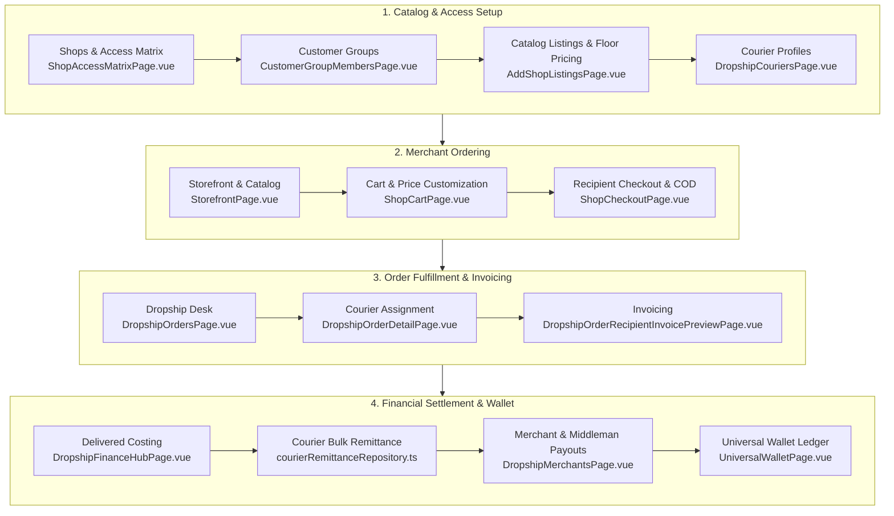

# End-to-End Dropship Workflow & Technical Testing Guide

This document provides a comprehensive, step-by-step technical and operational manual for the **Dropship Ecosystem** in Brandwala Wholesale. It details every administrative setup, storefront action, order status transition, courier handoff, financial costing lock, bulk remittance RPC, and universal ledger audit.

---

## 1. System Architecture & Component Mapping



---

## 2. Multi-Tenancy & Security Permissions

### URL Routing Convention
All app routes require tenant context scoping:
`/:tenantSlug/app/shop/...` (e.g., `/brandwala/app/shop/dropship`)

### Scope & Permission Requirements
| Role Scope | Minimum Required Permission | Target Functionality |
| :--- | :--- | :--- |
| `shop_dropship` | `dropship_view` / `dropship_manage` | Access Dropship Desk, Couriers, Merchants & Finance Hub |
| `shop_order_mgmt` | `order_view` / `order_manage` | Staff order detail review, pricing & fulfillment |
| `shop_admin` | `shop_manage` | Shop creation, product catalog listing, pricing rules |
| `wallet_admin` | `wallet_manage` | Universal Wallet balance manual adjustments & payout approvals |

---

## 3. Phase 1: Pre-Requisite Setup (Admin & Merchant Profiling)

### 3.1 Create a Dropship Shop
* **URL**: `/:tenantSlug/app/shop/shops`
* **RPC Called**: `upsert_shop`
* **Action**:
  1. Click **Create Shop**.
  2. Enter **Shop Name** (e.g. `Main Dropship Hub`).
  3. Select **Shop Type**: `dropship`.
  4. Set **Currency**: `BDT`.

### 3.2 Configure Shop Access Matrix
* **URL**: `/:tenantSlug/app/shop/shops/:id/pricing`
* **RPC Called**: `upsert_shop_customer_group_access`
* **Fields to Configure**:
  * `can_set_dropship_price`: Set to **TRUE** (Allows dropship merchants to set the recipient's retail price in cart).
  * `see_price_snapshot`: Set to **TRUE** (Allows viewing wholesale base cost vs margin preview).

### 3.3 Create Customer Group & Link Billing Profile
* **URL**: `/:tenantSlug/app/shop/customer-groups` and `/:tenantSlug/app/billing-profiles`
* **Page**: `CustomerGroupMembersPage.vue` & `BillingProfilesPage.vue`
* **RPC Called**: `upsert_billing_profile`, `assign_customer_group_member_role`, `upsert_customer_group_shop_profile`
* **Action**:
  1. Create customer group `VIP Dropship Merchants`.
  2. **Create Billing Profile**: Create a dedicated `billing_profile` for the dropship reseller/merchant account. (A Billing Profile is **required** for ledger profit payouts, invoicing, and wallet balances in the Dropship ecosystem).
  3. **Link Billing Profile to Group / Account**: Associate the `billing_profile_id` with the customer group / member profile.
  4. Open group member manager and assign user accounts.
  5. (Optional) Associate a **Middleman / Field Agent** `billing_profile_id` to the merchant profile for commission and wallet payout tracking.

### 3.4 List Products in Shop Catalog & Set Floor Prices
* **URL**: `/:tenantSlug/app/shop/shops/:id/listings`
* **Page**: `AddShopListingsPage.vue`
* **RPC Called**: `upsert_shop_product_listing` / `upsert_shop_pricing_rule`
* **Fields**:
  * `wholesale_price`: Wholesale cost charged by tenant (e.g., `৳500`).
  * `min_dropship_price`: Floor price limit (e.g., `৳650`). Merchants cannot sell below this price.

### 3.5 Setup Courier Profiles & Service Rates
* **URL**: `/:tenantSlug/app/shop/dropship/couriers`
* **Page**: `DropshipCouriersPage.vue`
* **Database Table**: `dropship_couriers`
* **Fields**:
  * **Courier Name**: `Steadfast Courier` / `Pathao` / `Paperfly` / `RedX`
  * **Inside Dhaka Shipping Charge**: `৳60`
  * **Outside Dhaka Shipping Charge**: `৳120`
  * **Return Shipping Charge**: `৳60` (Default penalty charged if package is rejected/returned)

---

## 4. Phase 2: Merchant Order Placement & Checkout

### 4.1 Browse Catalog & Add to Cart
* **URL**: `/:tenantSlug/app/shop/storefront`
* **RPC Called**: `browse_shop_catalog` → `add_to_shop_cart`
* **Action**: Merchant browses items and clicks **Add to Cart**.

### 4.2 Set Recipient Selling Price in Cart
* **URL**: `/:tenantSlug/app/shop/cart`
* **Component**: `ShopCartItemsList.vue`
* **RPC Called**: `update_shop_cart_item_price`
* **Input Fields**:
  * **Dropship Unit Selling Price**: Enter e.g. `৳850` (Validation enforces `selling_price >= min_dropship_price`).
* **Cart Calculations**:
  * `Merchant Unit Profit = Selling Price (৳850) - Base Wholesale Cost (৳500) = ৳350`

### 4.3 Recipient Shipping Info & Order Submission
* **URL**: `/:tenantSlug/app/shop/checkout`
* **Component**: `ShopCheckoutPage.vue`
* **RPC Called**: `submit_shop_order_from_cart`
* **Required Form Fields**:
  * `recipient_name`: `Rahim Ahmed`
  * `recipient_phone`: `01700000000` (Must be valid phone number format)
  * `recipient_address`: `House 12, Road 4, Dhanmondi`
  * `district`: `Dhaka` (Determines shipping rate: Inside Dhaka = `৳60`, Outside = `৳120`)
* **Recipient COD Total Calculation**:
  $$\text{Recipient COD Total} = \sum (\text{Selling Price} \times \text{Qty}) + \text{Delivery Charge} = ৳850 + ৳60 = ৳910$$
* **Result**: Order is created in `shop_orders` with `shop_type_snapshot = 'dropship'`. It is **automatically entered directly into the Dropship Desk** for staff courier processing.

---

## 5. Phase 3: Admin Processing & Courier Dispatch

### 5.1 Dropship Desk Direct Access & Management
* **URL**: `/:tenantSlug/app/shop/dropship`
* **Page**: `DropshipOrdersPage.vue`
* **Action**: Staff locates the auto-entered dropship order in the Dropship Desk list or clicks on any dropship order link across the admin portal (which auto-redirects directly to `/app/shop/dropship/:id`).

### 5.2 Courier Dispatch & Order Deletion
* **URL**: `/:tenantSlug/app/shop/dropship/orders/:id`
* **Page**: `DropshipOrderDetailPage.vue`
* **RPC Called**: `advance_dropship_order_status` / `delete_shop_order`
* **Actions**:
  * **Delete Order**: Click **Delete Order** in header to permanently purge/cancel the dropship order via `delete_shop_order` RPC.
  * **Courier Selection**: Choose `Steadfast Courier`
  * **Consignment ID / Waybill**: `STEADFAST-998877`
* **Status Progression**: `submitted` → `processing` → `shipped`.

---

## 6. Phase 4: Invoicing & Printing

### 6.1 Recipient COD Shipping Label & Invoice
* **URL**: `/:tenantSlug/app/shop/dropship/orders/:id/invoice`
* **Page**: `DropshipOrderRecipientInvoicePreviewPage.vue`
* **Printed Label Context**:
  * Shows **Merchant Brand Name** (hides wholesale tenant identity from end-customer).
  * Shows **Recipient Contact & Shipping Address**.
  * Shows **Cash on Delivery (COD) Collectible Amount**: `৳910`.

### 6.2 Merchant Wholesale Invoice
* **URL**: `/:tenantSlug/app/sales-invoice`
* **RPC Called**: `create_dropship_invoice`
* **Invoice Context**:
  * Tenant charges Merchant: Product Wholesale Base (`৳500`) + Packaging Fee (`৳10`).
  * Total Liability owed by Merchant to Tenant: `৳510`.

---

## 7. Phase 5: Financial Settlement (Costing & Remittance)

### 7.1 Scenario A: Successful Delivery & Costing Confirmation
When order status reaches `delivered`:
* **URL**: `/:tenantSlug/app/shop/dropship/finance-hub?step=delivered_costing`
* **Page**: `DropshipFinanceHubPage.vue` (Tab 1)
* **RPC Called**: `confirm_dropship_delivered_costing`
* **Payload Executed**:
```json
{
  "p_order_id": "ORDER-UUID",
  "p_delivered_cod_amount": 910,
  "p_wholesale_cost": 500,
  "p_delivery_charge": 60,
  "p_merchant_profit": 350
}
```
* **Ledger Locking Effect**:
  * Locks `delivered_costing_status = 'confirmed'`.
  * Credits Merchant **Pending Balance**: `+৳350`.

### 7.2 Record Courier Bulk Remittance Batch
When courier deposits remitted COD cash into Tenant's bank:
* **URL**: `/:tenantSlug/app/shop/dropship/finance-hub?step=courier_remittance`
* **Page**: `DropshipFinanceHubPage.vue` (Tab 2)
* **RPC Called**: `process_courier_bulk_remittance_batch` / `confirm_courier_remittance_to_tenant`
* **Payload Executed**:
```json
{
  "p_courier_id": "COURIER-UUID",
  "p_remittance_ref": "ST-REMIT-2026-08",
  "p_order_ids": ["ORDER-UUID-1", "ORDER-UUID-2"],
  "p_total_cash_collected": 910,
  "p_courier_fee_deducted": 60,
  "p_net_bank_deposit": 850
}
```
* **Database Updates**:
  * Marks orders as `remitted`.
  * Debits Courier Holding Account and credits Tenant Bank Account in `universal_wallet_ledger`.

### 7.3 Scenario B: Returned / Failed Delivery (Edge Case Flow)
If recipient refuses delivery:
* **RPC Called**: `mark_dropship_order_returned`
* **Status**: `returned` / `failed_delivery`.
* **Financial Handling**:
  * Recipient COD collected = `৳0`.
  * Return Shipping Charge (e.g. `৳60`) is deducted from Merchant's wallet balance.
  * Product stock inventory is automatically restocked into warehouse batching.

---

## 8. Phase 6: Money Distribution & Universal Wallet Audit

### 8.1 Dispense Merchant Profit Payout
* **URL**: `/:tenantSlug/app/shop/dropship/merchants`
* **Page**: `DropshipMerchantsPage.vue`
* **RPC Called**: `dispense_merchant_dropship_payout` / `record_ledger_transaction`
* **Action**:
  1. Locate Merchant profile.
  2. Review **Available Balance**: `৳350`.
  3. Click **Dispense Payout** modal:
     * **Payout Amount**: `৳350`
     * **Destination**: Merchant Bank Account / bKash.
  4. Submit: Merchant Available Balance returns to `৳0`, payout transaction logged.

### 8.2 Dispense Middleman / Field Agent Commission (If Applicable)
* **RPC Called**: `dispense_middleman_payout_from_tenant`
* **Action**: Dispenses agent commission earned on merchant dropship volume to the Middleman's Universal Wallet balance.

### 8.3 Universal Wallet Double-Entry Audit
* **URL**: `/:tenantSlug/app/wallet`
* **Page**: `UniversalWalletPage.vue`
* **Audit Checklist**:
  * Select **Entity: Merchant** → Confirm `CREDIT ৳350` (Profit) & `DEBIT ৳350` (Payout). Net balance: `৳0`.
  * Select **Entity: Courier** → Confirm `DEBIT ৳910` (COD Collection) & `CREDIT ৳910` (Remittance). Net balance: `৳0`.
  * Select **Entity: Tenant** → Confirm `CREDIT ৳500` (Product Wholesale Cost) & `CREDIT ৳60` (Shipping Charge).

---

## 9. Comprehensive Database RPC & Table Index

### Core Database Tables
| Table Name | Description | Key Foreign Keys |
| :--- | :--- | :--- |
| `shops` | Registered shops (types: `dropship`, `vendor_catalog`, `fixed_price`) | `tenant_id` |
| `shop_orders` | Master order headers | `shop_id`, `customer_id`, `courier_id` |
| `dropship_orders` | Dropship-specific metadata (recipient info, COD totals, profit) | `order_id` (PK/FK to `shop_orders.id`) |
| `dropship_couriers` | Courier service provider master profiles & rates | `tenant_id` |
| `courier_bulk_remittances` | Bulk remittance batch headers | `courier_id`, `tenant_id` |
| `universal_wallet_ledger` | Immutable multi-currency financial balance ledger entries | `tenant_id`, `entity_type`, `entity_id` |

### Core Backend Supabase RPC Functions
| RPC Name | Module File | Primary Function |
| :--- | :--- | :--- |
| `upsert_shop` | `shopOrderRepository.ts` | Creates/updates shop definition |
| `upsert_shop_customer_group_access` | `shopPermissionsRepository.ts` | Configures `can_set_dropship_price` flag |
| `upsert_shop_product_listing` | `shopPricingRepository.ts` | Lists product with wholesale cost & `min_dropship_price` |
| `update_shop_cart_item_price` | `shopCartRepository.ts` | Sets merchant's custom retail selling price |
| `submit_shop_order_from_cart` | `shopOrderRepository.ts` | Converts cart to `submitted` dropship order |
| `process_dropship_shop_order` | `shopOrderRepository.ts` | Assigns courier & consignment ID |
| `confirm_dropship_delivered_costing` | `dropshipFinanceRepository.ts` | Locks delivered order product cost & profit |
| `confirm_courier_remittance_to_tenant` | `courierRemittanceRepository.ts` | Settles courier COD bulk remittance batch |
| `dispense_middleman_payout_from_tenant` | `courierRemittanceRepository.ts` | Settles agent commissions to wallet |
| `mark_dropship_order_returned` | `useDropshipOrderActions.ts` | Handles rejected delivery & return fee penalties |

---

## 10. Manual Testing Checklist

| Step | Component / Action | Expected Result | Verified (✓) |
| :--- | :--- | :--- | :---: |
| **1.1** | Create Dropship Shop (`upsert_shop`) | Shop created with `shop_type = 'dropship'` | [ ] |
| **1.2** | Set `can_set_dropship_price = true` | Access matrix permits editing cart selling prices | [ ] |
| **1.3** | Set `min_dropship_price` on Product | Catalog enforces floor selling price validation | [ ] |
| **1.4** | Create Courier Profile (`Steadfast`) | Courier added with inside/outside Dhaka charges | [ ] |
| **2.1** | Add Catalog Item to Cart | Cart item created with default wholesale price | [ ] |
| **2.2** | Change Dropship Selling Price in Cart | Merchant profit preview recalculates dynamically | [ ] |
| **2.3** | Fill Recipient Form & Checkout | Order placed; recipient COD total = Selling Price + Shipping | [ ] |
| **3.1** | Open Dropship Desk (`/app/shop/dropship`) | Order listed under `submitted` status | [ ] |
| **3.2** | Assign Courier & Tracking ID | Status advances to `shipped` | [ ] |
| **4.1** | Print Recipient Invoice | Invoice shows Merchant brand & Recipient COD collectible | [ ] |
| **5.1** | Confirm Delivered Costing | Delivered costing locked; profit credited to merchant pending | [ ] |
| **5.2** | Record Courier Bulk Remittance | Remittance batch created; courier ledger updated | [ ] |
| **5.3** | Test Order Return Flow | Return charge deducted; product stock restocked | [ ] |
| **6.1** | Dispense Merchant Profit Payout | Available profit balance dispensed via payout modal | [ ] |
| **6.2** | Audit Universal Wallet Ledger | Double-entry balance shows 0 financial drift across entities | [ ] |
