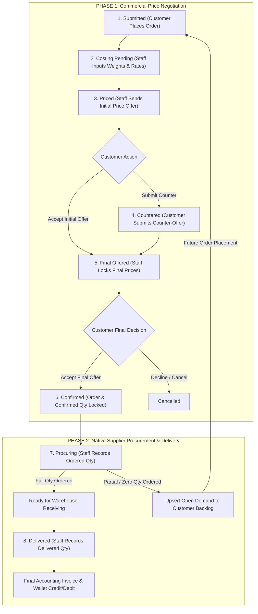

# Catalog Shop Negotiation & Native Procurement Specification

**Document Location:** `doc/fix/CATALOG_SHOP_NEGOTIATION_FLOW_SPEC.md`  
**Last Updated:** 2026-07-30  
**Target Module:** Catalog Shops (`vendor_catalog` / `procurement_intent`) in Brandwala Wholesale Quasar V2  
**Tech Stack:** Vue 3 (Composition API) + Quasar V2 + Supabase Postgres (RLS / RPC) + TanStack Query  

---

> [!IMPORTANT]
> **Native Order Procurement Architecture**  
> Catalog Shop orders do **not** transfer items out to external PBC files. Instead, the Catalog Shop Order itself natively tracks the entire commercial negotiation, vendor procurement placement (`ordered_quantity`), physical delivery (`delivered_quantity`), and customer backlog for unfulfilled quantities.

---

## 1. End-to-End Workflow Diagram

---

## 2. Complete Status Lifecycle & Role Matrix

| Status Code | UI Display Badge | Quasar Tone | Primary Role | Key Actions & Required Data Inputs |
| :--- | :--- | :--- | :--- | :--- |
| **`submitted`** | `Submitted` | `bg-blue-1 text-blue-9` | **Customer** | Customer places order intent with initial list of items and requested quantities (`quantity`). |
| **`costing_pending`** | `Costing Pending` | `bg-cyan-1 text-cyan-9` | **Staff** | Staff inspects request, updates item weights (`gross_weight_kg`), cargo rates, and exchange rates. |
| **`priced`** | `Price Offered` | `bg-amber-1 text-amber-9` | **Customer** | Staff submits initial `staff_offer_amount`. Customer reviews price offers; can click **Accept** or input `customer_offer_amount`. |
| **`countered`** | `Customer Countered` | `bg-orange-1 text-orange-9` | **Staff** | Customer submits counter-offer prices. Staff reviews variance matrix. |
| **`final_offered`** | `Final Price Offered` | `bg-purple-1 text-purple-9` | **Customer** | Staff submits binding `final_price_amount`. Customer reviews final pricing and adjusts `confirmed_quantity`. |
| **`confirmed`** | `Confirmed` | `bg-teal-1 text-teal-9` | **Customer / Staff** | Customer accepts final offer. Final unit prices (`final_price_amount`) and quantities (`confirmed_quantity`) are locked. |
| **`procuring`** | `Supplier Procuring` | `bg-deep-purple-1 text-deep-purple-9` | **Staff** | Staff orders items from international vendors and inputs actual purchased quantity (`ordered_quantity`). |
| **`delivered`** | `Delivered / Completed` | `bg-green-1 text-green-9` | **Staff** | Staff inspects physical shipment and inputs actual received quantity (`delivered_quantity`). Generates final invoice. |
| **`cancelled`** | `Cancelled` | `bg-red-1 text-red-9` | **Both** | Customer declines final offer or negotiation is cancelled. |

---

## 3. Detailed Step-by-Step Execution Guide

### Phase 1: Commercial Negotiation

#### Step 1: Customer Order Placement (`submitted`)
- Customer selects products from vendor catalog and submits order intent.
- Snapshots `quantity` per line item.

#### Step 2: Staff Landed-Cost Calculation (`costing_pending`)
- Staff opens **Landed Cost Calculator**:
  - Sets Currency Exchange Rate (`conversion_rate`).
  - Sets Freight Cargo Rate (`cargo_rate_per_kg`).
  - Inputs item weight (`gross_weight_kg`).
- **Formula**:
  $$\text{Landed Cost} = (\text{unit\_list\_price} \times \text{conversion\_rate}) + (\text{gross\_weight\_kg} \times \text{cargo\_rate\_per\_kg})$$
  $$\text{Staff Offer Amount} = \text{Landed Cost} \times \left(1 + \frac{\text{margin\_pct}}{100}\right)$$
- Staff saves offers $\rightarrow$ transitions order status to **`priced`**.

#### Step 3: Customer Counter-Offer (`priced` $\rightarrow$ `countered`)
- Customer reviews `staff_offer_amount`.
- Customer chooses:
  - **Accept Initial Offer**: Moves directly to **`final_offered`**.
  - **Submit Counter-Offer**: Inputs `customer_offer_amount` per item $\rightarrow$ transitions order to **`countered`**.

#### Step 4: Staff Final Offer (`countered` $\rightarrow$ `final_offered`)
- Staff reviews counter-offers side-by-side.
- Staff sets non-negotiable `final_price_amount` for each item.
- Staff submits $\rightarrow$ transitions order status to **`final_offered`**.

#### Step 5: Customer Confirmation (`final_offered` $\rightarrow$ `confirmed`)
- `final_price_amount` is locked.
- Customer adjusts final purchase volume (`confirmed_quantity` / `needed_quantity`) per item.
- Customer clicks **"Accept Final Offer & Confirm Order"** $\rightarrow$ transitions order to **`confirmed`**.

---

### Phase 2: Native Supplier Procurement, Delivery & Backlog

> [!NOTE]
> **No External PBC Transfer**  
> All procurement tracking (`ordered_quantity`), physical delivery (`delivered_quantity`), and customer backlog updates occur natively within the Catalog Shop Order domain.

#### Step 6: Staff Supplier Ordering (`procuring`)
When staff purchases items from international suppliers/vendors:
- Staff enters **`ordered_quantity`** for each item line in the order.
- **Full Order (`ordered_quantity = confirmed_quantity`)**: All confirmed items were successfully purchased from the vendor.
- **Partial / Zero Order (`ordered_quantity < confirmed_quantity`)**:
  - The purchased portion (`ordered_quantity`) moves forward to receiving.
  - The unfulfilled demand (`open_quantity = confirmed_quantity - ordered_quantity`) is automatically logged in **Customer Backlog** for that customer's `billing_profile_id`.

#### Step 7: Customer Backlog Re-Use
- Unfulfilled items stored in the Customer Backlog drawer can be pulled into future catalog order submissions for the same customer profile.

#### Step 8: Physical Warehouse Receiving & Delivery (`delivered`)
- When physical cargo arrives at the destination warehouse, Staff inspects goods and records **`delivered_quantity`** per line item.
- **Final Accounting Invoice & Wallet Settlement**:
  $$\text{Final Line Subtotal} = \text{delivered\_quantity} \times \text{final\_price\_amount}$$
- Invoice total is generated strictly based on actual delivered items (`delivered_quantity`), and tenant wallet debit/credit is executed.

---

## 4. Database Schema Extensions

### `shop_orders` Table
- `status`: `'submitted' | 'costing_pending' | 'priced' | 'countered' | 'final_offered' | 'confirmed' | 'procuring' | 'delivered' | 'cancelled'`
- `pricing_metadata`: `jsonb` (stores conversion rate, cargo rate, profit margin, weight snapshots)

### `order_items` Table
- `gross_weight_kg`: `numeric` (item weight recorded by staff)
- `staff_offer_amount`: `numeric` (initial staff price offer)
- `customer_offer_amount`: `numeric` (customer counter-offer price)
- `final_price_amount`: `numeric` (agreed binding unit price)
- `confirmed_quantity`: `integer` (customer confirmed order volume)
- `ordered_quantity`: `integer` (quantity actually purchased from supplier by staff)
- `delivered_quantity`: `integer` (quantity physically received/delivered)

### `customer_order_backlog_items` Table
- `tenant_id`: `bigint`
- `billing_profile_id`: `bigint` (customer billing profile)
- `product_id`: `bigint`
- `open_quantity`: `integer` (`confirmed_quantity - ordered_quantity`)
- Scoped strictly by `(tenant_id, billing_profile_id, product_id)` with `upsert_order_backlog_from_item` RPC.

---

## 5. Quasar V2 Implementation Checklist

- [ ] **TypeScript Types (`web/src/modules/shop_order/types/index.ts`)**:
  - [ ] Add `'costing_pending' | 'priced' | 'countered' | 'final_offered' | 'confirmed' | 'procuring' | 'delivered'` to `ShopOrderStatus`.
  - [ ] Add `ordered_quantity`, `delivered_quantity`, `confirmed_quantity`, `staff_offer_amount`, `customer_offer_amount`, `final_price_amount` to `OrderItem`.
- [ ] **Staff Order Management (`StaffOrderDetailPage.vue`)**:
  - [ ] Costing drawer for `costing_pending` state (weight, FX, cargo rate).
  - [ ] Initial price offer form for `priced` state.
  - [ ] Side-by-side counter review & `final_price_amount` input for `final_offered` state.
  - [ ] Supplier Procurement Editor for `procuring` state (`ordered_quantity` input & backlog trigger).
  - [ ] Delivery Receiving Editor for `delivered` state (`delivered_quantity` input & invoice lock).
- [ ] **Customer Order Detail (`CustomerOrderDetailPage.vue`)**:
  - [ ] Price offer review with Accept / Counter actions.
  - [ ] Final offer acceptance modal with `confirmed_quantity` adjustments.
  - [ ] Native fulfillment progress tracker (`Confirmed` $\rightarrow$ `Supplier Procured: X units` $\rightarrow$ `Delivered: Y units`).

