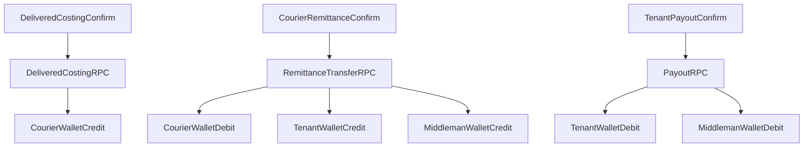

# Fix Plan: Dropship Finance Hub + Universal Wallet Wiring

**Status:** Completed  
**Related docs:**
- [doc/wallet/UNIVERSAL_WALLET_LEDGER.md](../wallet/UNIVERSAL_WALLET_LEDGER.md)
- [doc/COURIER_AND_MIDDLEMAN_FINANCIAL_MASTER_PLAN.md](../COURIER_AND_MIDDLEMAN_FINANCIAL_MASTER_PLAN.md)
- [doc/SHOP_ORDER.md](../SHOP_ORDER.md)

---

## Problem

Dropship finance is scattered across Courier Remittances, Courier Holdings, Merchants payout, Dropship Desk quick actions, and Billing Wallets. Wallet writes go to `billing_profile_wallet_ledger` while Universal Wallet reads `universal_wallet_ledger`. Staff cannot see a clear Courier → Tenant → Middleman money path.

## Product Rules (Locked)

1. One unified **Dropship Finance Hub** for all finance actions.
2. On **delivered costing confirm**: courier wallet increases (courier owes tenant).
3. On **courier remittance**: courier ↓, tenant ↑, middleman profit becomes payable.
4. On **tenant payout**: tenant ↓, middleman payable ↓.
5. Soft warning only for low balance (no hard block on order ops).
6. Retire unused/scattered finance UIs after hub ships.

## Wallet Sign Convention

| Entity | Positive balance means |
|---|---|
| `courier` | Courier owes tenant (COD held) |
| `tenant` | Cash / remittance held by tenant ops |
| `middleman` | Tenant owes middleman (payable profit) |

## Target Flow

### Example amounts

Order COD `2000`, delivery cost confirmed, middleman profit `400`, remittance net `1900` (after courier charge `100`):

| Step | Courier | Tenant | Middleman |
|---|---|---|---|
| Delivered costing | +2000 | — | — |
| Remittance confirmed | -1900 | +1900 | +400 |
| Tenant pays middleman 400 | — | -400 | -400 |

---

## Phase 0 — Spec Lock & Phase Tracker

**Goal:** Freeze transaction mapping and keep this file as the single implementation tracker.

**Files to change:**
- [doc/fix/DROPSHIP_FINANCE_HUB_WALLET.md](./DROPSHIP_FINANCE_HUB_WALLET.md) (this file)
- [doc/wallet/UNIVERSAL_WALLET_LEDGER.md](../wallet/UNIVERSAL_WALLET_LEDGER.md)

**What to change:**
- Add dropship 3-step posting matrix to wallet ledger doc.
- Mark each phase status below as `pending` → `in_progress` → `done`.

**Exit:** Mapping accepted; no code yet.

---

## Phase 1 — Backend: Atomic Multi-Wallet RPCs

**Goal:** Post Courier / Tenant / Middleman ledger rows atomically from three finance actions.

**Files to change:**
- New migration under [supabase/migrations/](../../supabase/migrations/)  
  e.g. `YYYYMMDDHHMMSS_dropship_finance_hub_wallet_flow.sql`
- Reference / wrap:
  - [supabase/migrations/20261220000000_create_universal_wallet_ledger.sql](../../supabase/migrations/20261220000000_create_universal_wallet_ledger.sql) (`record_ledger_transaction`)
  - [supabase/migrations/20261215000000_courier_middleman_workflow_rpcs.sql](../../supabase/migrations/20261215000000_courier_middleman_workflow_rpcs.sql)
  - [supabase/migrations/20261210000001_fix_dropship_profit_is_default.sql](../../supabase/migrations/20261210000001_fix_dropship_profit_is_default.sql)

**What to change:**
1. Add RPC `confirm_dropship_delivered_costing(p_order_id, p_cod_amount, p_delivery_charge, ...)`
   - Updates order costing fields.
   - Credits `courier` wallet by remittable COD (idempotent per order).
2. Add/replace remittance RPC `confirm_courier_remittance_to_tenant(...)`
   - Debits `courier`, credits `tenant`, credits `middleman` profit (payable opens here).
   - Sets order status `payment_received`.
3. Add/replace payout RPC `dispense_middleman_payout_from_tenant(...)`
   - Debits `tenant` and `middleman` for payout amount.
4. Stop booking `dropship_profit` at `ready_for_pickup` / `shipped` / `delivered` in `advance_dropship_order_status` (profit only on remittance).
5. Idempotency keys via `source_type + source_id + metadata.purpose`.
6. Soft-balance: allow negative with clear note; no hard reject on remittance path.

**Exit:** RPC-only test: delivered → remit → payout produces correct 3-wallet balances.

---

## Phase 2 — Backfill + Cutover Writes

**Goal:** Move historical middleman balances into `universal_wallet_ledger` and stop dual sources of truth.

**Files to change:**
- Same or follow-up migration in [supabase/migrations/](../../supabase/migrations/)
- [web/src/modules/shop_order/repositories/courierRemittanceRepository.ts](../../web/src/modules/shop_order/repositories/courierRemittanceRepository.ts)
- [web/src/modules/sales_invoice/repositories/billingWalletRepository.ts](../../web/src/modules/sales_invoice/repositories/billingWalletRepository.ts) (if still reading legacy)

**What to change:**
- Backfill `billing_profile_wallet_ledger` → `universal_wallet_ledger` (`entity_type='middleman'`, `entity_id=billing_profile_id`).
- Point remittance/payout repository methods at new RPCs.
- Temporary dual-write optional for one release; then remove legacy writes.

**Exit:** Existing merchant balances visible in Universal Wallet; new writes only hit universal ledger.

---

## Phase 3 — Dropship Finance Hub Page (Core UX)

**Goal:** One screen for all three finance steps with clear next action, strictly adhering to component modularization, page layout & skeleton, TanStack Query, and messaging standards.

**Files to change (new):**
- `web/src/modules/shop_order/pages/DropshipFinanceHubPage.vue` (Container page: routes, TanStack Query calls, layout grid, max 300 lines)
- `web/src/modules/shop_order/components/finance_hub/DropshipFinanceHubSkeleton.vue` (Dedicated skeleton loader matching final layout for Zero CLS)
- `web/src/modules/shop_order/components/finance_hub/FinanceHubStepDelivered.vue` (Presentational sub-component, max 150 lines)
- `web/src/modules/shop_order/components/finance_hub/FinanceHubStepRemittance.vue` (Presentational sub-component, max 150 lines)
- `web/src/modules/shop_order/components/finance_hub/FinanceHubStepPayout.vue` (Presentational sub-component, max 150 lines)
- `web/src/modules/shop_order/components/finance_hub/FinanceHubKpiStrip.vue` (Presentational sub-component, max 150 lines)
- `web/src/modules/shop_order/components/finance_hub/FinanceHubOrderQueue.vue` (Presentational sub-component, max 150 lines)
- `web/src/modules/shop_order/shared/queryKeys/dropshipFinanceQueryKeys.ts` (Centralized query keys factory)
- `web/src/modules/shop_order/composables/useDropshipFinanceHubQuery.ts` (TanStack query wrappers. **No** success toasts. Parse Supabase errors on failure)
- `web/src/modules/shop_order/composables/useDropshipFinanceHubMutations.ts` (TanStack mutation wrappers. Trigger frontend success toast on success, `parseSupabaseError` on failure)
- `web/src/modules/shop_order/repositories/dropshipFinanceRepository.ts` (All API/Supabase calls must go here)

**Files to change (routing/nav):**
- [web/src/modules/shop_order/routes/adminRoutes.ts](../../web/src/modules/shop_order/routes/adminRoutes.ts)
- [web/src/modules/navigation/moduleRegistry.ts](../../web/src/modules/navigation/moduleRegistry.ts)

**What to change:**
- New route: `/:tenantSlug?/app/shop/dropship/finance-hub` → `app-shop-dropship-finance-hub-page`.
- Page container layout must use `q-page class="q-pa-md"` and `div class="q-gutter-y-md"` to adhere to standard page layouts.
- Skeletons must use Quasar CSS variables (`q-skeleton`) without hardcoded colors and mirror the actual layout structure exactly.
- Keep math/logic in the composables; keep template clear of math.
- Hub layout (Rule of 3):
  1. KPI strip (Courier owed / Tenant cash / Middleman payable)
  2. Order queue filtered by next step
  3. Active step panel (one primary CTA: `unelevated no-caps`)
- Use presentational components for the sections, taking in props and emitting events. The parent page `DropshipFinanceHubPage.vue` orchestrates.
- Step 1 inputs: COD, delivery charge, confirm delivered costing.
- Step 2 inputs: remitted amount, bank/trx ref, confirm remittance.
- Step 3 inputs: middleman + amount + method, confirm payout.
- After each success: frontend-driven toast via mutation `onSuccess` (`showSuccessNotification`) + “Next: …” hint + invalidate hub queries via `queryClient`.
- After each error: parsed error toast via `parseSupabaseError`. No raw PostgreSQL errors should be shown.

**Exit:** Staff can complete full money path without leaving the hub. Code passes layout, component, and messaging guidelines.

---

## Phase 4 — Simplify Entry Points (Redirect, Don’t Scatter)

**Goal:** Old finance buttons open the hub with context; ops pages stop owning finance.

**Files to change:**
- [web/src/modules/shop_order/pages/DropshipOrdersPage.vue](../../web/src/modules/shop_order/pages/DropshipOrdersPage.vue)
- [web/src/modules/shop_order/pages/DropshipOrderDetailPage.vue](../../web/src/modules/shop_order/pages/DropshipOrderDetailPage.vue)
- [web/src/modules/shop_order/pages/DropshipMerchantsPage.vue](../../web/src/modules/shop_order/pages/DropshipMerchantsPage.vue)
- [web/src/modules/shop_order/components/DropshipTotalsCard.vue](../../web/src/modules/shop_order/components/DropshipTotalsCard.vue)
- [web/src/modules/shop_order/routes/adminRoutes.ts](../../web/src/modules/shop_order/routes/adminRoutes.ts)

**What to change:**
- Replace header buttons (`Courier Remittances`, `Wallet & Payouts`) with **Finance Hub**.
- Replace inline `Mark Remitted` / Quick Remit with link: Finance Hub filtered to that order + Step 2.
- Replace merchant dispense action with hub Step 3 (middleman preselected).
- Redirect legacy routes:
  - `courier-holdings` → finance-hub
  - `courier-remittances*` → finance-hub
  - `dropship/ledger` → finance-hub (or Universal Wallet read-only)

**Exit:** No finance mutation UI outside the hub.

---

## Phase 5 — Retire Unused Finance UIs

**Goal:** Delete scattered screens/components that the modern plan replaces.

**Delete / stop using:**
- [web/src/modules/shop_order/pages/CourierRemittancesListPage.vue](../../web/src/modules/shop_order/pages/CourierRemittancesListPage.vue)
- [web/src/modules/shop_order/pages/CourierRemittanceDetailPage.vue](../../web/src/modules/shop_order/pages/CourierRemittanceDetailPage.vue)
- [web/src/modules/shop_order/pages/CourierHoldingsPage.vue](../../web/src/modules/shop_order/pages/CourierHoldingsPage.vue)
- [web/src/modules/shop_order/components/QuickRemitDialog.vue](../../web/src/modules/shop_order/components/QuickRemitDialog.vue)
- [web/src/modules/shop_order/components/DispensePayoutModal.vue](../../web/src/modules/shop_order/components/DispensePayoutModal.vue)
- [web/src/modules/shop_order/components/RemittanceBatchHeaderForm.vue](../../web/src/modules/shop_order/components/RemittanceBatchHeaderForm.vue)
- [web/src/modules/shop_order/components/RemittanceReconciliationCard.vue](../../web/src/modules/shop_order/components/RemittanceReconciliationCard.vue)
- [web/src/modules/shop_order/components/RemittanceOrderSelectorTable.vue](../../web/src/modules/shop_order/components/RemittanceOrderSelectorTable.vue)
- [web/src/modules/shop_order/components/RemittanceBulkPasteModal.vue](../../web/src/modules/shop_order/components/RemittanceBulkPasteModal.vue)
- Related skeletons only used by those pages:
  - `CourierRemittanceSkeleton.vue`
  - `CourierHoldingsSkeleton.vue`
  - `CourierHoldingKpiCards.vue` / `CourierHoldingTable.vue` (absorb useful bits into hub first, then delete)

**Keep:**
- [web/src/modules/shop_order/pages/DropshipCouriersPage.vue](../../web/src/modules/shop_order/pages/DropshipCouriersPage.vue) (courier catalog / master data)
- [web/src/modules/shop_order/pages/DropshipMerchantsPage.vue](../../web/src/modules/shop_order/pages/DropshipMerchantsPage.vue) (merchant profiles; remove payout-only UI)
- [web/src/modules/wallet/pages/UniversalWalletPage.vue](../../web/src/modules/wallet/pages/UniversalWalletPage.vue) (ledger viewer)

**Also clean:**
- Remove `Courier Holdings` nav item from [moduleRegistry.ts](../../web/src/modules/navigation/moduleRegistry.ts); add **Finance Hub**.
- Remove dead remittance routes from [adminRoutes.ts](../../web/src/modules/shop_order/routes/adminRoutes.ts) after redirects verified.

**Exit:** Grep finds no imports of deleted finance components; nav has one finance entry.

---

## Phase 6 — Universal Wallet Entity Alignment

**Goal:** Hub and Universal Wallet show the same courier/tenant/middleman balances.

**Files to change:**
- [web/src/modules/wallet/pages/UniversalWalletPage.vue](../../web/src/modules/wallet/pages/UniversalWalletPage.vue)
- [web/src/modules/wallet/repositories/walletRepository.ts](../../web/src/modules/wallet/repositories/walletRepository.ts)
- [web/src/modules/wallet/types/index.ts](../../web/src/modules/wallet/types/index.ts)

**What to change:**
- Fix courier `entity_id` mapping (use real numeric/stable ID matching RPC writes; no synthetic string hash).
- Ensure middleman tab uses `billing_profiles.id` as `entity_id`.
- Optional deep-link from hub KPI chip → Universal Wallet with preselected entity.

**Exit:** Balances match hub KPIs for the same entity.

---

## Phase 7 — Acceptance Scenarios

**Goal:** Prove end-to-end correctness and UX simplicity.

**Files to change:**
- Update this tracker checkboxes.
- Optionally note results in related docs.

**What to validate:**
1. Delivered costing → courier liability appears; middleman still 0 payable for that order.
2. Remittance → courier down, tenant up, middleman payable opens.
3. Payout → tenant down, middleman payable closed.
4. Partial remittance / partial payout behave consistently.
5. Return/cancel after delivery does not double-post (idempotent + reversal policy documented).
6. Staff never need remittance list / holdings / quick remit dialogs.

**Exit:** All scenarios pass on staging; phase statuses marked `done`.

---

## Phase Status Tracker

| Phase | Title | Status |
|---|---|---|
| 0 | Spec lock & tracker | done |
| 1 | Backend multi-wallet RPCs | done |
| 2 | Backfill + cutover | done |
| 3 | Finance Hub page | done |
| 4 | Simplify entry points | done |
| 5 | Retire unused UIs | done |
| 6 | Universal Wallet alignment | done |
| 7 | Acceptance | done |

---

## Out of Scope

- Cryptocurrency / bank auto-wire APIs
- Multi-currency settlement beyond existing ledger rate fields
- Replacing courier catalog / merchant profile CRUD
- Hard blocking orders on negative wallet balance
