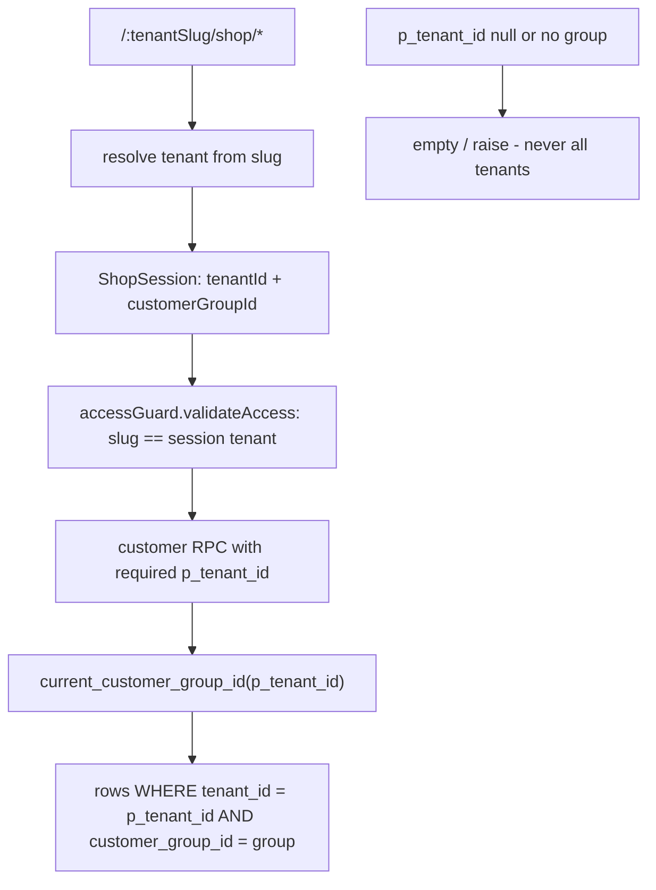

# Shop scope — tenant isolation + customer API cleanup

**Bug:** one email with active `customer_group_members` rows in two sister tenants sees **tenant B orders and carts on tenant A's URL**.

**Verdict:** the model in [SHOP_ORDER.md](../shop_order/SHOP_ORDER.md) is correct and stays — one `shop_orders` stack, three shop types, handoff to `sales_invoices`. No new order tables. The **implementation drifted**: customer RPCs treat tenant as optional, the tenant header comes from app-workspace `localStorage` instead of the URL, and RLS ("this email owns that group") was used as if it were tenancy.

**Rule:** RLS answers *may this person read the row*. It never answers *does the row belong to the tenant in the URL*. Both checks are required.

**Canon:** [SHOP_SCOPE.md](../shop_order/SHOP_SCOPE.md) (customer portal) · [SHOP_ORDER.md](../shop_order/SHOP_ORDER.md) (domain) · [TENANT_MODEL_AND_ACCESS.md](../TENANT_MODEL_AND_ACCESS.md)

---

## 1. Root causes

| ID | Defect | Evidence | Effect |
|----|--------|----------|--------|
| **C1** | Tenant header read from **app workspace** key before shop auth key | `readSelectedTenantIdFromStorage` in [web/src/boot/supabase.ts](../../web/src/boot/supabase.ts) checks `brandwala.tenant.workspace.v1` first, then `brandwala.auth.access.v4` | A user who is tenant admin **and** shop customer sends the wrong `x-selected-tenant-id` |
| **C2** | Null tenant means **all tenants** | `list_active_shop_carts()` uses `current_tenant_id() is null or c.tenant_id = current_tenant_id()`; `list_shops_for_customer(p_tenant_id default null)` uses `p_tenant_id is null or s.tenant_id = p_tenant_id` | Missing header returns every tenant's carts/shops for that email |
| **C3** | Order list scoped by **shop**, not tenant | `list_shop_orders_for_customer(p_shop_id)` resolves `v_tenant_id` *from the shop* | Any shop id the email can reach returns its orders, whatever the URL says |
| **C4** | No slug ↔ session check | `createAccessGuard` in [web/src/modules/auth/guards/accessGuard.ts](../../web/src/modules/auth/guards/accessGuard.ts) enforces `requireTenantContext` but never compares `to.params.tenantSlug` with `authStore.tenantSlug` | Tenant A URL renders a tenant B session |
| **C5** | Order detail is `select('*')` + email RLS | `getShopOrderById` in [shopOrderRepository.ts](../../web/src/modules/shop_order/repositories/shopOrderRepository.ts); policy `shop_orders_customer_owner` = `is_cart_owner(customer_group_id, tenant_id)` | Cross-tenant order id opens on the wrong tenant's URL (IDOR by email) |
| **C6** | Slug resolved by header, and slug is not globally unique | `shops_unique_slug unique (tenant_id, slug)`; `browse_shop_catalog(p_shop_slug)` matches `slug = p_shop_slug and tenant_id = current_tenant_id()` | Two sisters may both own slug `dhaka-wholesale`; the header picks the winner |
| **C7** | Customer query keys omit `tenantId`; `last_visited_shop_*` are global keys | [shopOrderQueryKeys.ts](../../web/src/modules/shop_order/shared/queryKeys/shopOrderQueryKeys.ts) `customerOrders` / `customerDashboardOrders` / `orderDetail`; `localStorage` in [catalogShop.ts](../../web/src/modules/shop_order/utils/catalogShop.ts), `CustomerDashboard.vue`, `CustomerOrdersPage.vue`, `useShopCartPageLogic.ts`, `ShopCheckoutPage.vue` | Stale tenant rows after a context switch; "resume shop" points at another tenant |
| **C8** | Fat rows + N calls on the customer read path | `list_shop_orders_for_customer` called once **per shop** in `useCustomerDashboardOrdersQuery`, merged as `any[]`; list rows cast to the 60-field `ShopOrder`; page then fetches `shops.sell_currency_id` + Thrift currencies | Extra waves, hardcoded `৳`, undefined fields the type claims exist |
| **C9** | Misleading Orders chrome | `Merchant wallet` + `Browse Wholesale Shops` buttons in [CustomerOrdersPage.vue](../../web/src/modules/shop_order/pages/CustomerOrdersPage.vue) | Violates SHOP_SCOPE §5b (nav is Home / Catalog / Orders; no `Browse`, no `Wholesale`; wallet is out of scope for shop login) |

---

## 2. Locked decisions

| ID | Decision |
|----|----------|
| **D-SC1** | Shop session = `(user, tenant_id, customer_group_id)` where **`tenant_id` is resolved from the URL `:tenantSlug`** — never from app-workspace storage |
| **D-SC2** | Every customer RPC takes a **required** `p_tenant_id`. Null (or unresolvable group) returns **empty / raises** — never "all tenants" |
| **D-SC3** | Server checks, in order: tenant from arg → email is an active member of a group **in that tenant** → group may access that shop → `row.tenant_id = p_tenant_id` |
| **D-SC4** | Shop identity in customer RPCs is `(p_tenant_id, slug)` or `shop_id` verified against `p_tenant_id`. Slug alone is **not** an identity |
| **D-SC5** | Strict URL-per-tenant. Visiting another sister's slug is a **context switch** (re-resolve group, purge shop query cache). No tenant switcher in the shop header |
| **D-SC6** | One write model (`shop_orders`), **three read DTOs**: customer list, customer detail, staff desk. No `select('*')` on customer paths |
| **D-SC7** | Rollout is **additive**: new RPC names → migrate frontend → drop the leaky ones (§6). No dual-write, no compat shim left behind |
| **D-SC8** | Wallet is **not** a customer-portal primary. It appears only for a dropship group with a `billing_profile_id`, reached from the dropship order |

---

## 3. Target session model

---

## 4. Phases

| Phase | Scope | Fixes | Status |
|-------|-------|-------|--------|
| **T0** | Tenant session boundary (frontend) | C1, C4, C7 | done |
| **T1** | Tenant-scoped customer RPCs (additive) | C2, C3, C6 | done |
| **T2** | Lean DTOs + read-path rewiring | C5, C8 | done |
| **T3** | Orders page chrome (SHOP_SCOPE S3) | C9 | done |
| **T4** | Drop legacy RPCs + dead frontend | §6 | done |

Execute in order. **T0 is the security fix** and is worth shipping alone.

### T0 — Tenant session boundary

1. [web/src/boot/supabase.ts](../../web/src/boot/supabase.ts): rewrite `readSelectedTenantIdFromStorage` to read `brandwala.auth.access.v4` **first** and branch on `scope`. When `scope === 'shop'`, use that snapshot's `tenant.id` and **ignore** `brandwala.tenant.workspace.v1` completely. Only `app` / `platform` may read the workspace key.
2. New `web/src/modules/auth/guards/validateShopTenantSlug.ts`: compare `getTenantSlugFromRoute(to)` ([tenantRouteContext.ts](../../web/src/modules/tenant/utils/tenantRouteContext.ts)) with `authStore.tenantSlug`; on mismatch return `getShopLoginRouteLocation(to, { redirect: to.fullPath })`. Wire as `validateAccess` on every shop guard in [shopRoutes.ts](../../web/src/modules/shop_order/routes/shopRoutes.ts) and the `customer-dashboard` route in [dashboard/routes/index.ts](../../web/src/modules/dashboard/routes/index.ts).
3. [shopOrderQueryKeys.ts](../../web/src/modules/shop_order/shared/queryKeys/shopOrderQueryKeys.ts): add `tenantId` to `customerOrders`, `customerDashboardOrders`, `orderDetail`, `storefrontCatalog`. Fold the duplicate key file `web/src/modules/shop_order/services/shopOrderQueryKeys.ts` (used by `useMerchantWalletQuery`) into this one.
4. [utils/catalogShop.ts](../../web/src/modules/shop_order/utils/catalogShop.ts): make the last-shop keys tenant-scoped — `shop:{tenantId}:lastShopId` / `:lastShopSlug` — and take `tenantId` in `rememberCatalogShop` / `resolveCatalogShop`. Route every remaining raw `localStorage` reader through it: [CustomerDashboard.vue](../../web/src/modules/dashboard/pages/CustomerDashboard.vue) (line 93), [CustomerOrdersPage.vue](../../web/src/modules/shop_order/pages/CustomerOrdersPage.vue) (lines 202, 271), [useShopCartPageLogic.ts](../../web/src/modules/shop_order/composables/useShopCartPageLogic.ts) (line 93), [ShopCheckoutPage.vue](../../web/src/modules/shop_order/pages/ShopCheckoutPage.vue) (line 663). No component reads the raw key after T0.
5. Purge shop cache on context change: `queryClient.removeQueries({ queryKey: ['shopOrder'] })` after shop login ([useOAuthLogin.ts](../../web/src/modules/auth/composables/useOAuthLogin.ts)) and on logout ([forceAuthLogout.ts](../../web/src/modules/auth/utils/forceAuthLogout.ts)).
6. `useCustomerShopsQuery` ([useShopQuery.ts](../../web/src/modules/shop_order/composables/useShopQuery.ts)): add `enabled: computed(() => !!tenantId.value)`.

### T1 — Tenant-scoped customer RPCs (additive)

Migration `supabase/migrations/20270829000000_shop_customer_tenant_scoped_rpcs.sql` (latest existing is `20270828000110`). New names only, so no return-type `drop`/`create` hazard per [supabase-migrations.mdc](../../.cursor/rules/supabase-migrations.mdc).

| RPC | Signature | Notes |
|-----|-----------|-------|
| `current_customer_group_id` | `(p_tenant_id bigint) → bigint` | `security definer stable`. Single resolver for `(current_user_email(), p_tenant_id)` → active group. Returns null when `p_tenant_id` is null. Every RPC below starts here and exits empty on null |
| `list_customer_shops` | `(p_tenant_id bigint)` | Required tenant. Same permission joins as `list_shops_for_customer`, **plus** `sell_currency_id`, `sell_currency_code`, `sell_currency_symbol` so no page joins currencies |
| `list_customer_active_carts` | `(p_tenant_id bigint)` | Required tenant; no `current_tenant_id() is null` escape hatch |
| `list_customer_shop_orders` | `(p_tenant_id bigint, p_limit int default 20, p_offset int default 0, p_status_bucket text default null)` | **One call for all shops.** Filters `o.tenant_id = p_tenant_id and o.customer_group_id = <resolved>`. Buckets per §5 |
| `get_customer_shop_order` | `(p_tenant_id bigint, p_order_id bigint) → jsonb` | `{ order, items }`. Raise when the order's `tenant_id` differs. No `select *` |
| `browse_shop_catalog_for_customer` | `(p_tenant_id bigint, p_shop_slug text, p_search text, p_category text, p_brand text, p_limit int, p_offset int)` | Resolves `shops` by `(tenant_id, slug)` from the **argument**, not `current_tenant_id()` (C6) |

`list_customer_shop_orders` returns exactly: `id, shop_id, shop_name, shop_slug, shop_type_snapshot, order_no, status, item_count, total_amount, currency_symbol, created_at`.

Also tighten `is_cart_owner(p_customer_group_id, p_tenant_id)` to delegate to `current_customer_group_id` so there is one resolver.

Then `pnpm run backend:reset` (must finish with no SQLSTATE errors) and `pnpm run backend:types`.

### T2 — Lean DTOs + read-path rewiring

1. [types/index.ts](../../web/src/modules/shop_order/types/index.ts): add `CustomerOrderListItem` and `CustomerOrderDetail`. Stop casting list rows to `ShopOrder`.
2. [shopOrderRepository.ts](../../web/src/modules/shop_order/repositories/shopOrderRepository.ts): add `listCustomerShopOrders(tenantId, opts)` and `getCustomerShopOrder(tenantId, orderId)`.
3. [useCustomerOrdersQuery.ts](../../web/src/modules/shop_order/composables/useCustomerOrdersQuery.ts): collapse the `Promise.all` over shops into **one** tenant-scoped query; delete the `any[]` merge and client sort (SQL orders). Delete `useShopCurrenciesMapQuery`.
4. [CustomerOrdersPage.vue](../../web/src/modules/shop_order/pages/CustomerOrdersPage.vue): drop `useThriftCurrenciesQuery` + `useShopCurrenciesMapQuery`; use `currency_symbol` from the row; drop the `last_visited_shop_id` dependency (the list is tenant-wide now).
5. [CustomerDashboardRecentOrders.vue](../../web/src/modules/dashboard/components/CustomerDashboardRecentOrders.vue): replace the hardcoded `৳` with the row symbol.
6. [CustomerOrderDetailPage.vue](../../web/src/modules/shop_order/pages/CustomerOrderDetailPage.vue) + `useShopOrderDetailQuery`: customer path calls `get_customer_shop_order`. Staff `getShopOrderById` is untouched (that is P15).
7. `browseShopCatalog` (`shopOrderRepository.ts` line 83) takes `tenantId` and calls `browse_shop_catalog_for_customer`; also drop the `Promise<any>` return in favour of the existing `ShopCatalogItem` shape. Callers: `useShopStorefrontQuery` / `StorefrontPage.vue`, `CatalogEntryPage.vue`.
8. `listShopsForCustomer` → `listCustomerShops` with a required `tenantId`; add `sell_currency_symbol` to `CustomerAccessibleShop`.
9. Cart path (`useShopCartQuery`, `useActiveShopCartsQuery`, `shopCartRepository`): pass `tenantId`. The per-item MOQ `products` fetch in `useShopCartQuery` stays for now — logged as a follow-up to move into the cart RPC.

### T3 — Orders page chrome (SHOP_SCOPE S3)

- Delete the `Merchant wallet` and `Browse Wholesale Shops` buttons from the `CustomerOrdersPage.vue` header (C9).
- Empty state CTA → **Catalog** (`/{slug}/shop/browse`).
- Replace the raw-enum status filter with **Needs you / In progress / Done** from [customerDashboardStatus.ts](../../web/src/modules/dashboard/utils/customerDashboardStatus.ts), driven by `?bucket=` so the home status strip deep-links (the open S3 item).
- Customer-facing shop type labels: **Catalog / Shop / Dropship** (not staff enum words).
- Keep the `shop-merchant-wallet-page` route, but expose it only when `useMerchantWalletQuery` returns a `billing_profile_id`, from the dropship order — per **D-SC8**.
- EN + BN strings for every changed label (`web/src/i18n/en-US/shop_admin.ts`, `web/src/i18n/bn/shop_admin.ts`).

### T4 — Legacy drop

See §6. Do not start until a repo grep shows zero frontend references.

---

## 5. Order buckets (single source)

Same words on home, orders list, and the RPC filter.

| Bucket | Statuses |
|--------|----------|
| **Needs you** | `priced`, `negotiating`, `countered`, `final_offered` |
| **Done** | `fulfilled`, `delivered`, `payment_received`, `cancelled`, `returned` |
| **In progress** | everything else except `draft` |

`draft` is never counted or listed.

---

## 6. Legacy drop plan

**Rule:** when a gap closes, drop the conflicting legacy path in the same phase. Never leave two readers.

| ID | Legacy path | Drop in | Action | Done |
|----|-------------|---------|--------|------|
| R1 | `list_shop_orders_for_customer(bigint,integer,integer)` | T4 | `drop function if exists` after `list_customer_shop_orders` is wired | [x] |
| R2 | `list_active_shop_carts()` (no tenant arg) | T4 | `drop function if exists`; `list_customer_active_carts` only | [x] |
| R3 | `list_shops_for_customer(bigint)` (null = all tenants) | T4 | `drop function if exists`; `list_customer_shops` only | [x] |
| R4 | `browse_shop_catalog(text, ...)` (header-resolved slug) | T4 | `drop function if exists`; `browse_shop_catalog_for_customer` only | [x] |
| R5 | `useShopCurrenciesMapQuery` + `useThriftCurrenciesQuery` on customer order pages | T2 | Delete composable and call sites; symbol comes from the RPC | [x] |
| R6 | Duplicate key factory `web/src/modules/shop_order/services/shopOrderQueryKeys.ts` | T0 | Fold into `shared/queryKeys/shopOrderQueryKeys.ts`, delete file | [x] |
| R7 | Global `last_visited_shop_id` / `last_visited_shop_slug` keys (+ the duplicate constant in `CustomerDashboard.vue`) | T0 | Tenant-scope them inside `catalogShop.ts`; delete direct `localStorage` reads elsewhere | [x] |
| R8 | Customer `select('*')` on `shop_orders` / `shop_order_items` | T2 | Customer paths use `get_customer_shop_order` only | [x] |
| R9 | `MerchantWalletPage` reachable from every customer's Orders header | T3 | Gate per D-SC8 | [x] |

Drop migration: `supabase/migrations/20270829000010_drop_legacy_shop_customer_rpcs.sql`.

---

## 7. Verification

| Check | How |
|-------|-----|
| Migrations replay clean | `pnpm run backend:reset` — no SQLSTATE errors |
| Types current | `pnpm run backend:types`; `database.types.ts` shows the new RPCs |
| Frontend clean | `vue-tsc` + ESLint (`/fix-ui-errors`) |
| **Isolation** | One Google account with active groups in tenant A **and** B: `/a/shop/orders` shows only A; `/b/shop/orders` only B; cart badge never merges |
| **IDOR** | Open `/a/shop/orders/{id-owned-by-B}` → rejected, not rendered |
| **Cache** | Switch A → B without reload: no stale A rows, resume shop is a B shop |
| **Null tenant** | Call each new RPC with `p_tenant_id => null` → empty, not all rows |
| **Waves** | Home makes **one** orders call, not one per shop; no `shop_categories` / `global_currencies` / `shops?select=sell_currency_id` |
| Chrome | Orders page has no `Merchant wallet` / `Browse Wholesale Shops`; empty state points to Catalog; strip click lands on a filtered bucket |

---

## 8. Do not

- Split retail / wholesale / dropship into separate order tables — the `shop_type` × `order_mode` matrix already covers it
- Add a fat `get_customer_dashboard` RPC (rejected in SHOP_SCOPE S0)
- Treat RLS "email owns this group" as tenant isolation
- Keep the old RPC names as compat wrappers
- Restore a tenant switcher in the shop header (**D-SC5**)
- Touch staff `list_shop_orders_for_staff` or staff `select('*')` here — that is [SHOP_ORDER_PHASES.md](../shop_order/SHOP_ORDER_PHASES.md) P15
