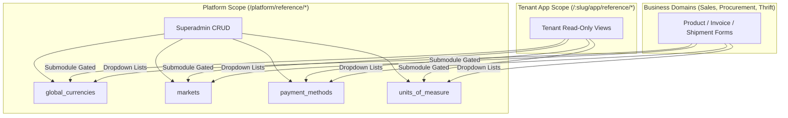

# Global Reference Data

The **Global Reference** module manages platform-wide reference catalogs shared across all tenants (currencies, markets, payment methods, and units of measure). Business modules consume these catalogs for dropdowns, pricing, and shipment calculations; they do not own or mutate them.

---

## 1. Domain Architecture & Access Scopes

Reference data is partitioned into **Platform Superadmin Management** and **Tenant App Consumption**:

### Module Keys & Gating Hierarchy

* **Parent Key**: `global_reference` (enables all catalogs by default when assigned to a tenant).
* **Submodule Keys** (gate tenant sidebar links and read-only pages):
  * `global_reference_currency` $\rightarrow$ `global_currencies`
  * `global_reference_market` $\rightarrow$ `markets`
  * `global_reference_payment_method` $\rightarrow$ `payment_methods`
  * `global_reference_unit_of_measure` $\rightarrow$ `units_of_measure`

---

## 2. Page & Component Inventory

### Platform Superadmin Management
| Route | Main Page | Key Child Components |
| :--- | :--- | :--- |
| `/platform/reference` | [`ReferenceHubPage.vue`](file:///Users/daviditc/Documents/personal_projects/brandwala-wholesale-quasar-v2/web/src/modules/global_reference/pages/ReferenceHubPage.vue) | Quick-navigation cards for all 4 catalogs |
| `/platform/reference/currencies` | [`CurrenciesPage.vue`](file:///Users/daviditc/Documents/personal_projects/brandwala-wholesale-quasar-v2/web/src/modules/global_reference/pages/CurrenciesPage.vue) | Currency CRUD table, system currency lock |
| `/platform/reference/markets` | [`MarketsPage.vue`](file:///Users/daviditc/Documents/personal_projects/brandwala-wholesale-quasar-v2/web/src/modules/global_reference/pages/MarketsPage.vue) | Market code/region CRUD table |
| `/platform/reference/payment-methods`| [`PaymentMethodsPage.vue`](file:///Users/daviditc/Documents/personal_projects/brandwala-wholesale-quasar-v2/web/src/modules/global_reference/pages/PaymentMethodsPage.vue) | Scope & category payment configuration |
| `/platform/reference/units` | [`UnitsOfMeasurePage.vue`](file:///Users/daviditc/Documents/personal_projects/brandwala-wholesale-quasar-v2/web/src/modules/global_reference/pages/UnitsOfMeasurePage.vue) | Unit type & symbol configuration |

### Tenant App Read-Only Surfaces
| Route | Main Page | Shared Component |
| :--- | :--- | :--- |
| `/:tenantSlug?/app/reference/currencies` | [`AppCurrenciesPage.vue`](file:///Users/daviditc/Documents/personal_projects/brandwala-wholesale-quasar-v2/web/src/modules/global_reference/pages/AppCurrenciesPage.vue) | [`AppReferenceReadOnlyPage.vue`](file:///Users/daviditc/Documents/personal_projects/brandwala-wholesale-quasar-v2/web/src/modules/global_reference/components/AppReferenceReadOnlyPage.vue) |
| `/:tenantSlug?/app/reference/markets` | [`AppMarketsPage.vue`](file:///Users/daviditc/Documents/personal_projects/brandwala-wholesale-quasar-v2/web/src/modules/global_reference/pages/AppMarketsPage.vue) | [`AppReferenceReadOnlyPage.vue`](file:///Users/daviditc/Documents/personal_projects/brandwala-wholesale-quasar-v2/web/src/modules/global_reference/components/AppReferenceReadOnlyPage.vue) |
| `/:tenantSlug?/app/reference/payment-methods`| [`AppPaymentMethodsPage.vue`](file:///Users/daviditc/Documents/personal_projects/brandwala-wholesale-quasar-v2/web/src/modules/global_reference/pages/AppPaymentMethodsPage.vue) | [`AppReferenceReadOnlyPage.vue`](file:///Users/daviditc/Documents/personal_projects/brandwala-wholesale-quasar-v2/web/src/modules/global_reference/components/AppReferenceReadOnlyPage.vue) |
| `/:tenantSlug?/app/reference/units` | [`AppUnitsPage.vue`](file:///Users/daviditc/Documents/personal_projects/brandwala-wholesale-quasar-v2/web/src/modules/global_reference/pages/AppUnitsPage.vue) | [`AppReferenceReadOnlyPage.vue`](file:///Users/daviditc/Documents/personal_projects/brandwala-wholesale-quasar-v2/web/src/modules/global_reference/components/AppReferenceReadOnlyPage.vue) |

---

## 3. Page to API / RPC Matrix

| Component | Action / Trigger | Hook / Endpoint | Caching Strategy |
| :--- | :--- | :--- | :--- |
| **`CurrenciesPage` / `AppCurrenciesPage`** | Mount / Refresh | `useGlobalCurrenciesQuery()` $\rightarrow$ `Table: global_currencies` | `staleTime: 24h`, `gcTime: 24h`, Key: `['global-reference', 'currencies']` |
| **`MarketsPage` / `AppMarketsPage`** | Mount / Refresh | `useGlobalMarketsQuery()` $\rightarrow$ `Table: markets` | `staleTime: 10m`, Key: `['global-reference', 'markets']` |
| **`PaymentMethodsPage` / `AppPaymentMethodsPage`** | Mount / Refresh | `useGlobalPaymentMethodsQuery()` $\rightarrow$ `Table: payment_methods` | `staleTime: 10m`, Key: `['global-reference', 'payment-methods']` |
| **`UnitsOfMeasurePage` / `AppUnitsPage`** | Mount / Refresh | `useGlobalUnitsOfMeasureQuery()` $\rightarrow$ `Table: units_of_measure` | `staleTime: 10m`, Key: `['global-reference', 'units-of-measure']` |
| **`CurrenciesPage` (Superadmin)** | Add / Update Currency | `globalReferenceRepository.updateCurrency` $\rightarrow$ `Table: global_currencies` | Invalidates `['global-reference', 'currencies']` |
| **`MarketsPage` (Superadmin)** | Add / Update Market | `globalReferenceRepository.updateMarket` $\rightarrow$ `Table: markets` | Invalidates `['global-reference', 'markets']` |
| **Business Dropdowns (Cross-module)** | Select Currency / Market | Global list RPCs (`list_global_currencies`, `list_vendor_markets`) | Cached per module / global repository |

---

## 4. Query Keys & Server State

Server state keys are centralized in [`globalReferenceQueryKeys.ts`](file:///Users/daviditc/Documents/personal_projects/brandwala-wholesale-quasar-v2/web/src/modules/global_reference/shared/queryKeys/globalReferenceQueryKeys.ts):

* `globalReferenceQueryKeys.currencies()` $\rightarrow$ `['global-reference', 'currencies']`
* `globalReferenceQueryKeys.markets()` $\rightarrow$ `['global-reference', 'markets']`
* `globalReferenceQueryKeys.paymentMethods()` $\rightarrow$ `['global-reference', 'payment-methods']`
* `globalReferenceQueryKeys.unitsOfMeasure()` $\rightarrow$ `['global-reference', 'units-of-measure']`
