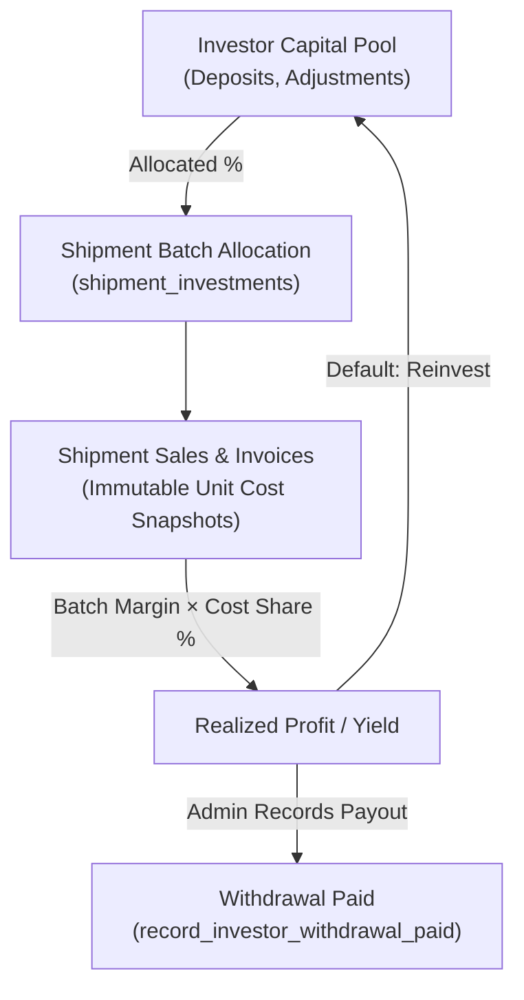

# Investor Capital Module

The **Investor Capital** domain manages external capital partner profiles, cash injections/withdrawals, shipment batch cost-share allocations, and read-side profit distribution.

---

## 1. Domain Architecture & Core Principles

### Core Profit-Sharing Philosophy
Investor profit is derived on-demand from live shipment profitability without maintaining a duplicate or shadow accounting ledger:

$$\text{Investor Profit Share} = \text{Shipment Batch Gross Profit} \times \text{cost\_share\_pct}$$

### Key Business Rules

1. **Read-Side Profit Derivation**: Operational invoice lines carry immutable cost snapshots. Gross profit is computed dynamically; no secondary ledger balances are posted until withdrawals are processed.
2. **Remainder Rule**: If the sum of investor `cost_share_pct` for a shipment is $< 100\%$, the **parent company absorbs the remaining share**.
3. **Default Reinvestment**: Realized profit remains in the investor's active capital pool until an admin explicitly records a `withdrawal_paid` transaction.
4. **Module Gating**:
   * `investor_profiles` $\rightarrow$ Partner contact & status management.
   * `investor_capital_ledger` $\rightarrow$ Cash deposits, adjustments, and payouts.
   * `investor_shipment_share` $\rightarrow$ Batch investment cost-share allocation.

---

## 2. Page & Component Inventory

| Route | Main Page | Key Child Components & Dialogs |
| :--- | :--- | :--- |
| `/:tenantSlug?/app/capital/profiles` | [`InvestorProfilesPage.vue`](file:///Users/daviditc/Documents/personal_projects/brandwala-wholesale-quasar-v2/web/src/modules/investor_capital/pages/admin/InvestorProfilesPage.vue) | [`InvestorProfileDialog.vue`](file:///Users/daviditc/Documents/personal_projects/brandwala-wholesale-quasar-v2/web/src/modules/investor_capital/components/InvestorProfileDialog.vue), Balance summary cards |
| `/:tenantSlug?/app/capital/ledger` | [`CapitalLedgerPage.vue`](file:///Users/daviditc/Documents/personal_projects/brandwala-wholesale-quasar-v2/web/src/modules/investor_capital/pages/admin/CapitalLedgerPage.vue) | [`InvestorTransactionDialog.vue`](file:///Users/daviditc/Documents/personal_projects/brandwala-wholesale-quasar-v2/web/src/modules/investor_capital/components/InvestorTransactionDialog.vue), transaction filter strip |
| `/:tenantSlug?/app/capital/shipments` | [`ShipmentAllocationsPage.vue`](file:///Users/daviditc/Documents/personal_projects/brandwala-wholesale-quasar-v2/web/src/modules/investor_capital/pages/admin/ShipmentAllocationsPage.vue) | Shipment batch list with total investor allocation percentage |
| `/:tenantSlug?/app/capital/shipments/:id` | [`ShipmentAllocationDetailsPage.vue`](file:///Users/daviditc/Documents/personal_projects/brandwala-wholesale-quasar-v2/web/src/modules/investor_capital/pages/admin/ShipmentAllocationDetailsPage.vue) | [`ShipmentShareEditor.vue`](file:///Users/daviditc/Documents/personal_projects/brandwala-wholesale-quasar-v2/web/src/modules/investor_capital/components/ShipmentShareEditor.vue), profit yield breakdown |

---

## 3. Page to API / RPC Matrix

| Component | Action / Trigger | Hook / Endpoint | Caching & State Strategy |
| :--- | :--- | :--- | :--- |
| **`InvestorProfilesPage`** | Mount / Refresh | `store.fetchInvestorsByTenant()` $\rightarrow$ `RPC: list_investor_profiles` | Pinia `useInvestorCapitalStore` |
| **`InvestorProfileDialog`** | Save Profile | `store.createInvestor()` / `updateInvestor()` $\rightarrow$ `RPC: upsert_investor_profile` | Refetches `list_investor_profiles` on success |
| **`InvestorProfileDialog`** | Delete Profile | `store.deleteInvestor()` $\rightarrow$ `Table: investors` | Optimistic removal in Pinia store |
| **`CapitalLedgerPage`** | Mount / Filter Change | `store.fetchTransactions()` $\rightarrow$ `RPC: list_investor_transactions` | Pinia `transactions` state |
| **`InvestorTransactionDialog`** | Record Deposit | `store.recordCapitalIn()` $\rightarrow$ `RPC: record_investor_capital_in` | Refetches ledger + balances |
| **`InvestorTransactionDialog`** | Record Withdrawal | `store.recordWithdrawalPaid()` $\rightarrow$ `RPC: record_investor_withdrawal_paid` | Refetches ledger + balances |
| **`InvestorTransactionDialog`** | Record Adjustment | `store.recordCapitalAdjustment()` $\rightarrow$ `RPC: record_investor_capital_adjustment` | Refetches ledger + balances |
| **`ShipmentAllocationDetailsPage`**| Save Cost Share % | `store.saveShipmentInvestment()` $\rightarrow$ `RPC: upsert_shipment_investment` | Refetches shipment investments |
| **`ShipmentAllocationDetailsPage`**| Recalculate Profit | `investorCapitalRepository.refreshShipmentInvestorProfits` $\rightarrow$ `RPC: refresh_shipment_investor_profits` | Triggers background profit sync |

---

## 4. State Management

Client state is managed in [`useInvestorCapitalStore.ts`](file:///Users/daviditc/Documents/personal_projects/brandwala-wholesale-quasar-v2/web/src/modules/investor_capital/stores/investorCapitalStore.ts) backed by [`investorCapitalRepository.ts`](file:///Users/daviditc/Documents/personal_projects/brandwala-wholesale-quasar-v2/web/src/modules/investor_capital/repositories/investorCapitalRepository.ts):

* **`investors`**: List of investor profiles with current balance, total deposited, and active shares.
* **`transactions`**: Filtered ledger entries (`capital_in`, `withdrawal_paid`, `profit_credit`, `adjustment`).
* **`shipmentInvestments`**: Active investor allocations for the selected shipment.
