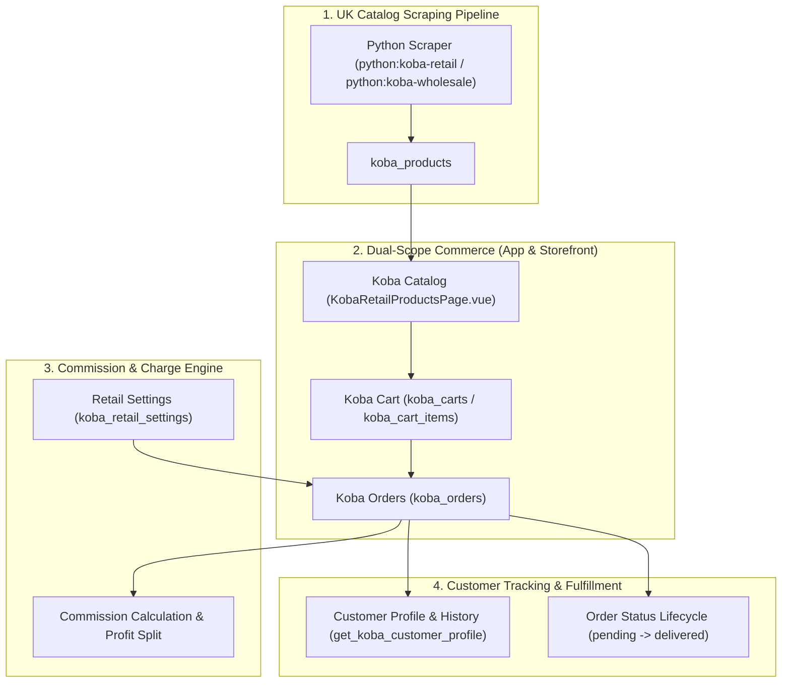

# Koba Vertical Module

The **Koba** vertical is an independent, tenant-scoped cross-border merchandise sourcing and catalog order system. It automates UK product scraping, commission-based retail pricing, multi-channel cart/checkout (App & Storefront), customer profiling, and order fulfillment.

---

## 1. Domain Architecture & Vertical Isolation

Like the Thrift vertical, Koba operates as a standalone retail and wholesale ecosystem:



### Module Gating & Access Surfaces

| Module Key | Accessible Scopes | Permitted Actions | Primary Capabilities |
| :--- | :--- | :--- | :--- |
| **`koba_retail`** | `app`, `shop` | `view`, `order`, `manage` | Scraped product catalog, cart, customer checkout, order tracking, settings. |
| **`koba_wholesale`** | `app` | `view`, `create`, `edit` | Bulk B2B order entry and wholesale catalog intake. |

---

## 2. Core Domain Engines & Business Algorithms

### 2.1 Retail Profit Split & Charges Engine
Order finances are computed authoritatively based on tenant configuration in `koba_retail_settings`:

$$\text{Extra Profit} = (\text{Custom Sell Price GBP} - \text{Base List Price GBP}) \times \text{Quantity}$$

$$\text{User Profit Share} = \text{Extra Profit} \times \text{extra\_profit\_user\_pct}$$

$$\text{Company Profit Share} = \text{Extra Profit} \times \text{extra\_profit\_company\_pct}$$

$$\text{Total Deductions} = \text{COD Charge} + \text{Packing Flat Fee} + \text{Invoice Flat Fee} + \text{Gateway Flat Fee}$$

$$\text{Net Order Commission} = \text{Base Commission} + \text{User Profit Share} - \text{Total Deductions}$$

### 2.2 Customer Profiling & District/Thana Directory
* **Auto-Lookup (`get_koba_customer_profile`)**: Queries repeat buyer phone numbers to fetch total order history, completed delivery count, return frequency, and last known delivery addresses.
* **Geographic Scoping**: Structured delivery location capture (`shipping_district`, `shipping_thana`, `shipping_address`) with dynamic courier rate calculation.

### 2.3 6-Stage Order Lifecycle
```text
Koba Order Status Lifecycle:
1. pending     -> Order submitted via Storefront or Staff Cart
2. confirmed   -> Address verified; phone delivery risk checked
3. processing  -> Order dispatched for UK packing & freight
4. shipped     -> Assigned courier tracking number
5. delivered   -> Completed; net commission unlocked
6. cancelled   -> Order rejected or cancelled prior to shipment
```

---

## 3. Page & Component Inventory

### Admin & Staff Surfaces (`/:tenantSlug?/app/koba/retail/*`)
| Route | Main Page | Key Child Components |
| :--- | :--- | :--- |
| `/:tenantSlug?/app/koba/retail` | [`KobaRetailProductsPage.vue`](file:///Users/daviditc/Documents/personal_projects/brandwala-wholesale-quasar-v2/web/src/modules/koba/retail/pages/KobaRetailProductsPage.vue) | Catalog grid, brand filter, custom price editor, [`ProductCard.vue`](file:///Users/daviditc/Documents/personal_projects/brandwala-wholesale-quasar-v2/web/src/modules/koba/retail/components/ProductCard.vue) |
| `/:tenantSlug?/app/koba/retail/cart` | [`KobaCartPage.vue`](file:///Users/daviditc/Documents/personal_projects/brandwala-wholesale-quasar-v2/web/src/modules/koba/retail/pages/KobaCartPage.vue) | Staff order builder, commission summary, address autocomplete |
| `/:tenantSlug?/app/koba/retail/orders` | [`KobaOrdersPage.vue`](file:///Users/daviditc/Documents/personal_projects/brandwala-wholesale-quasar-v2/web/src/modules/koba/retail/pages/KobaOrdersPage.vue) | Status filter tabs, courier quick-actions |
| `/:tenantSlug?/app/koba/retail/orders/:id` | [`KobaOrderDetailPage.vue`](file:///Users/daviditc/Documents/personal_projects/brandwala-wholesale-quasar-v2/web/src/modules/koba/retail/pages/KobaOrderDetailPage.vue) | Item quantity confirm, commission breakdown, [`KobaOrderDetailDialog.vue`](file:///Users/daviditc/Documents/personal_projects/brandwala-wholesale-quasar-v2/web/src/modules/koba/retail/components/KobaOrderDetailDialog.vue) |
| `/:tenantSlug?/app/koba/retail/settings` | [`KobaRetailSettingsPage.vue`](file:///Users/daviditc/Documents/personal_projects/brandwala-wholesale-quasar-v2/web/src/modules/koba/retail/pages/KobaRetailSettingsPage.vue) | Commission percentages, COD fee %, delivery rate table |
| `/:tenantSlug?/app/koba/retail/customers` | [`KobaRetailCustomersPage.vue`](file:///Users/daviditc/Documents/personal_projects/brandwala-wholesale-quasar-v2/web/src/modules/koba/retail/pages/KobaRetailCustomersPage.vue) | Customer CRM list with total lifetime spend |
| `/:tenantSlug?/app/koba/retail/customers/:phone` | [`KobaRetailCustomerProfilePage.vue`](file:///Users/daviditc/Documents/personal_projects/brandwala-wholesale-quasar-v2/web/src/modules/koba/retail/pages/KobaRetailCustomerProfilePage.vue) | Buyer order history, delivery success rate |

### Storefront Customer Surfaces (`/:tenantSlug?/shop/koba/retail/*`)
| Route | Main Page | Description |
| :--- | :--- | :--- |
| `/:tenantSlug?/shop/koba/retail` | [`KobaRetailProductsPage.vue`](file:///Users/daviditc/Documents/personal_projects/brandwala-wholesale-quasar-v2/web/src/modules/koba/retail/pages/KobaRetailProductsPage.vue) | Customer-facing scraped product catalog |
| `/:tenantSlug?/shop/koba/retail/cart` | [`KobaCartPage.vue`](file:///Users/daviditc/Documents/personal_projects/brandwala-wholesale-quasar-v2/web/src/modules/koba/retail/pages/KobaCartPage.vue) | Customer shopping cart & checkout |
| `/:tenantSlug?/shop/koba/retail/orders` | [`KobaOrdersPage.vue`](file:///Users/daviditc/Documents/personal_projects/brandwala-wholesale-quasar-v2/web/src/modules/koba/retail/pages/KobaOrdersPage.vue) | Customer order tracking |
| `/:tenantSlug?/shop/koba/retail/orders/:id` | [`KobaOrderDetailPage.vue`](file:///Users/daviditc/Documents/personal_projects/brandwala-wholesale-quasar-v2/web/src/modules/koba/retail/pages/KobaOrderDetailPage.vue) | Customer invoice summary |

---

## 4. Page to API / RPC Matrix

| Component | Action / Trigger | Hook / Endpoint | Caching Strategy |
| :--- | :--- | :--- | :--- |
| **`KobaRetailProductsPage`** | Mount / Search | `kobaRetailStore.fetchProducts` $\rightarrow$ `Table: koba_products` | `staleTime: 60s` |
| **`KobaCartPage`** | Mount / Refresh | `kobaCartService.getCart` $\rightarrow$ `RPC: get_koba_cart` | `staleTime: 15s` |
| **`KobaCartPage`** | Type Customer Phone | `kobaOrderService.getCustomerProfile` $\rightarrow$ `RPC: get_koba_customer_profile` | Debounced lookup |
| **`KobaCartPage`** | Place Order | `kobaOrderService.createOrder` $\rightarrow$ `Table: koba_orders` | Invalidates cart & order lists |
| **`KobaOrdersPage`** | Mount / Filter Change | `kobaOrderRepository.listOrders` $\rightarrow$ `Table: koba_orders` | `staleTime: 30s` |
| **`KobaOrderDetailPage`** | Update Status | `kobaOrderService.updateOrderStatus` $\rightarrow$ `Table: koba_orders` | Invalidates order detail |
| **`KobaRetailSettingsPage`**| Save Settings | `kobaSettingsRepository.updateSettings` $\rightarrow$ `Table: koba_retail_settings` | Refetches settings |

---

## 5. State Management & Automation Scripts

* **Client Stores**: Pinia stores in `web/src/modules/koba/retail/stores/` (`kobaRetailStore.ts`, `kobaOrderStore.ts`, `kobaCartStore.ts`, `kobaSettingsStore.ts`).
* **Scraper Automation**:
  * `pnpm run python:koba-retail`: UK retail product catalog scraping script (`scripts/run-python-koba-retail.sh`).
  * `pnpm run python:koba-wholesale`: UK wholesale product catalog scraping script (`scripts/run-python-koba-wholesale.sh`).
