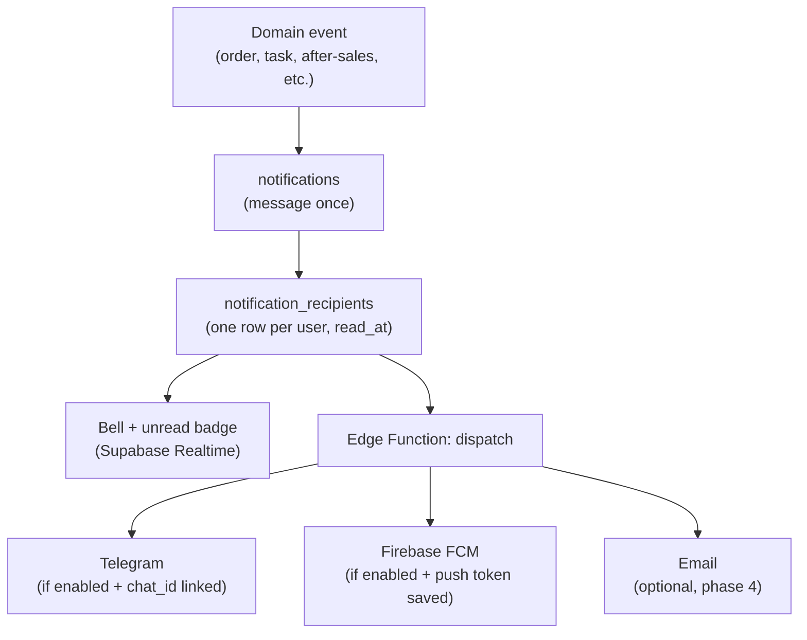

# Notifications — Implementation Plan

Staff and admin alerts for the `app` scope (tenant operators). Covers in-app inbox, Telegram, and Firebase web push. Email is optional later.

**Current state:** In-app inbox UI is live. Firebase push infra is shipped (preferences, token storage, `dispatch-notification` Edge Function, settings page at `/app/settings/notifications`). Telegram is not built yet. Push only works after you add Firebase keys to `web/.env` and `FIREBASE_SERVICE_ACCOUNT` to Supabase Edge Function secrets, plus dispatch DB settings (see Phase 2 setup below).

---

## 1. Channel strategy

| Channel | Cost | Configurable? | Best for | Limit |
| :--- | :--- | :--- | :--- | :--- |
| **In-app inbox** | Free (Supabase) | **No** — always on for parent-tenant staff | Staff inside the app | Only when app is open |
| **Telegram bot** | Free | **Yes** — per user opt-in | Phone alerts (iPhone + Android) | User must link bot once |
| **Firebase FCM** | Free (Spark) | **Yes** — per user opt-in | Android + desktop browser push | iPhone needs PWA on Home Screen; user must allow |
| **Email** (optional) | Free tier (Resend / Brevo) | **Yes** — per user opt-in (phase 4) | Formal audit trail, low-urgency | Slower; not everyone reads quickly |

### Channel rules

1. **In-app (mandatory):** Every eligible staff member in the **parent tenant network** gets in-app notifications. Scope uses `parent_tenant_id` (books tenant) — same pattern as wallet and after-sales. Parent operators see the full parent feed; child workspace users see their slice plus parent-wide events that apply to them. No user toggle to disable in-app.
2. **Telegram + FCM (configurable):** Optional outbound channels. Each user turns them on in settings, links Telegram or grants browser push, and can turn them off anytime. Dispatch only fires when the channel is enabled **and** linked.
3. **Email (later):** Same configurable model as Telegram / FCM.



---

## 2. Who receives notifications

| Audience | Scope | In-app | Telegram / FCM |
| :--- | :--- | :--- | :--- |
| Parent + child tenant admin / staff | `app` | Always (if eligible) | Configurable per user |
| Shop storefront members | `shop` | Later | Later |
| Investors | `investor` | No | No |
| End customers (dropship recipients) | — | Out of scope v1 | Out of scope v1 |

### Parent-tenant scope

- **`parent_tenant_id`** is the books key on every `notifications` row (via `resolve_parent_tenant_id(operating_tenant_id)`).
- All events in a parent books network share the same `parent_tenant_id`; child desks set `operating_tenant_id` when the event originated on a child workspace.
- Respect **`effectiveGrants`** — only create **recipient** rows for users who can view the related record.

See §3 for how **personal inbox** vs **tenant event log** use the same tables with different queries.

### External channels (Telegram / FCM)

Same eligible users as in-app, but delivery only when that user has enabled the channel in preferences and completed setup (Telegram link or FCM token).

### Parent vs child — who gets a recipient row?

Notify **both** parent and child when needed — but **not every event goes to everyone**. Per event, pick an **audience**:

| Audience | Meaning |
| :--- | :--- |
| `child_only` | Staff on `operating_tenant_id` with grants |
| `parent_only` | Parent membership users with grants |
| `child_and_parent` | Child desk staff **and** parent ops (stock, returns, policy) |
| `assignee_only` | Single `user_id` (tasks, direct ownership) |

**Decision rule**

| Question | If yes → include |
| :--- | :--- |
| Did this happen on a **child desk**? | Child staff on that `operating_tenant_id` |
| Does **parent** stock, money, or policy matter? | Parent ops / admin |
| Is it **only internal** to one child? | `child_only` |
| Is it **parent-wide** (warehouse, shipment, policy)? | `parent_only` or `parent_only` + opt-in children |

**Scenario matrix**

| Scenario | Audience | Child desk | Parent ops | Notes |
| :--- | :--- | :---: | :---: | :--- |
| New dropship order | `child_only` | Yes | No | Normal volume; parent does not need every order |
| Dropship line unavailable / stock shortfall | `child_and_parent` | Yes | Yes | Stock is parent-owned; warehouse may need to act |
| Shipment received at parent warehouse | `parent_only` | No | Yes | Child opt-in later for “new stock” if needed |
| Wholesale invoice created (routine) | `child_only` | Yes | No | Parent books; child desk owns the sale |
| Wholesale invoice (exception: over credit limit, first invoice) | `child_and_parent` | Yes | Yes | Phase 2 — threshold / rules engine |
| After-sales case opened or status changed | `child_and_parent` | Yes | Yes | Returns Hub is parent-scoped; child knows merchant/customer |
| Task assigned | `assignee_only` | — | — | Assignee only (parent or child user) |
| Staff / permission change | `parent_only` or `child_only` | Varies | Varies | Admins of the tenant where the change happened |

**v1 defaults** (see also §7 event table)

| Event | Audience |
| :--- | :--- |
| `task.assigned` | `assignee_only` |
| `dropship.order.created` | `child_only` |
| `dropship.line.unavailable` | `child_and_parent` |
| `after_sales.case.created` | `child_and_parent` |
| `after_sales.case.status_changed` | `child_and_parent` + assignee when set |
| `procurement.shipment.received` | `parent_only` |

**Anti-patterns**

- Do **not** send every child event to parent — inbox noise.
- Do **not** hide parent stock / returns events from parent ops.
- Do **not** use one audience rule for all modules — procurement ≠ dropship ≠ tasks.

`enqueue_notification` inserts **one** `notifications` row (message stored once), then one `notification_recipients` row per resolved user. Telegram / FCM use the same recipient set.

---

## 3. User notifications vs tenant events

Two product concepts, **one data store** — no separate table for tenant events in v1.

| Concept | Meaning | Who uses it | Query |
| :--- | :--- | :--- | :--- |
| **User notification** | “Something **I** should see or act on” | Every staff user | `notification_recipients` where `user_id = me` → join `notifications` |
| **Tenant event** | “Something that **happened** in the parent books network” | Parent admin / ops (later) | `notifications` where `parent_tenant_id = :books` → join recipients for delivery/read summary |

```text
notifications                    ← tenant event (parent_tenant_id, title, body, …)
       │
       ├── notification_recipients (user A, read_at)
       ├── notification_recipients (user B, read_at)
       └── notification_recipients (user C, read_at)
```

### Personal inbox (v1)

- One UI component set for all users — filtered per logged-in user, not a separate component per person.
- **`NotificationBell.vue`** — shell header; unread count from `notification_recipients` where `read_at is null`.
- **`NotificationList.vue`** — dropdown or full page; lists **my** rows only.
- **`NotificationListItem.vue`** — single row: title, body snippet, time, unread styling; click → `link_path` + mark read.

RPC: `list_my_notifications_paginated` — `where r.user_id = auth.uid()` join `notifications n`, order by `n.created_at desc`.

RLS on `notification_recipients`: users read and update **only their own** rows. Admins do **not** browse another user’s private inbox.

### Tenant event log (phase 2 — optional)

- Separate **admin page**, not an extension of the personal bell.
- Shows all `notifications` for `parent_tenant_id`, with recipient list and read status per user (“notified 3, read 2”).
- RPC: `list_tenant_notifications_paginated` — gated by parent-operator grant (e.g. `user_can_manage_parent_tenant` or tenant admin role).
- Child desk admin may see events for their `operating_tenant_id` slice only, if product requires it later.

**Do not** build “view User X’s inbox” in v1 — that is a privacy concern. Oversight belongs on the **event log**, not impersonating a user’s bell.

### Notifications vs activity / audit

| Need | Use |
| :--- | :--- |
| Actionable alert to specific people | `notifications` + `notification_recipients` |
| Parent admin oversight of what was sent | Tenant event log (same `notifications` table) |
| Silent history (“Ali edited line 3 at 10:42”, no alert) | Domain `activity_logs` (e.g. tasks module) — **not** notification tables |

Do not duplicate audit data into `notifications` unless someone should be notified.

---

## 4. Data model

**Two-table pattern:** event content lives once in `notifications`; per-user read state lives in `notification_recipients`. Same alert to five people = 1 notification + 5 recipient rows (not 5 duplicated messages).

### `notifications` (event / message — shared)

| Column | Type | Notes |
| :--- | :--- | :--- |
| `id` | uuid | PK, `gen_random_uuid()` |
| `parent_tenant_id` | bigint | Books scope (`resolve_parent_tenant_id`) → `tenants(id)` |
| `operating_tenant_id` | bigint | Child desk that triggered the event; null for parent-wide events → `tenants(id)` |
| `event_type` | text | e.g. `dropship.order.created`, `task.assigned` |
| `title` | text | Short headline (required) |
| `body` | text | Longer message; optional if `title` is enough |
| `link_path` | text | In-app route, e.g. `/app/dropship/orders/:id` |
| `entity_type` | text | Optional deep-link context, e.g. `shop_order` |
| `entity_id` | text | Optional entity id (text for flexibility) |
| `created_at` | timestamptz | `default now()` |

Indexes: `(parent_tenant_id, created_at desc)`, `(parent_tenant_id, operating_tenant_id, created_at desc)`, `(event_type, created_at desc)`.

No `user_id` or `read_at` on this table — those belong on recipients.

### `notification_recipients` (per user — read state)

| Column | Type | Notes |
| :--- | :--- | :--- |
| `id` | uuid | PK, `gen_random_uuid()` |
| `notification_id` | uuid | FK → `notifications(id)` on delete cascade |
| `user_id` | uuid | FK → `auth.users(id)` |
| `read_at` | timestamptz | Null = unread for this user |
| `created_at` | timestamptz | `default now()` |

Constraints: `unique (notification_id, user_id)`.

Indexes: `(user_id, read_at, created_at desc)` — bell unread count and inbox list; `(notification_id)`.

**Mark as read:** `update notification_recipients set read_at = now() where notification_id = :id and user_id = auth.uid()`.

RLS on `notification_recipients`: users read/update **only their own** rows (`user_id = auth.uid()`).

RLS on `notifications` (for direct selects): join from recipient rows in normal use. Tenant event log RPC uses `security definer` + parent-operator check — same pattern as after-sales list RPCs.

### `user_notification_preferences`

Configurable channels only. In-app is **not** stored here — it is always on.

| Column | Type | Notes |
| :--- | :--- | :--- |
| `user_id` | uuid | PK → `auth.users(id)` |
| `channel_telegram` | boolean | Default `false`; user opts in |
| `channel_push` | boolean | Default `false`; user opts in |
| `channel_email` | boolean | Default `false` (phase 4) |
| `event_preferences` | jsonb | Per `event_type` overrides for **Telegram / push / email only** |
| `updated_at` | timestamptz | |

### `user_push_subscriptions`

| Column | Type | Notes |
| :--- | :--- | :--- |
| `id` | uuid | PK |
| `user_id` | uuid | FK → `auth.users(id)` |
| `fcm_token` | text | From Firebase SDK |
| `platform` | text | `web` \| `android` (future Capacitor) |
| `created_at` | timestamptz | |
| `last_used_at` | timestamptz | Optional — prune stale tokens |

Unique: `(user_id, fcm_token)`.

### `user_telegram_links`

| Column | Type | Notes |
| :--- | :--- | :--- |
| `user_id` | uuid | PK → `auth.users(id)` |
| `telegram_chat_id` | bigint | From bot `/start` webhook |
| `telegram_username` | text | Optional |
| `linked_at` | timestamptz | |

### `notification_delivery_log` (optional — phase 2+)

| Column | Type | Notes |
| :--- | :--- | :--- |
| `id` | uuid | PK |
| `notification_id` | uuid | FK → `notifications(id)` |
| `user_id` | uuid | Recipient |
| `channel` | text | `telegram` \| `push` \| `email` |
| `status` | text | `sent` \| `failed` |
| `error_message` | text | Null on success |
| `created_at` | timestamptz | |

Not required for v1 in-app. Useful to debug failed Telegram / FCM sends.

RLS: users read/update own preference / link / subscription rows; service role inserts on dispatch.

**Schema source:** `supabase/schemas/notifications/` (`01_types.sql` … `04_rpcs.sql`).

**Migration:** `supabase/migrations/20270910120000_notifications_core.sql`

---

## 5. Backend / RPC contract

### Enum: `notification_audience`

```sql
'child_only' | 'parent_only' | 'child_and_parent' | 'assignee_only'
```

### Grant matrix

| Function | Client (`authenticated`) | Internal |
| :--- | :---: | :---: |
| `enqueue_notification` | No | Yes — domain RPCs / triggers |
| `resolve_notification_recipient_user_ids` | No | Yes |
| `list_my_notifications_paginated` | Yes | — |
| `get_my_notification_unread_count` | Yes | — |
| `mark_notification_read` | Yes | — |
| `mark_all_my_notifications_read` | Yes | — |

### `enqueue_notification` (plugin — internal only)

**Signature:**

```sql
enqueue_notification(
  p_tenant_id bigint,
  p_operating_tenant_id bigint,
  p_audience notification_audience,
  p_event_type text,
  p_title text,
  p_body text default null,
  p_link_path text default null,
  p_entity_type text default null,
  p_entity_id text default null,
  p_recipient_user_ids uuid[] default null,
  p_module_key text default null,
  p_action text default 'view'
) returns jsonb
```

**Request (from domain RPC / trigger):**

```json
{
  "p_tenant_id": 10,
  "p_operating_tenant_id": 12,
  "p_audience": "child_and_parent",
  "p_event_type": "dropship.line.unavailable",
  "p_title": "Stock shortfall on order DS-1042",
  "p_body": "2 lines marked unavailable.",
  "p_link_path": "/app/dropship/orders/1042",
  "p_entity_type": "shop_order",
  "p_entity_id": "1042",
  "p_recipient_user_ids": null,
  "p_module_key": "shop_order",
  "p_action": "view"
}
```

**Response (success):**

```json
{
  "success": true,
  "notification_id": "f47ac10b-58cc-4372-a567-0e02b2c3d479",
  "parent_tenant_id": 10,
  "operating_tenant_id": 12,
  "recipient_count": 3,
  "recipient_user_ids": ["uuid-1", "uuid-2", "uuid-3"]
}
```

**Response (no recipients — valid no-op):**

```json
{
  "success": true,
  "notification_id": null,
  "recipient_count": 0,
  "recipient_user_ids": []
}
```

**Response (error):**

```json
{
  "success": false,
  "error": "assignee_only requires p_recipient_user_ids"
}
```

### `list_my_notifications_paginated`

```sql
list_my_notifications_paginated(
  p_tenant_id bigint,
  p_page int default 1,
  p_page_size int default 20,
  p_unread_only boolean default false,
  p_event_type text default null
) returns jsonb
```

**Response:**

```json
{
  "data": [
    {
      "recipient_id": "uuid",
      "notification_id": "uuid",
      "read_at": null,
      "is_unread": true,
      "event_type": "task.assigned",
      "title": "Task assigned: Review shipment docs",
      "body": null,
      "link_path": "/app/tasks",
      "entity_type": "item",
      "entity_id": "55",
      "parent_tenant_id": 10,
      "operating_tenant_id": 10,
      "created_at": "2026-03-09T10:00:00Z"
    }
  ],
  "meta": {
    "total_count": 42,
    "page": 1,
    "page_size": 20,
    "total_pages": 3,
    "unread_count": 7
  }
}
```

### `get_my_notification_unread_count`

```sql
get_my_notification_unread_count(p_tenant_id bigint) returns jsonb
```

```json
{ "unread_count": 7 }
```

### `mark_notification_read`

```sql
mark_notification_read(p_notification_id uuid) returns jsonb
```

```json
{
  "success": true,
  "notification_id": "uuid",
  "read_at": "2026-03-09T10:05:00Z"
}
```

### `mark_all_my_notifications_read`

```sql
mark_all_my_notifications_read(p_tenant_id bigint) returns jsonb
```

```json
{
  "success": true,
  "updated_count": 7
}
```

### First plugin: `task.assigned`

Trigger `trg_item_assignees_notify_assigned` on `item_assignees` AFTER INSERT → resolves assignee `auth.users.id` from `user_email` → calls `enqueue_notification` with `assignee_only`.

---

## 6. Implementation phases

### Phase 1 — In-app inbox (foundation)

**Goal:** Bell in `WorkspaceShell`, unread count, list + mark read. Works without third-party services.

| Layer | Work |
| :--- | :--- |
| DB | `notifications` + `notification_recipients`, RLS, `list_my_notifications_paginated`, `mark_notification_read`, `mark_all_notifications_read` |
| Backend | DB triggers or RPC hooks on first events (see §7); `enqueue_notification` inserts 1 notification + N recipients |
| Frontend | `NotificationBell.vue`, `NotificationList.vue`, `NotificationListItem.vue`; Realtime on `notification_recipients` where `user_id = me` |
| Settings | None — in-app is always on for all eligible parent-tenant staff |

**Done when**

- [x] Bell shows unread count for logged-in `app` user
- [x] Click opens list; click row navigates to `link_path` and marks read
- [x] At least one real event writes 1 notification + recipient row(s) (e.g. task assigned)

---

### Phase 2 — Firebase web push (FCM)

**Goal:** Optional browser push on Android and desktop. User enables in settings. Telegram comes next.

| Layer | Work |
| :--- | :--- |
| External | Firebase project (Spark / free), FCM web config, VAPID key |
| App | Root service worker `public/firebase-messaging-sw.js` + `firebase` SDK (no full Quasar offline PWA) |
| DB | `user_notification_preferences`, `user_push_subscriptions`, `notification_delivery_log` |
| Edge Function | `dispatch-notification` — FCM HTTP v1 with service account |
| Frontend | “Enable browser notifications” in settings; save token on grant |

**Done when**

- [ ] Android Chrome + desktop receive push when tab closed (after opt-in)
- [ ] User can disable push in settings
- [ ] Dispatch does not duplicate if both Telegram and push are on (same event, both channels — acceptable; user chose both)

**Note:** iOS Safari only works when site is added to Home Screen (iOS 16.4+). Telegram (Phase 3) remains the reliable iPhone channel.

**Setup (required before push works):**

1. Create Firebase project → Web app → Cloud Messaging → copy public config + VAPID key into `web/.env` (`VITE_FIREBASE_*`).
2. Add Edge Function secret `FIREBASE_SERVICE_ACCOUNT` (service account JSON with Firebase Messaging scope).
3. Configure Postgres dispatch settings so `trg_notification_recipients_dispatch` can call the Edge Function:
   - **Local:** `pnpm run backend:configure-dispatch` (reads `SUPABASE_SECRET_KEY` from `web/.env`; optional `FIREBASE_SERVICE_ACCOUNT_PATH` for Edge Function secret)
   - **Hosted:** run in SQL editor — `select public.set_notification_dispatch_settings('https://<project-ref>.supabase.co', '<service-role-key>');`
   - Local default functions URL is `http://kong:8000` (inside Docker); override with env `NOTIFICATION_DISPATCH_FUNCTIONS_URL` if needed

---

### Phase 3 — Telegram

**Goal:** Optional phone alerts. Staff opt in via settings and link a bot. Free, reliable on iPhone and Android.

| Layer | Work |
| :--- | :--- |
| External | Telegram bot (BotFather), bot token in Supabase secrets |
| DB | `user_telegram_links` (prefs table already exists from Phase 2) |
| Edge Function | `telegram-webhook` — handle `/start <link_token>`; extend `dispatch-notification` — Telegram Bot API |
| Frontend | Settings page: “Connect Telegram” → deep link `t.me/<bot>?start=<one_time_token>` |

**Done when**

- [ ] User links Telegram from profile/settings
- [ ] New notification triggers Telegram per recipient when channel enabled
- [ ] Message includes title + link back to app

---

### Phase 4 — Email (optional)

**Goal:** Low-urgency or audit-friendly copy of alerts.

| Layer | Work |
| :--- | :--- |
| External | Resend or Brevo free tier |
| Edge Function | `dispatch-notification` — email branch |
| Frontend | Toggle in notification preferences |

Defer until phases 1–2 are stable.

---

### Phase 5 — Tenant event log (optional)

**Goal:** Parent admin oversight — all events in the books network, who was notified, who read. **Not** a per-user inbox viewer.

| Layer | Work |
| :--- | :--- |
| DB | `list_tenant_notifications_paginated` — `notifications` for `parent_tenant_id` + aggregated recipient read counts |
| Frontend | `TenantNotificationLogPage.vue` under settings or ops — parent operator only |

Defer until personal inbox (phase 1) is stable.

---

## 7. First event types (v1)

| Event | Trigger | Audience | Recipients (after grants) |
| :--- | :--- | :--- | :--- |
| `task.assigned` | Insert on `item_assignees` | `assignee_only` | Assignee |
| `dropship.order.created` | New dropship order | `child_only` | Child desk shop ops |
| `dropship.line.unavailable` | Line marked unavailable | `child_and_parent` | Child merchant desk + parent warehouse |
| `after_sales.case.created` | New case | `child_and_parent` | Child desk + parent returns watchers |
| `after_sales.case.status_changed` | Case status update | `child_and_parent` | Assignee / creator + parent returns watchers |
| `procurement.shipment.received` | Shipment received at parent | `parent_only` | Parent warehouse staff |

Add events incrementally. Each domain owns the trigger; shared `enqueue_notification(parent_tenant_id, operating_tenant_id, audience, event_type, title, body, link_path, entity_type, entity_id)` RPC:
1. Inserts one `notifications` row (message once).
2. Resolves users from `audience` + `effectiveGrants`.
3. Inserts one `notification_recipients` row per user.

---

## 8. Dispatch flow

1. Domain code or trigger calls `enqueue_notification(...)`.
2. RPC inserts **one** `notifications` row, then **one** `notification_recipients` row per eligible user — in-app always (parent-tenant scoped).
3. For each recipient row, if `channel_telegram` or `channel_push` is enabled, enqueue outbound dispatch (async). Message text comes from `notifications.title` / `notifications.body`.
4. `dispatch-notification` Edge Function loads preferences + Telegram `chat_id` + FCM tokens per `user_id`.
5. Sends only to configured external channels; log failures in `notification_delivery_log` (optional, phase 2+).

In-app does not depend on Edge Functions. Do not block the business RPC on Telegram/FCM latency — fire-and-forget from Edge Function.

---

## 9. UI placement

| Surface | Component | Scope |
| :--- | :--- | :--- |
| App shell header | `NotificationBell.vue` | My unread count |
| Bell dropdown / route | `NotificationList.vue` + `NotificationListItem.vue` | My inbox only |
| User settings | `NotificationPreferencesPage.vue` | Telegram + FCM toggles (in-app not listed) |
| Ops / settings (phase 5) | `TenantNotificationLogPage.vue` | Parent admin — all tenant events |
| Toast | `appFeedback.ts` | Immediate action feedback — separate from inbox |

---

## 10. Out of scope (v1)

- WhatsApp Business API (paid; manual `wa.me` links OK in UI until then)
- SMS gateway
- Shop customer / dropship recipient automated messaging
- Investor portal notifications
- Admin browsing another user’s private inbox (“view Sara’s notifications”)

---

## 11. Cross-links

- [`doc/dashboard/DASHBOARD.md`](../dashboard/DASHBOARD.md) — shell placement for bell
- [`doc/tasks/TASKS.md`](../tasks/TASKS.md) — first assignee event
- [`doc/shop_order/DROPSHIP_PROCESSING_STOCK_PICK.md`](../shop_order/DROPSHIP_PROCESSING_STOCK_PICK.md) — shortfall notify gap
- [`doc/after_sales/DROPSHIP_AFTER_SALES.md`](../after_sales/DROPSHIP_AFTER_SALES.md) — merchant notify gap
