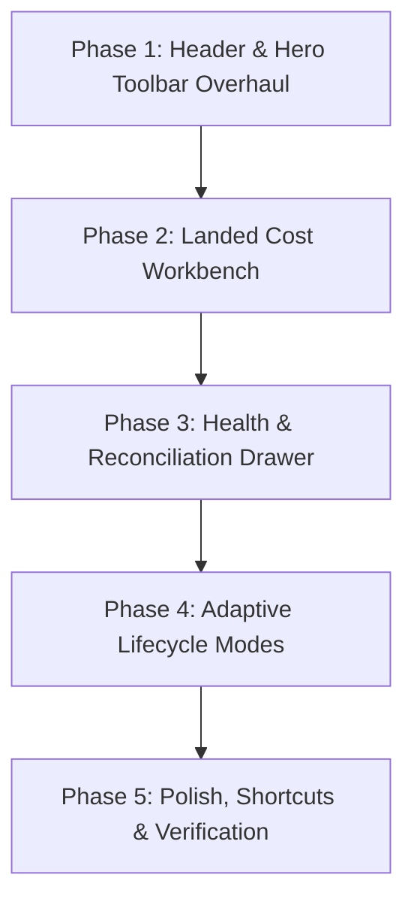

# Inbound Shipment Details Page UX Redesign Plan

## Executive Summary
This document outlines the phased redesign strategy for [`InboundShipmentDetailsPage.vue`](file:///Users/daviditc/Documents/personal_projects/brandwala-wholesale-quasar-v2/web/src/modules/procurement_stock/pages/InboundShipmentDetailsPage.vue). The goal is to transform the page from a dense, static multi-tab container into a **high-efficiency, context-aware procurement workbench**. 

The redesign addresses cognitive overload, excessive tab hopping, vertical space inefficiency, and manual invoice matching friction.

---

## 🎯 Architectural Goals
1. **Reduce Screen Real Estate Waste**: Shrink stacked top bars from ~140px down to a single ~55px sticky Executive Hero Bar.
2. **Eliminate Tab Hopping**: Replace disconnected `Items` and `Rates & cost entries` tabs with a live side-by-side **Landed Cost Workbench**.
3. **Streamline Reconciliation**: Introduce a persistent **Shipment Health Widget** and slide-over **Reconciliation Drawer** for 1-click weight/purchase variance resolution.
4. **Adaptive Lifecycle Views**: Tailor UI controls according to shipment lifecycle stage (`Draft` vs `In Transit` vs `Received`).

---

## 📅 Phased Implementation Plan



---

### Phase 1: Header & Hero Toolbar Overhaul (Vertical Space Optimization)
**Goal**: Consolidate top headers to reclaim ~85px of vertical screen real estate for item data.

* **Tasks**:
  * [ ] Create a unified component [`ShipmentHeroHeader.vue`](file:///Users/daviditc/Documents/personal_projects/brandwala-wholesale-quasar-v2/web/src/modules/procurement_stock/components/ShipmentHeroHeader.vue) to combine [`ShipmentHeaderBar.vue`](file:///Users/daviditc/Documents/personal_projects/brandwala-wholesale-quasar-v2/web/src/modules/procurement_stock/components/ShipmentHeaderBar.vue) and [`ShipmentStatusWorkflowBar.vue`](file:///Users/daviditc/Documents/personal_projects/brandwala-wholesale-quasar-v2/web/src/modules/procurement_stock/components/ShipmentStatusWorkflowBar.vue).
  * [ ] Replace inline dropdown chips (Type, Vendor, Cargo) with a clean popover metadata card.
  * [ ] Integrate a compact, linear milestone stepper for status transitions (`Draft` ➔ `In Transit` ➔ `Received`).
  * [ ] Place primary CTA (e.g., *"Mark In-Transit"*, *"Receive Stock"*) prominently in the top right.
* **Target Layout**:
  ```
  [ ← ] #SHP-1042 • Summer Batch 2026   [ Draft ─── In Transit (Active) ─── Received ]
        Vendor: Apex | Cargo: DHL       Flow: Standard  | Progress: Tag ▼     [ Action CTA ] [ ⋯ ]
  ```

---

### Phase 2: Landed Cost "Split Workbench" (Eliminate Tab Hopping)
**Goal**: Allow real-time calculation and visualization of unit landed costs alongside cost entries.

* **Tasks**:
  * [ ] Create a 2-pane workbench view:
    * **Left Pane (35% width)**: [`ShipmentCostEntriesPanel.vue`](file:///Users/daviditc/Documents/personal_projects/brandwala-wholesale-quasar-v2/web/src/modules/procurement_stock/components/ShipmentCostEntriesPanel.vue) (Freight, Duty, Clearing, Local Transport).
    * **Right Pane (65% width)**: [`ShipmentLineItemsTable.vue`](file:///Users/daviditc/Documents/personal_projects/brandwala-wholesale-quasar-v2/web/src/modules/procurement_stock/components/ShipmentLineItemsTable.vue) showing base price, allocated cost share, and calculated unit landed cost.
  * [ ] Bind live reactive recalculations so changes in cost entries update the unit landed price column instantly.
  * [ ] Add visual color-coding for cost breakdown columns (Base Rate + Expenses = Landed Cost).

---

### Phase 3: Contextual Health & Auto-Reconciliation Slide-Over Drawer
**Goal**: Proactively surface invoice/weight discrepancies and allow 1-click resolution.

* **Tasks**:
  * [ ] Create a persistent **Shipment Health Indicator Widget** anchored near the workbench toolbar:
    * ⚖️ **Weight Match Status** (`Cargo Weight` vs `Line Items Total Weight`).
    * 💰 **Purchase Match Status** (`Paid Purchase` vs `Line Items Total Purchase`).
    * 📦 **Splits Status** (`Warehouse Location Allocation`).
  * [ ] Build [`ShipmentReconciliationDrawer.vue`](file:///Users/daviditc/Documents/personal_projects/brandwala-wholesale-quasar-v2/web/src/modules/procurement_stock/components/ShipmentReconciliationDrawer.vue) containing side-by-side delta comparisons and 1-click auto-appliers (*"Pro-rate 8kg variance across items"*, *"Match total invoice amount"*).
  * [ ] Replace anchor scrolling (`scrollToBalanceCard`) with direct drawer invocation.

---

### Phase 4: Adaptive Lifecycle Navigation & Receiving Workbench
**Goal**: Render stage-optimized UI components appropriate for the current shipment state.

* **Tasks**:
  * [ ] Implement stage-based view modes inside [`InboundShipmentDetailsPage.vue`](file:///Users/daviditc/Documents/personal_projects/brandwala-wholesale-quasar-v2/web/src/modules/procurement_stock/pages/InboundShipmentDetailsPage.vue):
    * **Draft Mode**: Focus on item creation, Excel paste, vendor selection. Hide cost distribution and warehouse receiving panels.
    * **In-Transit Mode**: Focus on landed cost split workbench and invoice matching.
    * **Received Mode**: Focus on warehouse stock receiving, shop assignment ([`ShipmentAssignShopCard.vue`](file:///Users/daviditc/Documents/personal_projects/brandwala-wholesale-quasar-v2/web/src/modules/procurement_stock/components/ShipmentAssignShopCard.vue)), and stock ledger posting.
  * [ ] Streamline warehouse stock receiving grid with inline location picker and batch receive triggers.

---

### Phase 5: Refactoring, UX Polish & Verification
**Goal**: Ensure high performance, accessibility, type safety, and smooth animations.

* **Tasks**:
  * [ ] Implement a **Floating Bulk Action Toolbar** for line item selections (Bulk weight update, shop assignment, deletion).
  * [ ] Add keyboard shortcuts (`Cmd/Ctrl + S` to save cost entries, `Esc` to close drawer).
  * [ ] Run complete typecheck and linting:
    ```bash
    pnpm run typecheck
    ```
  * [ ] Perform manual end-to-end verification across desktop and tablet viewports.

---

## 📌 Deliverable Files Matrix

| File Path | Action | Description |
| :--- | :---: | :--- |
| [`InboundShipmentDetailsPage.vue`](file:///Users/daviditc/Documents/personal_projects/brandwala-wholesale-quasar-v2/web/src/modules/procurement_stock/pages/InboundShipmentDetailsPage.vue) | **[MODIFY]** | Integrate stage-driven layout modes and split workbench |
| [`ShipmentHeroHeader.vue`](file:///Users/daviditc/Documents/personal_projects/brandwala-wholesale-quasar-v2/web/src/modules/procurement_stock/components/ShipmentHeroHeader.vue) | **[NEW]** | Consolidated compact 55px header & status workflow bar |
| [`ShipmentReconciliationDrawer.vue`](file:///Users/daviditc/Documents/personal_projects/brandwala-wholesale-quasar-v2/web/src/modules/procurement_stock/components/ShipmentReconciliationDrawer.vue) | **[NEW]** | Slide-over drawer for 1-click weight & invoice delta resolution |
| [`ShipmentCostEntriesPanel.vue`](file:///Users/daviditc/Documents/personal_projects/brandwala-wholesale-quasar-v2/web/src/modules/procurement_stock/components/ShipmentCostEntriesPanel.vue) | **[MODIFY]** | Adapt panel for 35% left-pane workbench layout |
| [`ShipmentLineItemsTable.vue`](file:///Users/daviditc/Documents/personal_projects/brandwala-wholesale-quasar-v2/web/src/modules/procurement_stock/components/ShipmentLineItemsTable.vue) | **[MODIFY]** | Add landed cost layer visual color coding & bulk action bar |

---

## 🔍 Verification Plan
1. **Type Safety**: Verify zero Vue/TypeScript errors with `pnpm run typecheck`.
2. **Responsiveness**: Verify proper rendering on 1080p desktop, 1440p wide monitors, and iPad/Tablet viewports.
3. **Calculations**: Validate that modifying cost entries in the Split Workbench immediately and accurately recalculates unit landed costs without needing full refetches.
