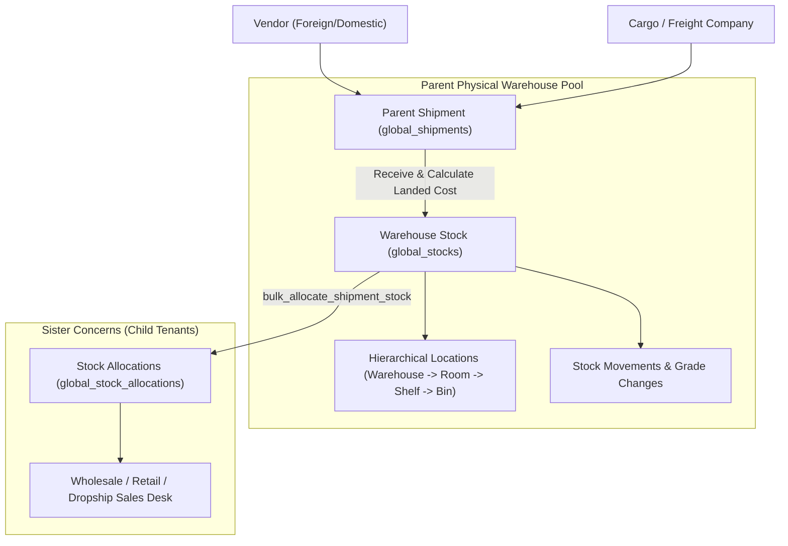
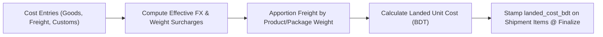

# Procurement & Stock Module

The **Procurement & Stock** domain manages inbound international shipments, freight cargo logistics, landed cost calculation, warehouse inventory pooling, hierarchical bin locations, and child-tenant stock allocations.

---

## 1. Domain Architecture & Multi-Tenant Model

### Parent Ownership & Virtual Child Allocation

Physical stock is owned strictly at the **Parent** tenant level. Sister concerns (child tenants) receive virtual allocation slices for sales execution:



### Core Entity Relationships

| Entity | Table | Responsibility |
| :--- | :--- | :--- |
| **Global Shipment** | `global_shipments` | Inbound customs batch, vendor/cargo link, FX rates, status lifecycle, archiving flag (`is_archived`, `archived_at`). |
| **Shipment Item** | `global_shipment_items` | Catalog/manual products in batch with stamped `landed_cost_bdt`. |
| **Cost Entries** | `global_shipment_cost_entries` | Itemized charges (goods cost, freight, customs, local delivery). |
| **Global Stock** | `global_stocks` | Physical inventory row (`quantity`, `available_atp`, `availability`, `location_id`). |
| **Stock Location** | `stock_locations` | Hierarchical tree (`warehouse` $\rightarrow$ `room` $\rightarrow$ `shelf` $\rightarrow$ `bin`). |
| **Stock Movement** | `stock_movements` | Immutable audit log of stock transfers, grade changes, and re-allocations. |
| **Cargo Company** | `cargo_companies` | Inbound freight/customs providers with wallet accounts for payout. |

---

## 2. Core Domain Engines & Business Algorithms

### 2.1 Landed Cost Engine (`shipment_engine`)
Calculates the landed unit cost in BDT for every line item in a shipment:



* **Formula**:
  $$\text{Landed Cost (BDT)} = (\text{Purchase Price} \times \text{FX Rate}) + \text{Apportioned Cargo Charge} + \text{Customs Surcharge}$$
* **Dual-Phase Design**: Pure in-memory calculation for live preview in UI; authoritative stamp written to `global_shipment_items.landed_cost_bdt` upon shipment finalization.

### 2.2 Warehouse Location Hierarchy & Leaf Validation
Locations follow a strict 4-tier nesting structure: `warehouse` $\rightarrow$ `room` $\rightarrow$ `shelf` $\rightarrow$ `bin`.
* **Leaf Constraint**: Physical stock can only be stored in **leaf-level locations** (`_stock_location_is_leaf`).
* **Nesting Rule**: Enforced by database trigger (`_validate_stock_location_nesting`).

### 2.3 Stock Availability & Movement Lifecycle
Stock rows transition across 3 availability states:
* `sellable`: Available for invoice allocation and desk sales.
* `held`: Temporarily reserved for inspection, returns, or pending batches.
* `unsellable`: Quarantined, damaged, or lost inventory.

### 2.4 Shipment Archiving & Deletion Governance Lifecycle

To preserve financial audit trails, stock lineage, and avoid accidental data loss, shipments adhere to a strict **Archive-First** governance policy with direct table actions:

```mermaid
flowchart TD
    subgraph ActiveTable ["1. Active Shipment Table (InboundShipmentListPage)"]
        Row["Shipment Row (No 3-dots menu)"]
        Row -->|Click Row| Nav["Navigate to Shipment Overview"]
        Row -->|Direct Archive Btn| ConfArch["Confirmation Dialog: 'Archive this shipment?'"]
        ConfArch -->|Confirm| RPC_Arch["RPC: archive_shipment"]
    end

    subgraph ArchivedHub ["2. Archived Shipments Hub (ArchivedShipmentsDialog)"]
        TopBtn["Toolbar 'Archived' Button"] --> OpenDialog["Open Archived Shipments Dialog"]
        RPC_Arch --> OpenDialog

        OpenDialog --> AD["Archived Draft"]
        OpenDialog --> ACN["Archived Cancelled"]
        OpenDialog --> AIT["Archived In-Transit"]
        OpenDialog --> ARC["Archived Received"]
    end

    subgraph ArchivedActions ["3. Actions in Archived Dialog"]
        AD -->|Unarchive Icon| Unarch["RPC: unarchive_shipment (Returns to Active Table)"]
        ACN -->|Unarchive Icon| Unarch
        AIT -->|Unarchive Icon| Unarch
        ARC -->|Unarchive Icon| Unarch

        AD -->|Delete Icon (ph-trash)| PurgeConf["Destructive Confirm Dialog"]
        ACN -->|Delete Icon (ph-trash)| PurgeConf
        PurgeConf -->|Confirm| RPC_Purge["RPC: purge_archived_shipment (Hard Delete)"]

        AIT -.->|Delete Icon REMOVED| AuditLock["Locked: Transit Audit Required"]
        ARC -.->|Delete Icon REMOVED| AuditLock2["Locked: Stock & Wallet Ledger Invariant"]
    end
```

#### Key UI & Interaction Rules:
1. **No Three-Dots Menu (`...`)**: The actions column in the active shipment table does **not** use a three-dots dropdown menu. 
2. **Direct Row Archive Button**: Each active shipment row provides an inline **Archive** button (`q-btn icon="ph-archive"` / `"ph-archive-box"`). Clicking it triggers an explicit confirmation dialog before invoking `archive_shipment`.
3. **Archived Hub Trigger**: The table toolbar contains a dedicated **"Archived"** button (`q-btn icon="ph-archive-box"`) displaying the count of archived shipments. Clicking it opens [`ArchivedShipmentsModal.vue`](file:///Users/daviditc/Documents/personal_projects/brandwala-wholesale-quasar-v2/web/src/modules/procurement_stock/components/ArchivedShipmentsModal.vue).
4. **Archived Dialog Action Matrix**:
   * **Unarchive / Restore**: Rendered for **all** archived records, returning them to the active table.
   * **Delete Icon (Permanent Purge)**: Rendered **only** for shipments with **`draft`** or **`cancelled`** status. Triggers a permanent hard-delete dialog via `purge_archived_shipment`.
   * **Delete Icon Removed**: For shipments in **`in_transit`** or **`received`** status, the delete icon is **completely removed** (protected by financial and inventory audit locks).
5. **Consolidated Single RPC Execution**: The shipment list page loads entirely through a single execution of `list_global_shipments_paginated`. It embeds `vendor_name`, `vendor_code`, and `progress_tag` in every row, and includes `archived_total` inside `meta`, eliminating separate secondary API calls for vendors, child refs, or background count fetching.

---

## 3. Page & Component Inventory

| Route | Main Page | Key Child Components & Dialogs |
| :--- | :--- | :--- |
| `/:tenantSlug?/app/procurement/shipment` | [`InboundShipmentListPage.vue`](file:///Users/daviditc/Documents/personal_projects/brandwala-wholesale-quasar-v2/web/src/modules/procurement_stock/pages/InboundShipmentListPage.vue) | Compact table toolbar, "Archived" hub trigger button, filter chips, shipment status pills, direct row Archive button with confirmation dialog (no 3-dots menu), [`ArchivedShipmentsModal.vue`](file:///Users/daviditc/Documents/personal_projects/brandwala-wholesale-quasar-v2/web/src/modules/procurement_stock/components/ArchivedShipmentsModal.vue), [`ShipmentFormDialog.vue`](file:///Users/daviditc/Documents/personal_projects/brandwala-wholesale-quasar-v2/web/src/modules/procurement_stock/components/ShipmentFormDialog.vue) |
| `/:tenantSlug?/app/procurement/shipment/:id` | [`ShipmentOverviewPage.vue`](file:///Users/daviditc/Documents/personal_projects/brandwala-wholesale-quasar-v2/web/src/modules/procurement_stock/pages/ShipmentOverviewPage.vue) | [`ShipmentStatusWorkflowBar.vue`](file:///Users/daviditc/Documents/personal_projects/brandwala-wholesale-quasar-v2/web/src/modules/procurement_stock/components/ShipmentStatusWorkflowBar.vue), Archive toggle button, [`ShipmentLandedCostSummaryCard.vue`](file:///Users/daviditc/Documents/personal_projects/brandwala-wholesale-quasar-v2/web/src/modules/procurement_stock/components/ShipmentLandedCostSummaryCard.vue), [`ShipmentCostEntriesPanel.vue`](file:///Users/daviditc/Documents/personal_projects/brandwala-wholesale-quasar-v2/web/src/modules/procurement_stock/components/ShipmentCostEntriesPanel.vue) |
| `/:tenantSlug?/app/procurement/shipment/:id/items` | [`ShipmentLineItemsPage.vue`](file:///Users/daviditc/Documents/personal_projects/brandwala-wholesale-quasar-v2/web/src/modules/procurement_stock/pages/ShipmentLineItemsPage.vue) | [`ShipmentLineItemsTable.vue`](file:///Users/daviditc/Documents/personal_projects/brandwala-wholesale-quasar-v2/web/src/modules/procurement_stock/components/ShipmentLineItemsTable.vue), [`AddShipmentItemsDrawer.vue`](file:///Users/daviditc/Documents/personal_projects/brandwala-wholesale-quasar-v2/web/src/modules/procurement_stock/components/AddShipmentItemsDrawer.vue), [`BulkPasteDialog.vue`](file:///Users/daviditc/Documents/personal_projects/brandwala-wholesale-quasar-v2/web/src/modules/procurement_stock/components/BulkPasteDialog.vue) |
| `/:tenantSlug?/app/procurement/shipment/:id/receive` | [`ReceiveShipmentPage.vue`](file:///Users/daviditc/Documents/personal_projects/brandwala-wholesale-quasar-v2/web/src/modules/procurement_stock/pages/ReceiveShipmentPage.vue) | [`ShipmentReceiveTabPanel.vue`](file:///Users/daviditc/Documents/personal_projects/brandwala-wholesale-quasar-v2/web/src/modules/procurement_stock/components/ShipmentReceiveTabPanel.vue), physical variance checklist |
| `/:tenantSlug?/app/procurement/stock` | [`WarehouseStockListPage.vue`](file:///Users/daviditc/Documents/personal_projects/brandwala-wholesale-quasar-v2/web/src/modules/procurement_stock/pages/WarehouseStockListPage.vue) | Stock location badge, availability chips, [`StockMoveLocationDialog.vue`](file:///Users/daviditc/Documents/personal_projects/brandwala-wholesale-quasar-v2/web/src/modules/procurement_stock/components/StockMoveLocationDialog.vue), [`StockMoveGradeDialog.vue`](file:///Users/daviditc/Documents/personal_projects/brandwala-wholesale-quasar-v2/web/src/modules/procurement_stock/components/StockMoveGradeDialog.vue) |
| `/:tenantSlug?/app/procurement/locations` | [`StockLocationsPage.vue`](file:///Users/daviditc/Documents/personal_projects/brandwala-wholesale-quasar-v2/web/src/modules/procurement_stock/pages/StockLocationsPage.vue) | Tree hierarchy viewer, [`StockLocationFormDialog.vue`](file:///Users/daviditc/Documents/personal_projects/brandwala-wholesale-quasar-v2/web/src/modules/procurement_stock/components/StockLocationFormDialog.vue) |
| `/:tenantSlug?/app/procurement/movements` | [`StockMovementsPage.vue`](file:///Users/daviditc/Documents/personal_projects/brandwala-wholesale-quasar-v2/web/src/modules/procurement_stock/pages/StockMovementsPage.vue) | Audit history log, [`StockMovementDetailDialog.vue`](file:///Users/daviditc/Documents/personal_projects/brandwala-wholesale-quasar-v2/web/src/modules/procurement_stock/components/StockMovementDetailDialog.vue) |
| `/:tenantSlug?/app/procurement/cargo-companies` | [`CargoCompaniesPage.vue`](file:///Users/daviditc/Documents/personal_projects/brandwala-wholesale-quasar-v2/web/src/modules/procurement_stock/pages/CargoCompaniesPage.vue) | [`CargoCompanyFormDialog.vue`](file:///Users/daviditc/Documents/personal_projects/brandwala-wholesale-quasar-v2/web/src/modules/procurement_stock/components/CargoCompanyFormDialog.vue), currency configuration |
| `/:tenantSlug?/app/procurement/child-stock` | [`ChildStockPage.vue`](file:///Users/daviditc/Documents/personal_projects/brandwala-wholesale-quasar-v2/web/src/modules/procurement_stock/pages/ChildStockPage.vue) | Allocated stock view for child sister concerns |

---

## 4. Page to API / RPC Matrix

| Component | Action / Trigger | Hook / Endpoint | Caching Strategy |
| :--- | :--- | :--- | :--- |
| **`InboundShipmentListPage`** | Mount / Filter Change | `useQuery` $\rightarrow$ `RPC: list_global_shipments_paginated` (Returns rows + vendor info + `archived_total`) | `staleTime: 30s`, Key: `['procurementStock', 'shipments', tenantId, { is_archived: false }]` |
| **`InboundShipmentListPage`** | Direct Row Archive Click | `useMutation` $\rightarrow$ `RPC: archive_shipment` | Invalidates `['procurementStock', 'shipments']` & `['procurementStock', 'archivedShipments']` |
| **`ArchivedShipmentsModal`** | Mount / Refresh | `useQuery` $\rightarrow$ `RPC: list_global_shipments_paginated` (where `is_archived = true`) | `staleTime: 30s`, Key: `['procurementStock', 'archivedShipments', tenantId]` |
| **`ArchivedShipmentsModal`** | Unarchive Action | `useMutation` $\rightarrow$ `RPC: unarchive_shipment` | Invalidates active and archived shipment lists |
| **`ArchivedShipmentsModal`** | Permanent Delete (Draft & Cancelled Only) | `useMutation` $\rightarrow$ `RPC: purge_archived_shipment` | Optimistic removal / Invalidates `['procurementStock', 'archivedShipments']` |
| **`ShipmentFormDialog`** | Create Shipment Draft | `useMutation` $\rightarrow$ `RPC: create_shipment_draft` | Invalidates `['procurementStock', 'shipments']` |
| **`ShipmentLineItemsPage`** | Add Catalog Product Line | `useMutation` $\rightarrow$ `RPC: add_shipment_item_from_product` | Invalidates `['procurementStock', 'shipmentOverview', id]` |
| **`ShipmentLineItemsPage`** | Add Child Line Item | `useMutation` $\rightarrow$ `RPC: add_child_line_to_parent_shipment` | Invalidates `['procurementStock', 'shipmentOverview', id]` |
| **`ShipmentOverviewPage`** | Settle Vendor / Cargo Payee | `useMutation` $\rightarrow$ `RPC: settle_shipment_payee` | Invalidates shipment & wallet ledger caches |
| **`ReceiveShipmentPage`** | Finalize Inbound Batch | `useMutation` $\rightarrow$ `RPC: finalize_and_revise` | Stamps `landed_cost_bdt`, populates `global_stocks` |
| **`WarehouseStockListPage`** | Mount / Filter Change | `useQuery` $\rightarrow$ `Table: global_stocks` | `staleTime: 30s`, Key: `['procurementStock', 'allocatableStockList', params]` |
| **`StockMoveLocationDialog`** | Transfer Bin Location | `useMutation` $\rightarrow$ `RPC: create_and_post_stock_movement` | Invalidates stock list & movements |
| **`StockMoveGradeDialog`** | Change Condition Grade | `useMutation` $\rightarrow$ `RPC: create_and_post_stock_movement` | Invalidates stock list & movements |
| **`ShipmentAssignShopCard`** | Bulk Allocate to Child | `useMutation` $\rightarrow$ `RPC: bulk_allocate_shipment_stock` | Invalidates allocations & child stock |
| **`StockLocationsPage`** | Mount / Expand Tree | `useQuery` $\rightarrow$ `Table: stock_locations` | `staleTime: 5m`, Key: `['procurementStock', 'stockLocations', tenantId]` |
| **`CargoCompaniesPage`** | Add / Update Cargo Agent | `useMutation` $\rightarrow$ `RPC: create_cargo_company_with_wallet` | Invalidates `['procurementStock', 'cargoCompanies']` |

---

## 5. Query Keys & Server State

Server state keys are centralized in [`procurementStockQueryKeys.ts`](file:///Users/daviditc/Documents/personal_projects/brandwala-wholesale-quasar-v2/web/src/modules/procurement_stock/shared/queryKeys/procurementStockQueryKeys.ts):

* `procurementStockQueryKeys.shipments(tenantId, params)` $\rightarrow$ `['procurementStock', 'shipments', { tenantId, ...params }]`
* `procurementStockQueryKeys.archivedShipments(tenantId)` $\rightarrow$ `['procurementStock', 'archivedShipments', { tenantId }]`
* `procurementStockQueryKeys.shipmentOverview(shipmentId)` $\rightarrow$ `['procurementStock', 'shipmentOverview', { shipmentId }]`
* `procurementStockQueryKeys.allocatableStockList(params)` $\rightarrow$ `['procurementStock', 'allocatableStockList', params]`
* `procurementStockQueryKeys.stockLocations(tenantId)` $\rightarrow$ `['procurementStock', 'stockLocations', { tenantId }]`
* `procurementStockQueryKeys.cargoCompanies(tenantId)` $\rightarrow$ `['procurementStock', 'cargoCompanies', { tenantId }]`
* `procurementStockQueryKeys.childStockAtp(params)` $\rightarrow$ `['procurementStock', 'childStockAtp', params]`
