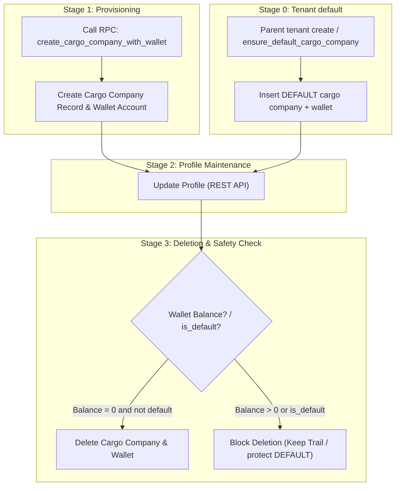

# Cargo Company Lifecycle & Workflow Specification

Step-by-step flow for cargo-company setup and management, mapped to APIs / RPCs.

---

## Lifecycle Overview

---

## Stage 0: Auto-provision default cargo company

* **When**:
  * Superadmin creates a **parent** tenant via `create_tenant_for_superadmin` (child tenants skipped) — same hook as [`ensure_default_vendor`](../../vendor/workflow_flow.md).
  * Migration / ops backfill calls `ensure_default_cargo_company` for every existing parent tenant.
* **What**: Idempotent insert of `code = 'DEFAULT'`, `name = 'Default Cargo Company'`, `is_default = true`, `is_active = true`, plus zero-balance `wallet_accounts` row (`entity_type: 'cargo_company'`).
* **Used by**:
  * Shipment create dialog prefill
  * Shipment draft / header RPC fallback when `p_cargo_company_id` is null
* **RPC**: `ensure_default_cargo_company(p_tenant_id)` → returns cargo company `id`

---

## Stage 1: Cargo Company & Wallet Provisioning

* **Action**: Admin / Manager adds a freight / cargo agent for the parent tenant.
* **Execution**: Single RPC provisions the `cargo_companies` row (`is_default = false`) and a zero-balance `wallet_account` (`entity_type: 'cargo_company'`) in one transaction.
* **API / RPC Used**:
  * [create_cargo_company_with_wallet.md](rpc/create_cargo_company_with_wallet.md)

---

## Stage 2: Profile Editing & Maintenance

* **Action**: User updates contact info, address, notes, or `is_active`.
* **API Used**:
  * [cargo_company_api.md](api/cargo_company_api.md) (`supabase.from('cargo_companies').update(...)`)

---

## Stage 3: Deletion & Financial Safety

* **Action**: User attempts to remove a cargo company.
* **Safety Rule**:
  * **`is_default` / `code = 'DEFAULT'`**: Do not delete — required for shipment header fallback.
  * **Balance = 0** (non-default): Deletion succeeds and cleans up empty wallet.
  * **Balance > 0**: System blocks deletion to prevent untracked balance / audit trail loss.
* **API Used**:
  * [cargo_company_api.md](api/cargo_company_api.md) (`supabase.from('cargo_companies').delete(...)`)
