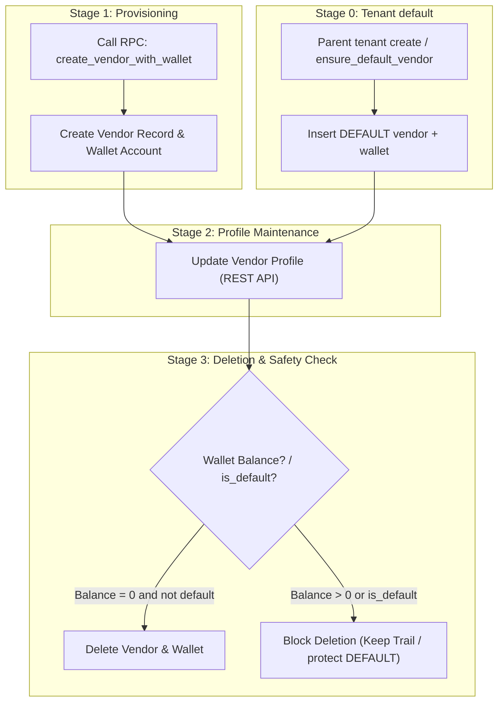

# Vendor Lifecycle & Workflow Specification

This document details the step-by-step business flow for vendor setup and management, mapping each stage to its corresponding APIs and RPCs.

---

## Lifecycle Overview

---

## Stage 0: Auto-provision default vendor

* **When**:
  * Superadmin creates a **parent** tenant via `create_tenant_for_superadmin` (child tenants skipped).
  * Migration / ops backfill calls `ensure_default_vendor` for every existing parent tenant.
* **What**: Idempotent insert of `code = 'DEFAULT'`, `name = 'Default Vendor'`, `is_default = true`, plus zero-balance `wallet_accounts` row. `market_code` resolved from an existing tenant vendor market, else a stable active `markets.code` (prefer `GB` / `BD` / `US`).
* **Used by**:
  * Shipment create dialog prefill
  * Shipment draft / header RPC fallback when `p_vendor_id` is null
* **RPC**: `ensure_default_vendor(p_tenant_id)` → returns vendor `id`

---

## Stage 1: Vendor & Wallet Provisioning

* **Action**: Admin / Manager adds a new supplier/vendor to the tenant.
* **Execution**: Single RPC function provisions vendor record (`is_default = false`) and creates an initial zero-balance `wallet_account` (`entity_type: 'vendor'`) in 1 atomic transaction.
* **API / RPC Used**:
  * [create_vendor_with_wallet.md](rpc/create_vendor_with_wallet.md) (`supabase.rpc('create_vendor_with_wallet', ...)`)

---

## Stage 2: Profile Editing & Maintenance

* **Action**: User updates contact info, address, or vendor details.
* **API Used**:
  * [vendor_api.md](api/vendor_api.md) (`supabase.from('vendors').update(...)`)

---

## Stage 3: Deletion & Financial Safety

* **Action**: User attempts to remove a vendor.
* **Safety Rule**:
  * **`is_default` / `code = 'DEFAULT'`**: Do not delete — required for shipment header fallback.
  * **Balance = 0** (non-default): Deletion succeeds and cleans up empty wallet (`ON DELETE CASCADE`).
  * **Balance > 0**: System blocks deletion to prevent untracked balance / audit trail loss.
* **API Used**:
  * [vendor_api.md](api/vendor_api.md) (`supabase.from('vendors').delete(...)`)
