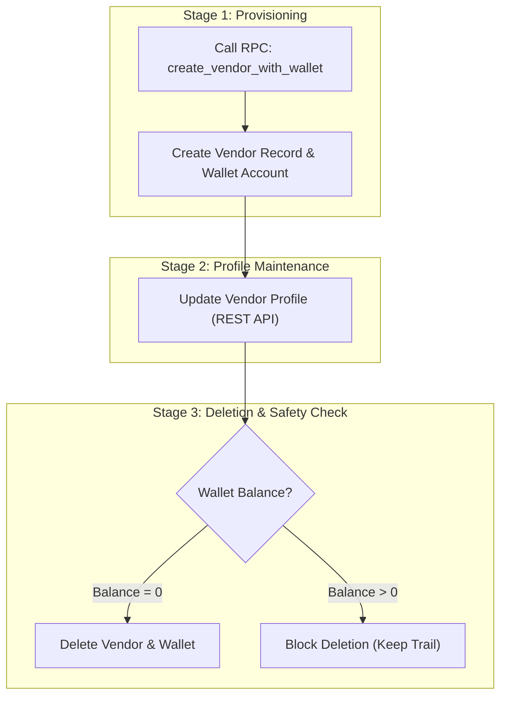

# Vendor Lifecycle & Workflow Specification

This document details the step-by-step business flow for vendor setup and management, mapping each stage to its corresponding APIs and RPCs.

---

## Lifecycle Overview

---

## Stage 1: Vendor & Wallet Provisioning

* **Action**: Admin / Manager adds a new supplier/vendor to the tenant.
* **Execution**: Single RPC function provisions vendor record and creates an initial zero-balance `wallet_account` (`entity_type: 'vendor'`) in 1 atomic transaction.
* **API / RPC Used**:
  * [create_vendor_with_wallet.md](rpc/create_vendor_with_wallet.md) (`supabase.rpc('create_vendor_with_wallet', ...)`)

---

## Stage 2: Profile Editing & Maintenance

* **Action**: User updates contact info, address, or vendor details.
* **API Used**:
  * [vendor_api.md](api/vendor_api.md) (`supabase.from('vendors').update(...)`)

---

## Stage 3: Deletion & Financial Safety

* **Action**: User attempts to remove a vendor.
* **Safety Rule**:
  * **Balance = 0**: Deletion succeeds and cleans up empty wallet (`ON DELETE CASCADE`).
  * **Balance > 0**: System blocks deletion to prevent untracked balance / audit trail loss.
* **API Used**:
  * [vendor_api.md](api/vendor_api.md) (`supabase.from('vendors').delete(...)`)
