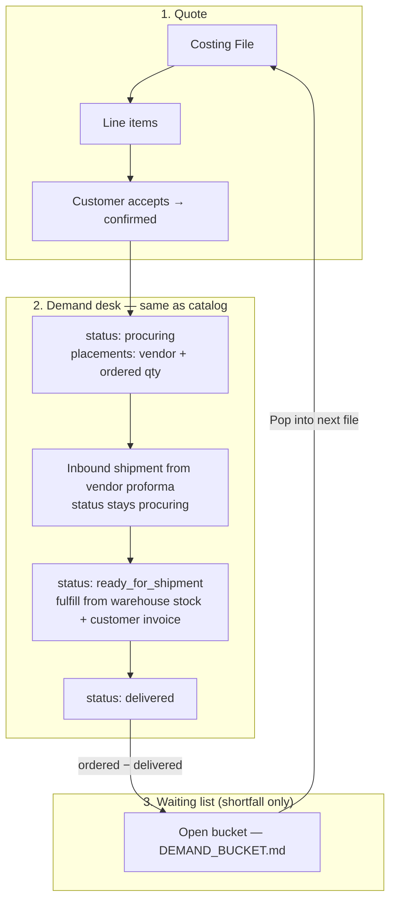

# Product-Based Costing (PBC) & Demand Backlog Module

The **Product-Based Costing (PBC)** domain manages B2B pre-order costing files, dynamic item pricing formulas, customer demand backlog tracking, and downstream sourcing via the same Demand desk as catalog shop orders.

---

## 1. Domain Architecture & After-confirm flow

Costing files let sister concerns assemble quotes and lock demand. After `confirmed`, PBC uses the **same three statuses** as catalog orders ([`CATALOG_NEGOTIATION.md`](../shop_order/CATALOG_NEGOTIATION.md) §2.1). Vendor proforma / vendor invoice / inbound cargo live on the **Shipment** module — they do **not** move the file status.



Treat Demand + Shipment as the tracker. `add_child_line_to_parent_shipment` is an **optional** inbound helper, not the customer-file status machine.

---

## 2. Core Domain Engines & Business Algorithms

### 2.1 Auxiliary Costing & Markup Formula
Calculates unit costs and customer prices for overseas products (GBP $\rightarrow$ BDT):

$$\text{Item Unit Cost GBP} = \text{Web Base Price} + \text{Delivery Surcharge} + \text{Item Type Surcharge}$$

$$\text{Quoted Unit Price BDT} = (\text{Item Unit Cost GBP} \times \text{FX Transaction Rate}) \times (1 + \text{Customer Group Markup Rate})$$

### 2.2 Costing file customer identity

Staff pick a **customer group** in the UI (`ProductBasedCostingFileDialog`, settings drawer). The row stores both:

| Column | Role |
| :--- | :--- |
| `customer_group_id` | Who the quote is for (same identity as shop carts / orders) |
| `billing_profile_id` | Stamped by DB trigger from the group's linked profile — used for invoices, wallet, and PBC backlog |

One-off billing profiles (no group) are not valid PBC customers.

### 2.3 PBC backlog (current) vs customer-group bucket (planned)

**Shipped today:** shortfall waiting list uses **`product_based_costing_backlog_items`**, keyed by **`billing_profile_id`** + `product_id`. [`PbcBacklogSuggestDrawer.vue`](file:///Users/daviditc/Documents/personal_projects/brandwala-wholesale-quasar-v2/web/src/modules/product_based_costing/components/PbcBacklogSuggestDrawer.vue) calls `list_pbc_backlog_items` with the file's stamped `billing_profile_id`.

**Planned:** migrate to **`customer_group_backlog_bucket_items`** ([`DEMAND_BUCKET.md`](../shop_order/DEMAND_BUCKET.md)), keyed by **`customer_group_id`** + `product_id`. Retired: `customer_order_backlog_items`, interim `customer_demand_bucket_items`.

| Line Outcome | Item Status | Bucket action (`source_type = pbc_costing_item`) | Eligible for parent shipment |
| :--- | :--- | :--- | :---: |
| **Fully Fulfilled** | `accepted` (`ordered_qty = confirmed_qty`) | No bucket row | **YES** (`ordered_qty`) |
| **Partially Fulfilled** | `partial` (`0 < ordered_qty < confirmed_qty`) | `add_customer_group_backlog_bucket_item` (`confirmed_qty − ordered_qty`) | **YES** (`ordered_qty`) |
| **Out of Stock / Unavailable** | `unavailable` (`ordered_qty = 0`) | `add_customer_group_backlog_bucket_item` (`confirmed_qty`) | **NO** |
| **Customer Rejected** | `rejected` | None | **NO** |

Bucket insert on document **`delivered`** is the source of truth ([`DEMAND_BUCKET.md`](../shop_order/DEMAND_BUCKET.md)). The “parent shipment” column is leftover line-level eligibility — inbound cargo is recorded on the Shipment module **during `procuring`**, not by waiting for `ready_for_shipment`.

* **One-Click Add (today):** backlog drawer lists `list_pbc_backlog_items` for the file's `billing_profile_id` and consumes rows into the costing file.

### 2.4 Costing file status model (`product_based_costing_files.status`)

Quote and negotiation phases are **unchanged**. Procurement phases are **aligned with catalog shop orders** ([`CATALOG_NEGOTIATION.md`](../shop_order/CATALOG_NEGOTIATION.md) §2.1).

#### Quote phase (unchanged)

| Status | Who acts | Meaning |
| :--- | :--- | :--- |
| `pending` | Staff / customer | Draft — building the quote |
| `offered` | Customer | Quote sent — customer review |
| `confirmed` | Staff | Customer accepted — procurement may start |

#### Procurement phase (shared with catalog orders)

| Status | Who acts | Meaning |
| :--- | :--- | :--- |
| `procuring` | Staff | Buying from vendor. Demand desk Procuring tab — vendor + ordered qty. **Stay here** through PO, vendor proforma, vendor invoice, and inbound cargo ([`CATALOG_NEGOTIATION.md`](../shop_order/CATALOG_NEGOTIATION.md) stay-procuring table). |
| `ready_for_shipment` | Staff | Buying done. Demand desk Ready tab: delivered qty from stock + **customer** invoice ([`PROCUREMENT_DEMAND_LIST.md`](../shop_order/PROCUREMENT_DEMAND_LIST.md) §2.5). |
| `delivered` | Staff | File closed from customer view. Shortfall → waiting list. |
| `cancelled` | Either | Voided at any step |

```text
pending → offered → confirmed → procuring → ready_for_shipment → delivered
```

(`cancelled` can occur from any status above.)


#### Statuses to stop using (procurement only)

| Legacy status | Action |
| :--- | :--- |
| `placing_order` | Rename / migrate to `procuring` |
| `invoicing` | Remove from file workflow — billing via `global_invoices` (see [`SALES_INVOICE.md`](../sales_invoice/SALES_INVOICE.md)) |
| `ordered` | Do not use on PBC files (catalog legacy only) |

**Inbound shipment** is created on the Shipment module **while the file is `procuring`** (from the vendor proforma). Vendor PO qty is logged on [`preorder_demand`](../shop_order/PROCUREMENT_DEMAND_LIST.md) (`placed_quantity`). `add_child_line_to_parent_shipment` is leftover tooling — do not wait for `ready_for_shipment` just to record a proforma.

**Aggregated Demand desk:** [`PROCUREMENT_DEMAND_LIST.md`](../shop_order/PROCUREMENT_DEMAND_LIST.md) — one `preorder_demand` row per line: vendor + `placed_quantity` (Procuring), `stock_picks` + `delivered_quantity` + invoice (Ready).

#### Customer-facing copy (same as catalog)

PBC has no shop order-tracking page. If the customer asks, use the catalog sentences. Do not show DB enum names or vendor paperwork.

| DB status | What to tell the customer |
| :--- | :--- |
| `pending` | Draft — not sent yet |
| `offered` | Please review the quote |
| `confirmed` | Quote accepted — we will source it |
| `procuring` | **We're sourcing your items** (covers PO, proforma, vendor invoice, cargo) |
| `ready_for_shipment` | **On the way** |
| `delivered` | **Delivered** |
| `cancelled` | **Cancelled** |

---

## 3. Page & Component Inventory

| Route | Main Page | Key Child Components & Dialogs |
| :--- | :--- | :--- |
| `/:tenantSlug?/app/product-based-costing` | [`ProductBasedCostingPage.vue`](file:///Users/daviditc/Documents/personal_projects/brandwala-wholesale-quasar-v2/web/src/modules/product_based_costing/pages/ProductBasedCostingPage.vue) | Status filter tabs, customer group selector, [`ProductBasedCostingFileDialog.vue`](file:///Users/daviditc/Documents/personal_projects/brandwala-wholesale-quasar-v2/web/src/modules/product_based_costing/components/ProductBasedCostingFileDialog.vue) |
| `/:tenantSlug?/app/product-based-costing/:id` | [`ProductBasedCostingFileDetailsPage.vue`](file:///Users/daviditc/Documents/personal_projects/brandwala-wholesale-quasar-v2/web/src/modules/product_based_costing/pages/ProductBasedCostingFileDetailsPage.vue) | [`ProductBasedCostingItemsTable.vue`](file:///Users/daviditc/Documents/personal_projects/brandwala-wholesale-quasar-v2/web/src/modules/product_based_costing/components/ProductBasedCostingItemsTable.vue), [`PbcBacklogSuggestDrawer.vue`](file:///Users/daviditc/Documents/personal_projects/brandwala-wholesale-quasar-v2/web/src/modules/product_based_costing/components/PbcBacklogSuggestDrawer.vue), [`AddCostingItemsDrawer.vue`](file:///Users/daviditc/Documents/personal_projects/brandwala-wholesale-quasar-v2/web/src/modules/product_based_costing/components/AddCostingItemsDrawer.vue), [`ProductBasedCostingFileWorkflowBar.vue`](file:///Users/daviditc/Documents/personal_projects/brandwala-wholesale-quasar-v2/web/src/modules/product_based_costing/components/ProductBasedCostingFileWorkflowBar.vue) |
| `/:tenantSlug?/app/product-based-costing/:id/preview` | [`ProductBasedCostingSharedPreviewPage.vue`](file:///Users/daviditc/Documents/personal_projects/brandwala-wholesale-quasar-v2/web/src/modules/product_based_costing/pages/ProductBasedCostingSharedPreviewPage.vue) | Customer-facing exportable quote sheet (PDF / Excel download) |

---

## 4. Page to API / RPC Matrix

| Component | Action / Trigger | Hook / Endpoint | Caching Strategy |
| :--- | :--- | :--- | :--- |
| **`ProductBasedCostingPage`** | Mount / Filter Change | `useProductBasedCostingFilesQuery()` $\rightarrow$ `Table: product_based_costing_files` | `staleTime: 30s`, Key: `['productBasedCosting', 'files', params]` |
| **`ProductBasedCostingFileDialog`**| Create New Costing Batch| `useProductBasedCostingFileMutations()` $\rightarrow$ `RPC: create_costing_file` | Invalidates `['productBasedCosting', 'files']` |
| **`PbcBacklogSuggestDrawer`** | Mount | `list_pbc_backlog_items` (file `billing_profile_id`) | Key: backlog by profile |
| **`PbcBacklogSuggestDrawer`** | Pull waiting list into file | `add_pbc_backlog_to_file` | Invalidates backlog & costing items |
| **Parent Shipment UI** | Pull PBC Lines to Cargo | `useProcurementStockMutations` $\rightarrow$ `RPC: add_child_line_to_parent_shipment` | Links `assigned_shipment_id` & marks `on_shipment` |

---

## 5. Query Keys & Server State

Server state keys are centralized in [`productBasedCostingQueryKeys.ts`](file:///Users/daviditc/Documents/personal_projects/brandwala-wholesale-quasar-v2/web/src/modules/product_based_costing/shared/queryKeys/productBasedCostingQueryKeys.ts):

* `productBasedCostingQueryKeys.files(params)` $\rightarrow$ `['productBasedCosting', 'files', params]`
* `productBasedCostingQueryKeys.fileDetails(id)` $\rightarrow$ `['productBasedCosting', 'fileDetails', id]`
* `productBasedCostingQueryKeys.fileItems(fileId)` $\rightarrow$ `['productBasedCosting', 'fileItems', fileId]`
* PBC backlog drawer: uses file `billing_profile_id` until [`DEMAND_BUCKET.md`](../shop_order/DEMAND_BUCKET.md) migration lands
